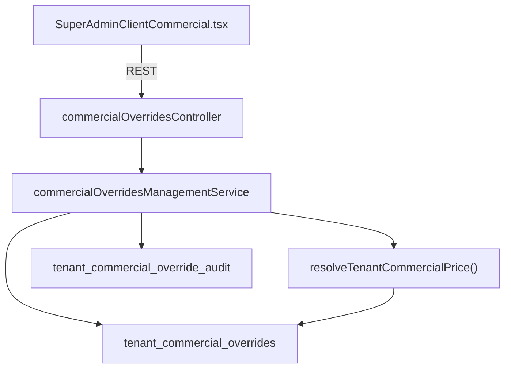

# Sprint M2 — Commercial Management UI

## Objetivo

Interface Superadmin para gestão de **Tenant Commercial Overrides** (Sprint M1), sem alterar motor de billing, lifecycle ou checkout público.

## Arquitetura



## Navegação

```text
Superadmin → Empresas → {empresa} → Comercial
```

Rota: `/superadmin/clients/:id/comercial`

## API REST (superadmin only)

| Método | Rota | Ação |
|--------|------|------|
| GET | `/api/superadmin/tenants/:tenantId/commercial` | Resumo + simulação |
| GET | `/api/superadmin/tenants/:tenantId/commercial/overrides` | Histórico |
| POST | `/api/superadmin/tenants/:tenantId/commercial/overrides` | Criar |
| PATCH | `/api/superadmin/tenants/:tenantId/commercial/overrides/:id` | Editar |
| DELETE | `/api/superadmin/tenants/:tenantId/commercial/overrides/:id` | Desativar (`is_active=false`) |
| POST | `/api/superadmin/tenants/:tenantId/commercial/simulate` | Simular draft |

## UI

### Card resumo
- Plano atual
- Preço catálogo
- Preço efetivo
- Origem (Catálogo / Override Comercial)

### Simulador
- Usa `resolveTenantCommercialPrice()` via backend
- Prévia em tempo real no formulário via `POST .../simulate`

### CRUD
- Tipos: `fixed_price`, `percent_discount`, `amount_discount`, `waive`
- Campos: motivo, validade, plano/intervalo opcionais

### Histórico
- Tabela com status: Ativo, Expirado, Desativado
- Detalhes, editar, desativar (soft)

## Auditoria

Tabela `tenant_commercial_override_audit` (migration `268`):

| action | Quando |
|--------|--------|
| `created` | POST override |
| `updated` | PATCH override |
| `disabled` | DELETE override |

## Arquivos

| Camada | Path |
|--------|------|
| Migration audit | `database/init/268_tenant_commercial_override_audit.sql` |
| Management service | `commercial/commercialOverridesManagementService.ts` |
| Controller | `controllers/commercialOverridesController.ts` |
| Routes | `routes/tenantsRoutes.ts` |
| Frontend page | `src/pages/superadmin/SuperAdminClientCommercial.tsx` |
| Frontend API | `src/services/superadminTenantCommercial.ts` |

## Testes

- `commercialOverridesManagementService.test.ts`
- `commercialOverridesController.test.ts`
- `commercialOverridesAudit.test.ts`

## Critérios de aceite

- [x] Aba Comercial no painel da empresa
- [x] CRUD completo via API
- [x] Simulador reflete backend
- [x] Histórico preservado após desativação
- [x] Auditoria em toda alteração
- [x] Sem impacto em Lifecycle / Trial / Promotion / Billing engine M1

## Referências

- `SPRINT_M1_TENANT_COMMERCIAL_OVERRIDES_FOUNDATION.md`
- `AUDIT_TENANT_COMMERCIAL_OVERRIDES.md`
