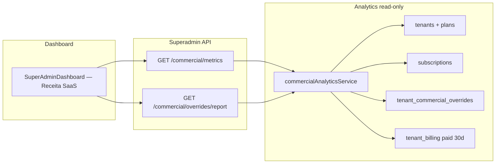

# Sprint M3 — Commercial Analytics & Contracted Revenue

## Objetivo

Separar indicadores financeiros SaaS para o Super Admin:

| Indicador | Fonte | Descrição |
|-----------|-------|-----------|
| **MRR Catálogo** | `plans.price_cents` (+ `plan_interval_prices` para custom) | Quanto valeria se todos pagassem o preço oficial |
| **MRR Contratado** | `tenant_commercial_overrides` → `subscriptions.contracted_*` → catálogo | Valor real dos contratos ativos (normalizado mensal) |
| **Receita Recebida (30d)** | `tenant_billing` `status='paid'` últimos 30 dias | Caixa efetivamente recebido |
| **Impacto Comercial** | `MRR Catálogo − MRR Contratado` | Descontos, parceiros, isenções e acordos |

**Escopo read-only:** não altera Billing, Lifecycle, Trial, Promotion Engine nem a lógica de overrides (M1/M2).

---

## Arquitetura

---

## Backend

### Serviço

`packages/backend/src/services/commercialAnalyticsService.ts`

| Método | Retorno |
|--------|---------|
| `getCommercialMetrics()` | `{ mrrCatalog, mrrContracted, monthlyRevenue, commercialImpact, activeOverrides, waivedTenants, breakdown }` |
| `getCommercialOverridesReport()` | Lista de empresas com override ativo ou economia mensal |

**Resolução MRR contratado por tenant (prioridade):**

1. Override comercial ativo (`pickBestCommercialOverride` + `applyCommercialOverrideToAmount`)
2. Snapshot `subscriptions.contracted_plan_price_cents` / `contracted_price_per_user_cents`
3. Fallback catálogo

**Normalização mensal:** `yearly ÷ 12`, `quarterly ÷ 3`, `semi_annual ÷ 6`.

**Log:** `[commercial_analytics]` com `mrrCatalog`, `mrrContracted`, `commercialImpact`.

### APIs (somente Super Admin)

| Método | Rota |
|--------|------|
| GET | `/api/superadmin/commercial/metrics` |
| GET | `/api/superadmin/commercial/overrides/report` |

Controller: `commercialAnalyticsController.ts`  
Rotas: `superadminRoutes.ts`

---

## Frontend

### Serviço

`src/services/superadminCommercialAnalytics.ts`

### Dashboard

Bloco **Receita SaaS** em `SuperAdminDashboard.tsx`:

- Cards: MRR Catálogo, MRR Contratado, Receita Recebida (30d), Impacto Comercial
- Tabela **Distribuição Comercial** (breakdown por categoria)
- Tabela **Empresas com condições especiais** (relatório de overrides)

---

## Breakdown comercial

| Categoria | Classificação |
|-----------|---------------|
| Preço catálogo | Sem desconto (efetivo = catálogo) |
| Desconto percentual | Override `percent_discount` |
| Desconto fixo | `fixed_price`, `amount_discount` ou snapshot abaixo do catálogo |
| Parceiros gratuitos | Override `waive` ou MRR efetivo zero |
| White Labels | `reason` ou `metadata_json` com tag `white_label` |

---

## Critério de aceite (exemplo)

| Base | Catálogo | Contratado |
|------|----------|------------|
| 70 × R$ 99 | R$ 6.930 | R$ 6.930 |
| 20 × R$ 59 | R$ 1.980 | R$ 1.180 |
| 10 × R$ 0 | R$ 990 | R$ 0 |
| **Total** | **R$ 9.900** | **R$ 8.110** |

- Impacto comercial exibido: **−R$ 1.790**
- Receita recebida: soma real de `tenant_billing` paid (30d)

---

## Testes

`packages/backend/src/services/commercialAnalyticsService.test.ts`

1. Sem overrides  
2. `fixed_price`  
3. `percent_discount`  
4. `waive`  
5. Múltiplos tenants (70/20/10)  
6. Receita recebida  
7. Impacto comercial  

`commercialAnalyticsController.test.ts` — smoke das rotas.

---

## Arquivos entregues

| Área | Arquivo |
|------|---------|
| Serviço | `commercialAnalyticsService.ts` |
| Controller | `commercialAnalyticsController.ts` |
| Rotas | `superadminRoutes.ts` |
| Frontend service | `superadminCommercialAnalytics.ts` |
| Dashboard | `SuperAdminDashboard.tsx` |
| Testes | `commercialAnalyticsService.test.ts`, `commercialAnalyticsController.test.ts` |
| Doc | Este arquivo |
