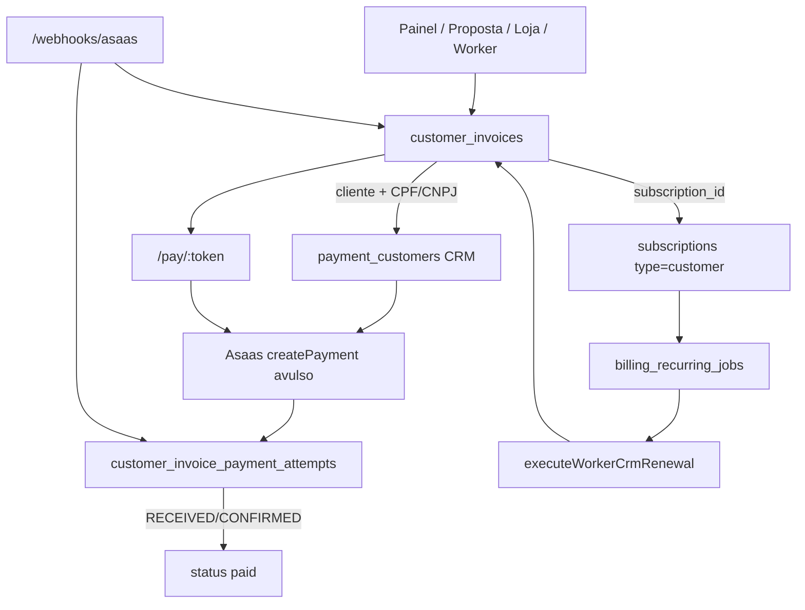

# Auditoria — Pipeline financeira CRM e encaixe do Pix Automático

| Campo | Valor |
|-------|-------|
| **Data** | 2026-07-29 |
| **Escopo** | Faturas / assinaturas dos **clientes do tenant** (`customer_invoices`, `subscriptions.type = 'customer'`) |
| **Fora de escopo** | Billing SaaS da plataforma (`tenant_billing`, Super Admin / billing2 já entregue) |
| **Objetivo** | Decidir **onde** entra Pix Automático para o cliente final do tenant, **sem mudar a arquitetura** atual |
| **Referência de produto** | Pix Automático SaaS (S10 + sprints A–C) — comportamento análogo, path CRM separado |

---

## 1. Resumo executivo

A pipeline CRM hoje é:

**fatura local (`customer_invoices`) + cobrança avulsa Asaas (`POST /payments`) por tentativa/ciclo + link público `/pay/:token` + liquidação por webhook/polling.**

Recorrência é **própria** do PainelCRM (`subscriptions.type = 'customer'` + `billing_recurring_jobs` + worker CRM). **Não** existe assinatura Asaas nativa no path CRM.

**Pix Automático e card token billing2 existem só no path SaaS.** No CRM: zero rotas, zero store, zero flag, zero UI.

A implantação pedida (ligar na criação da fatura, cliente recebe QR composto Asaas, default ON na fatura, cliente pode desligar) encaixa como **extensão do mesmo padrão de produto SaaS** nos pontos já existentes de criação de cobrança e do `/pay/:token` — **sem novo pipeline, sem novo motor, sem trocar o SSOT de fatura/recorrência.**

---

## 2. Mapa da pipeline atual (CRM)



### 2.1 Entrypoints de criação

| Origem | UI / API | Service | Cria charge Asaas na criação? |
|--------|----------|---------|-------------------------------|
| Manual | `CustomerInvoiceNew` → `POST /api/customer-invoices` | `createManualInvoice` | Sim (se cliente + CPF + gateway tenant) |
| Recorrente (1ª fatura) | Mesma UI + intervalo | `createRecurringManualInvoice` → `subscriptions` `customer` + `createManualInvoice` | Sim |
| Proposta | `convert-to-invoice` | `proposalInvoiceConversionService` → `createManualInvoice` | Sim |
| Loja | checkout público | `storePublicCheckoutService` → INSERT fatura | **Não** — charge no `/pay` |
| Worker renovação | `billing_recurring_jobs` | `executeWorkerCrmRenewal` → `executeGatewayChargeForInvoice` | Sim (avulso por ciclo) |
| Fatura filha (item agendado) | worker child | `recurringBillingJobService` | Sim |
| Pagamento manual (caixa) | detalhe fatura | `confirmCustomerInvoiceManualPayment` | Não |

Arquivos-chave:

- `packages/backend/src/services/customerBillingService.ts` — `createManualInvoice`, `createRecurringManualInvoice`, `completePaymentByToken`, `switchPaymentMethodByToken`, `payInvoiceWithCardByToken`
- `packages/backend/src/controllers/customerInvoicesController.ts` / `routes/customerInvoicesRoutes.ts`
- `packages/backend/src/billingExecution/gatewayExecutionService.ts`
- `packages/backend/src/services/workerCrmRenewalPipeline/workerCrmRenewalPipeline.ts`
- `packages/backend/src/services/recurringBillingJobService.ts`
- UI: `src/pages/CustomerInvoiceNew.tsx`, `CustomerInvoiceDetail.tsx`, `CustomerInvoices.tsx`

### 2.2 Gateway (tenant)

- Config: `payment_gateway_configs` com **`scope = 'tenant'`** (`getActiveConfig('crm', tenantId)` / `getActiveGateway({ billingType: 'crm', tenantId })`).
- Customer Asaas: `payment_customers` com `client_id` preenchido (`ensurePaymentCustomerForCrmClient`).
- Charge: `gateway.createCharge` → Asaas `POST /payments` (PIX / boleto / cartão) — **sempre avulso**.
- Metadata típica: `pixQrCode`, `pixCopyPaste`, `allowed_payment_methods`, `invoiceUrl`, etc. em `customer_invoices.gateway_metadata` + `gateway_reference_id`.

Capability `pixAutomatic: true` já existe no registry Asaas (`gatewayCapabilities.ts`), mas **não é usada no CRM**.

### 2.3 Link público `/pay/:token`

| Camada | Path |
|--------|------|
| Frontend | `/pay/:token` → `CustomerInvoicePay.tsx` |
| API | `/api/public/customer-invoices/pay/:token` (+ complete, switch-method, pay-with-card) |
| Token | `customer_invoices.payment_token` |

O pagador vê PIX avulso / boleto / cartão conforme `allowed_payment_methods`.  
**Não há** `start-pix-automatic` / `cancel-pix-automatic` no path CRM (existem só em `/api/public/saas-billing/...`).

### 2.4 Webhooks e liquidação

```
POST /webhooks/asaas
  → parser → payment_events
  → lookup attempt (customer_invoice_payment_attempts) ou customer_invoices / tenant_billing
  → applyPaymentAttemptEvent | applyPaymentEvent
  → customer_invoice → paid
```

Lookup de **Pix Automático por `conciliationIdentifier`** hoje resolve só **`tenant_billing`** (SaaS). CRM **não** participa.

### 2.5 Recorrência CRM

| Conceito | Realidade |
|----------|-----------|
| SSOT assinatura | `subscriptions` com `type = 'customer'` |
| Jobs | `billing_recurring_jobs` + worker |
| Cobrança Asaas | `createPayment` avulso por ciclo |
| Assinatura Asaas (`/subscriptions`) | **Não usada** |

### 2.6 Contraste SaaS (já implantado)

| Capacidade | CRM hoje | SaaS (billing2) |
|------------|----------|-----------------|
| Pix Automático | Ausente | Flag `billing2.pix_automatic`, store em `subscriptions` saas, APIs me/público, switch UX |
| Card token | Ausente no pay CRM | `card_token*` + flag `card_auto_renew` |
| Gateway config | `scope=tenant` | `scope=global` |
| Fatura | `customer_invoices` | `tenant_billing` |

Referência ops SaaS: `docs/architecture/commercial/billing2/BILLING2_PIX_AUTOMATIC_OPS.md` e closeouts S10 / A / B / C.

---

## 3. Requisitos de produto (pedido)

1. Na **criação** da fatura (e, por extensão, assinatura CRM), o tenant pode **ligar** Pix Automático.
2. O **cliente final** recebe fatura cujo pagamento no Asaas usa **autorização Pix Automático** (QR composto / jornada 3).
3. Na fatura enviada com Pix Auto, o switch vem **ligado por padrão**.
4. O cliente **pode desligar** (opt-out) se quiser.
5. **Não mudar arquitetura** — reutilizar pipeline, tabelas e padrões existentes.

---

## 4. Pontos de encaixe (onde entra — sem nova arquitetura)

| # | Ponto existente | Papel na implantação |
|---|-----------------|----------------------|
| **E1** | UI criação (`CustomerInvoiceNew`) + body `POST /customer-invoices` | Toggle “Pix Automático” na criação / envio |
| **E2** | `createManualInvoice` / `createRecurringManualInvoice` | Persistir intenção; se ON + PIX, iniciar auth Asaas **em vez de** (ou **antes de** substituir) charge PIX avulso do 1º ciclo |
| **E3** | `subscriptions.type='customer'` | SSOT da auth (espelho do SaaS: colunas `pix_automatic_*` também para `customer`, ou reutilizar as mesmas colunas já em `subscriptions`) |
| **E4** | `customer_invoices.gateway_metadata` | Stash QR avulso, journey `authorization`/`instruction`, conciliation id (como SaaS em `tenant_billing`) |
| **E5** | `/pay/:token` + `CustomerInvoicePay` | Expor status + switch default ON; enable/disable; trocar QR composto ↔ avulso |
| **E6** | `publicCustomerInvoicesController` | Endpoints públicos start/cancel (análogos ao saas-pay) |
| **E7** | Worker CRM / `executeGatewayChargeForInvoice` | Com auth `active` + janela 2–10: instrução com `pixAutomaticAuthorizationId`; senão charge avulso |
| **E8** | `webhookCore` / `paymentDomainService` | Estender lookup conciliation/auth para `customer_invoices`; paid limpa charges do ciclo sem cancelar auth (paridade Sprint B) |
| **E9** | `payment_gateway_configs` tenant + capability Asaas | Gate: só se gateway Asaas + Pix Auto elegível na conta do **tenant** |

**Fora do encaixe imediato (fase posterior explícita):** loja sem charge na criação; Mercado Pago; card token CRM; collection policy engine SaaS.

---

## 5. Lacunas técnicas (fatos)

1. Nenhuma chamada CRM a `createPixAutomaticAuthorization` / `pixAutomaticAuthorizationId`.
2. Colunas `pix_automatic_*` na migration 301 foram pensadas para assinaturas **saas** (índices/uso atual); precisa decisão se estendem a `type='customer'` **sem** nova tabela (preferível — sem mudar arquitetura).
3. `billingPixAutomaticService` está acoplado a `tenant_billing` / `getInvoiceById` (SaaS). CRM usará os **mesmos adapters Asaas** e o **mesmo padrão de store**, com entrypoints CRM (não novo gateway).
4. Webhook de auth ACTIVATED / conciliation 1º pagamento não amarra a `customer_invoices`.
5. Flag `billing2.pix_automatic` é de **plataforma SaaS** — não controla CRM.

---

## 6. Riscos e pré-requisitos

| Risco / pré-requisito | Nota |
|----------------------|------|
| Conta Asaas **do tenant** sem Pix Automático | 404/400 como no SaaS; UX deve degradar para PIX avulso |
| CPF/CNPJ do cliente | Já é pré-condição de charge; auth também exige |
| Dual QR (avulso + composto) | Mesmo problema SaaS — stash + restore no disable |
| Renovação fora da janela 2–10 | Fallback charge avulso (já é o default CRM) |
| Tenant multi-gateway (MP) | Pix Auto só Asaas — toggle só se capability |
| Confusão SaaS × CRM | Docs e flags separados; não reutilizar `billing2.pix_automatic` como único gate |
| **1º pagamento órfão** (paymentId novo, sem externalReference) | Incidente SaaS 2026-07-29; CRM **deve** liquidar via ACTIVATED + `pixQrCodeId` — [`LESSONS_SAAS_FIRST_PAYMENT_ORPHAN.md`](./LESSONS_SAAS_FIRST_PAYMENT_ORPHAN.md) |
| Reenvio de webhook como “fix” | Idempotência ignora; precisa script órfão (CRM6) |

---

## 7. Conclusão da investigação

- A pipeline CRM está madura e **não precisa ser redesenhada**.
- O produto desejado é o **mesmo padrão SaaS** (autorização Jornada 3 + switch default ON + opt-out + instruções nos ciclos) aplicado aos **clientes do tenant**.
- Pontos naturais: **criação de fatura/assinatura (E1–E3)**, **metadata/fatura (E4)**, **`/pay/:token` (E5–E6)**, **worker renovação (E7)**, **webhook (E8)**, **config Asaas tenant (E9)**.
- **Aptos a iniciar CRM1**; piloto real só após CRM5 com a lição de liquidação do 1º pagamento.

Próximos artefatos:

- [`DECISIONS_CRM_PIX_AUTOMATIC.md`](./DECISIONS_CRM_PIX_AUTOMATIC.md)
- [`SPRINTS_CRM_PIX_AUTOMATIC.md`](./SPRINTS_CRM_PIX_AUTOMATIC.md)
- [`CRM0_SPIKE.md`](./CRM0_SPIKE.md) — investigação webhook / elegibilidade / janela / avulsa (2026-07-29)
- [`LESSONS_SAAS_FIRST_PAYMENT_ORPHAN.md`](./LESSONS_SAAS_FIRST_PAYMENT_ORPHAN.md) — lição obrigatória pós-incidente SaaS
