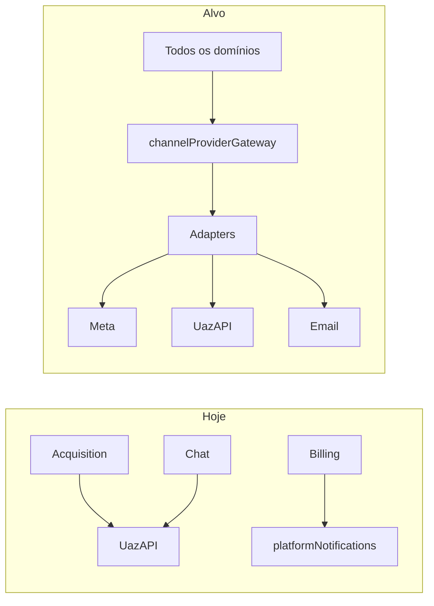
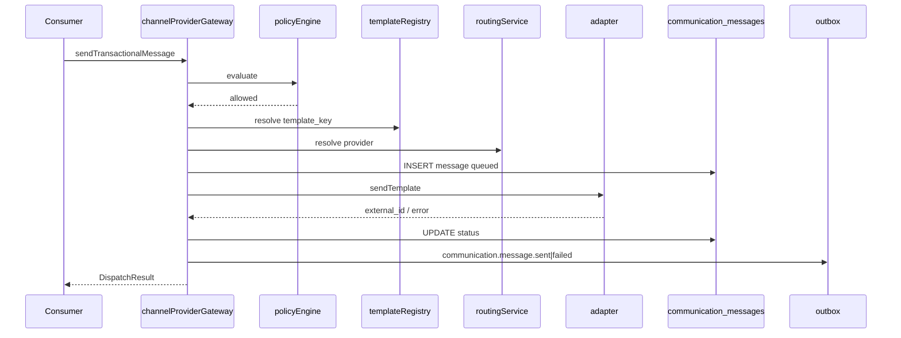
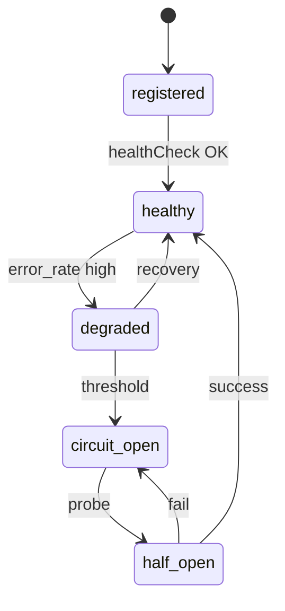
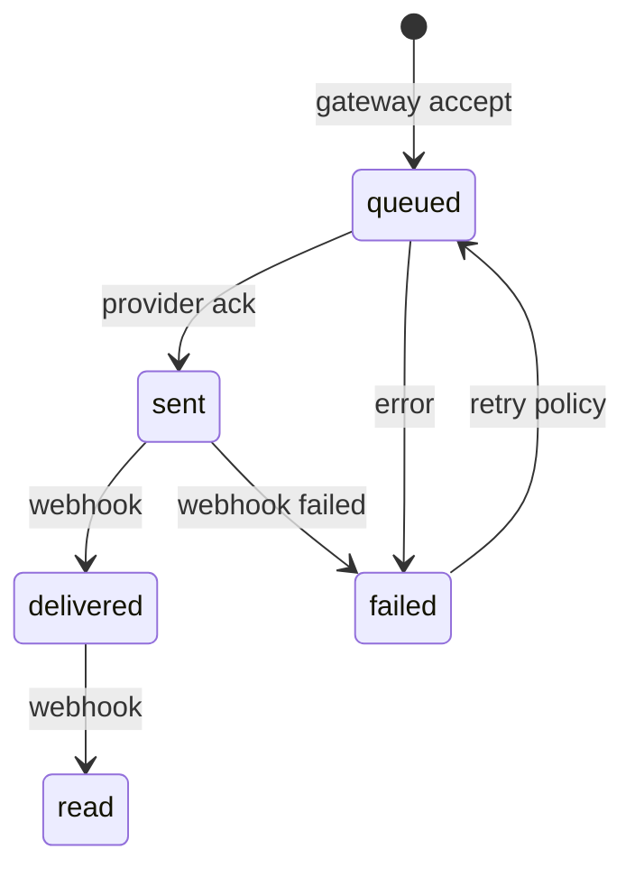
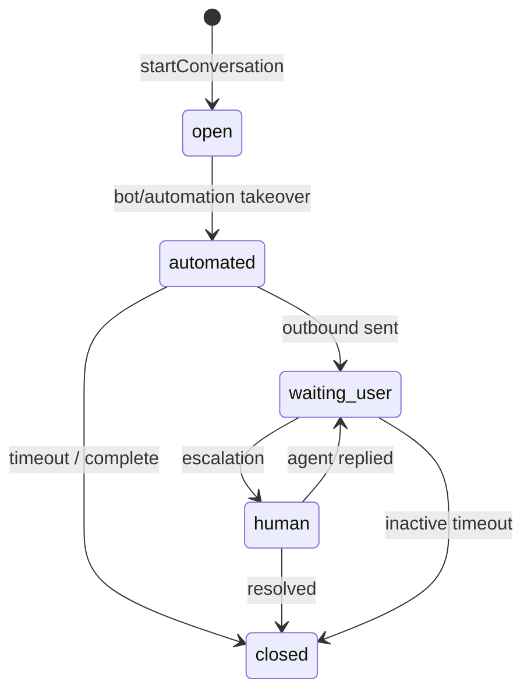
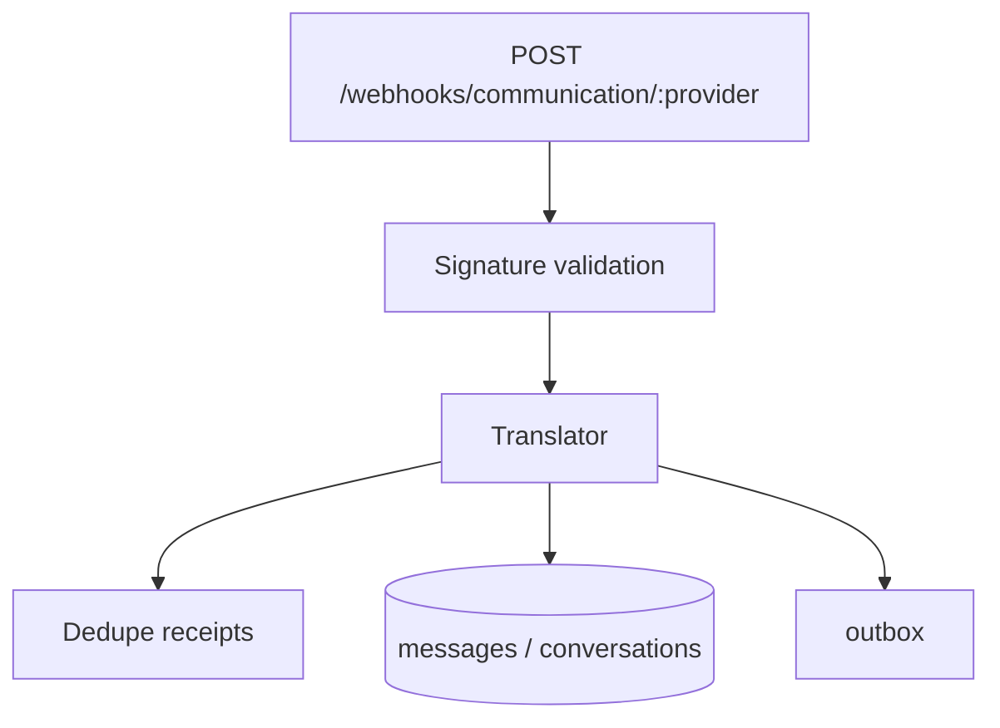
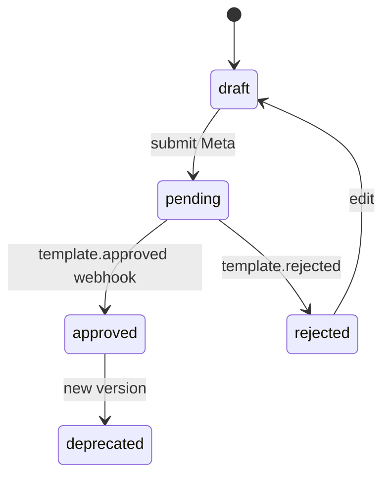
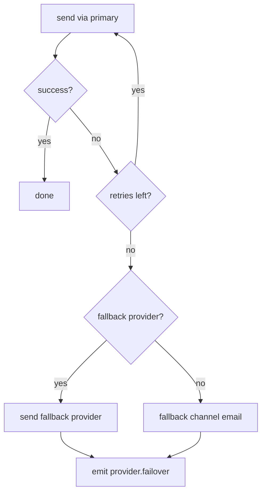
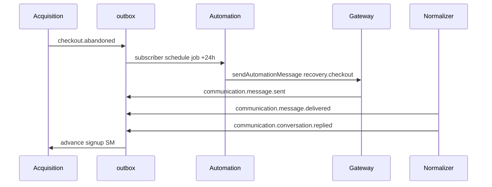

# Communication Platform Architecture (PainelCRM)

**Tipo:** documentação arquitetural oficial — plataforma de comunicação desacoplada, omnichannel-ready, Meta Cloud API.  
**Versão:** 1.0  
**Data:** maio/2026  
**Status:** planejamento — **não implementar** código sem sign-off P0 (Communication C0–C2).

**Bounded context:** Communication (ver [`../ARCHITECTURE_SYSTEM_CONTEXT_MAP.md`](../ARCHITECTURE_SYSTEM_CONTEXT_MAP.md) §3.6).

**Documentos relacionados:**

| Documento | Relação |
|-----------|---------|
| [`../MASTER_PLAN_SIGNUP_TRIAL_ONBOARDING_CONVERSION.md`](../MASTER_PLAN_SIGNUP_TRIAL_ONBOARDING_CONVERSION.md) | Parte G §59–§71 (origem consolidada aqui) |
| [`../automation/DOMAIN_EVENT_AND_OUTBOX_ARCHITECTURE.md`](../automation/DOMAIN_EVENT_AND_OUTBOX_ARCHITECTURE.md) | Outbox, eventos `communication.*` |
| [`../onboarding/ONBOARDING_ENGINE_ARCHITECTURE.md`](../onboarding/ONBOARDING_ENGINE_ARCHITECTURE.md) | Intents onboarding/recovery |
| [`../../BILLING_NOTIFICATION_HARDENING.md`](../../BILLING_NOTIFICATION_HARDENING.md) | AS-IS billing notify → migrar gateway |

**Código alvo (futuro):**

```text
packages/backend/src/services/communication/
  channelProviderGateway.ts          # API pública única (alias: communicationProviderGateway)
  communicationPolicyEngine.ts
  communicationTemplateRegistry.ts
  communicationWebhookNormalizer.ts
  providerRoutingService.ts
  conversationOrchestrator.ts
  communicationAnalyticsService.ts
  providerRegistry.ts
  contracts/
    ICommunicationProviderAdapter.ts
    SendCommunicationInput.ts
  adapters/
    metaCloudAdapter.ts
    uazapiAdapter.ts                 # bridge AS-IS
    smtpEmailAdapter.ts
    smsAdapter.ts                    # futuro
    pushAdapter.ts                   # futuro
  translators/
    metaCloudWebhookTranslator.ts
    uazapiWebhookTranslator.ts
    smtpBounceTranslator.ts
```

---

## Índice

1. [Visão geral](#1-visão-geral)
2. [Communication philosophy](#2-communication-philosophy)
3. [Channel Provider Gateway](#3-channel-provider-gateway)
4. [Provider architecture](#4-provider-architecture)
5. [Message domain model](#5-message-domain-model)
6. [Conversation engine](#6-conversation-engine)
7. [Webhook normalization layer](#7-webhook-normalization-layer)
8. [Template management](#8-template-management-architecture)
9. [Communication policy engine](#9-communication-policy-engine)
10. [Routing & failover](#10-routing--failover)
11. [Communication event bus](#11-communication-event-bus)
12. [Communication orchestration](#12-communication-orchestration)
13. [Communication analytics](#13-communication-analytics)
14. [Meta Cloud API readiness](#14-meta-cloud-api-readiness)
15. [Communication observability](#15-communication-observability)
16. [Failure & recovery model](#16-failure--recovery-model)
17. [Security model](#17-security-model)
18. [Future evolution](#18-future-evolution)
19. [Anti-patterns proibidos](#19-anti-patterns-proibidos)
20. [Conclusão](#20-conclusão)

---

## 1. Visão geral

### 1.1 Por que comunicação não pode depender de provider

**AS-IS (dívida técnica):**

| Módulo | Acoplamento |
|--------|-------------|
| `platformNotifications/*` | UazAPI / motor plataforma direto |
| `notificationsEngine/*` | WhatsApp tenant, templates ad hoc |
| Chat CRM | Instância UazAPI por tenant |
| Recovery/onboarding (futuro legado) | Risco de copiar padrão |

**Problemas:**

- Trocar UazAPI → Meta Cloud exige refatorar N controllers.
- Webhooks inconsistentes (formatos diferentes).
- Duplicata de envio (retry sem idempotência).
- Impossível omnichannel (email fallback manual).
- Analytics fragmentado por provider.

### 1.2 Evolução alvo



**De:** “integração WhatsApp”  
**Para:** **Communication Platform** — domínio central com mensagens, conversas, templates, policy e eventos.

### 1.3 Communication como domínio central

| Consumidor | Tipo de uso |
|------------|-------------|
| **Onboarding** | Nudges, conversas guiadas |
| **Recovery** | Checkout/trial/onboarding abandon |
| **Notifications** | Billing, auth, platform lifecycle |
| **Support** | Tickets plataforma |
| **CRM** | Chat operador (`crm.chat`) |
| **Automation** | [`automationOrchestrator`](../automation/AUTOMATION_ORCHESTRATOR_ARCHITECTURE.md) → gateway |
| **IA futura** | `ai.assistant` em conversation engine |

Nenhum consumidor conhece Graph API, Evolution ou Baileys.

### 1.4 Arquitetura modular (monólito)

- Um pacote `communication/` com API pública exportada em `index.ts`.
- Adapters isolados; subscribers consomem eventos normalizados.
- PostgreSQL: `communication_messages`, `communication_conversations` — source of truth.

---

## 2. Communication philosophy

### 2.1 Princípios

| Princípio | Significado |
|-----------|-------------|
| **Provider-agnostic** | Adapter traduz; domínio não |
| **Conversation-driven** | Thread lógica antes de provider thread id |
| **Event-driven** | Status e inbound via outbox |
| **Orchestrated** | Policy → template → adapter → outbox |
| **Eventual consistency** | `delivered`/`read` segundos depois via webhook |
| **Safe retries** | Idempotency em message + webhook |
| **Lifecycle explícito** | Message e conversation com estados |

### 2.2 Separação por classe de comunicação

| Classe | Intent prefix | Policy | Canal típico |
|--------|---------------|--------|--------------|
| **Operacional** | `transactional.*`, `onboarding.*` | UTILITY; sempre permitido se tenant ok | WA template / email |
| **Suporte** | `support.*` | UTILITY; SLA |
| **Automações** | `recovery.*`, jobs | Rate limit; idempotency | WA → email |
| **CRM** | `crm.chat` | Sessão 24h / texto livre | WA tenant |
| **Marketing** (futuro) | `marketing.*` | Opt-in; MARKETING category | WA broadcast |
| **IA** (futuro) | `ai.*` | Human handoff rules | WA + in-app |

### 2.3 Comunicação operacional vs marketing

**Operacional** — necessária para contrato/SaaS (fatura, trial, onboarding).  
**Marketing** — exige consent, limites Meta, horário comercial — **feature flag** `communication.marketing_v1`.

---

## 3. Channel Provider Gateway

### 3.1 Nome canônico

| Nome em docs | Implementação |
|--------------|---------------|
| `communicationProviderGateway` | alias |
| **`channelProviderGateway`** | **único arquivo export** |

### 3.2 Responsabilidade

**Única porta de entrada** para envio e gestão de conversas. Orquestra:

1. `communicationPolicyEngine.evaluate`
2. `communicationTemplateRegistry.resolve` (se template)
3. `providerRoutingService.resolve`
4. Adapter `send*`
5. Persistência `communication_messages`
6. Publicação outbox `communication.message.*`

### 3.3 API obrigatória

| Método | Descrição | Retorno |
|--------|-----------|---------|
| **`sendMessage(input)`** | Texto (sessão ativa / policy ok) | `CommunicationDispatchResult` |
| **`sendTemplate(input)`** | Template registry + vars | idem |
| **`sendTransactionalMessage(input)`** | Atalho: `template_key` + `message_intent` + vars | idem |
| **`sendMedia(input)`** | Mídia com caption opcional; exige capability `media` | idem |
| **`sendAutomationMessage(input)`** | Wrapper: intent `recovery.*` / job metadata; aplica rate limit automation | idem |
| **`startConversation(input)`** | Cria `communication_conversations`; opcional primeira mensagem template | `{ conversation_id }` |
| **`closeConversation(id, reason)`** | Estado `closed`; evento outbox | void |

### 3.4 `SendCommunicationInput` (contrato)

| Campo | Obrigatório | Descrição |
|-------|-------------|-----------|
| `tenant_id` | condicional | `null` = mensagem **plataforma** (recovery pré-tenant) |
| `channel` | sim | `whatsapp`, `email`, `sms`, `push`, `in_app` |
| `recipient` | sim | E.164, email, device token |
| `message_intent` | sim | §5.2 |
| `template_key` / `body` | um deles | Conteúdo |
| `media` | opcional | `{ type, url \| buffer_ref, caption }` |
| `conversation_id` | opcional | Se continuação |
| `correlation_id` | recomendado | Rastreio |
| `idempotency_key` | **crítico** | `comm:{tenant}:{intent}:{key}` |
| `metadata` | opcional | Sem secrets |

### 3.5 `CommunicationDispatchResult`

| Campo | Descrição |
|-------|-----------|
| `communication_message_id` | uuid interno |
| `status` | `queued` \| `sent` \| `failed` |
| `provider` | adapter usado |
| `external_message_id` | nullable |
| `fallback_used` | bool |

### 3.6 Fluxo interno



### 3.7 Proibições absolutas

| # | Proibido |
|---|----------|
| 1 | `import` UazAPI/Meta SDK fora de `adapters/` |
| 2 | `fetch` Graph API em controllers |
| 3 | Webhook handler com lógica de negócio Acquisition/Onboarding |
| 4 | Enviar WA sem `message_intent` |
| 5 | Side-effect notify sem registro `communication_messages` |
| 6 | Publicar `communication.*` antes do COMMIT da mensagem |

---

## 4. Provider architecture

### 4.1 Adapter pattern

Cada provider implementa `ICommunicationProviderAdapter`:

```typescript
// Contrato conceitual (não implementar aqui)
interface ICommunicationProviderAdapter {
  readonly providerId: string;
  capabilities(): ProviderCapabilities;
  healthCheck(): Promise<ProviderHealth>;
  sendMessage(ctx: AdapterSendContext): Promise<AdapterSendResult>;
  sendTemplate(ctx: AdapterTemplateContext): Promise<AdapterSendResult>;
  sendMedia?(ctx: AdapterMediaContext): Promise<AdapterSendResult>;
}
```

Webhook parsing **não** fica no adapter público — delega a **translator** (§7).

### 4.2 Provider registry

**`providerRegistry.ts`:**

| Operação | Uso |
|----------|-----|
| `register(adapter)` | Boot |
| `get(providerId)` | Routing |
| `listByChannel(channel)` | Failover candidates |

### 4.3 Provider lifecycle



### 4.4 Providers (roadmap)

| Provider | `providerId` | Fase | Bridge AS-IS |
|----------|--------------|------|--------------|
| **UazAPI** | `uazapi` | C0 | `platformNotifications`, chat |
| **Meta Cloud API** | `meta_cloud` | C4 | — |
| **SMTP** | `smtp` | C1 | e-mail transacional |
| **SMS** | `sms` | C6+ | — |
| **Push (FCM/APNs)** | `push` | C6+ | — |
| **Voice** | `voice` | futuro | — |

### 4.5 Capability model

| Capability | Descrição |
|------------|-----------|
| `text` | Texto em sessão |
| `media` | Imagem, áudio, doc, vídeo |
| `official_template` | Templates aprovados Meta |
| `template_params` | Variáveis `{{1}}` |
| `read_receipts` | delivered/read webhooks |
| `session_window_24h` | Regra Meta sessão |
| `marketing_broadcast` | Campanhas |
| `webhook_rich` | Status + inbound + template events |

**Matriz:**

| Provider | official_template | media | session_24h |
|----------|-------------------|-------|-------------|
| meta_cloud | sim | sim | sim |
| uazapi | parcial | sim | informal |
| smtp | N/A | anexos | N/A |

Gateway valida capabilities **antes** do adapter.

---

## 5. Message domain model

### 5.1 `communication_messages` — fonte de verdade

| Coluna | Tipo | Descrição |
|--------|------|-----------|
| `id` | uuid PK | |
| `tenant_id` | uuid nullable | null = plataforma |
| `channel` | enum | whatsapp, email, sms, push, in_app |
| `provider` | text | meta_cloud, uazapi, smtp, … |
| `direction` | outbound \| inbound | |
| `status` | enum | §5.3 |
| `conversation_id` | uuid FK nullable | |
| `message_intent` | text | §5.2 |
| `template_id` | uuid FK nullable | registry |
| `template_category` | text | UTILITY, MARKETING, AUTHENTICATION |
| `external_message_id` | text nullable | provider id |
| `retry_count` | int | |
| `idempotency_key` | text UNIQUE | |
| `correlation_id` | uuid | |
| `payload` | jsonb | corpo normalizado |
| `metadata` | jsonb | refs provider truncados |
| `failed_reason` | text | |
| `created_at` / `updated_at` | timestamptz | |

**Índices:** `(tenant_id, created_at)`, `(conversation_id)`, `(external_message_id, provider)`, `(correlation_id)`, `(message_intent, created_at)`.

### 5.2 Message intents (catálogo oficial)

| Intent | Consumidor | Categoria |
|--------|------------|-----------|
| `onboarding.nudge` | Onboarding engine | operacional |
| `onboarding.welcome` | Trial/paid welcome | operacional |
| `recovery.checkout` | Acquisition | automação |
| `recovery.trial` | Acquisition | automação |
| `recovery.onboarding` | Onboarding recovery | automação |
| `transactional.billing` | Billing | operacional |
| `transactional.auth` | Auth (OTP, magic link) | operacional |
| `transactional.platform` | Platform lifecycle | operacional |
| `support.platform_ticket` | Support | suporte |
| `automation.scheduled` | Automation executor | automação |
| `crm.chat` | CRM operador | CRM |
| `crm.automation` | Kanban/chat automation | CRM |
| `ai.assistant` | IA futura | IA |
| `marketing.campaign` | Campanhas futuras | marketing |

**Regra:** queries analytics e policy usam `message_intent`, nunca “tabela de notificações legada”.

### 5.3 Message status lifecycle



| Status | Significado |
|--------|-------------|
| `queued` | Persistido; adapter pendente |
| `sent` | Aceito pelo provider |
| `delivered` | Confirmação entrega |
| `read` | Leitura (WA) |
| `failed` | Erro permanente ou esgotou retry |

---

## 6. Conversation engine

### 6.1 `conversationOrchestrator`

Transforma “chat = instância WA” em **conversation engine** com thread lógica, ownership e handoff.

### 6.2 Tipos de conversa

| `conversation_type` | Uso |
|-----------------------|-----|
| `onboarding` | Nudges trial; respostas ativação |
| `recovery` | Recovery pré/pós tenant |
| `support` | Ticket plataforma |
| `automation` | Fluxos bot recovery |
| `ai` | Assistente (futuro) |
| `billing` | Cobrança conversacional (futuro) |
| `crm` | Chat operador tenant |
| `crm_followup` | Follow-up pós-venda (futuro) |

### 6.3 Tabela `communication_conversations`

| Coluna | Tipo |
|--------|------|
| `id` | uuid |
| `tenant_id` | nullable |
| `conversation_type` | text |
| `channel` | enum |
| `provider` | text |
| `external_thread_id` | text nullable |
| `participant_address` | text |
| `state` | §6.4 |
| `owner_type` | automation, ai, user, cs, system |
| `owner_id` | uuid nullable |
| `last_inbound_at` | timestamptz — **policy 24h** |
| `last_outbound_at` | timestamptz |
| `correlation_id` | uuid |
| `metadata` | jsonb |

### 6.4 Conversation states



### 6.5 Ownership & handoff

| Transição | Trigger |
|-----------|---------|
| **Automation takeover** | `recovery` workflow inicia |
| **AI handoff → human** | confidence &lt; threshold; keyword “atendente” |
| **Human → automation** | CS fecha ticket; policy permite |
| **Escalation** | `communication.conversation.escalated` → CS pipeline |

### 6.6 Relação CRM

- CRM UI continua; backend roteia mensagens operador via `message_intent=crm.chat`.
- `external_thread_id` mapeia conversa UazAPI/Meta sem expor ID ao Acquisition.

---

## 7. Webhook normalization layer

### 7.1 `communicationWebhookNormalizer`

**Entrada:** HTTP webhook bruto por provider.  
**Saída:** UPDATE `communication_messages` + INSERT outbox eventos normalizados.



### 7.2 Eventos internos normalizados

| Evento outbox | Quando |
|---------------|--------|
| `communication.message.sent` | Provider aceitou (confirmação async) |
| `communication.message.delivered` | Delivered |
| `communication.message.read` | Read |
| `communication.message.failed` | Falha permanente |
| `communication.conversation.started` | Primeira inbound ou template abre sessão |
| `communication.conversation.replied` | Inbound usuário |
| `communication.conversation.closed` | Close/timeout |
| `communication.template.approved` | Meta aprovou template |
| `communication.template.rejected` | Meta rejeitou |
| `communication.provider.failover` | Routing alternou provider |

### 7.3 Translators

| Arquivo | Provider |
|---------|----------|
| `metaCloudWebhookTranslator.ts` | Graph API |
| `uazapiWebhookTranslator.ts` | UazAPI (bridge) |
| `smtpBounceTranslator.ts` | Bounces/complaints |

Interface: `toNormalizedEvents(raw, headers): NormalizedCommunicationEvent[]`.

### 7.4 Idempotência webhooks

**Tabela:** `communication_webhook_receipts`

| Coluna | Uso |
|--------|-----|
| `provider` | text |
| `external_event_id` | text |
| `payload_hash` | text |
| `processed_at` | timestamptz |

UNIQUE `(provider, external_event_id)` — replay provider = no-op.

### 7.5 Webhook security

Ver §17 — signature validation **antes** de translator.

### 7.6 Rotas

| Rota | Provider |
|------|----------|
| `GET/POST /webhooks/communication/meta` | Meta verify + events |
| `POST /webhooks/communication/uazapi` | Bridge legado |
| `POST /webhooks/communication/email` | SES/SMTP bounces |

**Isolado** de `/webhooks/asaas` (billing).

### 7.7 Replay webhook

Admin reprocessa `communication_webhook_receipts` com falha de translator pós-fix — gera eventos com `:replay:` suffix auditado.

---

## 8. Template management architecture

### 8.1 `communicationTemplateRegistry`

| Operação | Descrição |
|----------|-----------|
| `resolve(key, locale, channel)` | Template aprovado |
| `submitForApproval(key)` | Push Meta (futuro) |
| `onApprovalEvent(event)` | Webhook handler |
| `getFallback(key)` | fallback_template_key |

### 8.2 Categorias

| Categoria negócio | Templates | Meta category |
|-------------------|-----------|---------------|
| `onboarding` | welcome, step.* | UTILITY |
| `recovery` | checkout.abandon, trial.offer | UTILITY |
| `billing` | invoice.*, payment.* | UTILITY |
| `support` | ticket.* | UTILITY |
| `automation` | kanban.* (CRM bridge) | UTILITY |
| `auth` | otp, magic_link | AUTHENTICATION |
| `marketing` | campaign.* | MARKETING |

### 8.3 Tabela `communication_templates`

| Coluna | Descrição |
|--------|-----------|
| `key` | `recovery.checkout.abandon_1` |
| `version` | semver interno |
| `channel` | whatsapp, email, … |
| `locale` | `pt_BR` |
| `category` | §8.2 |
| `provider_template_id` | ID Meta |
| `approval_status` | draft, pending, approved, rejected, deprecated |
| `body_schema` | variáveis jsonb |
| `fallback_template_key` | alternativa |
| `subject` | email only |

### 8.4 Approval lifecycle



### 8.5 Provider sync

| Job | Função |
|-----|--------|
| `syncTemplatesFromMeta` | Pull status + IDs |
| `pushTemplateDraftToMeta` | Create/update (futuro) |

### 8.6 Localization (futuro)

`key` + `locale` UNIQUE — fallback `pt_BR` → `en_US`.

---

## 9. Communication policy engine

### 9.1 `communicationPolicyEngine`

Executa **antes** de todo dispatch no gateway.

```text
evaluate(input, capabilities, tenantContext) → PolicyDecision
```

| `PolicyDecision` | Campos |
|------------------|--------|
| allowed | boolean |
| reason | code |
| required_template | bool |
| fallback_channel | optional |
| violation | grava audit se blocked |

### 9.2 Responsabilidades

| Regra | Descrição |
|-------|-----------|
| **Janela 24h Meta** | `sendMessage` texto livre só se `last_inbound_at` &lt; 24h |
| **Template obrigatório** | Fora janela → `sendTemplate` only |
| **Opt-in marketing** | `marketing.*` exige consent flag tenant |
| **Tenant limits** | Plano: max WA/mês, max automations/dia |
| **Abuse prevention** | Trial abuse signals; spam mesmo número |
| **Rate limits** | por `(tenant_id, intent, channel)` sliding window |
| **Marketing restrictions** | Horário 8h–20h local; não domingo |
| **Platform scope** | `tenant_id=null` só intents plataforma |
| **Fallback policies** | WA fail → email se billing/recovery |

### 9.3 Violações

**Tabela:** `communication_policy_violations` — analytics + CS; nunca envia silenciosamente.

---

## 10. Routing & failover

### 10.1 `providerRoutingService`

```text
resolve(tenant_id, channel, intent) → { primary, fallback_provider?, fallback_channel? }
```

### 10.2 `tenant_communication_routing`

| Coluna | Exemplo |
|--------|---------|
| `tenant_id` | uuid ou NULL (plataforma) |
| `channel` | whatsapp |
| `primary_provider` | uazapi |
| `fallback_provider` | meta_cloud |
| `fallback_channel` | email |
| `weight_meta` | 0–100 (futuro canary) |
| `enabled` | bool |

### 10.3 Failover automático



**Trocar provider:** UPDATE routing row — **zero** mudança em Onboarding/Recovery code.

### 10.4 Circuit breaker

| Estado | Comportamento |
|--------|---------------|
| Closed | Normal |
| Open | Skip provider 5 min; use fallback |
| Half-open | 1 probe/min |

Persistido em `provider_health_snapshots`.

---

## 11. Communication event bus

### 11.1 Integração outbox

Todos os eventos `communication.*` usam **`outbox_events`** ([DOMAIN_EVENT doc](../automation/DOMAIN_EVENT_AND_OUTBOX_ARCHITECTURE.md)).

**Owner publicação:** Communication context (mensagem, webhook normalizer).

### 11.2 Catálogo eventos

| Evento | Publisher | Consumidores |
|--------|-----------|--------------|
| `communication.message.sent` | Gateway | Analytics, logs |
| `communication.message.delivered` | Normalizer | Onboarding milestones |
| `communication.message.read` | Normalizer | Analytics, health |
| `communication.message.failed` | Gateway/Normalizer | Automation failover, HITL |
| `communication.conversation.started` | Normalizer/Orchestrator | Onboarding |
| `communication.conversation.replied` | Normalizer | Acquisition SM, Automation |
| `communication.conversation.closed` | Orchestrator | Analytics |
| `communication.template.approved` | Normalizer | Template registry |
| `communication.template.rejected` | Normalizer | CS alert |
| `communication.provider.failover` | Routing | Observability |

### 11.3 Publishers vs consumers

| Papel | Quem |
|-------|------|
| **Publisher** | `channelProviderGateway`, `communicationWebhookNormalizer` |
| **Consumer** | Subscribers registrados — **nunca** chamam provider |

### 11.4 Retries & replay

- Retry entrega evento: política outbox global.
- Replay evento `communication.*`: subscribers idempotentes.
- Não replay envio físico sem nova `idempotency_key`.

---

## 12. Communication orchestration

### 12.1 Padrão

**Domínio** publica fato → **Automation** agenda → **Gateway** envia → **Normalizer** confirma → **Domínio** reage.

### 12.2 Fluxos obrigatórios

#### checkout.abandoned → recovery



#### onboarding.started → reminders

| Etapa | Ação |
|-------|------|
| `onboarding.started` | subscriber → `startConversation(type=onboarding)` |
| +12h passo pendente | job → `onboarding.nudge` template |
| `onboarding.stalled` | `recovery.onboarding` escalation |

#### invoice.overdue → billing

| Etapa | Ação |
|-------|------|
| `billing.invoice.overdue` | subscriber |
| Policy | `transactional.billing` template |
| Fail WA | email fallback |
| +7d | CS task (billing context) |

#### ticket.created → support

| Etapa | Ação |
|-------|------|
| `support.ticket.created` | subscriber |
| GW | `support.platform_ticket` + `conversation_type=support` |
| Reply | mesmo thread via gateway |

---

## 13. Communication analytics

### 13.1 `communicationAnalyticsService`

Rollups apenas — hot path escreve `communication_messages` + eventos.

### 13.2 Métricas

| Métrica | Fórmula / fonte |
|---------|-----------------|
| **Delivery rate** | delivered / sent por provider, intent, template |
| **Read rate** | read / delivered (WA) |
| **Response rate** | conversations com inbound após outbound |
| **Recovery conversion** | recovery intent → trial/paid (join Acquisition) |
| **Onboarding conversion** | onboarding intent → step completed |
| **Provider health** | error_rate, latency p95 |
| **Template performance** | delivery por template_key |
| **Conversation engagement** | msgs per conversation |
| **AI interaction** (futuro) | turns per ai conversation |

### 13.3 Storage

| Tabela | Granularidade |
|--------|---------------|
| `communication_metrics_daily` | tenant, provider, intent, date |
| `communication_template_metrics` | template_key, date |
| `provider_health_snapshots` | provider, hour |

### 13.4 Integração

- `product_analytics_events` com `source=communication`
- Dashboard superadmin §56 MASTER
- Onboarding analytics TTFV correlation

---

## 14. Meta Cloud API readiness

### 14.1 Objetivo

Adicionar `metaCloudAdapter` = config + routing — **sem** refatorar consumers.

### 14.2 WABA multi-tenant

| Escopo | WABA | Uso |
|--------|------|-----|
| **Plataforma** | WABA PainelCRM comercial | recovery, trial, platform notify |
| **Tenant CRM** | WABA do cliente (BM hosted ou coex) | `crm.chat` |

**Tabela futura:** `platform_waba_accounts` (waba_id, phone_number_id, tier, quality_score).

### 14.3 Business verification & quality

| Conceito | Preparação |
|----------|------------|
| Business verification | metadata WABA; block send se unverified |
| **Quality rating** | snapshot; alert se YELLOW/RED |
| **Messaging limits** | tier em routing; policy throttle |
| **Pricing awareness** | metadata custo por categoria em analytics (futuro) |

### 14.4 Template & conversation categories

| Meta category | PainelCRM mapping |
|---------------|-------------------|
| UTILITY | onboarding, recovery, billing, support |
| AUTHENTICATION | auth |
| MARKETING | marketing.campaign |

### 14.5 Meta webhook architecture

| Item | Detalhe |
|------|---------|
| Verify token | `GET` hub challenge |
| Signature | `X-Hub-Signature-256` HMAC |
| Fields | messages, message_template_status_update |
| Translator | `metaCloudWebhookTranslator` |

### 14.6 Cutover strategy

| Fase | Ação |
|------|------|
| C4 canary | 5% tenants `primary_provider=meta_cloud` |
| C4 platform | WABA plataforma em Meta |
| C5+ | Tenant CRM migrate por tenant |

**Não implementar** até C0–C3 estáveis (gateway, normalizer, policy, templates UTILITY).

---

## 15. Communication observability

### 15.1 Log prefixes

| Prefixo | Conteúdo |
|---------|----------|
| `[COMMUNICATION]` | gateway dispatch, policy block |
| `[PROVIDER]` | adapter call, latency, errors |
| `[WEBHOOK]` | receive, dedupe, translate |
| `[TEMPLATE]` | resolve, approval |
| `[DELIVERY]` | status transitions |
| `[CONVERSATION]` | state, handoff |

Campos: `communication_message_id`, `conversation_id`, `correlation_id`, `message_intent`, `provider`, `tenant_id`.

### 15.2 Traces

Spans: `gateway.send`, `policy.evaluate`, `adapter.send`, `webhook.normalize`.

### 15.3 Queue health

| Métrica | Alerta |
|---------|--------|
| `comm_messages_queued_count` | &gt; 5000 |
| `comm_webhook_backlog_seconds` | &gt; 300 |
| `comm_provider_circuit_open` | any P0 provider |

### 15.4 Replay audit

Toda ação admin replay → `platform_audit_trail` + `[REPLAY]`.

### 15.5 Degraded mode

| Condição | UX / ops |
|----------|----------|
| WA down | Queue + email fallback + banner tenant |
| Meta rate limit | Throttle marketing; UTILITY priority |
| Webhook down | Poll status (último recurso adapter) |
| Normalizer bug | Read-only mode; stop outbound automation |

---

## 16. Failure & recovery model

### 16.1 Retry strategy (gateway)

| Camada | Retries |
|--------|---------|
| Adapter HTTP | 3× exponential 1s, 5s, 15s |
| Message row | `retry_count` increment |
| Outbox event | política global |

### 16.2 Dead-letter

- `communication_messages.status=failed` permanente
- Relacionado `communication.message.failed` outbox → dead após max attempts
- UI superadmin: requeue com nova idempotency key

### 16.3 Stuck message recovery

| Job | Detecta |
|-----|---------|
| `stuckMessageReconciler` | `queued` &gt; 30 min |
| | `sent` sem `delivered` &gt; 24h (opcional poll) |

### 16.4 Webhook recovery

- Receipts sem `processed_at` após 5 min → reprocess
- Integração `billingRecoveryService` notify recovery (AS-IS) converge para Communication

### 16.5 Reconciliation

Compare `communication_messages` vs provider status API (Meta) — relatório drift.

---

## 17. Security model

### 17.1 Webhook validation

| Provider | Método |
|----------|--------|
| Meta | HMAC SHA256 `X-Hub-Signature-256` |
| UazAPI | token/header conforme doc provider |
| Email | SNS signature / shared secret |

Rejeitar body &gt; size limit; timeout handler 10s.

### 17.2 Tenant isolation

- `tenant_id` obrigatório em mensagens tenant-scoped.
- Platform messages: `tenant_id IS NULL` + intent allowlist.
- Adapter credentials scoped por tenant ou plataforma — nunca cross-tenant token.

### 17.3 Provider credentials

| Storage | Notas |
|---------|-------|
| `tenant_whatsapp_credentials` (existente evoluído) | encrypted at rest |
| `platform_waba_accounts` | secrets vault / env + DB encrypted |

**Rotation:** suportar `credential_version`; adapter hot reload.

### 17.4 Audit & abuse

- `auditTrailService` em failover manual, template submit, policy override.
- Rate limits §9 — spam prevention.
- Block list `communication_blocked_recipients`.

---

## 18. Future evolution

| Capacidade | Arquitetura preparada |
|------------|----------------------|
| **Omnichannel** | Mesmo gateway; channel enum |
| **AI conversations** | `conversation_type=ai`; adapter interno |
| **AI copilots** | Sugestão draft → human approve → gateway send |
| **Voice** | `voiceAdapter`; intent `transactional.voice` |
| **Push** | `pushAdapter` |
| **Campaign engine** | `marketing.campaign` + batch jobs + policy |
| **CS automation** | Internal intents + in_app |
| **AI recovery** | NLU on `conversation.replied` → Acquisition |
| **Adaptive onboarding** | Template variants via feature flags |

Export event stream → analytics/IA sem alterar writes.

---

## 19. Anti-patterns proibidos

| # | Anti-pattern | Correção |
|---|--------------|----------|
| 1 | Provider direto fora adapter | `channelProviderGateway` |
| 2 | Notify fora do gateway | `sendTransactionalMessage` |
| 3 | Webhook sem normalização | translator + outbox |
| 4 | Retries sem idempotency_key | UNIQUE messages + receipts |
| 5 | Mensagem sem `message_intent` | obrigatório no input |
| 6 | Automação acoplada ao provider | Automation → gateway |
| 7 | Lógica comm espalhada em controllers | Communication service |
| 8 | `platformNotifications` novo código | bridge → deprecar |
| 9 | Subscriber chama Acquisition direto | outbox event |
| 10 | PII em `metadata` payload | ids only |

---

## 20. Conclusão

A **Communication Platform** converte o PainelCRM de integração WhatsApp pontual em **infraestrutura enterprise de comunicação**:

| Capacidade | Fundação |
|------------|----------|
| Onboarding conversacional | intents + conversations + templates |
| Recovery automation | `sendAutomationMessage` + failover |
| Notificações transacionais | billing/auth/platform intents |
| Suporte | support conversations |
| Meta Cloud API | `metaCloudAdapter` + policy + WABA model |
| IA / omnichannel / campanhas | conversation engine + capabilities |

**P0 implementação (documentação → código):**

1. **C0:** `communication_messages` + `channelProviderGateway` + `uazapiAdapter` bridge.  
2. **C1:** `communicationWebhookNormalizer` + rotas + eventos outbox.  
3. **C2:** `communicationTemplateRegistry` + `communicationPolicyEngine` (UTILITY).  
4. Migrar **um** fluxo piloto: platform trial notification → gateway.  
5. Depois: recovery, onboarding, billing (MASTER §71.2).

**Próximo documento sugerido:** `acquisition/ARCHITECTURE_ACQUISITION.md` ou `billing/ARCHITECTURE_BILLING_BOUNDARIES.md`.

---

*Documento oficial v1.0 — Communication Platform — PainelCRM — maio/2026. Não implementar código sem sign-off P0 Communication C0–C2.*
