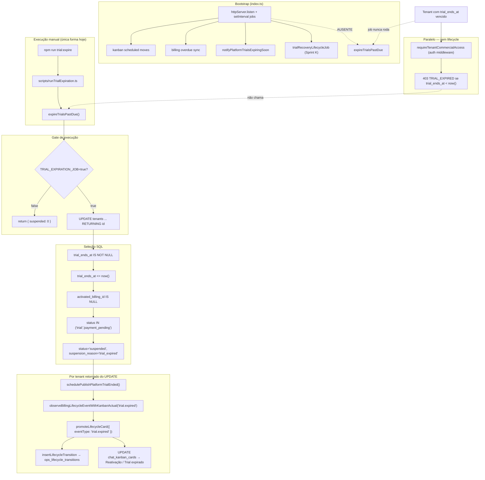

# AUDIT_TRIAL_EXPIRED_PIPELINE

**Modo:** READ ONLY  
**Data da auditoria:** 2026-06-08 (clock do PostgreSQL local: `2026-06-08T17:55:57Z`)  
**Ambiente:** desenvolvimento local (`localhost:5433`, `.env` com `TRIAL_EXPIRATION_JOB=true`, `OPS_LIFECYCLE_PROMOTION_ENABLED=true`)

---

## Resumo executivo

Um tenant com trial vencido **não gera** `trial.expired` e **não entra** em Reativação porque **`expireTrialsPastDue()` nunca é executado automaticamente** no processo do backend. A flag `TRIAL_EXPIRATION_JOB=true` habilita a função, mas **não a agenda**.

O middleware `requireTenantCommercialAccess` pode bloquear o CRM quando `trial_ends_at < now()` **sem** disparar o pipeline lifecycle — criando a impressão de “trial expirado” sem evento Kanban.

### Causa raiz principal

**A) Job não executa**

---

## Fluxograma completo (estado real do código)



---

## 1. `expireTrialsPastDue()` — onde, frequência, condições

### Onde está definido

`packages/backend/src/services/subscriptionService.ts` (linhas ~1329–1363)

### Onde é executado

| Mecanismo | Registrado? | Frequência |
|-----------|-------------|------------|
| `packages/backend/src/index.ts` (bootstrap API) | **Não** | — |
| `start.bat` (dev) | **Não** | — |
| Cron / PM2 / docker-compose documentado | **Não** | — |
| `npm run trial:expire` → `scripts/runTrialExpiration.ts` | **Sim** (manual) | Sob demanda |

### Condições de execução

1. `isTrialExpirationJobEnabled()` → `TRIAL_EXPIRATION_JOB` truthy (`true`/`1`/`yes`)
2. Se flag off → retorno imediato `{ suspended: 0 }` sem SQL

### Respostas objetivas

| Pergunta | Resposta |
|----------|----------|
| Está registrado no bootstrap? | **Não** — `index.ts` não importa nem agenda `expireTrialsPastDue` |
| Está sendo executado? | **Não automaticamente** — evidência: `ops_lifecycle_transitions` com `trial.expired` = **0**; tenant elegível ainda `status=trial` |
| Qual cron ou interval? | **Nenhum** — apenas script CLI `trial:expire` |

### Nota de documentação desatualizada

`docs/architecture/automation/LIFECYCLE_ROUTER_FOUNDATION_AUDIT.md` afirma *“Agendado em index.ts quando TRIAL_EXPIRATION_JOB=true”* — **isso não corresponde ao código atual**.

---

## 2. Seleção de tenants expirados

### SQL (UPDATE … RETURNING)

```sql
UPDATE tenants
SET status = 'suspended',
    suspension_reason = 'trial_expired',
    suspended_at = COALESCE(suspended_at, now()),
    has_used_trial = true,
    trial_consumed_at = COALESCE(trial_consumed_at, now()),
    updated_at = now()
WHERE trial_ends_at IS NOT NULL
  AND trial_ends_at <= now()
  AND activated_billing_id IS NULL
  AND status IN ('trial', 'payment_pending')
RETURNING id
```

### Critérios

| Critério | Usado? | Detalhe |
|----------|--------|---------|
| `trial_ends_at` | **Sim** | Deve ser `<= now()` |
| `status` | **Sim** | Apenas `trial` ou `payment_pending` |
| `activated_billing_id` | **Sim** | Deve ser `NULL` (sem conversão paga) |
| Timezone explícito | **Não** | Comparação `timestamptz` do Postgres com `now()` em **UTC** (TZ da sessão: `UTC`) |

Tenants já `active`, `suspended` (outro motivo) ou com `activated_billing_id` preenchido **não entram**, mesmo com `trial_ends_at` no passado.

---

## 3. Tenant de teste (ambiente local)

### Identificação

| Campo | Valor |
|-------|-------|
| **tenant_id** | `2850da5a-3e6f-49a3-8651-7eee3f32e9ab` |
| **nome** | Criar loja |
| **email lead** | kssantos@hotmail.com |
| **acquisition_lead_id** | `591a0100-2f5e-45e2-af50-9167efe4612d` |

### Estado atual (consulta read-only)

| Campo | Valor | Compatível com SQL do job? |
|-------|-------|----------------------------|
| `status` | `trial` | ✅ |
| `trial_ends_at` | `2026-06-08T17:50:00Z` | ✅ (`is_past_due=true` vs DB `now()` ≈ `17:55:57Z`) |
| `activated_billing_id` | `null` | ✅ |
| `suspension_reason` | `null` | — (ainda não processado) |
| `subscription_status` | N/A (coluna não existe em `tenants`) | — |
| `billing_status` (`tenant_billing`) | `null` | — |

**Conclusão:** o tenant **seria selecionado** se `expireTrialsPastDue()` rodasse agora. A falha **não** é de seleção (B) nem de status incompatível (C) neste caso.

### Cards Kanban ops (lead do tenant)

| Board | Coluna | card_id |
|-------|--------|---------|
| Aquisição | Trial iniciado | `0f9ca391-0c53-433e-9e19-40c97aeee661` |
| Onboarding | Onboarding concluído | `6144e179-5e0d-411e-8333-c308f6198b25` |
| Expansão | Novo Cliente | `4816a827-03b0-4daf-9e3f-61931c7c576c` |

`promoteLifecycleCard` usa o card mais recente por `acquisition_lead_id` (`ORDER BY updated_at DESC`) — promoção iria mover **um** card, tipicamente o de maior `updated_at`.

---

## 4. Fluxo após expiração (código)

```
expireTrialsPastDue()
  └─ para cada id retornado pelo UPDATE:
       ├─ schedulePublishPlatformTrialEnded(tenantId)     → platform.trial.ended (notificações)
       ├─ observeBillingLifecycleEventWithKanbanActual(
       │     'trial.expired', { tenantId }, 'expireTrialsPastDue')
       │     → resolveLifecycleRoute + log [lifecycle_billing_observe]
       │     → NÃO grava ops_lifecycle_transitions
       └─ promoteLifecycleCard({
             eventType: 'trial.expired',
             context: { tenantId },
             source: 'expireTrialsPastDue'
           })
           → resolveLifecycleRoute → Reativação / Trial expirado
           → insertLifecycleTransition (auditoria)
           → move card se OPS_LIFECYCLE_PROMOTION_ENABLED=true
```

### `observeBillingLifecycleEvent('trial.expired')` é chamado?

**Sim — mas somente dentro do loop `for (const row of r.rows)` após o UPDATE bem-sucedido.**

Condições cumulativas:

1. `TRIAL_EXPIRATION_JOB=true`
2. Tenant passa nos filtros SQL
3. `expireTrialsPastDue()` é **invocado** (hoje: só via script manual)

Se o job não roda → **nenhuma** observação nem promoção ocorre.

---

## 5. Promotion Engine

### Integração

Integração **direta** em `expireTrialsPastDue()` — não passa por outbox nem observer assíncrono separado.

```typescript
void promoteLifecycleCard({
  eventType: 'trial.expired',
  context: { tenantId: row.id },
  source: 'expireTrialsPastDue',
});
```

### Resultado esperado (com flags atuais do `.env`)

| Etapa | Esperado |
|-------|----------|
| Rota | `trial.expired` → Reativação / Trial expirado |
| `OPS_LIFECYCLE_PROMOTION_ENABLED=true` | Move físico do card |
| Auditoria | `ops_lifecycle_transitions` com `event_type=trial.expired`, `result=moved` |
| Tenant | `status=suspended`, `suspension_reason=trial_expired` |

### Evidência de que o motor funciona (outros eventos)

| event_type | total em `ops_lifecycle_transitions` |
|------------|--------------------------------------|
| `subscription.activated` | 2 |
| `onboarding.completed` | 2 |
| `onboarding.started` | 1 |
| **`trial.expired`** | **0** |

Promotion Engine está operacional para outros eventos; `trial.expired` nunca foi disparado porque o job de expiração não executou.

---

## 6. `ops_lifecycle_transitions`

### `event_type = 'trial.expired'`

| Métrica | Valor |
|---------|-------|
| Quantidade total | **0** |
| Últimos registros | Nenhum |
| Registro para tenant `2850da5a-…` | **Não existe** |

---

## 7. Lifecycle Dashboard (Sprint J)

### Filtros

Backend (`LIFECYCLE_DASHBOARD_EVENT_FILTERS`) e frontend (`LIFECYCLE_EVENT_FILTER_OPTIONS`) **incluem** `trial.expired`.

### O evento deveria aparecer?

**Sim**, após `promoteLifecycleCard` gravar a transição. Hoje a tabela está vazia para esse evento — comportamento consistente com job inativo.

Métrica `trial.expired` no dashboard (últimos 30 dias) mostrará **0**.

---

## 8. Conclusão — árvore de falha

| Hipótese | Aplica ao caso? | Evidência |
|----------|-----------------|-----------|
| **A) Job não executa** | **✅ CAUSA RAIZ** | Sem `setInterval`/cron em `index.ts` ou `start.bat`; 0 registros `trial.expired`; tenant elegível ainda `status=trial` |
| B) Tenant não selecionado | ❌ | Tenant teste atende todos os filtros SQL |
| C) Status não muda | Consequência de A | `suspended` só ocorre dentro do UPDATE do job |
| D) Lifecycle não publicado | Consequência de A | Observer só roda no loop pós-UPDATE |
| E) Promotion não executa | Consequência de A | `promoteLifecycleCard` só é chamado no mesmo loop |
| F) Auditoria não grava | Consequência de A | `insertLifecycleTransition` é efeito de `promoteLifecycleCard` |

### Causa raiz única

**A) O job `expireTrialsPastDue()` não está agendado no bootstrap da API nem no `start.bat`.**  
`TRIAL_EXPIRATION_JOB=true` apenas **autoriza** a função quando invocada manualmente (`npm run trial:expire`).

### Comportamento paralelo que confunde o diagnóstico

`requireTenantCommercialAccess` bloqueia acesso com `403 TRIAL_EXPIRED` quando:

- `status=trial` + `trial_ends_at < now()` + sem `activated_billing_id`

Isso ocorre **independentemente** do job — o usuário vê trial expirado no CRM, mas o pipeline billing→lifecycle→Kanban **não dispara**.

---

## Verificação operacional sugerida (sem alterar código)

Para confirmar em 1 comando:

```bash
cd packages/backend
npm run trial:expire
```

Resultado esperado se pipeline estiver íntegro:

1. Log `[trial-expiration] { suspended: 1 }` (para o tenant teste atual)
2. Tenant `2850da5a-…` → `status=suspended`, `suspension_reason=trial_expired`
3. Novo registro em `ops_lifecycle_transitions` com `event_type=trial.expired`
4. Card movido para Reativação / Trial expirado (com `OPS_LIFECYCLE_PROMOTION_ENABLED=true`)

---

## Referências de código

| Artefato | Caminho |
|----------|---------|
| Job de expiração | `packages/backend/src/services/subscriptionService.ts` |
| Script manual | `packages/backend/src/scripts/runTrialExpiration.ts` |
| Flag | `packages/backend/src/config/checkoutTrialFeatureFlags.ts` |
| Observer shadow | `packages/backend/src/lifecycle/lifecycleBillingObserver.ts` |
| Promotion | `packages/backend/src/lifecycle/lifecyclePromotionService.ts` |
| Rota | `packages/backend/src/lifecycle/lifecycleDefaultRoutes.ts` |
| Bootstrap (jobs registrados) | `packages/backend/src/index.ts` |
| Dev startup | `start.bat` |
| Bloqueio CRM sem job | `packages/backend/src/middleware/auth.ts` (`requireTenantCommercialAccess`) |
