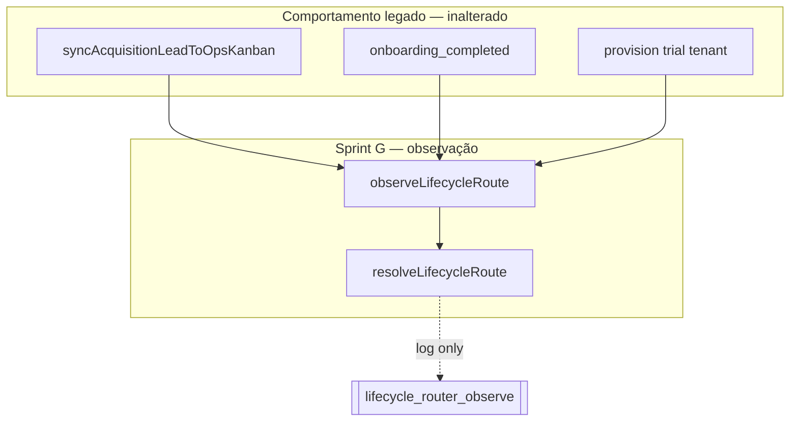

# Sprint G — Lifecycle Router Foundation

**Data:** 2026-06-04  
**Status:** Implementado (modo observação; produção-compatível)

---

## 1. Objetivo

Centralizar **decisões futuras** de movimentação do Ops Kanban em uma camada única (`Lifecycle Router`), sem alterar o comportamento atual de aquisição, onboarding, billing ou automações.

```text
Lifecycle Event
      ↓
Lifecycle Router (resolve apenas)
      ↓
boardName + columnName (teórico)
      ↓
[ Sprint H+ ] Ops Kanban apply
```

---

## 2. Arquitetura

### 2.1 Módulo

`packages/backend/src/lifecycle/`

| Arquivo | Responsabilidade |
|---------|------------------|
| `lifecycleTypes.ts` | `LifecycleEventType`, `LifecycleRoute`, `LifecycleContext`, `LifecycleResolution` |
| `lifecycleDefaultRoutes.ts` | Tabela central evento → board/coluna |
| `lifecycleBoardCatalog.ts` | Validação de boards/colunas conhecidos (seed + alvo Sprint H) |
| `lifecycleRouter.ts` | `resolveLifecycleRoute(eventType, context)` — **somente resolve** |
| `lifecycleStageMapping.ts` | Inferência de evento a partir de `acquisition_leads` (observação) |
| `lifecycleDebugService.ts` | `simulateLifecycleRoute`, `observeLifecycleRoute`, helpers shadow |
| `index.ts` | Exports públicos |
| `lifecycleRouter.test.ts` | Testes unitários |

### 2.2 Princípios Sprint G

- **Não move cards**
- **Não persiste** resolução
- **Não executa** automações
- **Não altera** `STAGE_TO_COLUMN` nem sync legado
- Integração **shadow**: log `[lifecycle_router_observe]` + resultado em memória

---

## 3. Eventos suportados

```ts
type LifecycleEventType =
  | 'lead.created'
  | 'lead.qualified'
  | 'trial.started'
  | 'trial.expired'
  | 'onboarding.started'
  | 'onboarding.completed'
  | 'subscription.activated'
  | 'subscription.cancelled'
  | 'customer.reactivated';
```

---

## 4. Rotas padrão (`lifecycleDefaultRoutes.ts`)

| Evento | Board | Coluna |
|--------|-------|--------|
| `lead.created` | Aquisição | Novo Lead |
| `lead.qualified` | Aquisição | Qualificado |
| `trial.started` | Aquisição | Trial iniciado |
| `onboarding.started` | Onboarding | Provisionado |
| `onboarding.completed` | Onboarding | Onboarding concluído |
| `subscription.activated` | Expansão | Novo Cliente |
| `trial.expired` | Reativação | Trial expirado |
| `subscription.cancelled` | Reativação | Cancelado |
| `customer.reactivated` | Reativação | Reativado |

**Importante:** estas rotas **não são aplicadas** em produção nesta sprint. O sync legado continua usando apenas o board **Aquisição** e `STAGE_TO_COLUMN`.

Eventos sem rota ou tipo inválido → fallback `Aquisição / Novo lead` com `fallback: true`.

---

## 5. API principal

### `resolveLifecycleRoute(eventType, context?)`

Retorno:

```ts
{
  boardName: string;
  columnName: string;
  reason: string;
  eventType: LifecycleEventType | null;
  matched: boolean;
  fallback: boolean;
  validation: { boardKnown: boolean; columnKnown: boolean };
}
```

### `simulateLifecycleRoute(eventType, context?)`

Debug / testes — mesmo resultado, envelope `{ eventType, context, resolution }`.

### Modo observação

| Helper | Onde é chamado |
|--------|----------------|
| `observeOpsKanbanAcquisitionSync` | `syncAcquisitionLeadToOpsKanban` (após sync OK) |
| `observeOnboardingCompletedShadow` | `completeWizardWhatsappStep`, `skipWizardWhatsappStep` |
| `observeTrialActivationShadow` | `provisionWorkspaceFromSession` (se `status === 'trial'`) |

Log estruturado compara `resolved_*` vs `actual_*` (comportamento legado).

---

## 6. Exemplos

```ts
import { resolveLifecycleRoute, simulateLifecycleRoute } from '../lifecycle/index.js';

// Trial teórico → Aquisição / Trial iniciado
const r = resolveLifecycleRoute('trial.started', {
  acquisitionLeadId: '...',
  tenantId: '...',
  correlationId: '...',
});
// r.boardName === 'Aquisição'
// r.columnName === 'Trial iniciado'

// Pagamento futuro → Expansão
resolveLifecycleRoute('subscription.activated', { tenantId: '...' });
// → Expansão / Novo Cliente

// Evento inválido
resolveLifecycleRoute('foo.bar');
// → fallback Aquisição / Novo lead
```

```ts
simulateLifecycleRoute('onboarding.completed', { tenantId: 't1' });
// resolution.boardName === 'Onboarding'
// resolution.columnName === 'Onboarding concluído'
```

---

## 7. Integração atual (shadow)



---

## 8. Critérios de aceite

| # | Critério | Status |
|---|----------|--------|
| 1 | Nenhum comportamento atual muda | OK — sync/board/coluna iguais |
| 2 | Nenhuma migration | OK |
| 3 | Nenhum card muda de board | OK |
| 4 | Nenhuma automação nova executa | OK |
| 5 | Testes existentes passam | Verificar `npm test` |
| 6 | Testes do router passam | `lifecycleRouter.test.ts` |
| 7 | Foundation pronta para Sprint H | OK — rotas + resolve + observe |

---

## 9. Próximos passos — Sprint H (Billing Integration)

1. Publicar eventos `lifecycle.*` a partir de `activatePlanFromBilling`, `expireTrialsPastDue`, cancelamento.
2. Substituir shadow por **`applyLifecycleRoute`** (ainda opcionalmente só Aquisição).
3. Comparar métricas observe: `resolved_board` vs `actual_board` antes de promover boards.

## 10. Sprint I — Board Promotion Engine

1. `promoteOpsLeadCard(boardId, columnId)` idempotente.
2. Aplicar rotas `Onboarding`, `Expansão`, `Reativação`.

## 11. Sprint J — Lifecycle Automations

1. Phase2 para subject `acquisition_lead`.
2. Campanhas temporais via router + jobs.

---

## 12. Referências

- [LIFECYCLE_ROUTER_FOUNDATION_AUDIT.md](../automation/LIFECYCLE_ROUTER_FOUNDATION_AUDIT.md)
- [OPS_KANBAN_LIFECYCLE_EVOLUTION_PLAN.md](../automation/OPS_KANBAN_LIFECYCLE_EVOLUTION_PLAN.md)
