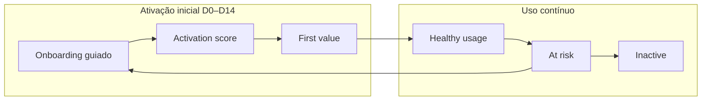
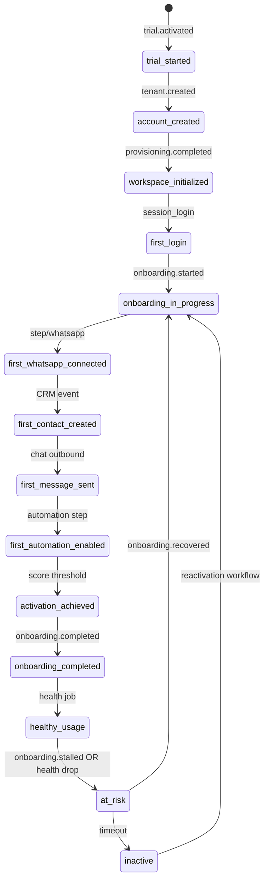
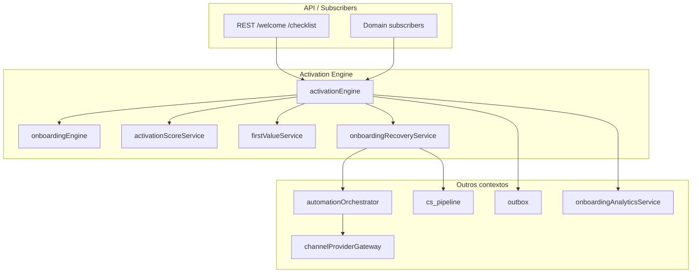
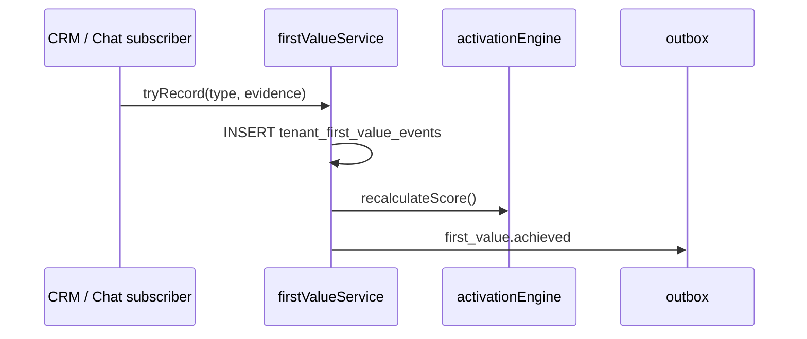
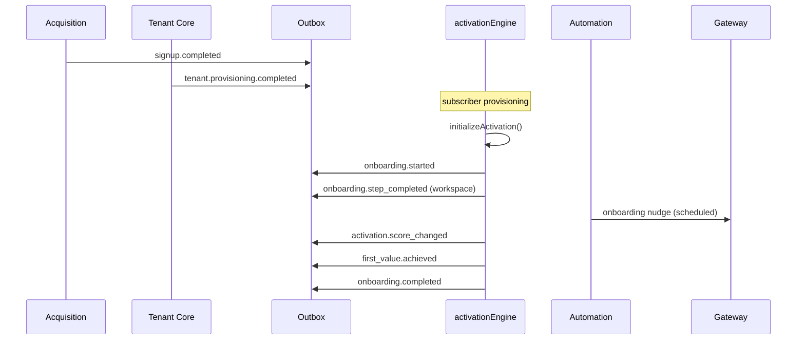
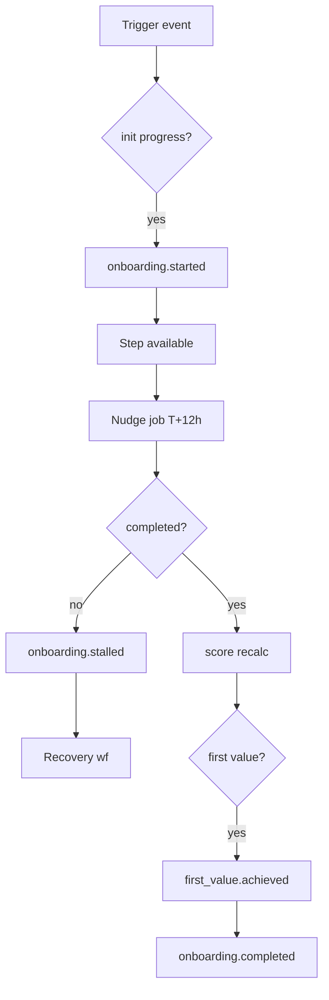
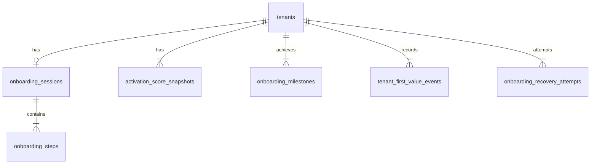

# Onboarding Engine Architecture (PainelCRM)

**Tipo:** documentação arquitetural oficial — engine de ativação, onboarding guiado, first value e recovery.  
**Versão:** 1.0  
**Data:** maio/2026  
**Status:** planejamento — **não implementar** código sem sign-off P0.

**Bounded context:** Activation / Onboarding (ver [`../ARCHITECTURE_SYSTEM_CONTEXT_MAP.md`](../ARCHITECTURE_SYSTEM_CONTEXT_MAP.md) §3.5).

**Documentos relacionados:**

| Documento | Relação |
|-----------|---------|
| [`../MASTER_PLAN_SIGNUP_TRIAL_ONBOARDING_CONVERSION.md`](../MASTER_PLAN_SIGNUP_TRIAL_ONBOARDING_CONVERSION.md) | §30 Onboarding engine, §31 First value, §32 Recovery, §22 Score |
| [`../automation/DOMAIN_EVENT_AND_OUTBOX_ARCHITECTURE.md`](../automation/DOMAIN_EVENT_AND_OUTBOX_ARCHITECTURE.md) | Eventos, outbox, workflows |
| [`../ARCHITECTURE_SYSTEM_CONTEXT_MAP.md`](../ARCHITECTURE_SYSTEM_CONTEXT_MAP.md) | Ownership, Communication gateway |

**Código alvo (futuro):**

```text
packages/backend/src/services/onboarding/
  activationEngine.ts           # fachada operacional (score, FV, recovery, sugestões)
  onboardingEngine/
    engine.ts
    stepRegistry.ts
    progressRepository.ts
    stepStateMachine.ts
    slaScheduler.ts
  activationScoreService.ts
  firstValueService.ts
  onboardingRecoveryService.ts
  onboardingAnalyticsService.ts
```

---

## Índice

1. [Visão geral](#1-visão-geral)
2. [Onboarding philosophy](#2-onboarding-philosophy)
3. [Onboarding lifecycle](#3-onboarding-lifecycle)
4. [Activation engine](#4-activation-engine)
5. [Activation score](#5-activation-score)
6. [First value detection](#6-first-value-detection)
7. [Onboarding orchestration](#7-onboarding-orchestration)
8. [Onboarding workflows](#8-onboarding-workflows)
9. [Onboarding recovery engine](#9-onboarding-recovery-engine)
10. [Communication integration](#10-communication-integration)
11. [Human-in-the-loop](#11-human-in-the-loop)
12. [Onboarding analytics](#12-onboarding-analytics)
13. [Onboarding dashboards](#13-onboarding-dashboards)
14. [Feature flags & experiments](#14-feature-flags--experiments)
15. [Data model](#15-data-model)
16. [Event catalog](#16-event-catalog)
17. [Failure & recovery model](#17-failure--recovery-model)
18. [Observability](#18-observability)
19. [Future evolution](#19-future-evolution)
20. [Anti-patterns proibidos](#20-anti-patterns-proibidos)
21. [Conclusão](#21-conclusão)

---

## 1. Visão geral

### 1.1 Por que onboarding não será apenas UI

**AS-IS:** `/onboarding` opcional, `DashboardActivationBlock` gamificado, `onboarding_completed=true` setado cedo no trial checkout — lógica espalhada, sem SLA nem recovery server-side.

**TO-BE:** onboarding é um **subsistema backend** com estado, eventos, automações e operação CS — a UI (`/welcome`, checklist dashboard) é **projeção** do engine.

| Só UI | Com engine |
|-------|------------|
| Usuário pode pular passos sem registro | Cada passo gera evento + evidência |
| CS não vê quem travou | Pipeline + `onboarding.stalled` |
| Score inconsistente | `activation_score` server-side |
| Recovery manual | Workflows + gateway |

### 1.2 Onboarding como activation engine

**Activation** = transformar conta provisionada em **uso produtivo** mensurável (WhatsApp, chat, automação, equipe).

O **Activation Engine** (`activationEngine`) coordena:

- Progresso de passos (`onboardingEngine`).
- Score e milestones (`activationScoreService`).
- First value (`firstValueService`).
- Detecção de travamento e recovery (`onboardingRecoveryService`).
- Sugestões e próxima ação (read model para UI).

### 1.3 Pipeline operacional contínuo

Onboarding não termina em `onboarding.completed`:



- **Fase 1:** engine de passos + TTFV.
- **Fase 2:** handoff para **health score** (Analytics §48 MASTER) — engine de onboarding **emite sinais**, Analytics **persiste** health.

### 1.4 Orientado a eventos

Toda transição relevante publica no **outbox** (ver [`DOMAIN_EVENT_AND_OUTBOX_ARCHITECTURE.md`](../automation/DOMAIN_EVENT_AND_OUTBOX_ARCHITECTURE.md)):

- Subscribers: Automation (jobs), Communication (nudges), Analytics, Customer Success.

**Proibido:** controller completar passo e chamar WhatsApp diretamente.

### 1.5 Conceitos integrados

| Conceito | Definição | Owner serviço |
|----------|-----------|---------------|
| **Activation** | Progresso mensurável até conta “pronta” | `onboardingEngine` + `activationScoreService` |
| **Adoption** | Uso sustentado de módulos pós-ativação | `featureAdoptionService` (Analytics) — consome eventos onboarding |
| **First value** | Percepção de benefício tangível | `firstValueService` |
| **Onboarding recovery** | Reengajamento após stall | `onboardingRecoveryService` |
| **Customer Success** | Humanos no loop | `cs_pipeline_cards` (CS context) — trigger por eventos onboarding |

---

## 2. Onboarding philosophy

### 2.1 Princípios

| Princípio | Implementação |
|-----------|---------------|
| **Progressivo** | Passos desbloqueados por dependências (`stepRegistry`) |
| **Guided** | UI `/welcome` + deep links por `step_id` |
| **Milestones** | Activation score + `onboarding_milestones` |
| **Friction reduction** | Soft blockers default; hard só onde produto exige |
| **Contextual** | Nudge no passo pendente, não spam genérico |
| **Event-driven** | Fatos no outbox; reações assíncronas |
| **Orchestrated** | Jobs via `automationOrchestrator`, não cron solto |

### 2.2 Três dimensões de onboarding

| Dimensão | O quê | Exemplos |
|----------|-------|----------|
| **Técnico** | Infra e integrações | Conectar WhatsApp, convidar usuário, SMTP tenant |
| **Operacional** | Processos do negócio do cliente | Primeiro contato, primeira mensagem, primeiro ticket |
| **Comportamental** | Hábito de login e frequência | Login D+1, D+7; tempo na agenda |

O engine cobre **técnico + operacional** nativamente; **comportamental** alimenta health score via eventos `session_login` (Analytics).

### 2.3 Soft vs hard completion

| Tipo | `required` | Efeito |
|------|------------|--------|
| Soft | false | Score menor; nudges; não bloqueia módulo |
| Hard | true | `evaluateBlockers()` bloqueia módulo (ex. chat sem WA) |

Override CS: `tenant.metadata.onboarding_override` — auditado (`auditTrailService`).

---

## 3. Onboarding lifecycle

### 3.1 Estados globais (activation lifecycle)

Estados de **experiência do tenant** na plataforma (camada onboarding/activation). Mapeiam para `onboarding_progress.lifecycle_state` + derivados de tenant/billing.

| Estado | Significado | Entrada típica |
|--------|-------------|----------------|
| `trial_started` | Trial ativo; engine pode não ter iniciado | `trial.activated` |
| `account_created` | Tenant + admin existem | `tenant.created` |
| `workspace_initialized` | Provisioning completo | `tenant.provisioning.completed` |
| `first_login` | Primeiro JWT sessão owner/admin | auth event / `session_login` |
| `first_whatsapp_connected` | Instância WA `connected` | evidência + first value |
| `first_contact_created` | CRM contact INSERT | subscriber CRM |
| `first_message_sent` | Outbound chat | `first_chat_replied` FV |
| `first_automation_enabled` | Tag/modelo/resposta rápida | FV / passo `automation` |
| `first_ticket_created` | Ticket tenant | FV |
| `activation_achieved` | Score ≥ limiar OU passos required completos | engine evaluate |
| `healthy_usage` | Health ≥ 70 (Analytics) | pós D+14 |
| `at_risk` | Health &lt; 30 ou onboarding.stalled prolongado | scanner |
| `inactive` | Sem login 14d+ e health baixo | scanner |

**Nota:** `healthy_usage`, `at_risk`, `inactive` são **primariamente** health lifecycle; onboarding engine **contribui** sinais e recovery.

### 3.2 Diagrama de estados (fase ativação)



### 3.3 Transitions e triggers

| Transition | Trigger | Publica evento |
|------------|---------|----------------|
| → `onboarding_in_progress` | `initialize(tenantId)` | `onboarding.started` |
| → passo X | `completeStep` ou detecção automática | `onboarding.step_completed` |
| → `activation_achieved` | `evaluateActivation()` | `activation.score_changed` |
| → `onboarding_completed` | `isComplete()` | `onboarding.completed` |
| → `at_risk` | scanner inatividade | `onboarding.stalled` / `onboarding.at_risk` |
| → recovery | job + engajamento | `onboarding.recovered` |

### 3.4 Timeout handling

| Timeout | Ação |
|---------|------|
| Passo `sla_hours` excedido | `onboarding.step_sla_breached` (interno) → reminder job |
| 24h sem atividade onboarding | `onboarding.stalled` |
| 72h stalled | HITL CS (§11) |
| Trial D-3 sem WA | `at_risk` + trial urgency workflow |

### 3.5 Relação tenant lifecycle (Tenant Core)

| Tenant LC status | Onboarding lifecycle |
|------------------|----------------------|
| `trial` / `trial_active` | Até `onboarding.completed` ou score mínimo |
| `active` (pago) | Onboarding pode continuar soft até complete |
| `suspended` | Pausar automações onboarding; manter estado |

Engine **não** altera billing — solicita transição via `tenantLifecycleService` quando regras produto permitirem.

---

## 4. Activation engine

### 4.1 `activationEngine` — fachada operacional

**Arquivo:** `packages/backend/src/services/onboarding/activationEngine.ts`

**Responsabilidade única de orquestração** (não substitui módulos internos):

| Método | Delega para | Descrição |
|--------|-------------|-----------|
| `initializeActivation(tenantId)` | `onboardingEngine.initialize` | Pós-provisioning |
| `getActivationState(tenantId)` | progress + score + FV | UI + APIs |
| `recalculateScore(tenantId)` | `activationScoreService` | Cron / evento |
| `tryRecordFirstValue(tenantId, type, evidence)` | `firstValueService` | Idempotente |
| `evaluateStalled(tenantId)` | progress + activity timestamps | Scanner input |
| `triggerRecovery(tenantId, reason)` | `onboardingRecoveryService` | Com audit |
| `suggestNextActions(tenantId)` | rules + progress | Lista para UI |
| `isActivationAchieved(tenantId)` | score + required steps | Gate produto |

### 4.2 Diagrama de componentes



### 4.3 Detecção onboarding travado

`evaluateStalled` retorna `{ stalled: boolean, reasons[], pending_step_id, idle_hours }`.

Publica `onboarding.stalled` **uma vez** por período de stall (idempotency `stall:{tenant_id}:{date_bucket}`).

### 4.4 Disparo automações

`activationEngine` **não** envia mensagens — chama `automationOrchestrator.schedule` com payload:

```json
{
  "job_type": "onboarding_reminder",
  "tenant_id": "...",
  "step_id": "whatsapp",
  "correlation_id": "..."
}
```

---

## 5. Activation score

### 5.1 Responsável

**`activationScoreService.ts`** — única fonte de verdade para score **server-side**. Frontend **exibe**; nunca calcula score final.

### 5.2 Sinais e pesos (v1 oficial)

Fórmula ponderada (cap 100) — alinhada MASTER §22:

```text
activation_score = min(100,
  10 * I(account_provisioned) +
  10 * I(company_profile_complete) +
  10 * I(team_started) +          // ≥1 user extra OU flag solo
  40 * I(whatsapp_connected) +
  25 * I(first_operational_chat) + // inbound+outbound OU first_chat FV
  15 * I(automation_configured) +
  10 * I(crm_used)                 // ≥1 contact OR agenda use
)
```

| Sinal | Peso | Detecção |
|-------|------|----------|
| WhatsApp conectado | 40 | instância `connected` |
| Primeiro atendimento operacional | 25 | conversation message in+out |
| Automação configurada | 15 | tag/quick reply/modelo |
| Conta provisionada | 10 | tenant + admin |
| Perfil empresa | 10 | CPF/CNPJ + billing_email |
| Equipe iniciada | 10 | users.count &gt; 1 ou `solo_workspace` |
| CRM utilizado | 10 | contact created |

**Bônus first value:** +10 até cap 100 na **primeira** ocorrência qualquer `first_value_type` (uma vez).

### 5.3 Score ranges e ações

| Faixa | Label | Ações automáticas |
|-------|-------|-------------------|
| 0–19 | Crítico | HITL CS; recovery agressivo |
| 20–39 | Baixo | Nudges WA + email |
| 40–69 | Em progresso | Lembretes passo pendente |
| 70–89 | Bom | Opcional parabéns FV |
| 90–100 | Ativado | `activation_achieved`; reduzir nudges |

**Limiar `activation_achieved`:** default **70** (flag `onboarding.activation_threshold`).

### 5.4 Milestones

| `milestone_id` | Condição |
|----------------|----------|
| `milestone.whatsapp` | score component WA = 1 |
| `milestone.first_chat` | first_operational_chat |
| `milestone.activation_70` | score ≥ 70 |
| `milestone.onboarding_complete` | all required steps |

Persistidos em `onboarding_milestones` (§15).

### 5.5 Snapshots

**Tabela:** `activation_score_snapshots`

| Quando | Motivo |
|--------|--------|
| Cron diário | Tendência |
| `onboarding.step_completed` | Delta |
| `first_value.achieved` | Marco |
| `activation.score_changed` | Evento com `components` jsonb |

Publicar `activation.score_changed` se delta ≥ 5 ou cruza faixa.

### 5.6 Evolução temporal

- UI tenant: sparkline 7d a partir de snapshots.
- Superadmin: distribuição scores por cohort trial week.

---

## 6. First value detection

### 6.1 Definição

**First value** = evidência de que o **negócio do tenant** obteve benefício real do PainelCRM — estritamente **depois** de provisionamento.

Distinto de:

- Conta criada (acquisition).
- WhatsApp conectado sozinho (pode ser só integração).

### 6.2 Catálogo `first_value_type` (v1)

| Tipo | Significado “valor percebido” | Detecção |
|------|------------------------------|----------|
| `whatsapp_connected` | Canal principal ativo | instance status |
| `first_conversation` | Primeira conversa com mensagens | chat |
| `first_sale` | Primeira venda registrada (futuro CRM) | order/invoice tenant |
| `first_ticket_resolved` | Primeiro ticket fechado | tickets |
| `first_automation_active` | Automação disparada | automation execution log |
| `first_operational_attendance` | Atendimento encerrado com interação | conversation closed |

### 6.3 Evento oficial

```text
first_value.achieved
```

| Campo payload | Tipo |
|---------------|------|
| `tenant_id` | uuid |
| `first_value_type` | text |
| `occurred_at` | timestamptz |
| `entity_type` / `entity_id` | evidência |
| `ttfv_seconds` | int — desde `tenant.provisioned_at` |

**Idempotency:** `first_value:{tenant_id}:{first_value_type}`.

### 6.4 Fluxo



### 6.5 Integração score e analytics

- Recalcula activation score (§5.4 bônus).
- `onboardingAnalyticsService.recordTTFV()`.
- Pode disparar workflow `first_value_celebration` (opcional, soft).

---

## 7. Onboarding orchestration

### 7.1 Integração com event bus

| Componente | Papel |
|------------|------|
| **Outbox** | Persiste fatos onboarding |
| **Subscribers** | Reagem sem acoplar engine a WA |
| **Automation** | Delays e escalonamento |
| **Communication** | Templates `onboarding.*` |
| **Saga** | `initialize` após `tenant.provisioning.completed` |

### 7.2 Cadeia oficial pós-signup



### 7.3 Mapeamento eventos (resumo)

| Evento upstream | Ação engine |
|-----------------|-------------|
| `signup.completed` | Prepara correlation; não init sem tenant |
| `tenant.provisioning.completed` | `initializeActivation` |
| `trial.activated` | init + workflow trial_onboarding |
| `billing.invoice.paid` | init se ainda não; adjust lifecycle |
| `communication.message.delivered` | Pode auto-complete step evidence |
| `onboarding.stalled` | recovery workflows |

### 7.4 Idempotência init

`onboarding_idempotency_key`: `onboarding:{tenant_id}:init` (MASTER §19).

---

## 8. Onboarding workflows

Workflows = definições em `stepRegistry` + `automation_jobs` + templates Communication — **não** código espalhado.

### 8.1 Estrutura workflow

| Campo | Descrição |
|-------|-----------|
| `workflow_id` | string estável |
| `trigger_events[]` | eventos que iniciam |
| `steps[]` | passos onboarding relacionados |
| `automation_sequence[]` | jobs com delays |
| `templates[]` | keys Communication |
| `cancel_on_events[]` | ex. `onboarding.completed` |

### 8.2 Workflows obrigatórios

#### 1. Trial onboarding

| Atributo | Valor |
|----------|-------|
| `workflow_id` | `wf.trial_onboarding` |
| Trigger | `trial.activated`, `onboarding.started` |
| Passos | company → whatsapp → first_chat (soft team) |
| Automação | D+0 welcome WA; D+1 passo pendente |
| Cancel | `billing.invoice.paid`, `onboarding.completed` |

#### 2. WhatsApp connection onboarding

| Atributo | Valor |
|----------|-------|
| `workflow_id` | `wf.whatsapp_connect` |
| Trigger | step `whatsapp` = `available` + 12h sem complete |
| Template | `onboarding.whatsapp.connect` |
| Hard blocker | chat module (produto) |

#### 3. CRM setup onboarding

| Atributo | Valor |
|----------|-------|
| `workflow_id` | `wf.crm_setup` |
| Trigger | whatsapp completed, contact step available |
| Passos | `first_contact`, import opcional |
| Evento alvo | `first_contact_created` |

#### 4. Team invite onboarding

| Atributo | Valor |
|----------|-------|
| `workflow_id` | `wf.team_invite` |
| Trigger | company complete, users=1 |
| Template | `onboarding.team.invite` |
| Métrica | `team_started` score component |

#### 5. First automation onboarding

| Atributo | Valor |
|----------|-------|
| `workflow_id` | `wf.first_automation` |
| Trigger | first_chat complete |
| Passo | `automation` |
| FV | `first_automation_active` |

#### 6. Ticket onboarding

| Atributo | Valor |
|----------|-------|
| `workflow_id` | `wf.first_ticket` |
| Trigger | plano com módulo tickets |
| Passo | `first_ticket` (optional) |
| FV | `first_ticket_resolved` |

#### 7. Reactivation onboarding

| Atributo | Valor |
|----------|-------|
| `workflow_id` | `wf.reactivation` |
| Trigger | `inactive` → manual ou scanner |
| Ação | Reset stalled steps; CS opcional |
| Evento | `onboarding.recovered` |

#### 8. Abandoned onboarding recovery

| Atributo | Valor |
|----------|-------|
| `workflow_id` | `wf.onboarding_abandoned` |
| Trigger | `onboarding.stalled` |
| Escalonamento | §9 (24h WA → 48h email → 72h CS) |
| Intent | `recovery.onboarding` |

### 8.3 Diagrama workflow genérico



---

## 9. Onboarding recovery engine

### 9.1 `onboardingRecoveryService`

**Responsável:** detectar, planejar e registrar tentativas de recovery — execução via Automation + Communication.

### 9.2 Sinais de travamento

| Sinal | Regra | `reason_code` |
|-------|-------|---------------|
| Conta sem login | provisioned + 48h sem `session_login` | `never_logged_in` |
| WhatsApp não conectado | trial D+2, step whatsapp pending | `no_whatsapp` |
| Sem contatos | WA ok + 72h sem contact | `no_contacts` |
| Sem mensagens | contact ok + 48h sem outbound | `no_messages` |
| Score crítico | activation &lt; 20 e idle 24h | `low_activation_score` |
| Passo SLA | `sla_hours` excedido 2× | `step_sla_breach` |

### 9.3 Escalonamento (retries)

| Estágio | Delay | Canal | Job type |
|---------|-------|-------|----------|
| 1 | +24h stall | WhatsApp | `onboarding_reminder` |
| 2 | +48h | Email | `onboarding_reminder_email` |
| 3 | +72h | CS task | `cs_onboarding_stalled` |
| 4 | +7d | `onboarding.at_risk` | analytics + AM |

**Idempotency:** `recovery:{tenant_id}:{step_id}:{stage}`.

### 9.4 Human escalation

Ver §11 — estágio 3+.

### 9.5 Tabela `onboarding_recovery_attempts`

Registra cada tentativa (canal, template, resultado, `communication_message_id`).

### 9.6 Recovery bem-sucedido

Quando `last_onboarding_activity_at` atualiza e passo crítico completa:

- Publicar `onboarding.recovered`.
- Cancelar jobs pendentes recovery.
- Mover card CS coluna “Trial ativo” / “Convertido”.

---

## 10. Communication integration

### 10.1 Regra absoluta

Todo envio onboarding/recovery usa **`channelProviderGateway`** (MASTER §59).

**Proibido:** UazAPI, Meta, SMTP direto em `onboardingEngine`.

### 10.2 Message intents

| Intent | Uso |
|--------|-----|
| `onboarding.nudge` | Lembrete passo |
| `recovery.onboarding` | Stall recovery |
| `transactional.onboarding` | Boas-vindas pós-activate |

### 10.3 Templates (registry)

| Template key | Workflow |
|--------------|----------|
| `onboarding.welcome.trial` | trial_onboarding |
| `onboarding.whatsapp.connect` | whatsapp_connect |
| `onboarding.team.invite` | team_invite |
| `onboarding.step.{step_id}` | genérico |
| `recovery.onboarding.stalled` | abandoned recovery |

Categoria Meta: **UTILITY** (MASTER §63).

### 10.4 Onboarding conversations

`conversation_type = onboarding` em `communication_conversations` (MASTER §66).

- Uma conversa lógica por tenant para nudges WA.
- Inbound resposta → `communication.conversation.replied` → pode marcar engajamento recovery.

### 10.5 Fluxo

```text
onboarding.stalled (outbox)
  → automationSubscriber
  → schedule job
  → executor → channelProviderGateway.sendTemplate({
        message_intent: 'recovery.onboarding',
        template_key: 'recovery.onboarding.stalled',
        tenant_id
      })
  → communication.message.sent (outbox)
```

---

## 11. Human-in-the-loop

### 11.1 Triggers escalonamento humano

| Condição | Prioridade | Fila |
|----------|------------|------|
| `onboarding.stalled` ≥ 72h | P2 | CS onboarding |
| `activation_score` &lt; 15 | P1 | CS senior |
| Trial D-3 sem `first_value` | P1 | CS trial urgency |
| Plano enterprise / MRR alto | P0 | AM assigned |
| 3+ recovery attempts failed | P2 | CS investigação |
| Cliente pediu humano (inbound) | P1 | CS |

### 11.2 Ownership

| Papel | Ownership |
|-------|-----------|
| SDR | Pré-ativação (Acquisition) |
| CS | Trial + onboarding parado |
| AM | Convertido + enterprise onboarding |
| Eng | Bug engine / replay |

### 11.3 SLA

| Prioridade | Primeira resposta |
|------------|-------------------|
| P0 enterprise | 4h úteis |
| P1 trial crítico | 8h |
| P2 onboarding parado | 24h |

### 11.4 CS pipeline

Card em `cs_pipeline_cards`:

- `column_key`: `onboarding_stalled` (MASTER §33).
- `entity_type`: `tenant`.
- `source`: `hitl_onboarding`.
- Atualizado por subscribers `onboarding.stalled`, `onboarding.at_risk`.

---

## 12. Onboarding analytics

### 12.1 `onboardingAnalyticsService`

**Localização:** `packages/backend/src/services/onboarding/onboardingAnalyticsService.ts`

**Responsável:** métricas e rollups de onboarding — **não** muta progresso.

### 12.2 Métricas oficiais

| Métrica | Definição |
|---------|-----------|
| **Onboarding funnel** | % tenants por `lifecycle_state` |
| **Drop-off analysis** | último `step_id` antes de stall 7d |
| **Activation conversion** | % score ≥ 70 em D+7 |
| **Recovery conversion** | % `onboarding.recovered` após stall |
| **Onboarding duration** | `completed_at - started_at` |
| **TTFV** | `first_value_at - provisioned_at` |
| **Activation cohorts** | trial week × score P50 |

### 12.3 Ingestão

| Fonte | Como |
|-------|------|
| Outbox events | Subscriber `onboardingAnalyticsSubscriber` |
| `product_analytics_events` | Dual-write opcional (MASTER §34) |
| Snapshots | Cron rollup `onboarding_metrics_daily` |

### 12.4 Separação Analytics context

- **Onboarding analytics** = funil ativação e passos.
- **Product analytics** = uso features pós-ativação.
- **Health score** = contínuo (Analytics §48).

---

## 13. Onboarding dashboards

### 13.1 Super Admin

| Painel | Dados |
|--------|-------|
| Ativação global | cohort activation P50/P90 |
| Gargalos | drop-off por `step_id` |
| Churn risk | tenants `at_risk` + trial D-N |
| Trial conversion | trial → activation_70 → paid |

Fonte: rollups §12 — sem queries pesadas em `onboarding_progress` em request síncrono.

### 13.2 Tenant (admin)

| Painel | Dados |
|--------|-------|
| Progresso | `getProgress()` steps |
| Checklist | facade `GET /api/dashboard/activation-checklist` |
| Score | último snapshot + component breakdown |
| Recomendações | `suggestNextActions()` |

### 13.3 Customer Success

| Painel | Dados |
|--------|-------|
| Contas travadas | `cs_pipeline` + idle_hours |
| SLA breach | cards `sla_breached_at` |
| Recovery queue | `onboarding_recovery_attempts` pending |

---

## 14. Feature flags & experiments

### 14.1 Registry

Via [`featureFlagRegistry`](../MASTER_PLAN_SIGNUP_TRIAL_ONBOARDING_CONVERSION.md) (MASTER §47) — não env vars em engine.

### 14.2 Flags onboarding (catálogo)

| Key | Efeito |
|-----|--------|
| `onboarding.engine_v1` | Engine vs legado checklist |
| `onboarding.hard_block_chat` | Hard blocker WA |
| `onboarding.activation_threshold` | override limiar 70 |
| `onboarding.recovery_v1` | Recovery workflows |
| `onboarding.experiment.{id}` | A/B step order |

### 14.3 A/B testing

| Experimento | Variante |
|-------------|----------|
| Ordem passos | WA antes vs depois company |
| Template nudge | tom A vs B |
| Threshold | 60 vs 70 activation |

**Persistência:** `tenant.metadata.onboarding_experiment` + analytics properties.

### 14.4 Progressive rollout

1. 5% tenants canary  
2. 25% → 100%  
3. Shadow: engine calcula score sem afetar UI (MASTER §42)

---

## 15. Data model

### 15.1 Entidades futuras

#### `onboarding_sessions`

| Coluna | Tipo | Notas |
|--------|------|-------|
| `id` | uuid PK | |
| `tenant_id` | uuid UNIQUE | 1 sessão ativa por tenant |
| `lifecycle_state` | text | §3.1 |
| `started_at` | timestamptz | |
| `completed_at` | nullable | |
| `last_activity_at` | timestamptz | |
| `correlation_id` | uuid | |
| `experiment_id` | text nullable | |

#### `onboarding_steps` (ou JSONB em progress)

| Coluna | Tipo |
|--------|------|
| `session_id` | uuid |
| `step_id` | text |
| `state` | enum §30.3 |
| `available_at` | timestamptz |
| `completed_at` | nullable |
| `evidence` | jsonb |
| `sla_due_at` | timestamptz |

**Alias implementação v1:** tabela `onboarding_progress` (MASTER §5.2) pode ser evoluída para este modelo.

#### `activation_score_snapshots`

| Coluna | Tipo |
|--------|------|
| `tenant_id` | uuid |
| `score` | int |
| `components` | jsonb |
| `recorded_at` | timestamptz |

#### `onboarding_events` (opcional audit stream)

Append-only mirror de outbox onboarding — para replay UI.

#### `onboarding_recovery_attempts`

| Coluna | Tipo |
|--------|------|
| `tenant_id` | uuid |
| `reason_code` | text |
| `stage` | int |
| `channel` | text |
| `status` | sent/failed/skipped |
| `communication_message_id` | uuid nullable |
| `idempotency_key` | UNIQUE |

#### `onboarding_milestones`

| Coluna | Tipo |
|--------|------|
| `tenant_id` | uuid |
| `milestone_id` | text |
| `achieved_at` | timestamptz |

UNIQUE `(tenant_id, milestone_id)`.

#### `tenant_first_value_events`

Ver MASTER §31 — owner First Value dentro do contexto Onboarding.

### 15.2 ER diagram



---

## 16. Event catalog

**Owner:** Activation / Onboarding context. Transporte: outbox (§7).

| Evento | Quando | Prioridade |
|--------|--------|------------|
| `onboarding.started` | `initializeActivation` | P2 |
| `onboarding.step_completed` | passo completed | P2 |
| `onboarding.stalled` | scanner idle / SLA | P2 |
| `onboarding.recovered` | reengajamento pós stall | P2 |
| `onboarding.at_risk` | trial D-3 / score crítico prolongado | P1 |
| `onboarding.completed` | `isComplete()` | P2 |
| `activation.score_changed` | recalc delta significativo | P3 |
| `first_value.achieved` | primeiro FV por tipo | P2 |

### 16.1 Payload mínimo (exemplo `onboarding.step_completed`)

```json
{
  "schema_version": 1,
  "data": {
    "tenant_id": "uuid",
    "step_id": "whatsapp",
    "previous_state": "in_progress",
    "new_state": "completed",
    "activation_score": 65,
    "correlation_id": "uuid"
  }
}
```

### 16.2 Consumidores

| Evento | Consumidores |
|--------|--------------|
| `onboarding.stalled` | Automation, CS pipeline, Analytics |
| `onboarding.completed` | Tenant lifecycle, Analytics |
| `first_value.achieved` | Analytics, Automation (celebration), Activation score |
| `activation.score_changed` | CS (threshold), Analytics |

Catálogo global: [`DOMAIN_EVENT_AND_OUTBOX_ARCHITECTURE.md`](../automation/DOMAIN_EVENT_AND_OUTBOX_ARCHITECTURE.md) §9.5.

---

## 17. Failure & recovery model

### 17.1 Onboarding stuck recovery

| Camada | Ação |
|--------|------|
| Detecção | `onboardingInactivityScanner` cron 1h |
| Plano | `onboardingRecoveryService.planRecovery()` |
| Execução | Automation jobs |
| Humano | HITL §11 |

### 17.2 Retry strategy

| Componente | Retries |
|------------|---------|
| Communication nudge | gateway + job retry 3× |
| Outbox publish | política global §5 outbox doc |
| `initialize` falhou | saga / job idempotente retry |

### 17.3 Replay onboarding flows

- Admin replay: requeue jobs cancelled erroneamente (audit).
- **Não** replay `onboarding.completed` sem override CS.

### 17.4 Manual intervention

CS actions:

- `completeStep` com `evidence.source=cs_override`
- `skipStep` auditado
- `triggerRecovery` manual

### 17.5 Degraded mode

| Modo | Comportamento |
|------|---------------|
| Communication down | Queue nudges; in-app banner |
| Engine bug | Fallback checklist legado (flag off) |
| DB stress | Pausar scanner; manter progress reads |

---

## 18. Observability

### 18.1 Log prefixes

| Prefixo | Conteúdo |
|---------|----------|
| `[ONBOARDING]` | init, completeStep, lifecycle |
| `[ACTIVATION]` | score recalc, achieved |
| `[FIRST_VALUE]` | tryRecord, achieved |
| `[RECOVERY]` | stall detect, attempt |
| `[ONBOARDING_WORKFLOW]` | job schedule/cancel |

Campos obrigatórios: `tenant_id`, `correlation_id`, `step_id`, `workflow_id`.

### 18.2 Correlation & traces

- Herdar `correlation_id` da sessão signup quando existir.
- Span: `onboarding.completeStep`, `activation.recalculate`.

### 18.3 Operational audit

| Ação | Audit |
|------|-------|
| CS override step | `onboarding.override` |
| Manual recovery | `onboarding.recovery.manual` |
| Replay | `onboarding.replay` |

### 18.4 Replay history

`onboarding_events` ou audit trail filtrado por `tenant_id` — UI superadmin “timeline onboarding”.

### 18.5 Métricas

| Métrica | Alerta |
|---------|--------|
| `onboarding_stalled_count` | spike 2× baseline |
| `onboarding_init_failures` | &gt; 0 em 1h |
| `ttfv_p95_hours` | &gt; 72h |
| `recovery_failure_rate` | &gt; 30% |

---

## 19. Future evolution

### 19.1 IA onboarding assistant

| Capacidade | Integração |
|------------|------------|
| Sugestão próximo passo | `suggestNextActions` + modelo |
| Copilot in-app | lê `onboarding_events` stream |
| **Sem** auto-complete step sem evidência | HITL ou regras |

### 19.2 Onboarding conversacional

- `conversation_type=onboarding` + AI adapter (futuro).
- Handoff humano §11.

### 19.3 Adaptive onboarding

- `stepRegistry` dinâmico por segmento (plano, vertical).
- Flags experiment §14.

### 19.4 Omnichannel onboarding

- Email + WA + in-app via mesmo gateway.
- Eventos `communication.*` unificados.

---

## 20. Anti-patterns proibidos

| # | Anti-pattern | Correção |
|---|--------------|----------|
| 1 | Onboarding espalhado em páginas/controllers | `onboardingEngine` |
| 2 | Lógica de passo fora do engine | `stepRegistry` |
| 3 | Notify direto (WA/email) | gateway + intent |
| 4 | Bypass gateway | `channelProviderGateway` |
| 5 | Score calculado no frontend | `activationScoreService` |
| 6 | Recovery manual sem audit | `onboarding_recovery_attempts` + audit |
| 7 | Automações paralelas duplicadas | um subscriber `onboarding.stalled` |
| 8 | `onboarding_completed=true` no INSERT tenant | init engine pós-provisioning |
| 9 | Cron chamando provider | orchestrator + gateway |
| 10 | Cross-context SQL em engine | facades / eventos |

---

## 21. Conclusão

O **Onboarding Engine** transforma o onboarding de **tutorial inicial** em **engine contínua de ativação e retenção**:

| Antes | Depois |
|-------|--------|
| UI opcional | Pipeline com estado e SLA |
| Boolean `onboarding_completed` | Score + milestones + first value |
| Sem recovery | Workflows + Communication + CS |
| Acoplamento WA | Eventos + gateway |
| CS cego | Dashboards + `onboarding.stalled` |

**P0 implementação futura:**

1. `onboarding_progress` + `onboardingEngine.initialize/completeStep`.  
2. `activationScoreService` + snapshots.  
3. Outbox eventos §16.  
4. Subscriber → Automation recovery wf #8.  
5. Facade checklist API.

**Próximo documento sugerido:** [`communication/COMMUNICATION_PLATFORM_ARCHITECTURE.md`](../communication/COMMUNICATION_PLATFORM_ARCHITECTURE.md) ou `acquisition/ARCHITECTURE_ACQUISITION.md`.

---

*Documento oficial v1.0 — Onboarding Engine — PainelCRM — maio/2026. Não implementar código sem sign-off P0.*
