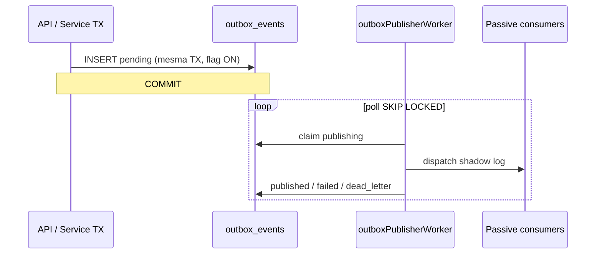

# Sprint 2 — Outbox Foundation (notas de implementação)

**Status:** implementado no código · **migração:** `254_outbox_events_p0.sql`  
**Data:** maio/2026

---

## 1. Arquitetura



| Componente | Caminho |
|------------|---------|
| Publish | `packages/backend/src/outbox/publishDomainEvent.ts` |
| Repository | `packages/backend/src/outbox/outboxRepository.ts` |
| Worker | `packages/backend/src/outbox/outboxPublisherWorker.ts` |
| Passive | `packages/backend/src/outbox/passiveConsumers/` |
| Replay foundation | `packages/backend/src/outbox/replayFoundation.ts` |
| Script | `npm run outbox:worker` |

---

## 2. Tabelas

| Tabela | Função |
|--------|--------|
| `outbox_events` | Fila transacional |
| `outbox_dispatch_log` | Auditoria por tentativa |
| `outbox_subscriber_idempotency` | Dedupe de consumo |
| `outbox_replay_markers` | Foundation replay |

**Status:** `pending` → `publishing` → `published` | `failed` (retry) | `dead_letter`

---

## 3. Feature flags (default OFF)

| Flag | Uso |
|------|-----|
| `outbox.write_v1` | INSERT no outbox |
| `outbox.publisher_worker_v1` / `outbox.publisher_v1` | Worker |
| `outbox.passive_consumers_v1` / `outbox.subscribers_v1` | Consumers passivos |
| `outbox.dead_letter_v1` | Transição para DLQ |
| `outbox.replay_foundation_v1` | Markers de replay |
| `outbox.master_off` | Kill switch global |
| `outbox.publisher_off` | Para só publisher |

---

## 4. Shadow mode

- Metadata `shadow: true` quando flag resolve com shadow
- Consumers **só logam** (`[OUTBOX] passive_consume`)
- **Nenhum** efeito em billing, notify, workflows
- Instrumentação: `ticket.created` em `createPlatformSupportTicket` (TX, non-fatal se falhar)

---

## 5. Retry / DLQ

| Tentativa | Backoff |
|-----------|---------|
| 1 | 30s |
| 2 | 2m |
| 3 | 10m |
| … | até 24h |

- **Stale reclaim:** `publishing` &gt; 5 min → `pending`
- **DLQ:** `attempts >= max_attempts` com `outbox.dead_letter_v1` ON

---

## 6. Replay foundation

- `prepareReplayPublication()` / `publishReplayEvent()`
- Nova `idempotency_key` `{original}:replay:{uuid}`
- Registo em `outbox_replay_markers`
- **Sem API admin** nesta sprint

---

## 7. Observabilidade

| Prefixo | Exemplos |
|---------|----------|
| `[OUTBOX]` | publish_inserted, passive_consume |
| `[OUTBOX_WORKER]` | batch_complete, stale_reclaimed |
| `[OUTBOX_RETRY]` | scheduled |
| `[OUTBOX_DLQ]` | dead_letter |
| `[OUTBOX_REPLAY]` | replay_published |

---

## 8. Rollback

| Nível | Ação |
|-------|------|
| L1 | `outbox.master_off` ON ou flags OFF |
| L2 | Parar `outbox:worker` |
| L3 | Revert deploy (tabelas podem ficar) |

---

## 9. Validação staging

```bash
cd packages/backend
npm run migrate:tsx
npm test -- --run src/outbox
npm run build

# internal tenant + flags ON em staging
# criar ticket suporte → verificar row outbox_events
OUTBOX_WORKER_LOOP=true npm run outbox:worker
```

Checklist:

- [ ] `outbox.write_v1` internal ON — INSERT em criar ticket
- [ ] Publisher processa → `published`
- [ ] Logs `[OUTBOX]` + `correlation_id`
- [ ] Idempotência: segundo publish mesma key → dedupe
- [ ] Kill `outbox.publisher_off` — fila acumula, sem crash
- [ ] Billing / notify inalterados com flags OFF

---

## 10. Próximas sprints

| Sprint | Escopo |
|--------|--------|
| S3 | Worker heartbeat enterprise, reclaim global |
| S4 | Communication gateway bridge |
| S5+ | Consumers ativos, shadow validation 7d |
| Futuro | Replay admin UI, Kafka/RabbitMQ |

---

*Ver: [P0_IMPLEMENTATION_SPRINTS.md](../P0_IMPLEMENTATION_SPRINTS.md) · [IMPLEMENTATION_P0_FOUNDATION_EXECUTION_PLAN.md](../IMPLEMENTATION_P0_FOUNDATION_EXECUTION_PLAN.md)*
