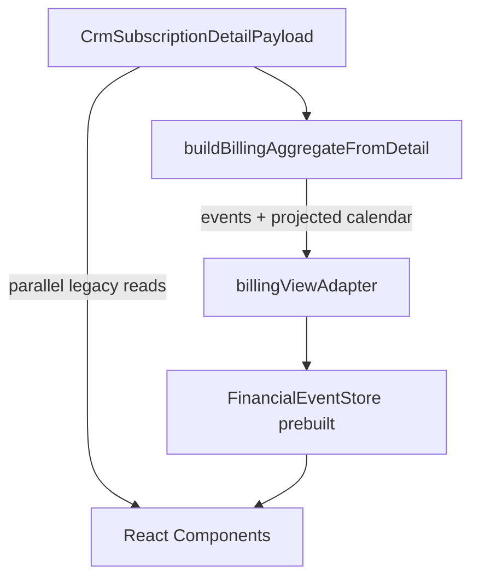

# Aggregate → UI Mapping — Sprint 5.0-22A

Matrizes de mapeamento entre `BillingAggregate`, `billingViewAdapter`, `FinancialEventStore(prebuilt)` e componentes React.

---

## Fluxo de dados atual

**Observação:** `aggregate.history`, `sidebar`, `nextInvoice`, `alerts`, `capabilities` são produzidos pelo pipeline mas **não entram no fluxo React**.

---

## Matriz 1: Aggregate field → reaches UI?

| Campo Aggregate | Stage | Chega à UI? | Caminho |
|-----------------|-------|-------------|---------|
| `subscriptionId` | init | ❌ | interno |
| `builtAt` | init | ❌ | interno |
| `todayYmd` | init | ⚠️ parcial | usado no build; store tem `today` próprio |
| `subscription` | subscriptionStage | ⚠️ parcial | UI lê `detail.subscription` |
| `cycles` | cycleStage | ❌ | UI usa `detail.cycles_raw` |
| `invoices` | cycleStage | ❌ | shadow only |
| `timeline` | passthrough | ❌ | sempre `[]`; UI usa `detail.timeline` |
| `events` | financialEventStage | ✅ parcial | adapter → `store.realEvents` / `store.events` |
| `history` | historyStage | ⚠️ indireto | store recomputa via eventos adaptados |
| `calendar` | calendarStage | ⚠️ parcial | só `isProjected` no adapter |
| `nextInvoice` | nextInvoiceStage | ⚠️ indireto | store recomputa via resolver legado |
| `sidebar` | sidebarStage | ⚠️ indireto | store recomputa `getSidebarSummary` |
| `alerts` | alertStage | ❌ | UI usa `buildFinancialAlerts(detail)` |
| `capabilities` | capabilityStage | ❌ | UI usa `cycleSupportsManualGenerate` + `invoiceCapabilities` |
| `technical` | passthrough | ❌ | UI usa `buildTechnicalDiagnostics(detail)` |
| `sourceSignature` | init | ❌ | traceabilidade |

---

## Matriz 2: Aggregate → Adapter → FinancialEvent

### Eventos reais

| Campo Aggregate | → FinancialEvent | Descartado? |
|-----------------|------------------|-------------|
| `id` | `id` | |
| `cycleId` | `cycleId` | |
| `subscriptionId` | — | ✅ |
| `eventType` | `type` | ⚠️ ver mapa de tipos |
| `dueYmd` | `ymd`, `dueYmd` | |
| `occurredAt` | `lastUpdatedAt` | |
| `status` | — | ✅ recomputado por helpers legados |
| `kind` | `kind: 'real'` | hardcoded |
| `metadata.invoiceId` | `invoiceId` | |
| `metadata.jobId` | — | ✅ |
| `metadata.periodStart` | `competence` | |
| `metadata.periodEnd` | — | ✅ |
| `metadata.amount` | `amountCents` | fallback subscription amount |
| `metadata.currency` | — | ✅ |
| `metadata.skippedReason` | `notes` | |
| `metadata.errorMessage` | `notes` | |
| `metadata.cycleMetadata` | — | ✅ |
| — | `gateway` | de `detail.subscription` |
| — | `clientName` | de `detail.client_name` |
| — | `paidAt` | derivado se type=payment |
| — | `cycleKey` | recomputado |

### Mapa de tipos (`AGGREGATE_TO_LEGACY`)

| Aggregate `eventType` | Legacy `FinancialEventType` | Notas |
|----------------------|----------------------------|-------|
| `payment` | `payment` | |
| `invoice_generated` | `invoice_generated` | |
| `invoice_due` | `invoice_due` | |
| `invoice_failed` | `invoice_failed` | |
| `manual_charge` | `manual_charge` | |
| `invoice_refunded` | `invoice_refunded` | |
| `upcoming_cycle` | `upcoming_cycle` | |
| `cycle_pending` | `upcoming_cycle` | granularidade perdida |
| `cycle_queued` | `upcoming_cycle` | granularidade perdida |
| `cycle_processing` | `upcoming_cycle` | granularidade perdida |
| `cycle_unknown` | `upcoming_cycle` | granularidade perdida |
| `cycle_cancelled` | `invoice_cancelled` | certificado 5.0-21D |
| **`cycle_skipped`** | **— (null)** | **evento descartado — GAP-01** |

### Calendário projetado

| Campo Aggregate | → FinancialEvent | Descartado? |
|-----------------|------------------|-------------|
| `eventId` | `id` | |
| `date` | `ymd`, `dueYmd` | |
| `metadata.amount` | `amountCents` | |
| `isProjected: true` | `kind: 'projected'` | |
| — | `type: 'upcoming_cycle'` | forçado |
| `cycleId` | `cycleId: null` | ✅ mesmo se aggregate tem valor |
| `eventType`, `status` | — | ✅ |

---

## Matriz 3: Adapter → React (via store methods)

| Store method | Fonte primária | Fonte legado adicional |
|--------------|----------------|------------------------|
| `getCalendarEvents` | `this.events` (adaptados) | `eventToCalendarKind`, emoji, title helpers |
| `getHistoryRows` / `filterHistory` | `this.realEvents` | `resolveFirstEligibleCycle(detail)`, `cycleSupportsManualGenerate(detail)`, `resolveHistoryRowState` |
| `getSidebarSummary` | `this.realEvents` | `getNextChargePresentation()` → **timeline**, annual revenue de detail |
| `getKpiCards` | events | `subscriptionHeadlineStatus(detail)` |
| `getInsights` | realEvents | `buildFinancialInsights` engine legado |
| `getMonthOverview` | — | **`buildFinancialMonthOverview(detail.timeline)`** |
| `resolveNextChargePresentationFromStore` | events | **`detail.timeline.find(cycle_id)`** para competência |

---

## Matriz 4: Aggregate views vs store recomputation

| Superfície | Shadow parity | UI lê aggregate? | UI lê store? | Divergência conhecida |
|------------|---------------|------------------|--------------|----------------------|
| History | 100% | ❌ | ✅ | `cycle_skipped` ausente na UI |
| Calendar | 100% | ❌ | ✅ | metadados simplificados |
| Sidebar | 100% | ❌ | ✅ | valores equivalentes |
| Next Invoice | 100% | ❌ | ✅ | competência pode divergir se timeline ≠ cycles |
| Alerts | 90% | ❌ | ❌ (usa legado) | lifecycle alerts intencionais |
| Capabilities | 100% | ❌ | ❌ (usa legado) | wiring only |
| Events | 100% | ✅ via adapter | ✅ | `cycle_skipped` dropped |

---

## Matriz 5: Unused Aggregate fields

Campos produzidos pelo pipeline **nunca consumidos pelo React**:

| Campo | Conteúdo | Shadow certificado? |
|-------|----------|---------------------|
| `aggregate.alerts[]` | alertas canônicos | ✅ comparado |
| `aggregate.capabilities` | canGenerate, canRetry, etc. | ✅ comparado |
| `aggregate.history[]` | linhas deduplicadas | ✅ comparado |
| `aggregate.sidebar` | KPIs formatados | ✅ comparado |
| `aggregate.nextInvoice` | próxima cobrança | ✅ comparado |
| `aggregate.invoices[]` | snapshots de fatura | ✅ (alerts invoice_only) |
| `aggregate.cycles[]` | ciclos normalizados | ✅ |

---

## Matriz 6: Missing fields (UI espera, adapter não fornece)

| Campo UI / store | Esperado de | Fornecido pelo adapter? |
|------------------|-------------|-------------------------|
| `cycle_skipped` history row | aggregate.events | ❌ descartado |
| Lifecycle alerts | aggregate.alerts | ❌ UI usa legado |
| `canGenerate` unificado | aggregate.capabilities | ❌ UI usa cycles_raw |
| Competência next invoice | aggregate.nextInvoice.metadata | ❌ resolver usa timeline |
| Projected `cycleId` | aggregate.calendar | ❌ forçado null |
