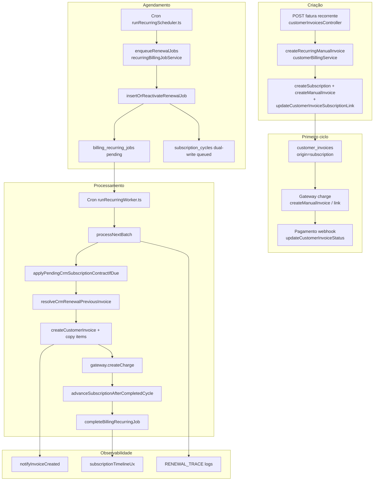
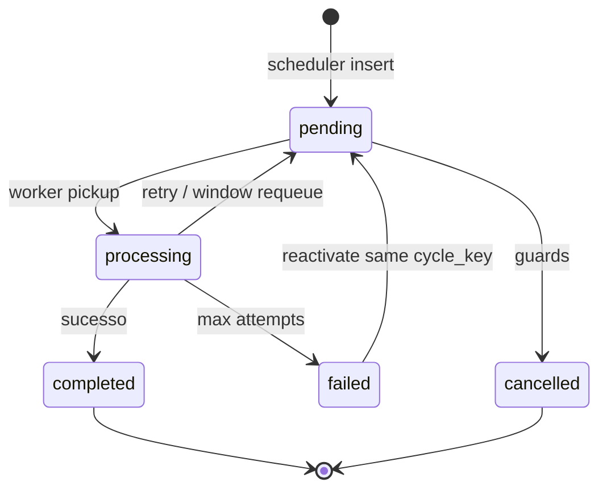

# AUDIT_P0_1_BILLING_RENEWAL_HARDENING

**Modo:** READ ONLY — auditoria completa, **sem implementação**  
**Prioridade:** P0 (BLOCKER)  
**Data:** 2026-06-25  
**Base:** `AUDIT_RENEWAL_ENGINE.md`, `BILLING_ENGINE_ARCHITECTURE_REVIEW_V1.md`, código em `deploy-v1.1.4.21` (`12130e1`)

---

## Resposta central

> **O motor financeiro consegue garantir que uma assinatura válida SEMPRE gerará sua próxima cobrança automaticamente?**

### **NÃO.**

Existem caminhos de falha **estruturais e operacionais** em que uma assinatura `active` com `next_billing_date` elegível **não gera** `customer_invoice`, ou gera job que **falha até `failed`** sem auto-recuperação.

A arquitetura atual é **adequada para MVP/evolução incremental**, mas **não atinge confiabilidade “SaaS financeiro alta confiabilidade”** sem o plano de hardening abaixo.

---

## Entrega 1 — Mapa completo do motor financeiro

### Diagrama ponta a ponta (CRM `type=customer`)



### Serviços envolvidos (referência)

| Camada | Ficheiros principais |
|--------|---------------------|
| Entrada API | `customerInvoicesController.ts`, `crmSubscriptionsController.ts` |
| Criação | `customerBillingService.ts`, `billingSubscriptionService.ts`, `customerInvoiceService.ts` |
| Scheduler | `runRecurringScheduler.ts`, `recurringBillingJobService.ts` |
| Worker | `runRecurringWorker.ts`, `recurringBillingJobService.ts` |
| Contratos S2 | `crmSubscriptionsContractService.ts`, `crmSubscriptionContractRenewalOverlay.ts` |
| Lifecycle | `crmSubscriptionsLifecycleService.ts` |
| Resolver template | `crmRenewalCustomerResolver.ts` |
| Datas | `subscriptionService.ts` (`calculateNextBillingDate`), `billingIntervalGenerationCap.ts` |
| Janela local | `billingTimeWindowObservability.ts`, `tenantBillingPreferencesService.ts` |
| Ciclos shadow | `subscriptionCyclesDualWriteService.ts` |
| Recovery | `billingRecoveryService.ts` |
| Gateway | `gatewayProvider.ts`, `paymentDomainService.ts` (webhooks) |
| UX | `crmSubscriptionsService.ts`, `subscriptionTimelineUx.ts`, `subscriptionRecurringDisplay.ts` |

### SaaS (`type=saas`) — ramo paralelo

Mesmo scheduler/worker; `processOneRenewalJob` usa `calculateSaasRenewalInvoiceAmount` + `tenant_billing` — **não depende** de `customer_invoices`.

---

## Entrega 2 — Tabela de entidades

| Entidade | SoT para… | Obrigatórios (runtime) | Pode NULL | Reconstruível? |
|----------|-------------|------------------------|-----------|---------------|
| **subscriptions** | Próximo ciclo, intervalo, estado | `type`, `tenant_id`, `amount_cents`, `billing_interval`, `status`, `next_billing_date` | `customer_id` (CRM), `current_period_*`, `metadata` | Parcial — datas recalculáveis; linhas não |
| **customer_invoices** | Histórico financeiro | `tenant_id`, `amount_cents`, `due_date`, `status` | `client_id`, `period_start/end`, `subscription_id` | Não (compliance) |
| **customer_invoice_items** | Linhas cobradas / template de facto | `invoice_id`, `total_cents` | `recurring_interval`, `scheduled_due_date` | Só via invoice anterior |
| **billing_recurring_jobs** | Orquestração do ciclo | `subscription_id`, `cycle_key`, `scheduled_at`, `status` | `result_invoice_id`, `error_message` | Re-enfileirável pelo scheduler |
| **subscription_cycles** | UX/relatório (shadow) | `cycle_date`, `period_start/end`, `status` | `invoice_id`, `job_id` | Sim (dual-write + reconciliation) |
| **metadata.crm_contract** | Contrato ativo (overlay) | amount, interval, description (validação app) | — | Sim (PATCH contrato) |
| **metadata.pending_crm_contract** | Downgrade/upgrade próximo ciclo | — | — | Sim |
| **subscription_change_events** | Auditoria S2.2 | tenant, subscription | vários | Não |
| **payment_customers** | Gateway customer id | tenant, gateway, client | — | Recriável no gateway |

---

## Entrega 3 — Tabela de datas

| Campo | Significado | Quem escreve | SoT? | Risco divergência |
|-------|-------------|--------------|------|-------------------|
| `subscriptions.next_billing_date` | Vencimento do ciclo atual | `createSubscription`, worker `updateSubscriptionAfterRenewal`, contract, lifecycle, PATCH manual | **SIM (operacional)** | PATCH manual, interval change |
| `subscriptions.current_period_start` | Início do ciclo corrente | create, worker advance | Deveria = último ciclo faturado | **Alto** após mudança intervalo |
| `subscriptions.current_period_end` | Fim do ciclo corrente | create, worker, contract (interval change) | Derivado | Médio |
| `billing_recurring_jobs.cycle_key` | Ciclo a processar (= vencimento) | scheduler | Espelho de `next_billing` no enqueue | Cancelado se divergir |
| `billing_recurring_jobs.scheduled_at` | Pickup worker | INSERT `now()` | Não | Baixo |
| `billing_recurring_jobs.retry_at` | Backoff erro/janela | worker catch / window requeue | Não | Baixo |
| `customer_invoices.due_date` | Vencimento da cobrança | worker (= `period_start`); admin PATCH | Snapshot | Admin pode alterar |
| `customer_invoices.period_start/end` | Snapshot do ciclo faturado | create; link 1º ciclo | Snapshot imutável | Desalinhamento pós interval change |
| `customer_invoice_items.scheduled_due_date` | Próxima cobrança da linha | create, worker copy/advance | Por item | E2 child path |
| `generation_date` (lógica) | `due − effective_days_before` | calculado | Derivado tenant+interval | Cap semanal (pós-P0) |
| `effective_generate_days` | `min(tenant, cap(interval))` | `billingIntervalGenerationCap.ts` | Derivado | — |

**Redundância intencional:** `cycle_key` ≈ `next_billing_date` ≈ `due_date` da nova fatura.  
**Redundância problemática:** `current_period_start` vs `invoice.period_start` vs template lookup.

---

## Entrega 4 — Tabela de estados

### Subscription (`subscriptions.status`)

| Estado | Transições válidas | Sem recuperação auto |
|--------|-------------------|----------------------|
| `active` | → paused, cancelled, past_due | — |
| `paused` | → active (resume/reactivate) | Jobs cancelados; re-enqueue manual |
| `cancelled` | terminal (reativar = novo fluxo) | — |
| `trialing` | SaaS | CRM não usa amplamente |
| `past_due` | SaaS grace | CRM raro |

### Invoice (`customer_invoices.status`)

`pending` → `waiting_payment` / `processing` → `paid` | `overdue` | `cancelled` | `failed`  
Webhook e `billingOverdueStatusService` atualizam. **Pagamento CRM não avança subscription automaticamente.**

### Job (`billing_recurring_jobs.status`)



### Cycle (`subscription_cycles.status`) — shadow

`pending` → `queued` → `processing` → `invoiced` | `skipped` | `failed` | `cancelled`

### Gateway

Fatura pode existir com `gateway_reference_id` NULL (gateway falhou mas invoice criada). Estado `gateway_status` separado de `invoice.status`.

---

## Entrega 5 — Tabela de fluxos

| Fluxo | Estado esperado | Estado real (código) | Risco |
|-------|-----------------|---------------------|-------|
| **Nova assinatura CRM** | sub + 1ª invoice + items | `createRecurringManualInvoice` | Link sem cliente: `customer_id` NULL |
| **Trial SaaS** | `trialing` → paid → active | `subscriptionService` | Fora do escopo CRM worker |
| **Mensal / semanal / anual** | advance +7d / +1m / +1y | `calculateNextBillingDate` | Semanal OK pós-migração 276 |
| **Upgrade imediato** | amount + open invoices sync | contract PATCH | Template antigo até próxima renovação |
| **Upgrade próximo ciclo** | pending metadata | `pending_crm_contract` | OK se apply no worker |
| **Downgrade próximo ciclo** | idem | idem | OK |
| **Cancelamento** | immediate ou period_end | `cancelCrmCustomerSubscription` | Scheduler expira |
| **Reativação** | active + next_billing | lifecycle + enqueue | Depende janela |
| **Contrato pendente** | apply no due | `applyPendingCrmSubscriptionContractIfDue` | Interval change desalinha datas |
| **Mensal→semanal** | datas coerentes | `current_period_start` **preservado** | **P0 — fatura anterior não encontrada** |
| **Semanal→mensal** | idem | idem | Alto |
| **Anual→mensal** | idem | idem | Alto |
| **Pagamento aprovado** | invoice paid | webhook | **Não** dispara renovação |
| **Pagamento recusado** | invoice failed/overdue | webhook | Subscription permanece active |
| **Gateway offline** | invoice criada; gateway retry manual | try/catch; não falha job | Cobrança sem ref gateway |
| **Gateway timeout** | idem | idem | idem |
| **Retry job** | 1h, 1d, 3d | 3 tentativas | Retries **inúteis** se erro permanente |
| **Job cancelado** | cycle mismatch, inactive | vários outcomes | Pode precisar re-enqueue |
| **Job idempotente** | invoice existe | skip create; advance sub | OK |
| **Link checkout** | customer_id após pay | `completePaymentByToken` | **Renovação antes do pay = falha** |

---

## FASE 3 — Auditoria `customer_id` NULL

### Como pode existir com cliente no CRM?

| Origem | Mecanismo | Persistência |
|--------|-----------|--------------|
| **Fatura por link (Fase 8)** | `createRecurringManualInvoice` com `client_id: null` → `customer_id: null` **by design** | `customerBillingService.ts` ~594 |
| **Comentário explícito** | *"Assinatura criada por link nasce com customer_id NULL até o cliente existir"* | ~740–752 |
| **Correção no pay** | `completePaymentByToken` faz `UPDATE subscriptions SET customer_id` **somente se** `customer_id IS NULL` | Condição estrita |
| **UI** | `link_checkout: (s.customer_id IS NULL)` em `crmSubscriptionsService` | Exibição |

### Quem cria / altera / remove?

| Ação | Quem |
|------|------|
| **Cria NULL** | `createSubscription({ customer_id: body.client_id ?? null })` |
| **Preenche** | `completePaymentByToken` após criar/vincular client |
| **Remove** | **Não há fluxo** que zere `customer_id` após preenchido |
| **Sync** | Não existe sync automático subscription↔client se client criado depois fora do link |

### Cenários de falha real

1. Assinatura link criada; cliente **nunca** completa pagamento → `customer_id` permanece NULL → **worker throw** `Subscription customer sem customer_id`.
2. Cliente criado manualmente no CRM **sem** passar pelo link → subscription **não** vinculada automaticamente.
3. Primeira fatura paga por outro fluxo sem atualizar subscription.

**Conclusão:** não é migration bug; é **fluxo legítimo incompleto** + ausência de guard no scheduler (job é criado mesmo sem `customer_id`).

---

## FASE 6 — Worker (auditoria)

### Throws que bloqueiam renovação CRM

| Throw | Recuperável por retry? | Deveria existir? |
|-------|------------------------|------------------|
| `Subscription customer sem customer_id` | Não (permanente) | Sim como guard; **não deveria enfileirar** |
| `Fatura anterior não encontrada` | Parcial (fallback pós-P0) | Guard sim; **arquitetura deveria eliminar dependência** |
| `current_period_start ausente` | Não | Dados inválidos |
| `Ciclo do job inválido` | Não | Corrupção |
| `advanceSubscription: final_next inválido` | Não | Bug intervalo |

### Retries inúteis

- `customer_id` NULL → 3 tentativas idênticas.
- Template invoice ausente sem backfill → idem.
- Erros de validação permanente deveriam → `cancelled` + alerta, não backoff.

### Riscos

| Risco | Existe? |
|-------|---------|
| Duplicidade de invoice | Mitigado: idempotência `(subscription, period_start)` + UNIQUE job `(subscription, cycle_key)` |
| Perda de cobrança | **SIM** — job `failed`, subscription não avança, sem auto-heal |
| Job `processing` órfão | Mitigado: reclaim 20 min |
| `processOneCustomerRenewalJob` cancela job paused mas outer loop conta `processed++` | **SIM** — inconsistência contagem |

### Idempotência

- CRM: `findCustomerInvoiceBySubscriptionAndPeriod(cycle_key)` antes de criar.
- SaaS: equivalente em `tenant_billing`.

---

## FASE 7 — Scheduler

| Função | Comportamento |
|--------|---------------|
| **Cria jobs** | `enqueueRenewalJobs` — active subs, `(next_billing − effective_days) ≤ CURRENT_DATE`, janela local |
| **Reativa** | `insertOrReactivateRenewalJob` — cancelled/failed mesmo `cycle_key` |
| **Evita duplicata** | Guard pending/processing; UNIQUE `(subscription_id, cycle_key)` |
| **Cancela** | `cancelPendingRenewalJobsForSubscription`, worker guards |
| **Ciclos perdidos** | **Não há detector dedicado** — só re-enqueue quando `next_billing` elegível |

### Assinatura sem job?

**SIM**, quando:
- Fora da janela horária (skipped no scheduler).
- `block_reason` em `describeRenewalEnqueue` (future date, active job completed).
- Subscription nunca teve scheduler tick após elegibilidade.
- Job `failed` após 3 tentativas — **fica sem job pending**.

### Job órfão?

- `processing` stale → reclaim.
- Job com `cycle_key` ≠ `next_billing_date` → `CANCELLED_JOB_CYCLE_MISMATCH` + tentativa re-enqueue.

**Gap:** scheduler **não valida** `customer_id`, `current_period_start`, existência template antes de enfileirar.

---

## FASE 8 — Dependência da última fatura

| Pergunta | Resposta |
|----------|----------|
| Por que depende? | Comentário Fase 5: evitar nova tabela; copiar `customer_invoice_items` |
| É necessária? | **Para o modelo atual com multi-linha, E2, item-level interval — SIM** |
| Só subscription + contrato? | **Suficiente apenas para single-line**; `metadata.crm_contract` já overlay amount/description |
| Sem última invoice? | **NÃO** gera (throw), exceto idempotência ciclo atual |

### Comparação técnica

| Critério | Invoice-as-template (atual) | `subscription_recurring_templates` |
|----------|----------------------------|-------------------------------------|
| Disaster recovery | Frágil | Robusto |
| Interval change | Desalinhamento | Template independente |
| Multi-line | Natural | Natural |
| Imutabilidade financeira | Violada (leitura mutável) | Respeitada |
| Esforço | Zero (existente) | Migração + UI |

---

## FASE 10 — Auto recovery

| Problema | Auto corrigível? | Intervenção |
|----------|------------------|-------------|
| `customer_id` NULL + client existe | **Possível** — match por invoice.client_id | Não implementado |
| Invoice anterior ausente | **Parcial** — fallback resolver; senão backfill template | Manual |
| Datas inconsistentes | **Possível** — recalc from last paid invoice | Não implementado |
| Job failed permanente | **Parcial** — `repairReactivateStalePendingJobs` (recovery) | Superadmin |
| Gateway ref ausente | Re-charge manual | Operador |
| `customer_id` NULL link incompleto | **Não** — aguardar `completePaymentByToken` | Cliente |

`billingRecoveryService.ts` cobre: stuck processing, orphan cycles/invoices, notifications — **não** cobre template missing nem customer_id.

---

## FASE 11 — Validação preventiva (proposta — não implementar)

### Rotina diária sugerida (`billing_health_check`)

| # | Verificação | Query lógica |
|---|-------------|--------------|
| 1 | Active CRM sem `customer_id` com `next_billing_date ≤ today+7` | scheduler blocker |
| 2 | Active sem `current_period_start` | worker blocker |
| 3 | Active sem invoice subscription origin | primeiro ciclo nunca criado |
| 4 | `current_period_start` sem invoice matching | template break |
| 5 | `next_billing − effective_days ≤ today` sem job pending/processing | ciclo perdido |
| 6 | Job failed últimas 24h | alerta P0 |
| 7 | `cycle_key` ≠ `next_billing_date` com job pending | mismatch |
| 8 | Invoice paid subscription sem advance histórico | drift manual |
| 9 | Pending contract due hoje não applied | contract stuck |
| 10 | Interval change últimos 7d + date misalignment | pós-mudança |

### Índices úteis

- `(subscriptions.status, type, next_billing_date) WHERE customer_id IS NULL`
- `(billing_recurring_jobs.status, updated_at)`
- `(customer_invoices.subscription_id, period_start)`

### Alertas

- Slack/email quando verificação 1, 4, 5, 6 disparam.
- Dashboard superadmin `billing_health_score` (já esboçado em `billingRecoveryService`).

---

## FASE 12 — Logs

| Pergunta | Estado atual |
|----------|--------------|
| Descobrir onde falhou? | **Parcial** — `error_message` no job + `[BILLING]` + `[SUBSCRIPTION_*]` + `[RENEWAL_TRACE]` (pós-P0) |
| Contexto suficiente? | Melhorou; falta `correlation_id` por job através de scheduler→worker→gateway |
| Trace por fase? | `[RENEWAL_TRACE]` tem `phase` |
| Duration? | `duration_ms` em alguns traces |
| Gap | Sem trace ID único; logs dispersos stdout; agregação manual |

---

## FASE 13 — Diagnóstico casos reais (produção)

### 13.1 `Subscription customer sem customer_id`

| Item | Detalhe |
|------|---------|
| **Causa raiz** | Assinatura `type=customer` com `customer_id IS NULL` (fluxo link-checkout Fase 8) |
| **Origem** | `createRecurringManualInvoice` + renovação antes de `completePaymentByToken` |
| **Fluxo** | Scheduler enfileira → worker throw linha 2115 → retry até failed |
| **Correção definitiva** | (1) Não enfileirar se `customer_id` NULL; (2) auto-link se `customer_invoices.client_id` preenchido; (3) bloquear criação recorrente link sem aviso |
| **Workaround** | Completar link ou UPDATE manual `customer_id` |

### 13.2 `Fatura anterior não encontrada`

| Item | Detalhe |
|------|---------|
| **Causa raiz** | `current_period_start` ≠ nenhum `customer_invoices.period_start` |
| **Origem frequente** | Mudança mensal→semanal (`applyContractToSubscriptionImmediate` não altera `current_period_start`) |
| **Fluxo** | `resolveCrmRenewalPreviousInvoice` → `no_prior_invoice` → throw |
| **Correção definitiva** | Template entity + recalcular `current_period_start` em interval change |
| **Workaround pós-P0** | Fallback `latest_before_cycle` (deploy `12130e1`) |

### 13.3 `Invalid time value`

| Item | Detalhe |
|------|---------|
| **No backend** | String **não encontrada** no código billing — provável **frontend** ou runtime JS |
| **Hipótese forte** | `date-fns` `format()` em `subscriptionRecurringDisplay.ts` `formatYmdBr()` — **sem guard** `Number.isNaN(d.getTime())` (diferente de `formatDateTimeBr`) |
| **Gatilho** | `due_date` / `next_billing_date` malformado, vazio, ou timestamp inválido na API |
| **Outra hipótese** | `new Date(subscription.current_period_end)` no worker se valor corrupto |
| **Correção definitiva** | Validar YMD em API + guards NaN em UI + CHECK constraints |
| **Investigação produção** | Correlacionar stack browser com campo timeline; inspecionar payload `getCrmSubscriptionDetail` |

---

## Entrega 6 — Top 30 riscos (priorizado)

| # | Risco | Sev | Categoria |
|---|-------|-----|-----------|
| 1 | Renovação depende invoice-as-template | P0 | Arquitetura |
| 2 | `customer_id` NULL enfileirado no scheduler | P0 | Dados |
| 3 | Interval change desalinha `current_period_start` | P0 | Datas |
| 4 | Job `failed` = cobrança perdida sem alerta | P0 | Operação |
| 5 | Retry em erros permanentes (3x inútil) | P1 | Worker |
| 6 | Link checkout renova antes de vincular cliente | P0 | Fluxo |
| 7 | Sem health check pré-vencimento | P1 | Operação |
| 8 | `subscription_cycles` shadow drift | P2 | Observabilidade |
| 9 | Gateway fail não falha job — invoice sem cobrança | P1 | Gateway |
| 10 | Pagamento CRM não sincroniza subscription | P2 | Domínio |
| 11 | `current_period_start` NULL bloqueia worker | P0 | Dados |
| 12 | Antecipação tenant > ciclo (pré-cap semanal) | P1 | Scheduler |
| 13 | UNIQUE job impede novo ciclo se failed não reativado | P1 | Jobs |
| 14 | Admin PATCH `due_date` sem `period_*` | P2 | Invoice |
| 15 | Sem correlation id nos logs | P2 | Observabilidade |
| 16 | UI `Invalid time value` em datas inválidas | P1 | UX |
| 17 | `max_cycles` configurável mas não enforced no worker | P2 | Produto |
| 18 | E2 child invoices complexidade extra | P2 | Arquitetura |
| 19 | Contrato PATCH exige fatura paga (bloqueio operacional) | P2 | S2 |
| 20 | Disaster recovery sem invoices = trava total | P0 | DR |
| 21 | Paused job cancelado mas contado processed | P3 | Worker bug |
| 22 | Timezone fallback silencioso | P2 | Scheduler |
| 23 | Idempotência não cobre partial item insert failure | P2 | Transação |
| 24 | Open invoice sync não atualiza template histórico | P2 | Contrato |
| 25 | SaaS e CRM compartilham worker — blast radius | P2 | Ops |
| 26 | Sem métrica “subscriptions at risk next 7d” | P1 | Observabilidade |
| 27 | `billing_recovery` não repara template | P1 | Recovery |
| 28 | Metadata contract overlay sem linhas = amount only | P2 | Contrato |
| 29 | Production deploy sem migração 276 weekly | P1 | Migração |
| 30 | Falta playbook runbook operador | P1 | Ops |

---

## Entrega 7 — Tabela de inconsistências possíveis

| ID | Inconsistência | Sintoma | Detectável |
|----|----------------|---------|------------|
| I01 | `customer_id` NULL, active | worker throw | SQL |
| I02 | `current_period_start` sem invoice | template miss | SQL join |
| I03 | `next_billing` passado, sem job | ciclo perdido | SQL |
| I04 | job `cycle_key` ≠ `next_billing` | cancel mismatch | SQL |
| I05 | invoice `period_start` ≠ sub `current_period_start` | template miss | SQL |
| I06 | interval weekly, items monthly interval | wrong item advance | lógica |
| I07 | paid invoice, sub não avançou | duplicate risk next cycle | SQL |
| I08 | job failed, sub unchanged | cobrança perdida | SQL |
| I09 | gateway_ref NULL, status pending | cobrança fantasma | SQL |
| I10 | cycle shadow `invoiced`, job failed | UI mentirosa | reconciliation |

---

## FASE 14 — Arquitetura atual vs recomendada

Ver `BILLING_ENGINE_ARCHITECTURE_REVIEW_V1.md` — **OPÇÃO B** confirmada.

| | Atual | Recomendada |
|---|-------|-------------|
| Template | Última invoice | `subscription_recurring_templates` |
| SoT linhas | Items em invoice | Template + snapshot invoice |
| Enqueue guards | Só status/datas | + customer_id + template health |
| Recovery | Jobs/notifications | + template rebuild |
| Vale migrar? | — | **Sim, faseado** |
| Custo | — | 3–5 sprints |
| ROI | — | Elimina classe P0 |

---

## FASE 15 — Plano de hardening (roadmap)

### P0 — Blocker (antes de S0.4+ performance)

| Ordem | Item | Tipo |
|-------|------|------|
| P0.1 | Deploy fixes já em `12130e1` (resolver, cap, trace) | Done |
| P0.2 | Scheduler guard: não enfileirar CRM sem `customer_id` | Hardening |
| P0.3 | Scheduler guard: não enfileirar sem template resolvível (dry-run resolver) | Hardening |
| P0.4 | `applyContractToSubscriptionImmediate`: recalcular `current_period_start` em interval change | Hardening |
| P0.5 | Erros permanentes → `cancelled` + `PERMANENT_FAILURE` outcome (não 3 retries) | Worker |
| P0.6 | `billing_health_check` diário + alertas (10 queries) | Observabilidade |
| P0.7 | UI: guard `Invalid time value` em `formatYmdBr` | UX |
| P0.8 | Auto-link `customer_id` from `customer_invoices.client_id` when unique | Recovery |
| P0.9 | Runbook operador + queries produção documentadas | Ops |
| P0.10 | Validar caso 24/06 produção pós-deploy | Validação |

### P1 — Robustez (30 dias)

| Item |
|------|
| `correlation_id` = `job_id` em todos logs billing |
| Re-enqueue automático job `failed` com backoff exponencial limitado |
| Métricas Prometheus: `billing_renewal_failures_total{reason}` |
| Superadmin dashboard “assinaturas em risco” |
| Transação única invoice+items no worker |
| Enforce `max_cycles` no worker |

### P2 — Evolução arquitetural (60–90 dias)

| Item |
|------|
| `subscription_recurring_templates` + backfill |
| Worker lê template; invoice deixa de ser fonte |
| `subscription_cycles` como projeção read-only pura |
| Config antecipação por `billing_interval` |
| DR playbook automático template rebuild |

---

## Entrega 8 — Plano de correção definitiva (resumo)

1. **Curto prazo:** guards no scheduler + invariantes de data + recovery auto-link + health check.
2. **Médio prazo:** classificar falhas permanentes vs transitórias; observabilidade com métricas.
3. **Longo prazo:** template entity; eliminar invoice-as-template; confiabilidade financeira.

---

## Entrega 9 — Plano de evolução futura

Alinhado com `BILLING_ENGINE_ARCHITECTURE_REVIEW_V1.md` secção 14:

```
Subscription (header)
  → subscription_recurring_templates (lines)
  → subscription_contract_versions (audit)
  → billing_recurring_jobs (orchestration)
  → customer_invoices (immutable snapshot)
  → gateway
  → subscription_cycles (projection)
```

---

## Conclusão executiva

| Pergunta | Resposta |
|----------|----------|
| Garantia “SEMPRE gera cobrança”? | **Não** |
| Quantos caminhos de falha? | **≥10** classes distintas documentadas |
| Bug pontual ou sistémico? | **Sistémico** — invoice-as-template + guards insuficientes |
| Suporta SaaS financeiro alta confiabilidade hoje? | **Não sem P0 hardening + evolução P2** |
| Próximo passo | Executar roadmap P0.2–P0.10 **antes** de novos sprints de performance |

---

## Referências

- `docs/billing/AUDIT_RENEWAL_ENGINE.md` — incidente semanal 24/06/2026
- `docs/billing/BILLING_ENGINE_ARCHITECTURE_REVIEW_V1.md` — revisão arquitetural V1
- `packages/backend/src/services/recurringBillingJobService.ts` — motor
- `packages/backend/src/services/customerBillingService.ts` — criação + link
- `packages/backend/src/services/crmRenewalCustomerResolver.ts` — template resolution
- `packages/backend/src/services/billingRecoveryService.ts` — recovery parcial

---

*Auditoria READ ONLY — nenhuma alteração de código realizada para produzir este documento.*
