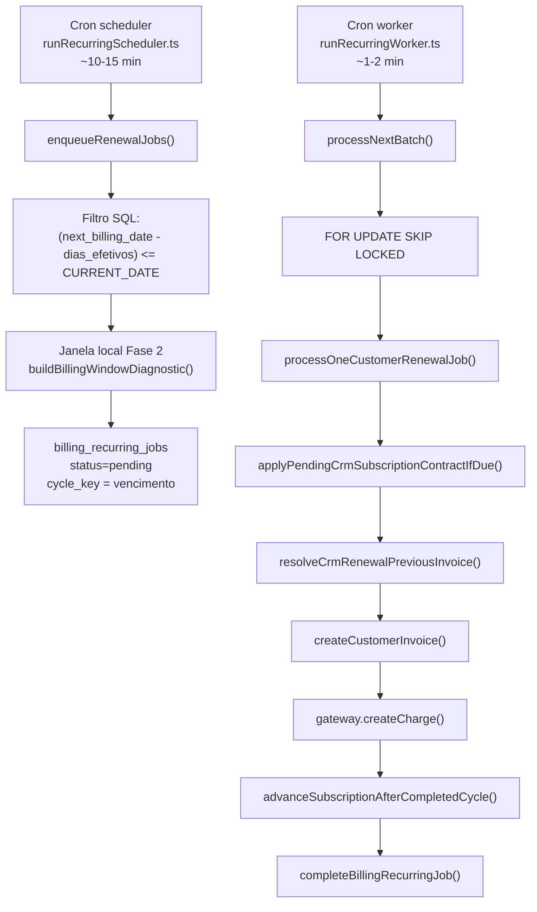

# AUDITORIA P0 — Motor de Renovação Automática + Geração de Faturas

**Data:** 2026-06-25  
**Escopo:** Assinaturas CRM (`subscriptions.type = customer`), motor de recorrência, worker, scheduler, faturas `customer_invoices`  
**Caso real (produção):** assinatura **semanal**, vencimento **24/06/2026**, cobrança não gerada; UI com *Agendado*, *Tentativas 2/3*, *Reprocessamento 25/06*, *Fatura: Em processamento*

> **Nota:** o banco local não reproduz o incidente. A reconstrução abaixo baseia-se no **código em produção**, no **estado observado na UI** e nos **logs estruturados** que o motor emite (`[BILLING]`, `[SUBSCRIPTION_*]`, `[RENEWAL_TRACE]` após este patch).

---

## 1. Arquitetura atual



| Componente | Ficheiro | Função |
|------------|----------|--------|
| Scheduler | `packages/backend/src/scripts/runRecurringScheduler.ts` | Enfileira até 500 jobs/ciclo |
| Worker | `packages/backend/src/scripts/runRecurringWorker.ts` | Processa batch de 100 jobs + faturas filhas E2 |
| Motor | `packages/backend/src/services/recurringBillingJobService.ts` | Lógica scheduler + worker |
| Janela horária | `packages/backend/src/services/billingTimeWindowObservability.ts` | Fuso + hora local + antecipação |
| Contratos S2 | `packages/backend/src/services/crmSubscriptionsContractService.ts` | Contrato imediato / próximo ciclo |
| Faturas CRM | `packages/backend/src/services/customerInvoiceService.ts` | Persistência `customer_invoices` |
| Timeline UX | `packages/backend/src/services/subscriptionTimelineUx.ts` | Estado operacional (somente leitura) |

**Convenções de data (fonte de verdade):**

| Campo | Significado |
|-------|-------------|
| `subscriptions.next_billing_date` | Vencimento do ciclo atual (= `cycle_key` do job) |
| `billing_recurring_jobs.cycle_key` | Mesmo dia que o vencimento (YYYY-MM-DD) |
| `customer_invoices.due_date` | Igual ao `period_start` na renovação automática |
| `customer_invoices.period_start` | Início do ciclo faturado |
| `customer_invoices.period_end` | `calculateNextBillingDate(period_start, interval)` |

---

## 2. Reconstrução forense — caso produção (24/06/2026)

### 2.1 O que a UI prova (sem acesso ao BD produção)

| Sinal na UI | Interpretação no motor |
|-------------|------------------------|
| **Status: Agendado** | `subscription_cycles.status = queued` (job enfileirado, fatura ainda não ligada ao ciclo) |
| **Tentativas: 2/3** | `billing_recurring_jobs.attempts = 2` após **duas exceções** no worker (não é requeue de janela horária — esse caminho **não incrementa** `attempts`) |
| **Reprocessamento: 25/06/2026** | `retry_at` do job; backoff: 1ª falha +1h, 2ª falha +1 dia |
| **Fatura: Em processamento** | **Sem `invoice_id`** no ciclo — label UX para “aguardando geração”, **não** significa fatura criada |

**Conclusão forense:** o cron **executou**, o job **foi criado**, o worker **iniciou pelo menos duas vezes** e **falhou antes de persistir** `customer_invoice` para o ciclo `2026-06-24`.

### 2.2 Fluxo esperado para ciclo semanal 24/06

| Etapa | Valor esperado |
|-------|----------------|
| `cycle_key` / vencimento | `2026-06-24` |
| `period_start` nova fatura | `2026-06-24` |
| `period_end` | `2026-07-01` (+7 dias) |
| Próximo `next_billing_date` (após sucesso) | `2026-07-01` |
| Fatura template (ciclo anterior) | `period_start = 2026-06-17` (semanal) |
| `subscriptions.current_period_start` | Deveria ser `2026-06-17` |

### 2.3 Onde ocorreu a falha

O worker CRM **só cria fatura** depois de resolver a fatura anterior para copiar itens recorrentes. Antes do patch, o código era:

```typescript
const prevPeriodStart = subscription.current_period_start;
const prevInvoice = await findCustomerInvoiceBySubscriptionAndPeriod(subscription.id, prevPeriodStart);
if (!prevInvoice) throw new Error('Fatura anterior (para copiar itens) não encontrada no subscription');
```

**Causa raiz (P0):** desalinhamento entre `subscriptions.current_period_start` e `customer_invoices.period_start` da última fatura — **cenário típico após mudança de periodicidade (mensal → semanal)** ou contrato S2.1 com recálculo de datas sem alinhar o `period_start` histórico.

| Hipótese | Probabilidade | Evidência |
|----------|---------------|-----------|
| `current_period_start` não coincide com nenhuma fatura | **Alta** | Único throw pré-fatura que gera retry com `attempts++` |
| `current_period_start` ausente | Média | Mesmo padrão de retry |
| Janela horária / cron ausente | Baixa | Job existe com `attempts=2` |
| Falha gateway | **Excluída** | Gateway é try/catch; fatura seria criada |
| Ciclo sem itens elegíveis | **Excluída** | Completa job sem retry (`completed_no_invoice`) |

### 2.4 Stack lógica da falha

```
processNextBatch()
  → processOneCustomerRenewalJob()
    → applyPendingCrmSubscriptionContractIfDue()  [pode alterar intervalo/datas]
    → resolveCrmRenewalPreviousInvoice()          [ANTES: findCustomerInvoiceBySubscriptionAndPeriod]
      ✗ Error: Fatura anterior (para copiar itens) não encontrada...
    → catch em processNextBatch
      → attempts = 2, retry_at = +1 dia, status = pending
```

**Rollback:** nenhum (exceção antes de `INSERT` em `customer_invoices`).  
**Timeout:** improvável (mensagem persistida em `error_message`).  
**Validação:** sim — lookup rígido por `period_start` exato.

### 2.5 Como confirmar em produção

```sql
-- Substituir :subscription_id
SELECT s.id, s.billing_interval, s.next_billing_date, s.current_period_start, s.current_period_end, s.status
FROM subscriptions s WHERE s.id = :subscription_id;

SELECT id, period_start, period_end, due_date, status, created_at
FROM customer_invoices
WHERE subscription_id = :subscription_id AND origin = 'subscription'
ORDER BY period_start DESC NULLS LAST LIMIT 5;

SELECT id, cycle_key, status, attempts, max_attempts, retry_at, error_message, updated_at
FROM billing_recurring_jobs
WHERE subscription_id = :subscription_id
ORDER BY updated_at DESC LIMIT 3;
```

Logs a procurar (agregador):

- `[SUBSCRIPTION_INVOICE_FAILED] job_processing_error`
- `error_message` no job
- Após deploy: `[RENEWAL_TRACE] phase=worker_error`

---

## 3. Auditoria das datas por periodicidade

| Periodicidade | Início ciclo | Fim ciclo | Vencimento | Próxima cobrança | Avanço pós-job |
|---------------|--------------|-----------|------------|------------------|----------------|
| **Semanal** | `cycle_key` | +7 dias UTC | = `cycle_key` | `calculateNextBillingDate(cycle, weekly)` | +7 dias |
| **Mensal** | `cycle_key` | +1 mês (âncora dia) | = `cycle_key` | +1 mês | |
| **Trimestral** | idem | +3 meses | = `cycle_key` | +3 meses | |
| **Semestral** | idem | +6 meses | = `cycle_key` | +6 meses | |
| **Anual** | idem | +1 ano | = `cycle_key` | +1 ano | |

**Geração antecipada:** `generation_date = due_date - effective_days_before`  
**Retry worker (erro):** 1h → 1 dia → 3 dias (máx 3 tentativas)  
**Requeue janela horária:** +15 min, **sem** incrementar `attempts`

**Quinzenal:** não existe como `billing_interval` de assinatura; apenas em itens (`recurring_interval`).

---

## 4. Configuração “Gerar X dias antes”

### 4.1 Estado anterior

- Campo único: `tenants.recurring_invoice_generate_days_before_due` (0–60)
- Usado **igual** para todas as periodicidades no SQL e na janela local
- **Projetado para ciclos longos (mensal)** — não havia cap por intervalo

### 4.2 Risco confirmado — semanal + 7 dias

| Config tenant | Intervalo | Geração ciclo 24/06 | Problema |
|---------------|-----------|---------------------|----------|
| 7 dias | Semanal (7d) | 17/06 | `generation_date` do ciclo N = **vencimento** do ciclo N−1 → sobreposição / re-enfileiramento agressivo |
| 7 dias | Mensal (31d) | OK | Antecipação < duração do ciclo |

### 4.3 Correção implementada

Novo módulo `billingIntervalGenerationCap.ts`:

```
dias_efetivos = min(tenant_days, ciclo_dias - 1)
```

| Intervalo | Cap |
|-----------|-----|
| weekly | 6 |
| monthly | 30 |
| quarterly | 92 |
| semi_annual | 185 |
| yearly | 365 (limitado também pelo máx. tenant 60) |

Aplicado em: scheduler SQL (`BILLING_EFFECTIVE_GENERATE_DAYS_BEFORE_SQL`), janela local, insight e timeline.

### 4.4 Evolução futura recomendada

Configuração por periodicidade no tenant (ex. `{ weekly: 1, monthly: 7, yearly: 15 }`) — **não implementado** neste patch para evitar migração de schema; o cap automático resolve o P0 com zero mudança de UI.

---

## 5. Auditoria do worker

| Tópico | Comportamento |
|--------|---------------|
| **Retry** | `attempts++` só em exceção; backoff 1h / 1d / 3d |
| **Locks** | `FOR UPDATE SKIP LOCKED`; reclaim processing stale (20 min default) |
| **Idempotência** | `findCustomerInvoiceBySubscriptionAndPeriod(sub, cycle_key)` antes de criar |
| **Duplicidade** | `UNIQUE` lógico por `(subscription, cycle_key)` em jobs; guard `skipped_active_exists` |
| **Concorrência** | Um job ativo por ciclo lógico |
| **Fatura presa** | Reclaim de `processing` órfão |

### Transições de status do job

| Estado | Quando |
|--------|--------|
| `pending` | Scheduler enfileirou ou retry agendado |
| `processing` | Worker fez pickup |
| `completed` | Fatura criada (ou idempotente / sem itens) |
| `failed` | `attempts >= max_attempts` (3) |
| `cancelled` | Assinatura inativa, cycle mismatch, etc. |

### Status UX “Em processamento”

Label quando **não há fatura** ainda (`resolveTimelineInvoiceColumn`) — pode confundir operação; não indica `customer_invoices.status = processing`.

---

## 6. Auditoria das faturas

| Responsável | Ação |
|-------------|------|
| Worker CRM | `createCustomerInvoice` — `due_date = period_start = cycle_key` |
| Worker | Copia itens de fatura anterior; avança `scheduled_due_date` |
| Gateway | `updateCustomerInvoiceGatewayData` (falha não reverte fatura) |
| `advanceSubscriptionAfterCompletedCycle` | Único escritor de `next_billing_date` pós-sucesso |

---

## 7. Auditoria assinaturas (cenários)

| Cenário | Suportado | Notas |
|---------|-----------|-------|
| Mensal / semanal / anual | Sim | Semanal adicionado migração 276 + boot `ensureSubscriptionsWeeklyBillingInterval` |
| Upgrade imediato (contrato) | Sim | `applyContractToSubscriptionImmediate` |
| Downgrade próximo ciclo | Sim | `pending_crm_contract` + `applyPendingCrmSubscriptionContractIfDue` no worker |
| Pausada / cancelada | Sim | Worker cancela job (`CANCELLED_SUBSCRIPTION_NOT_ACTIVE`) |
| Mudança periodicidade | Sim com ressalva | **Era fonte do bug** — lookup fatura anterior corrigido |
| Falha gateway | Fatura criada; status gateway separado | |
| Retry | Sim | Até 3 tentativas |

---

## 8. Correções realizadas (este patch)

| # | Correção | Ficheiro |
|---|----------|----------|
| 1 | **Resolver robusto da fatura anterior** (exact → ciclo anterior calculado → última fatura antes do ciclo) | `crmRenewalCustomerResolver.ts` |
| 2 | **Cap de antecipação por periodicidade** | `billingIntervalGenerationCap.ts` + SQL scheduler |
| 3 | **Janela local usa dias efetivos** | `billingTimeWindowObservability.ts` |
| 4 | **Logs `[RENEWAL_TRACE]`** por fase (pickup, error, complete, cancel) | `renewalAttemptTrace.ts` |
| 5 | **Cancelamento explícito** se assinatura inativa no meio do job CRM | `recurringBillingJobService.ts` |
| 6 | **Contrato pendente** aplicado antes do enqueue manual e no worker | já em diff S2 |
| 7 | **Overlay de contrato** nos itens da renovação | `crmSubscriptionContractRenewalOverlay.ts` |

---

## 9. Logs — rastreabilidade

Cada tentativa passa a emitir `[RENEWAL_TRACE]` com:

`subscription_id`, `job_id`, `cycle_key`, `period_start/end`, `due_date`, `generation_date_ymd`, `generate_days_before_due_effective`, `attempt`, `retry_at`, `exception`, `invoice_id`, `result`, `duration_ms`

**Consulta sugerida (Datadog/CloudWatch):**

```
[RENEWAL_TRACE] subscription_id:<uuid> 
```

---

## 10. Testes executados

```bash
cd packages/backend
npx vitest run \
  src/utils/billingIntervalGenerationCap.test.ts \
  src/services/crmRenewalCustomerResolver.test.ts \
  src/services/recurringBillingJobService.advance.test.ts \
  src/services/subscriptionService.billingDate.test.ts
```

**Resultado:** 22 testes passando (incl. semanal +7 dias, cap semanal 6, resolver fallback).

---

## 11. Antes × Depois

| Aspecto | Antes | Depois |
|---------|-------|--------|
| Lookup fatura anterior | Só `current_period_start` exato | 3 níveis de fallback |
| Antecipação semanal com 7 dias | Permitido (sobreposição) | Cap em 6 dias |
| Scheduler SQL | `tenant_days` fixo | `LEAST(tenant, cap_intervalo)` |
| Diagnóstico produção | `error_message` no job | + `[RENEWAL_TRACE]` estruturado |
| UI “Em processamento” sem fatura | Igual | Documentado; fatura aparece após sucesso |

---

## 12. Impacto e riscos

### Impacto positivo

- Renovações semanais após mudança de contrato/periodicidade deixam de falhar por template ausente
- Ciclos curtos não são mais “engolidos” por antecipação mensal
- Auditorias futuras facilitadas por trace dedicado

### Riscos residuais

| Risco | Mitigação |
|-------|-----------|
| Template errado via fallback `latest_before_cycle` | Log `crm_renewal_prev_invoice_resolved` com `resolved_via` |
| UI “Em processamento” ambígua | Melhoria UX futura (label “Aguardando geração”) |
| `attempts=2` no caso real | Após deploy, 3ª tentativa deve suceder; monitorar job |
| Config por periodicidade na UI | Evolução S2.x opcional |

---

## 13. Ações pós-deploy (produção)

1. **Deploy** deste patch no backend + worker/scheduler cron
2. **Consultar** `error_message` do job pendente da assinatura afetada
3. **Aguardar** 3ª tentativa automática ou **reprocessar** via fila (job já `pending`)
4. **Validar** criação de `customer_invoice` com `period_start = 2026-06-24`
5. **Verificar** `[RENEWAL_TRACE] phase=worker_complete`

Se o job estiver `failed` após 3 tentativas: reativar com `insertOrReactivateRenewalJob` (scheduler no próximo tick) após corrigir dados.

---

## 14. Recomendação evolutiva

1. **Curto prazo:** manter cap automático (implementado)
2. **Médio prazo:** `recurring_invoice_generate_days_before_due_by_interval JSONB` no tenant
3. **Longo prazo:** templates de itens desacoplados de “fatura anterior” (`subscription_recurring_line_templates`) para eliminar cópia por lookup

---

*Documento gerado na auditoria P0 financeira. Motor considerado bloqueante para sprints de performance S0.4+ até validação em produção do caso 24/06/2026.*
