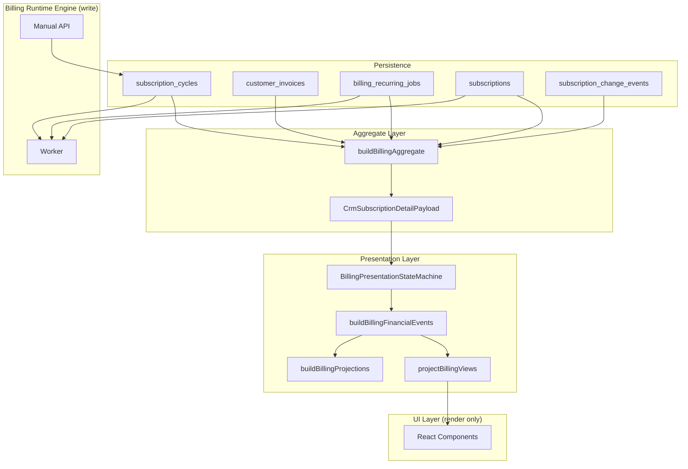
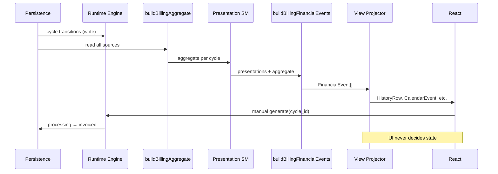
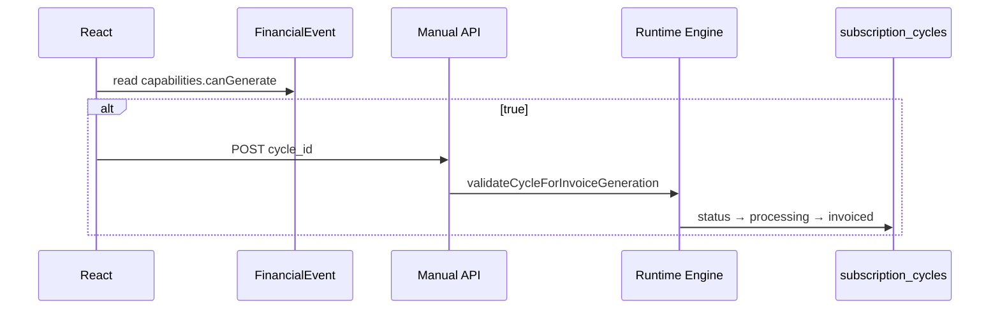
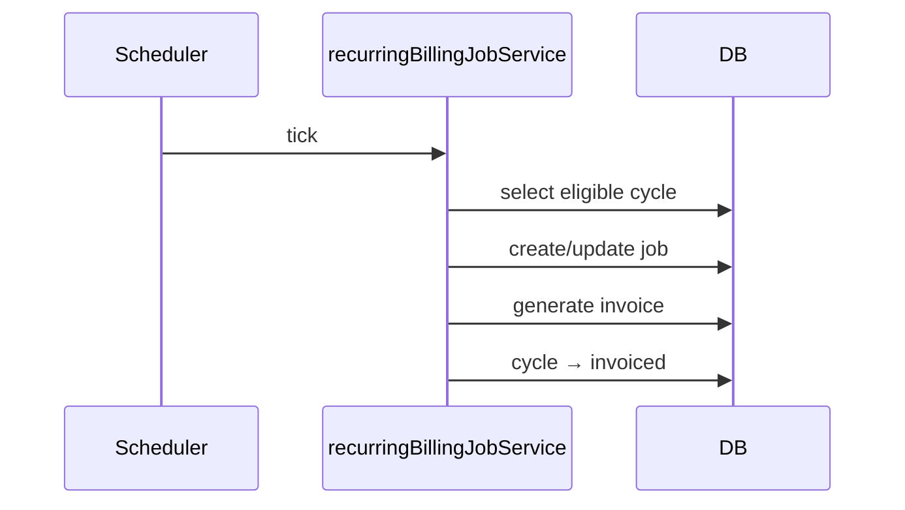
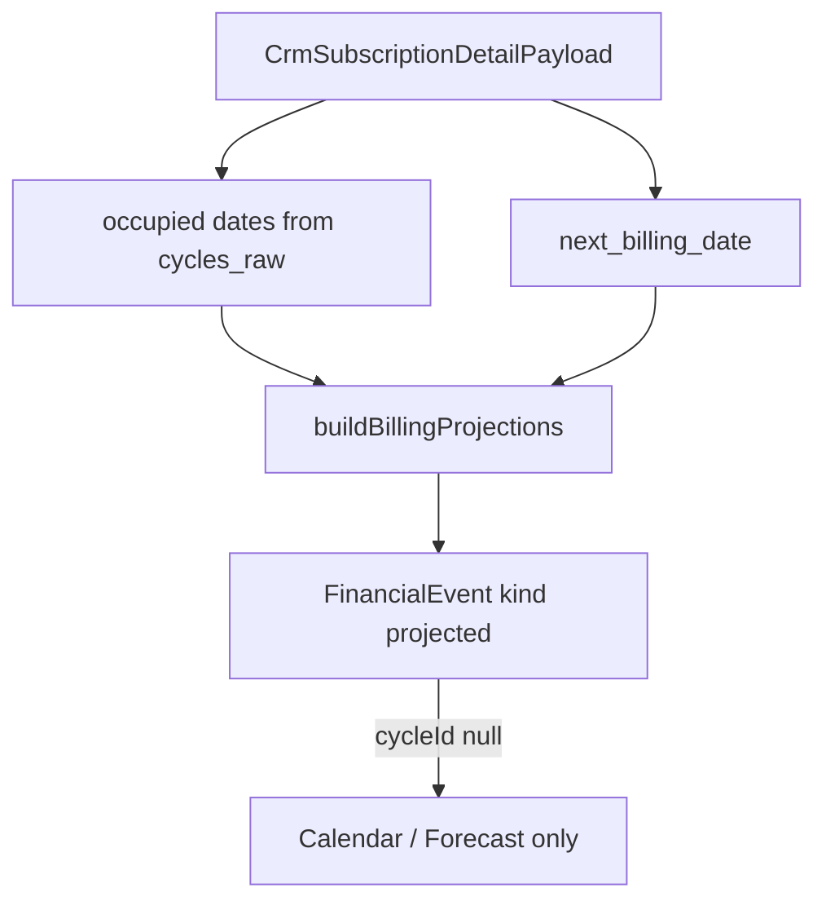
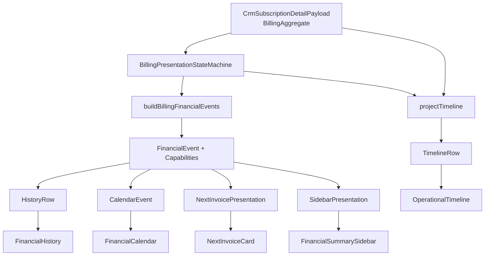

# Billing Architecture Specification — Constituição Oficial (Sprint 4.2R)

**Status:** ARCHITECTURE FREEZE — referência obrigatória para Billing 5.0 e todas as implementações subsequentes  
**Date:** 2026-07-03  
**Governança:** Nenhuma decisão arquitetural pode ser alterada sem **atualização formal** deste documento (nova sprint de arquitetura + revisão das evidências).

**Auditorias consolidadas:** 4.2K (Lifecycle), 4.2L (Generate Action), 4.2M (Runtime Causality), 4.2N (Timeline Causality), 4.2O (Simplification), 4.2P (State Machine Blueprint), 4.2Q (Aggregate Certification).

**Documentos históricos:** permanecem como evidência forense. Em caso de conflito, **este documento prevalece**.

---

## 1. Objetivo oficial do Billing

O Billing do CRM tem **dois objetivos distintos e complementares**:

| Domínio | Objetivo |
|---------|----------|
| **Billing Runtime Engine** | Executar cobrança recorrente e manual de forma determinística, idempotente e auditável — materializando competências em `subscription_cycles`, executando via `billing_recurring_jobs`, emitindo `customer_invoices`. |
| **Billing Presentation Layer** | Traduzir o estado persistido em uma experiência financeira unificada no CRM — **sem** duplicar regras de negócio, **sem** decidir cobrança na UI, **sem** divergência entre Histórico, Calendário, Próxima Cobrança e Sidebar. |

**Resultado esperado:** um operador vê **um único estado** por competência em todas as superfícies; o botão Gerar aparece **nas mesmas condições** em todas as superfícies; a cobrança real é sempre disparada pelo Runtime Engine com `cycle_id`.

---

## 2. Glossário oficial

| Termo | Definição |
|-------|-----------|
| **Competência** | Período de cobrança identificado por `subscription_cycles.id` (`cycle_id`). Única identidade oficial de competência no Billing. |
| **Billing Aggregate** | Objeto read-model único que reúne subscription, cycles, invoices, jobs, lifecycle, tenant prefs, stats e metadados de diagnóstico. **Tipo oficial:** `CrmSubscriptionDetailPayload` (evoluído conforme §6). |
| **Aggregate Builder** | Única função que monta o Aggregate a partir do DB + API. **Nome canônico:** `buildBillingAggregate`. |
| **Billing Runtime Engine** | Subsistema de escrita: worker, jobs, geração manual/automática, transições de `subscription_cycles.status`. |
| **Billing Presentation State Machine** | Única função pura que deriva estado de apresentação por competência: `(cycle, invoice?, job?, subscription, today) → PresentationState`. **Nome canônico:** `resolveBillingCyclePresentation`. |
| **FinancialEvent** | Contrato único consumido pela UI financeira. Contém tipo, datas, valores, `cycleId`, `capabilities` embedded. |
| **FinancialEvent Builder** | Único pipeline que emite `FinancialEvent[]` a partir do Aggregate + Presentation SM. **Nome canônico:** `buildBillingFinancialEvents`. |
| **Capabilities** | Decisões de ação (`canGenerate`, `supportsGenerate`, etc.) calculadas **uma vez** no pipeline e **embutidas** em `FinancialEvent`. Imutáveis após o build. |
| **Projection** | Eventos `kind: 'projected'` — competências futuras **sem** `cycle_id`. UX-only. Nunca participam de cobrança nem de `canGenerate`. |
| **Timeline** | Camada de apresentação humanizada (`TimelineRow[]`). Derivada do Aggregate. **Proibida** como input de decisão. |
| **HistoryRow / CalendarEvent** | Views projetadas a partir de `FinancialEvent[]`. Render-only. |
| **GENERATABLE** | Conjunto oficial de `subscription_cycles.status` elegíveis para geração manual: `pending`, `queued`, `failed`, `skipped`, `cancelled` (espelha `billingCycleInvoiceGenerationService.ts:22–28`). |

---

## 3. Princípios arquiteturais obrigatórios

Estes princípios são **normativos**. Violação é não-conformidade arquitetural.

| # | Princípio |
|---|-----------|
| P1 | `subscription_cycles` é a **única identidade oficial** da competência. |
| P2 | `customer_invoices` é a **única verdade financeira** (pago, pendente, cancelado, gateway). |
| P3 | `billing_recurring_jobs` representa **exclusivamente a execução** (tentativas, retries, erros). |
| P4 | `CrmSubscriptionDetailPayload` é o **Aggregate oficial** (transporte HTTP + tipo TypeScript). |
| P5 | Existe **exatamente um** Aggregate Builder. |
| P6 | Existe **exatamente uma** Billing Presentation State Machine. |
| P7 | Existe **exatamente um** FinancialEvent Builder. |
| P8 | `FinancialEvent` é o **único contrato** consumido pela UI financeira. |
| P9 | **React nunca decide estado.** |
| P10 | **Timeline nunca decide regra de negócio.** |
| P11 | **Projection nunca decide cobrança.** |
| P12 | **Capabilities nunca recalculam estados** — apenas leem o que foi decidido. |
| P13 | **History nunca recalcula Generate.** |
| P14 | **Calendar nunca recalcula Generate.** |
| P15 | **NextInvoice nunca recalcula Generate.** |
| P16 | **Sidebar nunca recalcula Generate.** |
| P17 | **Nenhuma camada posterior altera decisões anteriores** no pipeline. |

---

## 4. Arquitetura oficial

```
┌──────────────────────────────────────────────────────────────────────────────┐
│ PERSISTÊNCIA (SSOT write)                                                    │
│  subscriptions │ subscription_cycles │ customer_invoices │                    │
│  billing_recurring_jobs │ subscription_change_events                         │
└───────────────────────────────────┬──────────────────────────────────────────┘
                                    │
                          Billing Runtime Engine
                    (worker, manual API, job lifecycle)
                                    │
                                    ▼
┌──────────────────────────────────────────────────────────────────────────────┐
│ AGGREGATE LAYER (SSOT read — single builder)                                 │
│  buildBillingAggregate() → CrmSubscriptionDetailPayload                      │
└───────────────────────────────────┬──────────────────────────────────────────┘
                                    │
                          Billing Presentation State Machine
                    resolveBillingCyclePresentation() per cycle
                                    │
                                    ▼
┌──────────────────────────────────────────────────────────────────────────────┐
│ EVENT LAYER (single builder)                                                 │
│  buildBillingFinancialEvents(aggregate, presentations)                     │
│    ├── real events (kind: real, cycleId required)                            │
│    └── projections submodule (kind: projected, cycleId: null)                │
└───────────────────────────────────┬──────────────────────────────────────────┘
                                    │
                          Billing View Projector
                    HistoryRow │ CalendarEvent │ TimelineRow │ NextInvoice │ Sidebar
                                    │
                                    ▼
┌──────────────────────────────────────────────────────────────────────────────┐
│ UI LAYER (render-only React)                                                 │
└──────────────────────────────────────────────────────────────────────────────┘
```

**Separação inviolável:** Runtime Engine (write) e Presentation Layer (read) são **duas máquinas de estado** em domínios diferentes — comprovado necessário em 4.2O, 4.2P. Não se fundem.

---

## 5. Responsabilidade de cada camada

| Camada | Responsabilidade | Proibido |
|--------|------------------|----------|
| **DB / Runtime Engine** | Transições de ciclo, jobs, invoices, `next_billing_date` | Consumir `timeline` CRM |
| **Aggregate Builder** | Montar `CrmSubscriptionDetailPayload` completo e imutável por request | Decidir UI, emitir eventos |
| **Presentation SM** | `BillingCyclePresentationState` + inputs para capabilities/event types | Persistir, mutar aggregate |
| **FinancialEvent Builder** | `FinancialEvent[]` + embedded `Capabilities` | Consultar timeline como decisor |
| **Projection submodule** | Eventos futuros UX | Atribuir `cycleId`, `canGenerate` |
| **View Projector** | `HistoryRow`, `CalendarEvent`, `TimelineRow`, presentations | Recalcular capabilities |
| **Event Store (cache)** | Cache de views, filtros, ordenação | `cycleSupportsManualGenerate`, `resolveInvoiceCapabilities` |
| **React components** | Render, dispatch actions (`cycle_id` ao engine) | Guards de negócio (`&& canGenerate`) |

---

## 6. Contratos oficiais

### 6.1 BillingAggregate (`CrmSubscriptionDetailPayload`)

**Tipo oficial:** `CrmSubscriptionDetailPayload` em `src/services/crmSubscriptions.ts` — **evoluído** com campos obrigatórios abaixo.

```typescript
/** Aggregate oficial — CrmSubscriptionDetailPayload (Billing 5.0) */
type CrmSubscriptionDetailPayload = {
  // Identidade
  subscription: SubscriptionSnapshot;

  // SSOT read references (obrigatórios)
  cycles_raw: SubscriptionCycleRaw[];
  invoices: InvoiceSnapshot[];              // NOVO — obrigatório 5.0 (hoje ausente — 4.2Q)
  recent_jobs: JobSnapshot[];
  lifecycle_events: LifecycleEventSnapshot[]; // NOVO — obrigatório 5.0 (hoje só em timeline — 4.2Q)

  // Contexto
  client_name: string | null;
  tenant_billing: TenantBillingSnapshot;
  stats: CrmSubscriptionStats;
  meta: { periodicity_label_pt: string };

  // Diagnóstico (read-only, não decisor UI)
  automation_summary: AutomationSummarySnapshot;
  runtime_validation?: RuntimeValidationSnapshot;
  pending_contract?: PendingContractSnapshot | null;

  // Apresentação derivada (opcional no wire, sempre derivável)
  timeline?: TimelineRow[];                 // PROIBIDO como input de decisão

  // Flags
  cycles_read_enabled: boolean;
  built_at?: string;                        // ISO — recomendado

  // Resumo invoice (convenience — derivável de invoices[])
  latest_invoice_id: string | null;
  latest_invoice_status: string | null;
  latest_paid_invoice_id: string | null;
  plan_label: string | null;
};

type InvoiceSnapshot = {
  id: string;
  subscription_cycle_id: string | null;
  status: string;
  amount_cents: number;
  due_date: string;
  period_start: string | null;
  period_end: string | null;
  created_at: string;
  gateway_status: string | null;
  gateway_reference_id: string | null;
};

type SubscriptionCycleRaw = {
  id: string;
  cycle_date: string;
  period_start: string;
  period_end: string;
  status: string;
  invoice_id: string | null;
  job_id: string | null;
  processed_at: string | null;
  skipped_reason: string | null;
  error_message: string | null;
};
```

**Invariante aggregate:** após `buildBillingAggregate`, o objeto é **imutável** até próximo fetch. Proibido `normalizeDetailForBillingStateMachine` e mutações in-memory de `timeline`.

---

### 6.2 FinancialEvent

```typescript
type FinancialEventKind = 'real' | 'projected';

type FinancialEventType =
  | 'payment' | 'invoice_generated' | 'invoice_due' | 'invoice_failed'
  | 'invoice_cancelled' | 'invoice_reprocessed' | 'invoice_refunded'
  | 'upcoming_cycle' | 'manual_charge' | 'charge_attempt';

type BillingCyclePresentationState =
  | 'awaiting_generation' | 'processing' | 'pending_invoice' | 'paid' | 'refunded'
  | 'failed_recoverable' | 'failed_terminal' | 'gateway_failed' | 'skipped'
  | 'cancelled' | 'manual_invoice' | 'projected' | 'lifecycle';

type BillingCapabilities = {
  canGenerate: boolean;
  supportsGenerate: boolean;       // DEVE === canGenerate para kind:'real'
  supportsRegisterPayment: boolean;
  supportsOpen: boolean;
  supportsResolve: boolean;
  supportsReprocess: boolean;
  supportsChangeDue: boolean;
  showBillingActions: boolean;     // false se projected
};

type FinancialEvent = {
  id: string;
  kind: FinancialEventKind;
  type: FinancialEventType;
  ymd: string;
  dueYmd: string | null;
  amountCents: number | null;
  competence: string | null;
  invoiceId: string | null;
  cycleId: string | null;            // obrigatório se kind === 'real'
  presentationState: BillingCyclePresentationState;
  invoiceStatus: string | null;
  capabilities: BillingCapabilities;
  isOverdue: boolean;
  isRecoverable: boolean;
  statusLabel: string;
  statusBadge: string;
  gateway: string | null;
  notes: string | null;
  paidAt: string | null;
  lastUpdatedAt: string | null;
  periodStart: string | null;
  periodEnd: string | null;
  jobId: string | null;
  jobErrorSnippet: string | null;
  clientName: string | null;
  cycleKey: string;
  subscriptionStatus: string;
};
```

**Invariantes:**

- `kind:'projected'` → `cycleId === null`, `capabilities.canGenerate === false`, `capabilities.supportsGenerate === false`.
- `kind:'real'` → `cycleId` obrigatório.
- `capabilities.supportsGenerate === capabilities.canGenerate` para `kind:'real'`.
- Todo `cycles_raw[].id` com subscription ativa produz **≥1** `FinancialEvent` com `kind:'real'`.

---

### 6.3 Capabilities

**Única função decisora:** `deriveBillingCapabilities(ctx: CapabilityContext): BillingCapabilities`

**Regra oficial `canGenerate` / `supportsGenerate`:**

```
canGenerate =
  subscription.status !== 'cancelled' ∧
  cycle.invoice_id IS NULL ∧
  cycle.status ∈ GENERATABLE_CYCLE_STATUSES
```

Proibido recalcular fora de `deriveBillingCapabilities` chamada dentro do FinancialEvent Builder.

---

### 6.4 HistoryRow

```typescript
type HistoryRow = {
  id: string;
  cycleId: string | null;
  invoiceId: string | null;
  eventType: FinancialEventType;
  competence: string;
  dueYmd: string | null;
  amountCents: number | null;
  statusLabel: string;
  visual: 'paid' | 'overdue' | 'pending' | 'cancelled' | 'failed' | 'projected';
  capabilities: BillingCapabilities;   // cópia do evento — NÃO recalculada
  isNextCharge: boolean;
  isProjected: boolean;
  gateway: string | null;
  notes: string | null;
};
```

**Proibido:** campo `canGenerateNow` separado. Usar `capabilities.canGenerate`.

---

### 6.5 CalendarEvent

```typescript
type CalendarEvent = {
  id: string;
  ymd: string;
  dueYmd: string | null;
  type: FinancialEventType;
  kind: FinancialEventKind;
  cycleId: string | null;
  invoiceId: string | null;
  amountCents: number | null;
  statusLabel: string;
  capabilities: BillingCapabilities;
  isOverdue: boolean;
  popoverSummary: string;
};
```

---

### 6.6 TimelineRow

```typescript
type TimelineRowKind = 'cycle' | 'invoice_only' | 'lifecycle';

type TimelineRow = {
  id: string;
  kind: TimelineRowKind;
  cycleId: string | null;
  invoiceId: string | null;
  presentationState: BillingCyclePresentationState;
  statusLabel: string;
  dueYmd: string | null;
  periodStart: string | null;
  periodEnd: string | null;
  amountCents: number | null;
  dotVariant: string;
  subtitle: string | null;
};
```

**Construção:** `projectTimeline(aggregate, presentations[])` — função inversa, idempotente. **Nunca** `buildBillingFinancialEvents(projectTimeline(...))`.

---

### 6.7 NextInvoicePresentation

```typescript
type NextInvoicePresentation = {
  eventId: string | null;
  cycleId: string | null;
  invoiceId: string | null;
  isProjected: boolean;
  dueYmd: string | null;
  periodStart: string | null;
  periodEnd: string | null;
  amountCents: number | null;
  statusKey: 'pending' | 'issued' | 'paid' | 'cancelled' | 'paused';
  statusLabel: string;
  capabilities: BillingCapabilities;
  visible: boolean;
};
```

**Construção:** `projectNextInvoice(events, aggregate)` — seleciona primeiro evento elegível; **não** consulta `detail.timeline` nem `resolveFirstEligibleCycle` isolado.

---

### 6.8 SidebarPresentation

```typescript
type SidebarAlert = {
  id: string;
  kind: 'billing_missing' | 'client_overdue' | 'gateway_failed' | string;
  message: string;
  severity: 'info' | 'warning' | 'error';
  targetEventId: string | null;
  capabilities: BillingCapabilities | null;
};

type SidebarPresentation = {
  summary: {
    lastPaymentDate: string;
    lastPaymentAmount: string;
    nextReceiptDate: string;
    nextReceiptAmount: string;
    openAmount: string;
    annualRevenue: string;
  };
  alerts: SidebarAlert[];
};
```

**Construção:** `projectSidebar(events, aggregate)` — alertas derivados de `FinancialEvent[]`, **não** de `detail.timeline` direto (proíbe `buildFinancialAlerts(detail.timeline)` — 4.2Q).

---

## 7. Fontes oficiais de verdade

| Dado | SSOT | Leitura CRM |
|------|------|-------------|
| Identidade da competência | `subscription_cycles.id` | `aggregate.cycles_raw[]` |
| Estado de execução do ciclo | `subscription_cycles.status` | via Presentation SM |
| Valor / status financeiro | `customer_invoices` | `aggregate.invoices[]` |
| Tentativas / erros de cobrança | `billing_recurring_jobs` | `aggregate.recent_jobs[]` |
| Eventos contrato/pausa | `subscription_change_events` | `aggregate.lifecycle_events[]` |
| Próxima data de recorrência | `subscriptions.next_billing_date` | `aggregate.subscription` |
| Elegibilidade gerar (runtime) | `validateCycleForInvoiceGeneration` | espelhada em `deriveBillingCapabilities` |
| Estado UX unificado | — | `FinancialEvent.presentationState` |
| Ações disponíveis | — | `FinancialEvent.capabilities` |
| Competências futuras sem ciclo | — | `FinancialEvent` kind `projected` only |

---

## 8. Máquinas de estado oficiais

### 8.1 Billing Runtime Engine FSM (write)

**Owner:** `packages/backend` — worker, `billingManualRenewalService`, `billingCycleInvoiceGenerationService`.

**Estados persistidos (`subscription_cycles.status`):** `pending`, `queued`, `processing`, `invoiced`, `failed`, `skipped`, `cancelled`.

**Transições permitidas (4.2K):**

```
pending → queued → processing → invoiced
{pending|queued|failed|skipped|cancelled} + manual_generate → processing → invoiced | failed
* → failed | skipped | cancelled
```

### 8.2 Billing Presentation State Machine (read)

**Owner:** módulo único `BillingPresentationStateMachine`.

**Função canônica:** `resolveBillingCyclePresentation(ctx): BillingCyclePresentation`

**Estados de apresentação:** ver `BillingCyclePresentationState` em §6.2.

**Funções canônicas derivadas (mesmo módulo):**

| Função | Responsabilidade |
|--------|------------------|
| `deriveBillingCapabilities` | Única decisão de Generate e ações |
| `resolveFinancialEventTypes` | Única decisão de `FinancialEventType[]` por ciclo |

**Proibido:** `resolveOperationalState`, `normalizeTimelineRowForStateMachine`, `cycleSupportsManualGenerate` público, `resolveInvoiceCapabilities` como decisor.

---

## 9. Fluxos oficiais

### 9.1 Runtime → Aggregate → Presentation → Events → UI

Ver Diagrama 2 (§12).

### 9.2 Geração manual

```
UI (HistoryRow | CalendarEvent | NextInvoice)
  → lê event.capabilities.canGenerate === true
  → executeDeterministicGenerateRenewal({ cycleId })
  → POST API com cycle_id
  → validateCycleForInvoiceGeneration (backend)
  → Billing Runtime Engine
  → subscription_cycles.status transition
  → refresh aggregate (GET detail)
  → rebuild pipeline completo
```

**UI nunca valida elegibilidade** — apenas lê `capabilities`. Backend é autoridade final na execução (4.2L).

### 9.3 Geração automática

```
Scheduler → recurringBillingJobService
  → subscription_cycles (DB)
  → billing_recurring_jobs
  → customer_invoices
  → cycle.status → invoiced
```

**Sem envolvimento** de Aggregate, Timeline ou FinancialEvent (4.2O PROVEN).

### 9.4 Timeline

```
buildBillingAggregate()
  → resolveBillingCyclePresentation() per cycle
  → projectTimeline(aggregate, presentations)
  → TimelineRow[] → React (render only)
```

### 9.5 Projection Layer

```
buildBillingAggregate()
  → buildBillingFinancialEvents()
      → submodule buildBillingProjections(aggregate)
          → occupied dates from cycles_raw
          → future dates from next_billing_date
          → FinancialEvent kind:'projected', cycleId:null
```

**Projeção nunca:** gera cobrança, recebe `canGenerate`, substitui evento real na mesma data.

---

## 10. Anti-patterns proibidos

Ver Tabela 9. Resumo normativo:

- Múltiplos Aggregate Builders
- Múltiplas Presentation State Machines
- Múltiplos FinancialEvent Builders
- Regras de negócio em React (`&& canGenerate`, `cycleSupportsManualGenerate` em componentes)
- Regras de negócio via `detail.timeline` (`emitEventsForCycleRow` input timeline, `buildFinancialAlerts(detail)`)
- Projection com `cycleId` ou `canGenerate: true`
- `resolveInvoiceCapabilities` / `cycleSupportsManualGenerate` após o pipeline
- `normalizeDetailForBillingStateMachine` (mutação aggregate)
- `timelineRowForCycle` como decisor (prioridade timeline sobre cycle)
- APIs paralelas de decisão UI (`getRenewalDiagnosis.can_generate_now` como gate — diagnóstico only)
- `createFinancialEventStore` fora do Provider (instâncias paralelas — 4.2Q)
- Experience layer paralela (`buildCalendarMonths(detail.timeline)`) como fonte financeira

---

## 11. Invariantes obrigatórios

| ID | Invariante |
|----|------------|
| INV-1 | Existe **um** Aggregate Builder: `buildBillingAggregate`. |
| INV-2 | Existe **uma** Presentation SM: `resolveBillingCyclePresentation`. |
| INV-3 | Existe **um** FinancialEvent Builder: `buildBillingFinancialEvents`. |
| INV-4 | Existe **uma** função para Generate: `deriveBillingCapabilities`. |
| INV-5 | Existe **uma** função para EventType: `resolveFinancialEventTypes`. |
| INV-6 | Existe **uma** função para Capabilities: `deriveBillingCapabilities` (mesma de INV-4). |
| INV-7 | Nenhuma camada posterior altera decisões anteriores. |
| INV-8 | Todo ciclo real → ≥1 FinancialEvent real. |
| INV-9 | `supportsGenerate === canGenerate` para eventos reais. |
| INV-10 | UI consome apenas `FinancialEvent`, `HistoryRow`, `CalendarEvent`, `TimelineRow`, `NextInvoicePresentation`, `SidebarPresentation`. |
| INV-11 | Timeline não é input do FinancialEvent Builder. |
| INV-12 | Projection sempre `cycleId: null`. |

---

## 12. Critérios de certificação

Uma implementação é **certificada Billing 5.0** quando:

1. `grep` confirma ausência de decisores proibidos (Tabela 9) em `src/components` e `src/lib` (exceto módulo oficial).
2. Suite de paridade: mesmos ciclos mostram Gerar em History, Calendar, NextInvoice, Sidebar (4.2L scenarios).
3. Invariantes INV-1 a INV-12 verificados por testes automatizados.
4. Billing Engine testes existentes passam sem alteração de contrato runtime.
5. Nenhum componente `.tsx` importa `cycleSupportsManualGenerate`, `resolveInvoiceCapabilities`, `buildFinancialAlerts`.
6. Um único `FinancialEventStore` por `SubscriptionDetail` via Provider.
7. `invoices[]` presente no payload aggregate.
8. Documentação de conformidade referencia este arquivo.

---

## Tabela 1 — Domínios oficiais

| Domínio | Escopo | SSOT |
|---------|--------|------|
| **Runtime** | Cobrança real, jobs, materialização ciclos | DB tables |
| **Aggregate** | Read-model por subscription | `CrmSubscriptionDetailPayload` |
| **Presentation** | Estado derivado UX | Presentation SM |
| **Events** | Contrato UI | `FinancialEvent[]` |
| **Views** | Projeções render | HistoryRow, CalendarEvent, etc. |
| **UI** | React render + action dispatch | Nenhum |

---

## Tabela 2 — Fontes oficiais de verdade

| Entidade | Tabela / campo | Consumo |
|----------|----------------|---------|
| Competência | `subscription_cycles` | `cycles_raw[]` |
| Financeiro | `customer_invoices` | `invoices[]` |
| Execução | `billing_recurring_jobs` | `recent_jobs[]` |
| Lifecycle | `subscription_change_events` | `lifecycle_events[]` |
| Assinatura | `subscriptions` | `subscription` |
| Recorrência | `subscriptions.next_billing_date` | projection submodule |

---

## Tabela 3 — Responsabilidades por camada

| Camada | Decide | Consome | Persiste |
|--------|--------|---------|----------|
| Runtime Engine | Transições ciclo/job | DB | Sim |
| `buildBillingAggregate` | Nada (monta) | DB | Não |
| Presentation SM | presentationState, event types, capabilities | Aggregate | Não |
| `buildBillingFinancialEvents` | Emissão eventos | Aggregate + SM output | Não |
| View Projector | Layout/ordenação | FinancialEvent[] | Não |
| Event Store | Cache apenas | FinancialEvent[] | Não |
| React | Nada | View DTOs | Não |

---

## Tabela 4 — Contratos oficiais

| Contrato | Propósito | Consumidores |
|----------|-----------|--------------|
| `CrmSubscriptionDetailPayload` | Aggregate | Pipeline, diagnóstico |
| `FinancialEvent` | Evento canônico | Store, Projector |
| `BillingCapabilities` | Ações embedded | History, Calendar, Sidebar, Next |
| `HistoryRow` | Histórico | `FinancialHistory`, `FinancialHistoryRow` |
| `CalendarEvent` | Calendário | `FinancialCalendar`, popover |
| `TimelineRow` | Timeline operacional | `SubscriptionOperationalTimelinePanel` |
| `NextInvoicePresentation` | Próxima cobrança | `NextInvoiceCard` |
| `SidebarPresentation` | Resumo + alertas | `FinancialSummarySidebar` |

---

## Tabela 5 — Builders oficiais

| Builder | Função canônica | Único? | Substitui (legado) |
|---------|-----------------|--------|-------------------|
| Aggregate Builder | `buildBillingAggregate` | **Sim** | `getCrmSubscriptionDetail` + mutações frontend |
| Presentation SM | `resolveBillingCyclePresentation` | **Sim** | `resolveOperationalState`, `normalizeDetailForBillingStateMachine`, `resolveBillingCycleState` duplicado |
| FinancialEvent Builder | `buildBillingFinancialEvents` | **Sim** | `buildFinancialEvents`, `emitEventsForCycleRow` |
| Projection submodule | `buildBillingProjections` | Parte do #3 | `buildProjectionEvents` |
| Timeline projector | `projectTimeline` | **Sim** | `buildSubscriptionTimeline` como decisor |
| View projector | `projectBillingViews` | **Sim** | `getHistoryRows` com recálculo, `buildFinancialAlerts` |

**Regra:** apenas os builders acima podem criar ou transformar estruturas oficiais.

---

## Tabela 6 — State Machines oficiais

| SM | Tipo | Função | Domínio |
|----|------|--------|---------|
| Billing Runtime Engine FSM | Write / persistido | worker + manual API | Backend |
| Billing Presentation SM | Read / derivado | `resolveBillingCyclePresentation` | Shared (prefer backend build) |

**Não é SM:** Projection (emissor sintético), Event Store (cache).

---

## Tabela 7 — Componentes renderizadores (oficiais)

| Componente | Contrato consumido |
|------------|-------------------|
| `FinancialHistoryRow` | `HistoryRow.capabilities` |
| `FinancialHistory` | `HistoryRow[]` via store |
| `FinancialCalendar` | `CalendarEvent[]` via store |
| `FinancialCalendarPopover` | `CalendarEvent.capabilities` |
| `NextInvoiceCard` | `NextInvoicePresentation` |
| `UpcomingPaymentsList` | `FinancialEvent.capabilities` |
| `FinancialSummarySidebar` | `SidebarPresentation` |
| `FinancialInsights` | insights derivados de eventos |
| `FinancialTechnicalAccordion` | `runtime_validation` (display) |
| `HistoryRowChargeAction` | dispatch `cycleId` |
| `SubscriptionOperationalTimelinePanel` | `TimelineRow[]` |

---

## Tabela 8 — Componentes proibidos de tomar decisões

| Componente | Violação atual (4.2L–4.2Q) | Conformidade 5.0 |
|------------|----------------------------|------------------|
| `FinancialHistoryRow` | `canGenerateNow && !isProjected` | Ler `capabilities.canGenerate` |
| `NextInvoiceCard` | guards `detail.subscription.status`, `!isProjected` | Ler `NextInvoicePresentation` |
| `UpcomingPaymentsList` | `cycleSupportsManualGenerate(store.detail)` | Ler `capabilities` |
| `FinancialSummarySidebar` | `buildFinancialAlerts(detail)` | `SidebarPresentation` |
| `FinancialCalendarPopover` | `resolveInvoiceCapabilities` | `CalendarEvent.capabilities` |
| `SubscriptionRenewalActionsCard` | `status.can_generate_now` gate | Diagnóstico display; ação via `capabilities` do aggregate refresh |

---

## Tabela 9 — Anti-patterns proibidos

| ID | Anti-pattern | Evidência forense |
|----|--------------|-------------------|
| AP-1 | Múltiplos Aggregate Builders | 4.2Q — ≥7 builders |
| AP-2 | Múltiplas Presentation SMs | 4.2N — 5+ decisores |
| AP-3 | Múltiplos FinancialEvent Builders | 4.2M — builder + projection + timeline input |
| AP-4 | React decide Generate | 4.2L — `FinancialHistoryRow.tsx:35` |
| AP-5 | Timeline decide regra | 4.2N — `emitEventsForCycleRow` |
| AP-6 | Projection decide cobrança | 4.2H — by design forbidden |
| AP-7 | Capabilities recalculam estado | 4.2L — store + invoiceCapabilities |
| AP-8 | Helpers mutam aggregate | 4.2N — `normalizeDetailForBillingStateMachine` |
| AP-9 | Componentes consultam estruturas paralelas | 4.2Q — Sidebar timeline, Next timeline.find |
| AP-10 | Duplicação History/Calendar/Sidebar/Next | 4.2L — famílias A e B |

---

## Tabela 10 — Checklist de conformidade

| # | Item | Método de verificação |
|---|------|----------------------|
| C1 | Um `buildBillingAggregate` | grep + code review |
| C2 | `invoices[]` no payload | type + API test |
| C3 | Um `resolveBillingCyclePresentation` | grep decisores legados = 0 |
| C4 | Um `buildBillingFinancialEvents` | grep `buildFinancialEvents` legado removido |
| C5 | INV-8 ciclo→evento | teste automatizado |
| C6 | INV-9 supports === canGenerate | teste automatizado |
| C7 | Zero `cycleSupportsManualGenerate` em `.tsx` | grep |
| C8 | Zero `resolveInvoiceCapabilities` em `.tsx` | grep |
| C9 | Zero `buildFinancialAlerts(detail)` | grep |
| C10 | Zero `normalizeDetailForBillingStateMachine` | grep |
| C11 | Um FinancialEventStore por página | Provider único |
| C12 | Paridade Gerar 4.2L | suite cenários |
| C13 | Runtime engine inalterado | testes backend |
| C14 | Timeline = `projectTimeline` only | grep `timeline` em builders |

---

## Diagramas oficiais

### Diagrama 1 — Arquitetura completa do Billing



### Diagrama 2 — Runtime → Aggregate → Presentation → Events → UI



### Diagrama 3 — Geração manual



### Diagrama 4 — Geração automática



### Diagrama 5 — Fluxo da Timeline

```mermaid
flowchart LR
  AGG[CrmSubscriptionDetailPayload]
  SM[Presentation SM]
  PT[projectTimeline]
  TR[TimelineRow[]]
  UI[Timeline Panel]

  AGG --> SM
  SM --> PT
  PT --> TR
  TR --> UI

  FEB[buildBillingFinancialEvents] -.->|forbidden| PT
```

### Diagrama 6 — Fluxo do Projection Layer



### Diagrama 7 — Mapa completo dos contratos



---

## Módulos oficiais (nomes congelados)

| Módulo canônico | Responsabilidade |
|-----------------|------------------|
| `buildBillingAggregate` | Aggregate Builder |
| `BillingPresentationStateMachine` | Presentation SM |
| `deriveBillingCapabilities` | Generate + actions |
| `resolveFinancialEventTypes` | Event type decision |
| `buildBillingFinancialEvents` | FinancialEvent Builder |
| `buildBillingProjections` | Projection submodule |
| `projectBillingViews` | HistoryRow, CalendarEvent, Next, Sidebar |
| `projectTimeline` | TimelineRow[] |
| `BillingEventStore` | Cache (views only) |

**Localização física:** a definir na implementação. Nomes **não** podem ser alterados sem revisão desta constituição.

---

## Gap de conformidade atual (referência 4.2Q — não normativo)

O código **atual** não conforma com esta constituição. Principais gaps documentados:

- Sem `buildBillingAggregate` único; ≥7 builders (4.2Q).
- `invoices[]` ausente no payload; invoices só em `timeline` (4.2Q).
- Timeline como decisor de eventos (4.2N, 4.2O).
- Três famílias de gate Gerar (4.2L).
- Múltiplas instâncias `FinancialEventStore` (4.2Q).

**Todas as sprints de implementação devem fechar estes gaps** sem alterar esta especificação.

---

## Processo de alteração

1. Proposta escrita com evidência e impacto nos invariantes.
2. Nova sprint de arquitetura (ex.: 4.2S+).
3. Atualização deste documento com versionamento e data.
4. Re-certificação conforme §12.

**Até lá, esta constituição está congelada.**

---

## Definition of Done — Sprint 4.2R

| Critério | Status |
|----------|--------|
| Arquitetura congelada | ✅ |
| Responsabilidades congeladas | ✅ |
| Contratos congelados | ✅ |
| Builders congelados | ✅ |
| Máquinas de estado congeladas | ✅ |
| Fluxos congelados | ✅ |
| Anti-patterns oficialmente proibidos | ✅ |
| Documento suficiente para implementação | ✅ |

---

*Billing Architecture Specification v1.0 — Sprint 4.2R — ARCHITECTURE FREEZE. Nenhum código foi alterado.*
