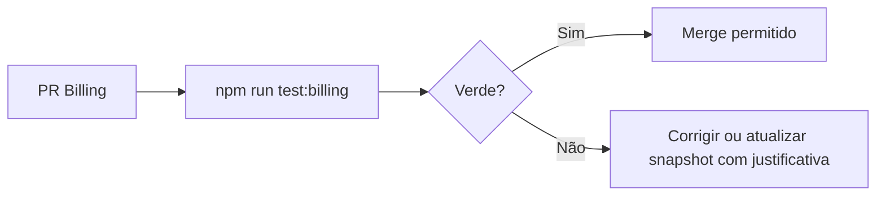

# Billing Certification Suite — Sprint 5.0-10A

Suíte automatizada que valida a **camada de apresentação atual** (`FinancialEventStore` + derivados) utilizando **exclusivamente** o Golden Dataset. Serve como barreira de regressão antes do cutover para `buildBillingAggregate` (Billing 5.0).

## Comandos

```bash
# Suite completa (certificação + regressões)
npm run test:billing

# Apenas certificação com snapshots
vitest run tests/billing/certification

# Regenerar snapshots oficiais após mudança intencional de UX
npm run test:billing:update-snapshots
```

## Estrutura

```
tests/billing/
├── golden-dataset/           # Fixtures oficiais
├── certification/
│   ├── captureVisualFixture.ts   # Serializa History, Calendar, Sidebar, Next
│   ├── snapshotHelpers.ts        # Load/save JSON
│   └── certificationSuite.test.ts
├── snapshots/                # 40 JSONs — um por cenário golden
└── regressions/              # Bugs permanentes das auditorias 4.2K–4.2Q
    ├── audit-4.2K-lifecycle.test.ts
    ├── audit-4.2L-generate-parity.test.ts
    ├── audit-4.2M-runtime-causality.test.ts
    ├── audit-4.2N-timeline-causality.test.ts
    ├── audit-4.2O-simplification.test.ts
    ├── audit-4.2P-state-machine.test.ts
    └── audit-4.2Q-aggregate.test.ts
```

## O que cada camada valida

### Certification Suite (`certificationSuite.test.ts`)

Para **cada** cenário golden:

1. **Snapshot visual** — compara `BillingVisualFixture` com `tests/billing/snapshots/{id}.json`:
   - **History:** `rowCount`, linhas (`statusPt`, `dueYmd`, `canGenerateNow`, `invoiceId`, `cycleId`)
   - **Calendar:** eventos (`ymd`, `isProjected`, `supportsGenerate`, `type`)
   - **Sidebar:** `alertKinds`, `nextReceiptDate`, `openAmount`
   - **Next invoice:** `dueYmd`, `statusLabel`, `showGenerate`, `isProjected`
   - **Financial events:** contagem real vs projetada

2. **Asserções de negócio** — funções `assert` opcionais por cenário (ex.: `generate-jul-before-aug` valida `generateCycleIds`).

3. **Invariantes UI** — shape estável, Gerar só com `cycleId` sem `invoiceId`, paridade next invoice ↔ store.

### Regression Suite (`regressions/`)

| Arquivo | Auditoria | Bugs congelados |
|---------|-----------|-----------------|
| `audit-4.2K-lifecycle.test.ts` | 4.2K | Lifecycle não emite cobrança; retomada com ciclo emite eventos |
| `audit-4.2L-generate-parity.test.ts` | 4.2L | Paridade histórico ↔ calendário Gerar; `supportsGenerate` exige `cycle_id` |
| `audit-4.2M-runtime-causality.test.ts` | 4.2M | Payment `ymd` = `due_date`; failed recuperável → `upcoming_cycle`; `invoice_only` sem `realEvents` |
| `audit-4.2N-timeline-causality.test.ts` | 4.2N | Legacy false cancel; histórico sem projeções |
| `audit-4.2O-simplification.test.ts` | 4.2O | Jobs órfãos não bloqueiam Gerar; projeções fora de `realEvents` |
| `audit-4.2P-state-machine.test.ts` | 4.2P | `statusPt` alinhado com `resolveHistoryRowState` |
| `audit-4.2Q-aggregate.test.ts` | 4.2Q | Assinatura determinística; campos obrigatórios do aggregate implícito |

## Fluxo CI recomendado



## Shadow Mode (Sprint 5.0-14A)

Após implementar `buildBillingAggregate`, esta suite continuará validando o **runtime legado**. A sprint 5.0-14A adicionará comparação shadow 100% legado vs 5.0 (`CERT-15` no roadmap).

## Definition of Done — 5.0-10A

- [x] 40 cenários com fixture oficial
- [x] 40 snapshots JSON (History, Calendar, Sidebar, Next)
- [x] Regressões 4.2K–4.2Q como testes permanentes
- [x] Scripts `test:billing` e `test:billing:update-snapshots`
- [x] Nenhuma alteração de negócio / API / backend

## Referências

- [BILLING_GOLDEN_DATASET.md](./BILLING_GOLDEN_DATASET.md)
- [BILLING_IMPLEMENTATION_ROADMAP.md](./BILLING_IMPLEMENTATION_ROADMAP.md) — sprint 5.0-10A
- [BILLING_ARCHITECTURE_SPECIFICATION.md](./BILLING_ARCHITECTURE_SPECIFICATION.md)
