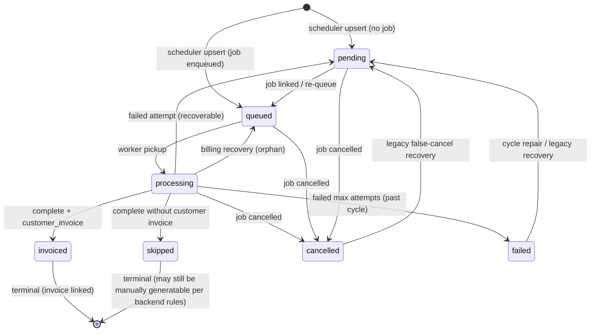

# Billing Cycle Ownership — Sprint 4.2K

**Entity:** `subscription_cycles`  
**Mode:** READ ONLY

---

## Schema

```sql
-- database/init/141_subscription_cycles_phase1.sql
status IN ('pending', 'queued', 'processing', 'invoiced', 'skipped', 'failed', 'cancelled')
UNIQUE (subscription_id, cycle_date)
```

`cycle_date` is the anchor competence (aligned to `cycle_key` / invoice `period_start`). **No DELETE path** exists in application code.

---

## Who creates cycles?

| # | Module | Function | Trigger | Initial status |
|---|--------|----------|---------|----------------|
| 1 | `subscriptionCyclesDualWriteService.ts` | `subscriptionCyclesUpsertAfterScheduler` | Scheduler inserts/reactivates job | `queued` (with job_id) or `pending` |
| 2 | `subscriptionCyclesDualWriteService.ts` | `upsertCycleRow` (via worker hooks) | Worker pickup / complete / fail / cancel | varies |
| 3 | `141_subscription_cycles_phase1.sql` | Backfill 4a–4c | Migration (one-time) | `invoiced` / `queued` / `pending` |
| 4 | `subscriptionCyclesReconciliationService.ts` | Reconciliation report | Audit script only — **no INSERT in hot path** | — |

**Primary runtime owner:** `subscriptionCyclesDualWriteService.ts` (all live writes gated by `subscription_cycles_write` flag).

---

## Who updates cycles?

### Dual-write worker paths

| Function | When | Status set | `invoice_id` |
|----------|------|------------|--------------|
| `subscriptionCyclesMarkProcessing` | Job → `processing` | `processing` | unchanged / null |
| `subscriptionCyclesMarkQueued` | Job re-queued (time window / retry) | `queued` | null |
| `subscriptionCyclesOnJobCompleted` | `completeBillingRecurringJob` | `invoiced` if customer invoice; else `skipped` | set on customer path |
| `subscriptionCyclesOnJobCancelled` | `cancelBillingRecurringJob` | `cancelled` | null |
| `subscriptionCyclesOnJobFailedAttempt` | Retry or max attempts | `pending` (recoverable) or `failed` (past + final) | null |

### Scheduler upsert (ON CONFLICT)

Updates `job_id`, `status`, `period_start`, `period_end`, `metadata` **unless** existing row is `invoiced` (frozen).

### Repair / recovery (operational, not billing engine)

| Module | Function | Change |
|--------|----------|--------|
| `subscriptionCycleRepairService.ts` | `repairCyclesTable` | `failed` → `pending` (future, no invoice) |
| `legacyCancelledCycleRecovery.ts` | `recoverLegacyFalseCancelledCycles` | false `cancelled` → `pending` |
| `billingRecoveryService.ts` | `repairOrphanCycles` | stuck `processing` → `queued`; broken `invoiced` without invoice → `failed` |
| `customerInvoiceAdminService.ts` | invoice delete | **`invoice_id = NULL`** only (status unchanged) |

---

## Field ownership

| Field | Writers | Notes |
|-------|---------|-------|
| `cycle_date` | INSERT only | Identity key; never UPDATE |
| `period_start` | `loadPeriodBounds` in dual-write | `= cycle_date` for customer CRM |
| `period_end` | `calculateNextBillingDate(period_start, interval)` | Recalculated on upsert unless `invoiced` |
| `status` | All dual-write + repair services | See state graph below |
| `invoice_id` | `subscriptionCyclesOnJobCompleted` (set); `customerInvoiceAdminService` (clear) | Protected when `invoiced` |
| `job_id` | Scheduler + worker upserts | Frozen when `invoiced` |
| `skipped_reason` | Completed (skipped) / cancelled paths | Stores `completion_outcome` |
| `error_message` | Failed attempts | Truncated 4000 chars |

**Nobody** updates `cycle_date`, `period_start`, or `period_end` outside `subscriptionCyclesDualWriteService` except repair status-only updates.

---

## Cycle state transition graph



### Transition details

| From | To | Actor | Condition |
|------|-----|-------|-----------|
| — | `pending` / `queued` | Scheduler | `subscriptionCyclesUpsertAfterScheduler` |
| * | `processing` | Worker | `subscriptionCyclesMarkProcessing` |
| * | `queued` | Worker / Recovery | Re-queue or orphan heal |
| * | `invoiced` | Worker / Manual | `resultInvoiceType === 'customer_invoice'` |
| * | `skipped` | Worker | Tenant invoice or no eligible items |
| * | `cancelled` | Worker / CRM PATCH | Job cancel; `guardObsolete` may skip on mismatch |
| * | `failed` | Worker | Max attempts + cycle_date < today |
| `failed` / `cancelled` | `pending` | Repair services | Recoverable, no invoice, not official cancel |

---

## Invoice linkage

| Action | Module | Mechanism |
|--------|--------|-----------|
| **Set** `invoice_id` | `subscriptionCyclesOnJobCompleted` | After `BillingExecutionOrchestrator` persists customer invoice |
| **Clear** `invoice_id` | `customerInvoiceAdminService` | Admin deletes invoice |
| **Lookup** | `subscriptionCyclesQueryService.findSubscriptionCycleForInvoice` | By `invoice_id` or `cycle_date = period_start` |

Invoice **creation** is owned by `BillingExecutionOrchestrator` / `customerInvoiceService` (not cycle table). Cycle dual-write **links** after the fact.

---

## Who cancels cycles?

There is **no direct “cancel cycle” API**. Cancellation is always **derived from job cancellation**:

```
cancelBillingRecurringJob / cancelPendingRenewalJobsForSubscription
  → subscriptionCyclesOnJobCancelled
  → status = 'cancelled', skipped_reason = outcome
```

**Exception:** `guardObsolete` on mismatch cancel skips cycle update when `job.cycle_key === subscription.next_billing_date` (job still “current” — rare edge).

---

## Who decides skipped vs cancelled?

| Decision | Decider | Outcome stored |
|----------|---------|----------------|
| **Skipped** | Worker completion without billable customer invoice | `status = skipped`, `skipped_reason = completion_outcome` |
| **Cancelled** | Any job cancellation path | `status = cancelled`, `skipped_reason = outcome` |

Skipped cycles remain in `GENERATABLE_CYCLE_STATUSES` (`billingCycleInvoiceGenerationService.ts:22–28`). Cancelled cycles are generatable only when classified as legacy false-cancel (`legacyCancelledCycleRecovery.ts`).

---

## Concurrent writers on same cycle

| Scenario | Behavior |
|----------|----------|
| Scheduler + Worker same `cycle_date` | ON CONFLICT merge; `invoiced` wins immutability |
| Manual generate + Scheduler | Same `insertOrReactivateRenewalJob` guard — one active job per logical cycle |
| PATCH next_billing + pending job | Cancels old job → old cycle `cancelled`; new cycle row only when new job enqueued |

See `BILLING_RUNTIME_SEQUENCE_DIAGRAM.md` for timing diagrams.
