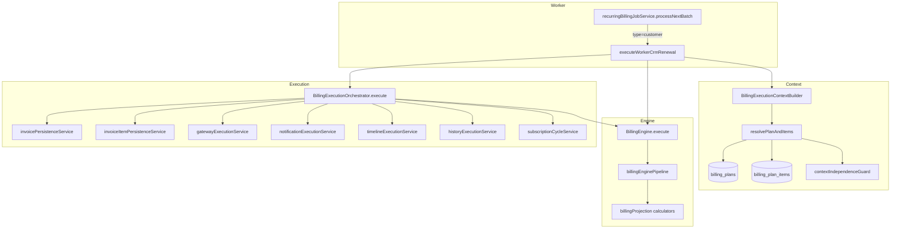
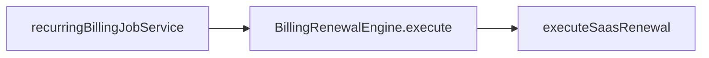
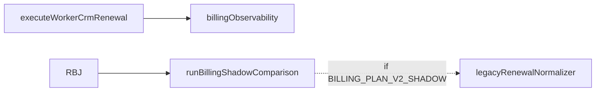

# Billing Engine 3.0 — Dependency Graph Final

**Data:** 2026-06-26  
**Sprint:** 3.2A Final Audit

---

## CRM Renewal — Production (único caminho)



---

## SaaS Renewal — Parallel (não CRM)



CRM `customer` type é **bloqueado** em `BillingRenewalEngine` (`crm_use_worker_v2_pipeline`).

---

## Observability (sidecar, não altera fatura)



Shadow **não** está no caminho crítico de geração de invoice CRM.

---

## Módulos removidos — sem arestas

```
executeCustomerRenewal          ✗
crmRenewalCustomerResolver      ✗
crmSubscriptionContractRenewalOverlay ✗
buildBillingItemsFromInvoice    ✗
billingEngineV2/                ✗
billingPersistence/             ✗
```

---

## Imports verificados

| From | To | Status |
|------|-----|--------|
| `workerCrmRenewalPipeline.ts` | `billingExecutionOrchestrator.js` | ✅ |
| `billingExecutionOrchestrator.ts` | `billingEngine.js` | ✅ |
| `planItemResolver.ts` | `billingPlanRepository`, `billingPlanItemRepository` | ✅ |
| `planItemResolver.ts` | `customerInvoiceService` (template) | ✗ ausente |

---

## Conclusão

Grafo CRM de produção é **único e acíclico** em direção ao motor 3.0. Não existe aresta para o motor legado de cópia de faturas.
