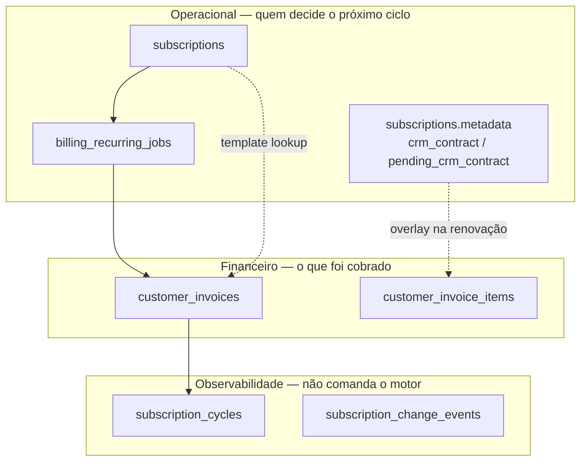
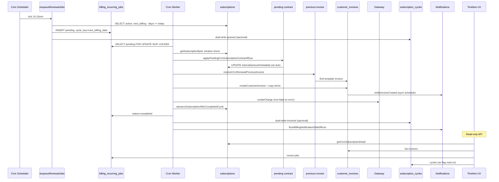
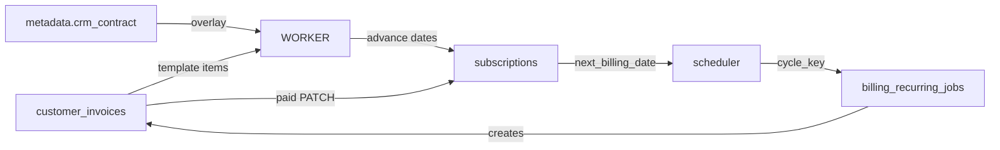
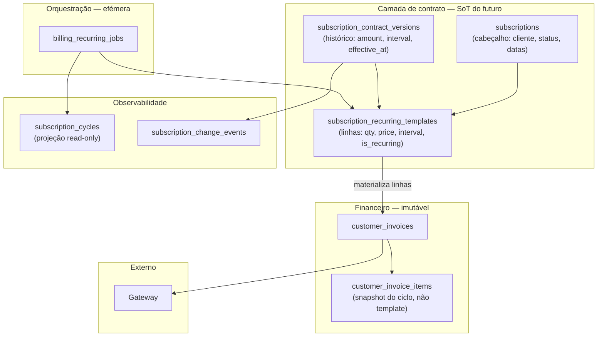

# BILLING ENGINE — ARCHITECTURE REVIEW V1

**Modo:** READ ONLY (auditoria arquitetural — sem alterações de código)  
**Data:** 2026-06-25  
**Contexto:** Pós-incidente P0 renovação semanal (`AUDIT_RENEWAL_ENGINE.md`)  
**Objetivo:** Decidir se o modelo atual deve permanecer com hardening ou evoluir estruturalmente

---

## Sumário executivo

| Pergunta | Resposta |
|----------|----------|
| Fonte de verdade operacional | **`subscriptions`** (próximo ciclo, intervalo, estado) |
| Fonte de verdade financeira | **`customer_invoices`** (cobranças emitidas/pagas) |
| O motor depende da última invoice? | **SIM** — para CRM, itens recorrentes são **copiados** da fatura anterior |
| Bug P0 foi só bug ou arquitetural? | **Ambos** — bug de lookup + fragilidade do modelo invoice-as-template |
| Recomendação | **OPÇÃO B** — evoluir arquitetura (não refatorar agora; fortalecer primeiro) |

---

## 1. Fonte de verdade (Source of Truth)

### 1.1 Hierarquia por responsabilidade



| Entidade | Papel real | Deve sobreviver 10 anos? | Gera próximos ciclos? |
|----------|------------|--------------------------|------------------------|
| **`subscriptions`** | Contrato operacional ativo: cliente, intervalo, valor nominal, datas de ciclo, estado | **SIM** | **SIM** — `next_billing_date` é o gatilho do scheduler |
| **`customer_invoices`** | Registro financeiro imutável por ciclo (cobrança emitida) | **SIM** (compliance) | **NÃO** — mas hoje é usada como **template** da próxima |
| **`customer_invoice_items`** | Linhas de cobrança por fatura; flags `is_recurring`, `scheduled_due_date` | **SIM** (via invoice) | **Indiretamente** — worker copia itens da fatura anterior |
| **`billing_recurring_jobs`** | Fila efémera de processamento (`cycle_key`, retry, outcome) | Histórico útil, não SoT | Orquestra uma execução, não define contrato |
| **`subscription_cycles`** | Dual-write para UX/relatórios (flag superadmin) | Opcional | **NÃO** — espelha jobs; erros são engolidos |
| **`subscriptions.metadata`** | Contrato CRM (`crm_contract`), pendências (`pending_crm_contract`) | **SIM** | Influencia overlay de itens na renovação |
| **`subscription_change_events`** | Auditoria de mudanças de contrato (S2.2) | **SIM** | **NÃO** |
| **Gateway metadata** | Estado externo (Asaas/MP) | **SIM** (na invoice) | **NÃO** |

### 1.2 Quem representa o estado do contrato do cliente?

**Resposta composta (estado atual):**

| Dimensão | SoT |
|----------|-----|
| “Quando cobrar de novo?” | `subscriptions.next_billing_date` |
| “Quanto e com que periodicidade?” | `subscriptions.amount_cents` + `billing_interval` + `metadata.crm_contract` |
| “O que cobrar (linhas)?” | **Não há SoT dedicado** — inferido de `customer_invoice_items` da última fatura |
| “O que já foi cobrado/pago?” | `customer_invoices` + status |

**Conclusão:** o contrato operacional está **fragmentado** entre `subscriptions` (cabeçalho) e a **última fatura** (linhas). Não existe entidade única de “contrato recorrente”.

---

## 2. O motor depende da última invoice?

### 2.1 Resposta direta

| Tipo | Depende de invoice anterior? |
|------|------------------------------|
| **CRM (`type=customer`) — renovação normal** | **SIM, obrigatoriamente** |
| **CRM — idempotência** | Não — verifica invoice do **ciclo atual** |
| **CRM — sem itens elegíveis** | SIM — precisa ler itens para decidir que não há o que cobrar |
| **CRM — primeiro ciclo** | Não via worker — criado por `createRecurringManualInvoice` |
| **SaaS (`type=saas`)** | **NÃO** — calcula valor via `calculateSaasRenewalInvoiceAmount(plan, seats)` |

### 2.2 Cadeia de chamadas (CRM)

```
runRecurringWorker.ts
└── processNextBatch()                          recurringBillingJobService.ts
    └── findCustomerInvoiceBySubscriptionAndPeriod(sub, cycle_key)  ← idempotência
    └── processOneCustomerRenewalJob()
        ├── applyPendingCrmSubscriptionContractIfDue()                crmSubscriptionsContractService.ts
        ├── resolveCrmRenewalPreviousInvoice()                      crmRenewalCustomerResolver.ts
        │   ├── [1] findCustomerInvoiceBySubscriptionAndPeriod(current_period_start)
        │   ├── [2] findCustomerInvoiceBySubscriptionAndPeriod(computed_prev_cycle)
        │   └── [3] findLatestSubscriptionInvoiceBefore(cycle)
        ├── getCustomerInvoiceItems(prevInvoice.id)                 customerInvoiceService.ts
        ├── overlayCrmContractOnRenewalItems(metadata)              crmSubscriptionContractRenewalOverlay.ts
        ├── createCustomerInvoice({ period_start, period_end, due_date, amount })  ← header da SUB
        ├── INSERT customer_invoice_items (cópia dos itens filtrados)             ← template da INV
        ├── gateway.createCharge()
        └── advanceSubscriptionAfterCompletedCycle()                recurringBillingJobService.ts
            └── updateSubscriptionAfterRenewal()                    billingSubscriptionService.ts
```

### 2.3 O que vem de cada fonte

| Campo / decisão | Fonte |
|-----------------|-------|
| `period_start`, `period_end`, `due_date` da nova fatura | **Subscription** + `job.cycle_key` + `billing_interval` |
| `client_id`, `tenant_id`, `subscription_id` | **Subscription** |
| `amount_cents` (total) | **Soma dos itens** copiados (não `subscription.amount_cents` diretamente) |
| Linhas (`description`, `quantity`, `unit_price`, `is_recurring`, `recurring_interval`) | **Invoice anterior** |
| Override de valor/descrição/intervalo nas linhas | **`metadata.crm_contract`** |
| Gateway, payment method | **Subscription** + tenant config |

### 2.4 Seria possível gerar só com dados da assinatura?

**Tecnicamente sim, mas não hoje.**

Dados já na assinatura suficientes para um modelo simplificado:
- `amount_cents`, `billing_interval`, `customer_id`, `metadata.crm_contract.description`

O que **falta** na assinatura para paridade com o motor atual:
- Múltiplas linhas com preços/discounts distintos
- Itens com `scheduled_due_date` diferente do ciclo (E2 child invoices)
- Itens avulsos vs recorrentes no mesmo ciclo
- `recurring_interval` por item (pode diferir do intervalo da assinatura)

**Hoje:** sem invoice anterior resolvida → worker **lança exceção** e entra em retry.

---

## 3. Fluxo completo da renovação

### 3.1 Diagrama end-to-end



### 3.2 Quem escreve cada campo (pós-renovação CRM bem-sucedida)

| Campo | Escritor | Momento |
|-------|----------|---------|
| `billing_recurring_jobs.status` | `completeBillingRecurringJob` | Fim do job |
| `billing_recurring_jobs.result_invoice_id` | idem | Fim do job |
| `customer_invoices.*` | `createCustomerInvoice` + item INSERTs | Meio do job |
| `customer_invoices.gateway_*` | `updateCustomerInvoiceGatewayData` | Após gateway |
| `subscriptions.next_billing_date` | `updateSubscriptionAfterRenewal` | Após fatura criada |
| `subscriptions.current_period_start` | idem | = ciclo processado |
| `subscriptions.current_period_end` | idem | = novo next_billing |
| `subscriptions.billing_cycle_count` | idem | +1 |
| `subscriptions.last_job_at` | idem | now() |
| `subscription_cycles.status` | `subscriptionCyclesOnJobCompleted` | Dual-write |
| `subscription_cycles.invoice_id` | idem | Dual-write |
| Notificações | `notifyInvoiceCreated` → engine | Na criação da invoice |

---

## 4. Responsabilidades por entidade

### 4.1 `subscriptions`

| Campos críticos | Controla | Quem escreve | Quem lê |
|-----------------|----------|--------------|---------|
| `next_billing_date` | Próximo vencimento / gatilho scheduler | Worker (`updateSubscriptionAfterRenewal`), contract service, lifecycle, manual patch | Scheduler, worker, UI, insight |
| `current_period_start/end` | Janela do ciclo corrente | `createSubscription`, worker advance, contract (só `end` em mudança intervalo) | Worker (lookup template), UI |
| `billing_interval` | Periodicidade | create, contract, SaaS plan change | Scheduler cap, date math, worker |
| `amount_cents` | Valor nominal do contrato | create, contract, SaaS renewal sync | UI, relatórios (não é total da fatura CRM) |
| `status` | active/paused/cancelled | lifecycle, cancel, scheduler expire | Worker guards |
| `metadata` | Contrato CRM, pause reason | contract service, lifecycle | Worker overlay, contract apply |
| `billing_cycle_count` | Contador de ciclos | worker advance | UI, max_cycles guard |

**Quem nunca deveria escrever:** `customer_invoices` diretamente (não há trigger); invoices não alteram subscription automaticamente no pagamento CRM.

### 4.2 `customer_invoices`

| Campos | Controla | Quem escreve | Quem lê |
|--------|----------|--------------|---------|
| `period_start/end` | Snapshot do ciclo faturado | `createCustomerInvoice` (worker), link na 1ª fatura | Idempotência worker, timeline |
| `due_date` | Vencimento da cobrança | worker (= period_start), admin PATCH | Gateway, overdue sync |
| `status` | Estado financeiro | webhooks, admin, overdue job | Timeline, relatórios |
| `amount_cents` | Total cobrado | create + item sum | Gateway, UI |
| `gateway_*` | Estado externo | gateway após charge | Webhooks, UI |

**Papel real:** registro financeiro **e**, acidentalmente, **template** da próxima renovação.

**Quem nunca deveria escrever:** worker de renovação em faturas **pagas** de ciclos passados.

### 4.3 `customer_invoice_items`

| Campos | Controla | Quem escreve | Quem lê |
|--------|----------|--------------|---------|
| `is_recurring` | Se entra no próximo ciclo | manual create, worker copy | Worker filter |
| `recurring_interval` | Periodicidade da linha | manual, worker copy, contract sync (open) | Worker item advance |
| `scheduled_due_date` | Próxima cobrança da linha | manual, worker copy/advance | Worker inclusion, E2 child |

**Não há UPDATE de `is_recurring` após criação** — decisão irreversível na prática.

### 4.4 `billing_recurring_jobs`

| Campos | Controla | Quem escreve | Quem lê |
|--------|----------|--------------|---------|
| `cycle_key` | Qual ciclo processar | scheduler | Worker, timeline |
| `status` | pending/processing/completed/failed/cancelled | scheduler, worker | UI, insight |
| `attempts`, `retry_at` | Retry backoff | worker catch | UI |
| `error_message` | Diagnóstico falha | worker catch | UI, auditoria |
| `result_invoice_id` | Fatura gerada | worker complete | Timeline |

**Ephemeral orchestration** — não é contrato; é fila de trabalho.

### 4.5 `subscription_cycles`

| Papel | Dual-write shadow de jobs + bounds de período |
| Flag | `subscription_cycles_write` (superadmin, default on) |
| Falha | Engolida — **nunca bloqueia** motor legado |
| Leitura | `subscription_cycles_read` para timeline enriquecida |

**Não é SoT.** Legado: `billing_recurring_jobs` + `subscriptions.next_billing_date`.

### 4.6 Contratos (`metadata` + `subscription_change_events`)

| Objeto | Papel |
|--------|-------|
| `metadata.crm_contract` | Contrato ativo: amount, interval, description |
| `metadata.pending_crm_contract` | Downgrade/upgrade no próximo ciclo |
| `subscription_change_events` | Histórico auditável (S2.2) |

**Quem escreve:** `patchCrmSubscriptionContract`, `applyPendingCrmSubscriptionContractIfDue`  
**Quem lê:** worker (overlay), UI histórico

---

## 5. Mudança de periodicidade e cenários de contrato

### 5.1 Matriz de impacto

| Cenário | Objetos que mudam | Depende invoice anterior? | Risco desalinhamento |
|---------|-------------------|---------------------------|----------------------|
| **Mensal → Semanal** (imediato) | `billing_interval`, `next_billing_date`, `current_period_end`, `metadata.crm_contract`; jobs cancelados/re-enfileirados | **SIM** na próxima renovação | **ALTO** — `current_period_start` **não** é recalculado; invoice antiga tem `period_start` mensal |
| **Semanal → Mensal** (imediato) | idem | SIM | ALTO |
| **Mensal → Anual** | idem | SIM | ALTO |
| **Anual → Semestral** | idem | SIM | ALTO |
| **Upgrade imediato** (preço ↑, mesmo intervalo) | `amount_cents`, `metadata`; open invoices synced | SIM (itens copiados; overlay aplica novo valor) | Médio — open invoice atualizada, template próximo ciclo ok |
| **Downgrade próximo ciclo** | só `metadata.pending_crm_contract` até due | SIM | Baixo até apply; depois mesmo risco se intervalo mudar |
| **Mudança de preço** (imediato) | `amount_cents`, `crm_contract`, open invoice items | SIM | Baixo se overlay funciona |
| **Mudança de plano** (SaaS) | `plan_id`, `billing_interval`, seats via `changeSubscriptionPlan` | NÃO (SaaS não copia invoice) | Baixo |
| **Mudança quantidade usuários** (SaaS custom) | `users_count`, tenant `max_users_scheduled_next_cycle` | NÃO | Baixo |

### 5.2 Detalhe crítico — mudança de intervalo

`applyContractToSubscriptionImmediate` quando `intervalChanged`:

```typescript
// crmSubscriptionsContractService.ts — mantém current_period_start; recalcula end e next
computeCrmContractDatesAfterIntervalChange({
  current_period_start: subscription.current_period_start,  // INALTERADO
  next_billing_date: ...,
  new_billing_interval: contract.billing_interval,
});
```

**Efeito:** após mensal→semanal, `current_period_start` pode continuar apontando para o início do ciclo **mensal**, enquanto `next_billing_date` já reflete ciclo **semanal**. A fatura do ciclo corrente tem `period_start` do regime anterior.

**Isto não é estado esperado estável** — é **inconsistência estrutural** mascarada por fallbacks no resolver (pós-P0). O modelo assume alinhamento que a mudança de intervalo não garante.

### 5.3 Pending contract (próximo ciclo)

1. PATCH grava `pending_crm_contract` em metadata
2. No `next_billing_date`, scheduler ou worker chama `applyPendingCrmSubscriptionContractIfDue`
3. Aplica contrato + sync open invoices + marca evento applied
4. Renovação prossegue com novo intervalo/valor

**Dependência de invoice:** sync em faturas abertas; renovação ainda copia da anterior.

---

## 6. Perda da última invoice

### 6.1 Resposta: depende do cenário

| Cenário | Consegue gerar próxima? | Por quê |
|---------|-------------------------|---------|
| **Única fatura da assinatura apagada** | **NÃO** | `resolveCrmRenewalPreviousInvoice` → `no_prior_invoice` |
| **Última apagada, existem anteriores** | **PARCIAL** | Fallback `latest_before_cycle` encontra fatura mais antiga — **template desatualizado** |
| **`current_period_start` apontava só para a deletada** | **PARCIAL** | Estratégias 2 e 3 podem salvar |
| **SaaS** | **SIM** | Não depende de customer_invoice |

### 6.2 Por que trava (CRM)

```typescript
// recurringBillingJobService.ts — processOneCustomerRenewalJob
if (!prevResolution.ok) {
  throw new Error(detail);  // → retry → failed após 3 tentativas
}
```

Sem invoice resolvível, **não há caminho alternativo** que use apenas `subscriptions` + `metadata.crm_contract`.

---

## 7. Recuperação de desastre

### 7.1 Cenário: backup restaurado, subscription intacta, última invoice perdida

| Condição | Resultado |
|----------|-----------|
| Todas invoices perdidas | **TRAVA** — worker falha indefinidamente até intervenção manual |
| Invoices antigas existem | **Pode continuar** com template defasado; valores/itens podem não refletir contrato atual |
| `billing_recurring_jobs` perdidos | Scheduler re-enfileira quando `next_billing_date` elegível |
| `subscription_cycles` perdidos | Motor legado **não depende**; timeline degradada |
| `metadata.crm_contract` intacto | Overlay aplica amount/description, **mas não cria linhas do zero** |

### 7.2 Procedimento de recuperação manual (hoje)

1. Recriar fatura “template” com itens recorrentes para o `current_period_start` correto, OU
2. Ajustar `current_period_start` para coincidir com invoice existente, OU
3. Cancelar job failed e forçar novo ciclo via PATCH manual de `next_billing_date`

**Não há auto-recuperação.**

---

## 8. Template recorrente — viabilidade técnica de evolução

### 8.1 Existe regra de negócio que obrigue copiar da invoice?

**Não há regra de domínio documentada** que exija invoice-as-template. É **decisão de implementação** (Fase 5):

> *"Para manter o modelo simples (sem nova tabela de template), usamos a fatura anterior como fonte dos itens."*  
> — comentário em `processOneCustomerRenewalJob`

### 8.2 O que a cópia resolve hoje

- Múltiplas linhas com descontos
- Itens com periodicidades diferentes (item-level `recurring_interval`)
- Distinção recorrente vs avulso (`is_recurring`)
- Agendamento por item (`scheduled_due_date`) + path E2 child invoices

### 8.3 Seria viável `subscription_recurring_items` ou `subscription_invoice_template`?

**SIM, tecnicamente viável**, sem implementar:

| Abordagem | Prós | Contras |
|-----------|------|---------|
| **`subscription_recurring_line_templates`** | SoT claro; independente de invoices; disaster-proof | Migração; sync com contract; UI de gestão |
| **Expandir `metadata.crm_contract`** | Já existe overlay | JSON não escala para multi-linha complexa |
| **View materializada “última invoice”** | Zero schema novo | Mesma fragilidade |

**Paridade funcional exige:** CRUD de linhas no contrato, sync com open invoices, worker lê template em vez de invoice.

---

## 9. Responsabilidades das invoices

| Pergunta | Resposta |
|----------|----------|
| Representa histórico financeiro? | **SIM** — primário |
| Representa estado do contrato? | **NÃO** — mas é **usada como proxy** |
| Representa template da próxima cobrança? | **SIM, de facto** — acoplamento não intencional no desenho de domínio |

**Uma invoice deveria ser imutável após emissão/pagamento.** Usá-la como template viola separação entre **contrato** (futuro) e **cobrança** (passado).

---

## 10. Acoplamentos ocultos

### 10.1 Invoice → Subscription

| Acoplamento | Mecanismo | Ficheiro |
|-------------|-----------|----------|
| Reagendar próxima cobrança | PATCH paid invoice → `next_billing_date` | `customerInvoiceRecurrenceNextBillingService.ts` |
| Gate de contrato | `patchCrmSubscriptionContract` exige **fatura paga** | `crmSubscriptionsContractService.ts` |
| Template de renovação | Worker lê itens da invoice anterior | `processOneCustomerRenewalJob` |
| SaaS idempotente | Sync `amount_cents` da invoice existente | `processNextBatch` |
| SaaS ativação | Paid `tenant_billing` → create/patch subscription | `subscriptionService.ensureSaasSubscriptionAfterPaidActivation` |

### 10.2 Subscription → Invoice

| Acoplamento | Mecanismo | Ficheiro |
|-------------|-----------|----------|
| Lookup template | `current_period_start` → `period_start` | `crmRenewalCustomerResolver.ts` |
| Idempotência | `cycle_key` → `period_start` | `findCustomerInvoiceBySubscriptionAndPeriod` |
| Contract sync | Atualiza itens em faturas **abertas** | `syncOpenInvoicesWithContract` |
| Criação 1º ciclo | `createRecurringManualInvoice` cria sub + invoice ligados | `customerBillingService.ts` |

### 10.3 Job ↔ Subscription ↔ Cycle

| Acoplamento | Risco |
|-------------|-------|
| `job.cycle_key` deve = `subscription.next_billing_date` | Job cancelado se divergir (`CANCELLED_JOB_CYCLE_MISMATCH`) |
| `subscription_cycles` dual-write | Drift se flag on e job manual no DB |
| `advanceSubscriptionAfterCompletedCycle` único escritor pós-worker | Exceção: PATCH manual de next billing |



---

## 11. Mapa de escrita — campos críticos

> Campo `renewal_date` **não existe** no schema atual. Equivalente operacional: `next_billing_date`.

### 11.1 `next_billing_date`

| Ficheiro | Função | Responsabilidade |
|----------|--------|------------------|
| `billingSubscriptionService.ts` | `createSubscription` | Criação inicial |
| `billingSubscriptionService.ts` | `updateSubscriptionAfterRenewal` | Avanço pós-ciclo (worker) |
| `recurringBillingJobService.ts` | `advanceSubscriptionAfterCompletedCycle` | Orquestra avanço |
| `crmSubscriptionsContractService.ts` | `applyContractToSubscriptionImmediate` | Mudança intervalo |
| `crmSubscriptionsLifecycleService.ts` | `resumeCrmSubscription`, `reactivateCrmSubscription` | Retomada |
| `customerInvoiceRecurrenceNextBillingService.ts` | `patchCustomerSubscriptionNextBillingFromPaidInvoice` | Reagendamento manual |
| `billingSubscriptionService.ts` | `patchActiveSaasSubscriptionIncompletePeriods` | Self-heal SaaS |

### 11.2 `current_period_start` / `current_period_end`

| Ficheiro | Função | Notas |
|----------|--------|-------|
| `billingSubscriptionService.ts` | `createSubscription` | Ambos na criação |
| `billingSubscriptionService.ts` | `updateSubscriptionAfterRenewal` | Ambos no avanço worker |
| `crmSubscriptionsContractService.ts` | `applyContractToSubscriptionImmediate` | Só `current_period_end` se intervalo mudou; **start preservado** |

### 11.3 `billing_interval`

| Ficheiro | Função |
|----------|--------|
| `billingSubscriptionService.ts` | `createSubscription`, `changeSubscriptionPlan` |
| `crmSubscriptionsContractService.ts` | `applyContractToSubscriptionImmediate` |

### 11.4 `status` (subscription)

| Ficheiro | Função |
|----------|--------|
| `crmSubscriptionsLifecycleService.ts` | pause / resume / reactivate |
| `billingSubscriptionService.ts` | `cancelSubscription`, `expireCancelledSubscriptions` |
| `crmSubscriptionsService.ts` | `cancelCrmCustomerSubscription` |

### 11.5 `scheduled_due_date` (items)

| Ficheiro | Função |
|----------|--------|
| `customerInvoiceService.ts` | create manual / replace items |
| `recurringBillingJobService.ts` | copy on renewal; advance on E2 child |

### 11.6 `period_start` / `period_end` / `due_date` (invoice)

| Ficheiro | Função |
|----------|--------|
| `customerInvoiceService.ts` | `createCustomerInvoice` (worker) |
| `customerInvoiceService.ts` | `updateCustomerInvoiceSubscriptionLink` (1º ciclo) |
| `customerInvoiceAdminService.ts` | PATCH `due_date` (admin) |

**`period_start/end` não têm UPDATE** após criação — snapshot imutável.

---

## 12. Auditoria de consistência

### 12.1 `subscription.current_period_start` ≠ `invoice.period_start` — esperado ou bug?

| Situação | Classificação |
|----------|---------------|
| Após renovação bem-sucedida | **Deve alinhar** — worker seta `current_period_start = cycle` e invoice tem `period_start = cycle` |
| Após mudança de intervalo imediata | **Inconsistência estrutural esperada pelo código atual** — start não é recalculado |
| Após PATCH manual de next billing | **Pode divergir** — só altera `next_billing_date` |
| Fatura criada manualmente com link incorreto | **Bug de dados** |
| Primeiro ciclo: sub `current_period_start = due`, invoice `period_start` ligado depois | **Deve alinhar** se `updateCustomerInvoiceSubscriptionLink` correto |

**Conclusão:** divergência **não é estado estável válido** no modelo mental do domínio, mas **é produzido pelo código** em mudanças de intervalo. O incidente P0 semanal é sintoma disso.

### 12.2 Invariantes desejados vs reais

| Invariante desejado | Cumprido? |
|---------------------|-----------|
| `next_billing_date` = único gatilho do scheduler | ✅ |
| Uma invoice por `(subscription, period_start)` | ✅ (idempotência) |
| `current_period_start` = `period_start` da última invoice processada | ⚠️ Quebrado em interval change |
| Template = contrato vigente | ❌ Template = invoice histórica |

---

## 13. Arquitetura ideal — decisão

### **OPÇÃO B: A arquitetura atual deveria evoluir**

**Não porque o motor “está errado” no core scheduler/worker/idempotência**, mas porque:

1. **Confunde três papéis** numa só entidade (`customer_invoices`): histórico financeiro, snapshot de ciclo, template de renovação.
2. **Renovação CRM não é derivável de `subscriptions` alone** — dependência frágil de invoice anterior.
3. **Mudanças de periodicidade** não mantêm invariantes entre subscription e invoices.
4. **`subscription_cycles`** é shadow opcional — duplica estado sem ser SoT, aumentando superfície de drift.
5. **Contrato S2** (`metadata.crm_contract`) é overlay parcial, não substitui template de linhas.
6. O bug P0 **não é edge case raro** — é consequência previsível de mensal→semanal + lookup rígido.

**O que está correto e deve ser preservado:**

- Scheduler por `next_billing_date` − antecipação efetiva
- Jobs com `cycle_key` + idempotência por `period_start`
- Janela horária local (Fase 2)
- `advanceSubscriptionAfterCompletedCycle` como único avanço pós-worker
- Separação SaaS (plan-based) vs CRM (item-based)

---

## 14. Arquitetura alvo (desenho — não implementar)



### 14.1 Princípios do modelo alvo

| Princípio | Implementação |
|-----------|---------------|
| **Contrato ≠ Cobrança** | Template vive em `subscription_recurring_templates` |
| **Invoice é append-only** | Nunca lida para gerar futuro; só histórico |
| **Renovação = materialização** | Worker: template + contract version → nova invoice |
| **Mudança intervalo** | Atualiza template + recalcula datas; não depende de invoice antiga |
| **Cycles = projeção** | `subscription_cycles` gerado de jobs; não dual-write frágil |
| **Disaster recovery** | Subscription + template bastam para próximo ciclo |

### 14.2 Fluxo alvo simplificado

```
Scheduler → Job(cycle_key)
Worker → load subscription + active template lines + contract version
       → apply pending contract if due
       → createCustomerInvoice(snapshot from template)
       → gateway
       → advance subscription dates
       → append contract version event
```

---

## 15. Impacto de uma migração arquitetural

| Dimensão | Avaliação |
|----------|-----------|
| **Complexidade** | Alta — nova tabela, migração de dados, UI de linhas no contrato |
| **Risco** | Médio-alto — motor financeiro P0; exige feature flag e paralelismo |
| **Migração** | Backfill template a partir da última invoice recorrente por subscription; validar por tenant |
| **Compatibilidade** | Período de convivência: worker tenta template, fallback invoice (como hoje) |
| **Rollback** | Flag `BILLING_USE_RECURRING_TEMPLATES=false` volta ao motor atual |
| **Esforço estimado** | 3–5 sprints (design, schema, backfill, worker, UI, testes, cutover) |
| **ROI** | Alto a médio prazo — elimina classe de bugs P0, simplifica interval change, melhora DR |

### 15.1 O que fazer **agora** vs **depois**

| Agora (hardening — já iniciado no P0) | Depois (evolução B) |
|--------------------------------------|---------------------|
| Resolver fallback invoice | Template entity |
| Cap antecipação por intervalo | Config antecipação por intervalo |
| `[RENEWAL_TRACE]` logs | Contract version history |
| Recalcular `current_period_start` em interval change | Eliminar dependência de invoice |
| Alertas job failed | DR playbook automático |

---

## 16. Conclusão obrigatória

### 16.1 O bug P0 era apenas bug ou revelou problema arquitetural?

**Ambos.**

- **Bug:** lookup rígido `current_period_start` → `invoice.period_start` sem fallback.
- **Arquitetural:** renovação CRM **fundamentada em invoice como template** + mudança de intervalo que **não realinha** subscription com invoices históricas.

### 16.2 A arquitetura atual é sustentável para os próximos anos?

**Parcialmente.**

- **Sustentável:** scheduler, jobs, idempotência, gateway, SaaS path, contrato S2 metadata.
- **Não sustentável sem evolução:** CRM item-copy model, interval changes, disaster recovery, multi-line contracts complexos.

### 16.3 Vale a pena refatorar?

**Sim, mas de forma faseada** — não big-bang.

1. **Fase 0 (agora):** hardening P0 — concluir e validar em produção.
2. **Fase 1:** corrigir invariantes (recalcular `current_period_start` em interval change).
3. **Fase 2:** introduzir `subscription_recurring_templates` com fallback.
4. **Fase 3:** cutover; invoice deixa de ser template.
5. **Fase 4:** simplificar `subscription_cycles` para projeção pura.

### 16.4 Ou apenas fortalecer?

**Fortalecer é necessário e imediato; fortalecer sozinho não resolve a classe de problemas.**

A decisão recomendada:

> **Manter o motor atual em produção com hardening P0.**  
> **Planejar evolução para OPÇÃO B** com template de contrato desacoplado de invoices.  
> **Não refatorar antes** de estabilizar o caso 24/06/2026 e de completar Fase 1 de invariantes.

---

## Apêndice A — Entidades e scripts de entrada

| Script / rota | Dispara |
|---------------|---------|
| `runRecurringScheduler.ts` | `enqueueRenewalJobs` |
| `runRecurringWorker.ts` | `processNextBatch`, `processChildItemDueInvoices`, notification flush |
| `POST` fatura recorrente | `createRecurringManualInvoice` (ciclo 1) |
| `PATCH` contrato CRM | `patchCrmSubscriptionContract` |
| `PATCH` lifecycle | pause/resume/reactivate |
| Webhooks pagamento | `updateCustomerInvoiceStatus` (não avança subscription CRM) |

## Apêndice B — Referências de código

| Tópico | Ficheiro principal |
|--------|-------------------|
| Motor scheduler/worker | `packages/backend/src/services/recurringBillingJobService.ts` |
| Resolver invoice anterior | `packages/backend/src/services/crmRenewalCustomerResolver.ts` |
| Contrato CRM | `packages/backend/src/services/crmSubscriptionsContractService.ts` |
| Primeiro ciclo | `packages/backend/src/services/customerBillingService.ts` |
| Dual-write cycles | `packages/backend/src/services/subscriptionCyclesDualWriteService.ts` |
| Timeline UX | `packages/backend/src/services/subscriptionTimelineUx.ts` |
| Auditoria incidente | `docs/billing/AUDIT_RENEWAL_ENGINE.md` |

---

*Documento READ ONLY — nenhuma alteração de código foi feita para produzir esta revisão.*
