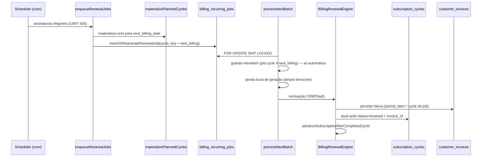
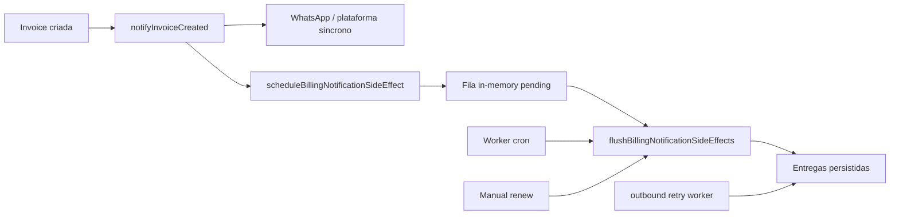

# Auditoria de Saúde Financeira — Billing Recorrente

**Sprint:** 5.0-24F (consolidação pós 24B–24E)  
**Data:** 2026-07-07  
**Objetivo:** Certificar que assinaturas e faturas recorrentes são geradas na **competência correta**, que **notificações** são disparadas de forma confiável, e que o **sistema financeiro** permanece auditável e auto-reparável.

**Escopo:** Backend (runtime, worker, scheduler, lifecycle), notificações, validação em GET, UI financeira (Aggregate + OCRE).  
**Fora de escopo:** Gateway de pagamento externo, contabilidade fiscal, migração de dados legados fora do domínio CRM.

---

## 1. Veredito executivo

| Dimensão | Status | Confiança |
|----------|--------|-----------|
| **Competência correta (automático)** | ✅ Saudável com ressalvas | Alta — desde que scheduler/worker ativos e `next_billing_date` coerente |
| **Competência correta (manual / retroativo)** | ✅ Certificado pós-24E | Alta — `cycle_id` determinístico + bypass de mismatch + INV-19/21 |
| **Notificações pós-fatura** | ✅ Saudável com ressalvas | Média-alta — depende de flush no worker/manual e retries outbound |
| **Consistência ciclo ↔ fatura ↔ job** | ✅ Reparável automaticamente | Alta após deploy 24C–24E; monitorar INV-19/21 em produção |
| **UI financeira** | ✅ Alinhada ao Aggregate + OCRE | Alta — Gerar/Abrir por `invoice_id`; alerta Corrigir (24D) |

**Conclusão:** O domínio está **operacionalmente saudável** para produção **desde que** os gates desta auditoria sejam executados periodicamente e os gaps residuais (§8) sejam conhecidos pelo time.

---

## 2. Modelo de domínio (referência permanente)

Adotado **Modelo B** ([ADR-001](ADR-001_BILLING_DOMAIN_INVARIANTS.md)):

```
Subscription (contrato + next_billing_date)
        ↓
subscription_cycle (competência = cycle_date)   ← SSOT do domínio
        ↓
customer_invoice (artefato)                     ← efeito da geração
        ↓
billing_recurring_jobs (veículo de execução)    ← 1 job por (subscription, cycle_key)
```

| Conceito | Papel | Não é |
|----------|-------|-------|
| `cycle_date` | Identidade da competência | Projeção de calendário |
| `next_billing_date` | Próximo ciclo **automático** | SSOT para Gerar manual |
| `cycle_id` (POST) | Alvo determinístico do Gerar | Substituto de OCRE em modo NEXT |
| `invoice_id` no ciclo | Prova de cobrança emitida | Opcional em estados `pending` |

**Regra de gerabilidade (domínio):**

> Primeiro `subscription_cycle` (ordem `cycle_date`, `id`) com `invoice_id IS NULL` e `status` ∈ {pending, queued, failed, skipped, cancelled}.

Implementações: OCRE (`src/lib/operationalCompetencyResolverCore.ts`), Aggregate, API `manual-renew` com `cycle_id`.

---

## 3. Invariantes críticos e enforcement

### 3.1 Invariantes de integridade (Sprint 24C–24E)

| ID | Regra | Enforcement | Gatilho de repair |
|----|-------|-------------|-------------------|
| **INV-19** | `status=invoiced` ⇒ `invoice_id` válido | `subscriptionCycleLifecycleService`, Materializer ON CONFLICT | GET assinatura, `manual-renew`, endpoint Corrigir |
| **INV-20** | Purge físico de fatura ⇒ ciclo `pending` | `reopenCyclesAfterInvoiceRemoved` em `customerInvoiceAdminService` | Delete invoice (purge) |
| **INV-21** | Ciclo aberto sem fatura não pode ter job `completed` bloqueando | `billingJobExecutionResetService` orquestrado pelo lifecycle | GET, manual-renew, Corrigir |

### 3.2 Invariantes estruturais (ADR-001)

| ID | Regra | Enforcement |
|----|-------|-------------|
| INV-01 | `(subscription_id, cycle_date)` único | UNIQUE DB + Materializer |
| INV-07 | Gerável = primeiro ciclo elegível sem invoice | OCRE + `resolveFirstEligibleCycle` |
| INV-09 | Apagar fatura permitido (com restrições) | Admin service + lifecycle |
| INV-10 | Auto-reparo parcial | `validateBillingRuntime` no GET |

### 3.3 Invariantes de execução manual retroativa (24E.1)

| Regra | Enforcement |
|-------|-------------|
| Job com `cycle_key` histórico ≠ `next_billing_date` **não** deve ser cancelado em execução manual | `processNextBatch`: bypass quando `manualExecution === true` |
| Não criar segundo job para mesmo `cycle_key` | `UNIQUE(subscription_id, cycle_key)` + reset/revive |

---

## 4. Geração no ciclo correto

### 4.1 Fluxo automático (scheduler → worker)



**Garantias automáticas:**

| Etapa | Garantia | Arquivo |
|-------|----------|---------|
| Enfileiramento | `cycle_key` derivado de `subscription.next_billing_date` canônico | `recurringBillingJobService.ts` |
| Materialização | INSERT apenas via Materializer; protege `invoiced` com invoice válida | `subscriptionCycleMaterializer.ts` |
| Execução | `resolveWorkerJobCycleStartYmd` prioriza `job.cycle_key` sobre subscription | `recurringBillingJobService.ts` |
| Pós-sucesso | `advanceSubscriptionAfterCompletedCycle` com `skippedAlreadyAhead` para ciclos históricos | `billingRecurringJobPersistence.ts` |
| Idempotência | Reuso de invoice existente para mesmo `period_start` | worker + engine |

**Riscos automáticos:**

- `next_billing_date` alterado entre enqueue e pickup → job cancelado (`cancelled_job_cycle_mismatch_after_reschedule`) + tentativa de re-enqueue.
- Janela de geração bloqueada → job requeued (`worker_requeue_outside_local_window`).
- Gap de competências se `next_billing_date` saltar meses sem materialização intermediária ([BILLING_CYCLE_GAP_ANALYSIS.md](BILLING_CYCLE_GAP_ANALYSIS.md)).

### 4.2 Fluxo manual (Gerar cobrança)

```
POST /api/crm-subscriptions/:id/manual-renew { cycle_id }
  1. repairInvoicedCyclesWithoutInvoice     → INV-19 + INV-21
  2. resolveCycleForManualGeneration        → OCRE SPECIFIC_CYCLE
  3. validateCycleForInvoiceGeneration      → status + invoice_id
  4. ensureJobForManualGenerate             → revive job órfão se necessário
  5. executeRenewalJobSynchronously         → manualExecution: true
  6. BillingRenewalEngine                   → fatura + advance
  7. flushBillingNotificationSideEffects    → notificações
  8. materializePlannedCycles(C+1)          → próxima competência
```

**Garantias manuais:**

| Cenário | Comportamento esperado | Sprint |
|---------|------------------------|--------|
| Ciclo `pending` sem fatura | Gera para `cycle_date` do `cycle_id` | 4.2D |
| Delete fatura + Gerar | Lifecycle reopen + job reset | 24C–24E |
| Ciclo histórico com `next_billing` à frente | Bypass mismatch guard | 24E.1 |
| Zombie `invoiced` + `invoice_id` null | Repair antes de validar | 24C |
| Job `completed` com fatura apagada | Reset para `pending` | 24E |

**Certificação de caso real (Jul/2026):**

- Assinatura `f585a448-…`, ciclo `65804762` (`2026-07-16`), `next_billing_date = 2026-10-01`
- Bloqueadores corrigidos: INV-21 (job stale), SQL `$3` em repair, mismatch bypass manual

### 4.3 OCRE — resolução de competência operacional

| Modo | Uso | Gerar permitido quando |
|------|-----|------------------------|
| `NEXT_GENERATE` | Próxima cobrança na sidebar | Primeiro ciclo elegível cronológico |
| `SPECIFIC_CYCLE` | Gerar em linha do histórico/calendário | `cycle_id` explícito + elegível |
| `HISTORY` / `CALENDAR` | Visualização | Gerar bloqueado se não for próxima operacional |

Fonte canônica compartilhada: `src/lib/operationalCompetencyResolverCore.ts` (backend re-export).

### 4.4 UI — visibilidade de ações (23F + 24D)

| Ação | Regra UI | Arquivo |
|------|----------|---------|
| **Gerar** | `invoice_id == null` e não `needsInvariantRepair` | `resolvedCompetencyPresentation.ts` |
| **Abrir** | `invoice_id != null` | idem |
| **Corrigir** | `cycleNeedsInvariantRepair` (INV-19) | `CycleInvariantRepairAction.tsx` |

**Nota:** UI usa `invoice_id` como SSOT de visibilidade; backend ainda valida `status` — seguro **após** repair automático (24C).

---

## 5. Camada de jobs (`billing_recurring_jobs`)

| Concern | Implementação | Saúde |
|---------|---------------|-------|
| Unicidade | `UNIQUE(subscription_id, cycle_key)` | ✅ |
| Job ativo duplicado | Guard `skipped_active_exists` | ✅ |
| Job completed bloqueando | INV-21 reset | ✅ pós-24E |
| Processing travado >30min | `validateBillingRuntime` → reset | ✅ |
| Scheduler vs worker | Scheduler só enfileira; worker só executa | ✅ |
| Heartbeat ops | `billing.recurring_scheduler` / `billing.recurring_worker` | ⚠️ monitorar |

**Estados terminais de job e significado operacional:**

| `completion_outcome` | Significado | Ação |
|----------------------|-------------|------|
| `completed` | Fatura emitida | Normal |
| `cancelled_job_cycle_mismatch_after_reschedule` | Job obsoleto vs `next_billing` | Automático: re-enqueue; Manual: bypass 24E.1 |
| `cancelled_subscription_not_active` | Assinatura pausada/cancelada | Resolver status assinatura |
| `failed` (max attempts) | Erro de engine/gateway | Reprocessar / Corrigir ciclo |

---

## 6. Notificações

### 6.1 Pipeline



### 6.2 Pontos de flush (obrigatórios)

| Contexto | Flush | Arquivo |
|----------|-------|---------|
| Worker automático | ✅ Após cada batch | `runRecurringWorker.ts` |
| Renovação manual síncrona | ✅ Antes de responder HTTP | `billingManualRenewalService.ts` |
| Recovery batch | ✅ Replay faturas sem notificação | `billingRecoveryService.ts` |

### 6.3 Critérios de sucesso

| Canal | Evidência |
|-------|-----------|
| In-app / plataforma | Registro em `platform_notification_deliveries` |
| WhatsApp | Trace `NOTIFICATION_*` + provider response |
| Manual response | Campo `notification_sent` + `BILLING_NOTIFY_FLUSH` no log |

### 6.4 Riscos de notificação

| Risco | Mitigação |
|-------|-----------|
| Processo crash antes do flush | Próximo worker run drena fila; recovery replay |
| Side-effect rejeitado | Log `[BILLING_NOTIFY_FLUSH] rejected > 0` |
| Digest due/overdue | `notificationInvoiceDigestWorker` (separado de invoice_created) |

---

## 7. Validação e auto-reparo em runtime

### 7.1 `validateBillingRuntime` (GET `/api/crm-subscriptions/:id`)

Executado em cada leitura de detalhe da assinatura (`crmSubscriptionsService.ts`).

| Passo | Ação |
|-------|------|
| 1 | `repairRecoverableSubscriptionCycles` — INV-19, failed→pending (≥ hoje), jobs failed |
| 2 | Reset jobs `processing` travados |
| 3 | Provisionar billing plan ausente |
| 4 | `auditCycleConsistency` — persiste JSON em `storage/debug/billing-runtime/` |

**Não faz (por design atual):**

- INSERT de competências gap em GET passivo (ADR-002 visão futura)
- Repair de cancelamento de fatura sem purge físico

### 7.2 Endpoint manual de repair

`POST /api/crm-subscriptions/:id/repair-cycle-invariants`  
Retorna: `cycles_reopened`, `jobs_reset`, `cycle_ids`.

### 7.3 Scripts de certificação

```bash
npm run billing:production-validation
npm run billing:production-cert
npm run test:billing
npm run billing:pipeline-cert
```

Artefatos: `storage/debug/billing-production/`, `storage/debug/billing-certification-lab/`.

---

## 8. Gaps residuais e riscos conhecidos

| # | Risco | Severidade | Mitigação atual | Ação futura sugerida |
|---|-------|------------|-----------------|----------------------|
| R1 | Cancelar fatura (sem delete) mantém ciclo `invoiced` + `invoice_id` | Média | Operador deve usar delete ou Corrigir após purge | Lifecycle no PATCH cancel |
| R2 | `validateCycleForInvoiceGeneration` usa `status` além de `invoice_id` | Baixa* | Pre-repair em manual-renew | Unificar regra: `invoice_id` SSOT |
| R3 | Ciclos `cancelled` por mismatch após falha manual | Baixa | Status ainda gerável; novo Gerar funciona | Reopen `cancelled`→`pending` no repair |
| R4 | Lacunas de competência no histórico (next saltou) | Baixa (produto) | Projeção UX vs DB documentado | Materialização eager (ADR-002) |
| R5 | `billingRecoveryService.heal_orphan_cycles` não orquestra INV-21 | Baixa | Lifecycle no GET cobre caso comum | Unificar recovery com lifecycle |
| R6 | Notificação atrasada se flush falhar | Baixa | Worker periódico + retry outbound | Alerta ops em `rejected > 0` |

\* Baixa **com** deploy 24C–24E ativo; média se repair for bypassado (SQL direto).

---

## 9. Queries SQL de saúde (produção)

Executar semanalmente ou pós-deploy. **Meta: 0 linhas** nas queries 9.1 e 9.2.

### 9.1 INV-19 — Zombies `invoiced` sem fatura

```sql
SELECT tenant_id, subscription_id, id, cycle_date, status, invoice_id, job_id, updated_at
FROM subscription_cycles
WHERE status = 'invoiced' AND invoice_id IS NULL
ORDER BY updated_at DESC
LIMIT 100;
```

### 9.2 INV-21 — Ciclo aberto + job terminal bloqueando

```sql
SELECT sc.tenant_id, sc.subscription_id, sc.cycle_date, sc.status AS cycle_status,
       br.id AS job_id, br.status AS job_status, br.cycle_key,
       br.result_invoice_id, br.completion_outcome, ci.status AS invoice_status
FROM subscription_cycles sc
JOIN billing_recurring_jobs br
  ON br.subscription_id = sc.subscription_id
 AND br.tenant_id = sc.tenant_id
 AND left(br.cycle_key, 10) = sc.cycle_date::text
WHERE sc.invoice_id IS NULL
  AND sc.status IN ('pending','queued','failed','skipped','cancelled')
  AND br.status IN ('completed','failed','cancelled')
  AND (
    br.result_invoice_id IS NULL
    OR NOT EXISTS (
      SELECT 1 FROM customer_invoices ci
      WHERE ci.id = br.result_invoice_id
        AND ci.status NOT IN ('cancelled','refunded')
    )
  )
ORDER BY sc.updated_at DESC
LIMIT 100;
```

### 9.3 Drift `next_billing_date` vs menor ciclo aberto

```sql
SELECT s.id, s.tenant_id, s.next_billing_date,
       MIN(sc.cycle_date) FILTER (
         WHERE sc.invoice_id IS NULL
           AND sc.status IN ('pending','queued','failed','skipped','cancelled')
       ) AS earliest_open_cycle
FROM subscriptions s
LEFT JOIN subscription_cycles sc ON sc.subscription_id = s.id
WHERE s.type = 'customer' AND s.status = 'active'
GROUP BY s.id, s.tenant_id, s.next_billing_date
HAVING MIN(sc.cycle_date) FILTER (
         WHERE sc.invoice_id IS NULL
           AND sc.status IN ('pending','queued','failed','skipped','cancelled')
       ) < s.next_billing_date::date
LIMIT 50;
```

### 9.4 Jobs travados em processing

```sql
SELECT id, tenant_id, subscription_id, cycle_key, status, locked_at, locked_by, updated_at
FROM billing_recurring_jobs
WHERE status = 'processing'
  AND locked_at < now() - interval '30 minutes'
ORDER BY locked_at
LIMIT 50;
```

### 9.5 Faturas ativas sem ciclo vinculado

```sql
SELECT ci.id, ci.tenant_id, ci.subscription_id, ci.invoice_number,
       ci.period_start, ci.status, ci.created_at
FROM customer_invoices ci
WHERE ci.subscription_id IS NOT NULL
  AND ci.status NOT IN ('cancelled','refunded')
  AND NOT EXISTS (
    SELECT 1 FROM subscription_cycles sc WHERE sc.invoice_id = ci.id
  )
ORDER BY ci.created_at DESC
LIMIT 100;
```

### 9.6 Notificações ausentes (48h)

```sql
SELECT ci.id, ci.tenant_id, ci.invoice_number, ci.created_at
FROM customer_invoices ci
WHERE ci.created_at > now() - interval '48 hours'
  AND ci.status IN ('pending','waiting_payment','paid')
  AND NOT EXISTS (
    SELECT 1 FROM platform_notification_deliveries pnd
    WHERE pnd.entity_type = 'customer_invoice'
      AND pnd.entity_id = ci.id::text
      AND pnd.status IN ('sent','delivered','queued')
  )
LIMIT 50;
```

### 9.7 Fila de jobs (7 dias)

```sql
SELECT status, completion_outcome, count(*) AS n
FROM billing_recurring_jobs
WHERE updated_at > now() - interval '7 days'
GROUP BY status, completion_outcome
ORDER BY n DESC;
```

---

## 10. Checklist de certificação operacional

### 10.1 Gate de deploy (obrigatório)

- [ ] `npm run billing:production-validation` → `PRODUCTION READY`
- [ ] `billing_health_score >= 99`
- [ ] `npm run test:billing` → verde (certification + regressions)
- [ ] Queries §9.1 e §9.2 = **0 linhas** em staging/produção
- [ ] Heartbeats scheduler + worker < 5 min (`billing_ops` / logs)

### 10.2 Ciclo correto — cenários de aceite

| # | Cenário | Resultado esperado |
|---|---------|-------------------|
| C1 | Assinatura ativa, scheduler rodando | Job `pending` com `cycle_key = next_billing_date` |
| C2 | Worker dentro da janela | Fatura `period_start = cycle_key` do job; ciclo `invoiced` |
| C3 | Gerar em ciclo histórico (`cycle_id`) | Fatura na data do ciclo; `next_billing_date` não regride |
| C4 | Delete fatura + Gerar | Ciclo `pending`; job resetado; nova fatura |
| C5 | Ciclo com fatura ativa | Gerar bloqueado; Abrir disponível |
| C6 | Jul sem fatura + Ago com fatura | Gerar Jul permitido (gap retroativo) |

### 10.3 Notificações — cenários de aceite

| # | Cenário | Resultado esperado |
|---|---------|-------------------|
| N1 | Gerar manual com sucesso | `notification_sent: true` OU delivery em DB |
| N2 | Worker batch com invoice nova | Log `BILLING_NOTIFY_FLUSH` com `fulfilled >= 1` |
| N3 | Recovery replay | Faturas sem delivery recebem notificação |

### 10.4 Saúde financeira UI

| # | Verificação |
|---|-------------|
| U1 | Histórico, calendário e sidebar usam mesmo `cycles_raw` (Aggregate) |
| U2 | Gerar só em competências sem `invoice_id` |
| U3 | ⚠️ Corrigir visível em INV-19 violado |
| U4 | Após Gerar bem-sucedido, refresh mostra fatura no ciclo correto |

---

## 11. Cobertura de testes

| Área | Testes principais |
|------|-------------------|
| Lifecycle INV-19/20/21 | `subscriptionCycleLifecycleService.test.ts`, `billingJobExecutionResetService.test.ts` |
| Geração manual | `billingCycleInvoiceGenerationService.test.ts`, `billingManualRenewalExecution.test.ts` |
| Materializer | `subscriptionCycleMaterializer.test.ts` |
| OCRE | `operationalCompetencyResolver.test.ts`, `src/lib/*` |
| Worker advance | `recurringBillingJobService.advance.test.ts` |
| Notificações | `billingNotificationFlush.test.ts` |
| UI visibilidade | `subscriptionBillingVisibility.test.ts`, `subscriptionBillingGeneration.test.ts` |
| Golden / regressão | `tests/billing/certification/`, `tests/billing/regressions/` |

**Lacuna conhecida:** E2E integrado cancel-without-delete → regenerate (R1).

---

## 12. Mapa de ownership (onde corrigir cada classe de problema)

| Sintoma | Owner primário | Ação |
|---------|----------------|------|
| Ciclo `invoiced` sem fatura | `subscriptionCycleLifecycleService` | Corrigir / GET repair |
| Job completed bloqueando | `billingJobExecutionResetService` | INV-21 repair |
| Gerar retroativo cancelado | `recurringBillingJobService` (manual bypass) | Já corrigido 24E.1 |
| Fatura no mês errado (automático) | Scheduler + `next_billing_date` | Auditar subscription + job `cycle_key` |
| Notificação não enviada | `billingNotificationFlush` + recovery | Verificar flush logs + query §9.6 |
| UI mostra Gerar errado | `resolvedCompetencyPresentation` + OCRE | `invoice_id` + `needsInvariantRepair` |

---

## 13. Referências

| Documento | Conteúdo |
|-----------|----------|
| [ADR-001](ADR-001_BILLING_DOMAIN_INVARIANTS.md) | Modelo B, invariantes permanentes |
| [ADR-002](ADR-002_SUBSCRIPTION_CYCLE_MATERIALIZATION_POLICY.md) | Política de materialização |
| [SPRINT_5.0-24B](SPRINT_5.0-24B_RETROACTIVE_INVOICE_GENERATION_REPORT.md) | Investigação regeneração retroativa |
| [SPRINT_5.0-24C](SPRINT_5.0-24C_CYCLE_INVARIANT_LIFECYCLE.md) | INV-19/20 |
| [SPRINT_5.0-24D](SPRINT_5.0-24D_INVARIANT_REPAIR_UX_CERTIFICATION.md) | UX Corrigir |
| [SPRINT_5.0-24E](SPRINT_5.0-24E_JOB_EXECUTION_RESET.md) | INV-21 + bypass manual |
| [BILLING_DEPLOY_CHECKLIST.md](BILLING_DEPLOY_CHECKLIST.md) | Gate de produção |
| [BILLING_JOB_CANCELLATION_ANALYSIS.md](BILLING_JOB_CANCELLATION_ANALYSIS.md) | Mismatch guard |
| [BILLING_CERTIFICATION_SUITE.md](BILLING_CERTIFICATION_SUITE.md) | Golden dataset |

---

## 14. Sign-off

| Papel | Critério | Data |
|-------|----------|------|
| Engenharia | Testes + queries §9.1–9.2 zeradas em staging | |
| Ops | Scheduler/worker heartbeats + production-validation OK | |
| Produto | Cenários C1–C6 e N1–N3 validados manualmente | |

**Próxima revisão recomendada:** após qualquer mudança em worker, lifecycle ou fluxo de delete/cancel de fatura.
