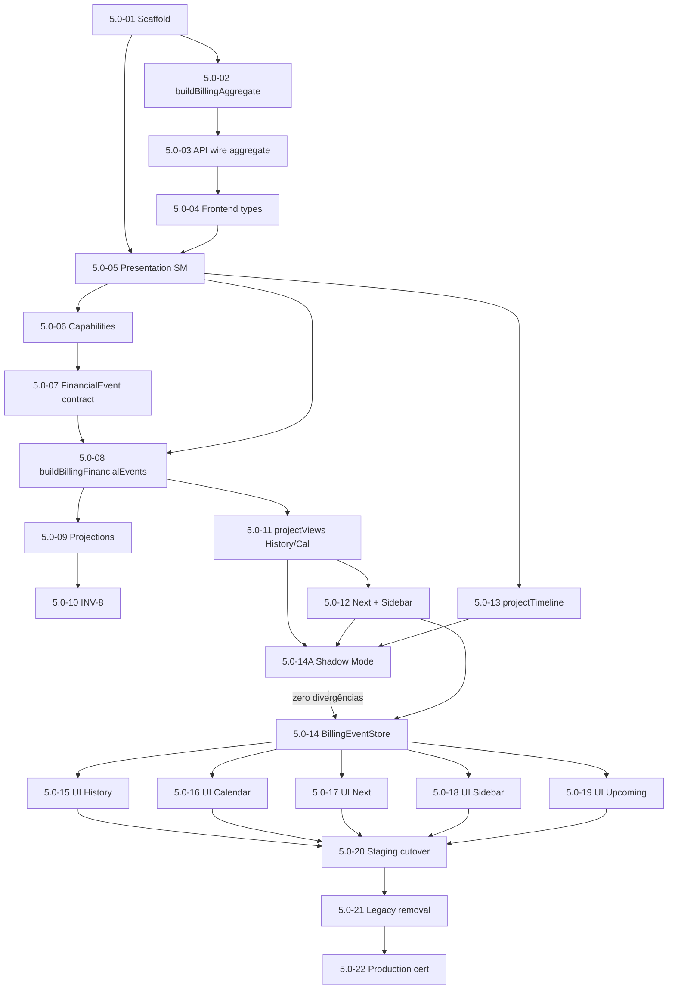
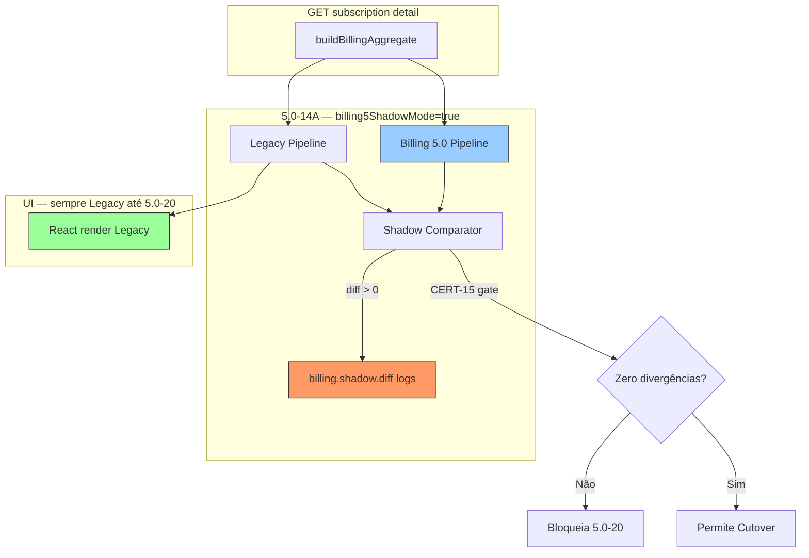

# Billing 5.0 — Implementation Roadmap (Sprint 4.2S + Addendum 4.2S-A)

**Mode:** IMPLEMENTATION PLANNING — nenhum código alterado  
**Date:** 2026-07-03 (atualizado: Addendum arquitetural)  
**Fonte única:** [BILLING_ARCHITECTURE_SPECIFICATION.md](./BILLING_ARCHITECTURE_SPECIFICATION.md) (Constituição 4.2R — ARCHITECTURE FREEZE)

**Objetivo:** Decompor a Billing 5.0 em sprints pequenas, independentes, testáveis, com rollback seguro e sistema sempre compilando em produção.

**Estratégia global de migração:**

1. **Aggregate antes da API** — `buildBillingAggregate` define o contrato; a API apenas serializa o aggregate (Addendum CHANGE_01).
2. **Mudanças aditivas** — novos módulos paralelos; flags `billing5ShadowMode` e `billing5Presentation`.
3. **Shadow Mode antes do Cutover** — pipeline legado e 5.0 rodam em paralelo; UI inalterada; 100% equivalência obrigatória (Addendum CHANGE_02).
4. **Paridade antes de corte** — fixtures forenses 4.2L + relatório Shadow sem divergências.
5. **Runtime Engine intocado** — worker, scheduler, engine e banco **não** entram no escopo deste roadmap.
6. **Rollback** — desligar flags reverte ao legado sem migração DB.

**Convenção de IDs:** sprints `5.0-01` … `5.0-22` + sprint especial `5.0-14A` (Shadow Mode). Complexidade: **S** (<1d), **M** (1–3d), **L** (3–5d), **XL** (>5d).

---

## Roadmap Improvements (Addendum 4.2S-A)

### CHANGE_01 — Aggregate before API

| Antes | Depois |
|-------|--------|
| 5.0-01 Scaffold → **5.0-02 API** → **5.0-03 Aggregate** | 5.0-01 Scaffold → **5.0-02 `buildBillingAggregate`** → **5.0-03 API baseada no Aggregate** |

**Justificativa:** O Aggregate é o contrato canônico da camada de apresentação (Constituição P4, P5). A API deve expor esse contrato — não defini-lo. Evita retrabalho se o shape do aggregate evoluir durante a implementação.

**Escopo inalterado:** Runtime, Scheduler, Worker, Engine e Banco permanecem intocados.

### CHANGE_02 — Shadow Mode (5.0-14A)

Nova sprint **entre a conclusão das Views (5.0-13) e o Cutover (5.0-20)**.

| Regra | Descrição |
|-------|-----------|
| Execução | Legacy + Billing 5.0 pipeline em paralelo por request |
| UI | **Inalterada** — usuário sempre vê Legacy |
| Diferenças | Apenas logs estruturados (`billing.shadow.diff`) |
| Flag | `billing5ShadowMode` — ativar/desativar independente de `billing5Presentation` |
| Gate Cutover | **Zero divergências** reportadas em staging antes de 5.0-20 |

**Dimensões comparadas:** Calendar, History, Next Charge, Sidebar, FinancialEvents, `canGenerate`, `supportsGenerate`, `cycleId`, `invoiceId`, quantidade de linhas, ordenação, valores, estados de apresentação.

**Aceite:** 100% equivalência Legacy ↔ Aggregate nas dimensões acima. Qualquer divergência **bloqueia** 5.0-20.

---

## Tabela 1 — Roadmap completo

| ID | Título | Fase | Depende de | Complexidade |
|----|--------|------|------------|--------------|
| 5.0-01 | Scaffold `packages/billing-presentation` + constantes compartilhadas | Fundação | — | S |
| 5.0-02 | `buildBillingAggregate` (backend — contrato canônico) | Aggregate | 5.0-01 | M |
| 5.0-03 | API baseada no Aggregate (`invoices[]`, `lifecycle_events[]`, wire) | Aggregate | 5.0-02 | M |
| 5.0-04 | Tipos frontend + adapter aggregate imutável | Aggregate | 5.0-03 | S |
| 5.0-05 | `BillingPresentationStateMachine` + testes paridade | Presentation | 5.0-01, 5.0-04 | L |
| 5.0-06 | `deriveBillingCapabilities` + `resolveFinancialEventTypes` | Presentation | 5.0-05 | M |
| 5.0-07 | Contrato `FinancialEvent` 5.0 (capabilities embedded) | Events | 5.0-06 | S |
| 5.0-08 | `buildBillingFinancialEvents` (flag off, paralelo) | Events | 5.0-05, 5.0-07 | L |
| 5.0-09 | `buildBillingProjections` unificado no pipeline | Events | 5.0-08 | M |
| 5.0-10 | Invariante INV-8: todo ciclo → ≥1 evento real | Events | 5.0-08 | M |
| 5.0-11 | `projectBillingViews` — HistoryRow + CalendarEvent | Views | 5.0-08 | M |
| 5.0-12 | `projectNextInvoice` + `projectSidebar` | Views | 5.0-11 | M |
| 5.0-13 | `projectTimeline` (apresentação) | Views | 5.0-05 | M |
| **5.0-14A** | **Shadow Mode — Legacy vs 5.0 em paralelo (UI inalterada)** | **Validação** | **5.0-11, 5.0-12, 5.0-13** | **L** |
| 5.0-14 | `BillingEventStore` — cache-only + Provider único | Store | 5.0-11, 5.0-14A green | M |
| 5.0-15 | UI History — render `capabilities` only | UI | 5.0-14, flag | S |
| 5.0-16 | UI Calendar + Popover — render `capabilities` | UI | 5.0-14, flag | M |
| 5.0-17 | UI NextInvoice — `NextInvoicePresentation` | UI | 5.0-12, 5.0-14, flag | S |
| 5.0-18 | UI Sidebar — `SidebarPresentation` | UI | 5.0-12, 5.0-14, flag | M |
| 5.0-19 | UI Upcoming + Renewal (diagnóstico only) | UI | 5.0-14, flag | S |
| 5.0-20 | Flag ON default staging — paridade 4.2L + Shadow green | Cutover | 5.0-14A green, 5.0-15–19 | M |
| 5.0-21 | Remoção legado (normalize, timeline decisor, helpers) | Cleanup | 5.0-20 | L |
| 5.0-22 | Certificação Billing 5.0 + flag ON produção | Certificação | 5.0-21 | M |

---

## Tabela 2 — Dependências entre sprints



| Sprint | Bloqueia |
|--------|----------|
| 5.0-02 | API wire (5.0-03), pipeline frontend (via 5.0-03→04) |
| 5.0-05 | Event builder (precisa presentation state) |
| 5.0-08 | Views, Shadow, Store, UI |
| 5.0-14A | **Cutover** — obrigatório 100% equivalência |
| 5.0-14 | Todas UIs financeiras |
| 5.0-20 | Cleanup e produção |

**Caminho crítico:** `01 → 02 → 03 → 04 → 05 → 06 → 08 → 11 → 12 → 13 → **14A** → 14 → 15–19 → 20 → 21 → 22`

---

## Tabela 3 — Riscos por sprint

| Sprint | Risco | Mitigação |
|--------|-------|-----------|
| 5.0-02 | Shape aggregate incompleto bloqueia API | Tipos da constituição §6.1 como checklist antes de merge |
| 5.0-03 | Payload maior / serialização | Limitar invoices (ex. 120); gzip HTTP; serializar saída de `buildBillingAggregate` |
| 5.0-05 | Legacy false-cancel behavior | Fixture `legacyCancelledCycleRecovery`; decisão produto documentada |
| 5.0-08 | Regressão tipos de evento | Suite paridade `subscriptionFinancialEventBuilder.test.ts` |
| 5.0-10 | Ciclos “silenciosos” sem UI | Log estruturado + invariante test |
| 5.0-12 | Alertas sidebar diferentes | Cenários 4.2L billing_missing, overdue, gateway |
| 5.0-14A | Shadow passa com diffs não críticos ignorados | CI falha em qualquer diff; relatório obrigatório |
| 5.0-14 | Re-render excessivo | Signature baseada em aggregate hash, não timeline |
| 5.0-20 | Cutover sem Shadow green | Gate hard: 5.0-20 bloqueado se CERT-15 falhar |
| 5.0-21 | Remoção prematura | Só após 5.0-20 estável em staging ≥1 semana |
| 5.0-22 | Rollout produção | Flag per-tenant; rollback < 5 min |

---

## Tabela 4 — Rollback por sprint

| Sprint | Mecanismo de rollback |
|--------|----------------------|
| 5.0-01 | Deletar pacote; sem wire |
| 5.0-02 | `getCrmSubscriptionDetail` legado permanece; flag `useBillingAggregateBuilder=false` |
| 5.0-03 | Controller volta a serializar legado sem `invoices[]`; campos novos opcionais |
| 5.0-04 | Tipos opcionais `invoices?`; adapter no-op |
| 5.0-05–06 | Módulo novo não importado em produção |
| 5.0-07–10 | `billing5Presentation=false` → `buildFinancialEvents` legado |
| 5.0-11–13 | Views legadas no store antigo |
| 5.0-14A | `billing5ShadowMode=false` — zero impacto UI |
| 5.0-14 | Provider dual: `createFinancialEventStore` legado se flag off |
| 5.0-15–19 | Flag off → componentes legados inalterados |
| 5.0-20 | `billing5Presentation=false` em staging |
| 5.0-21 | **Não reversível por flag** — só após 5.0-20 estável; manter branch/tag pré-cleanup |
| 5.0-22 | Flag off em produção |

**Regra:** até 5.0-20 inclusive, **todo rollback = desligar flag** (`billing5ShadowMode` e/ou `billing5Presentation`), zero migração DB.

---

## Tabela 5 — Critérios de certificação (global Billing 5.0)

Referência constituição §12 + checklist C1–C14.

| ID | Critério | Verificação |
|----|----------|-------------|
| CERT-1 | Um `buildBillingAggregate` | grep + review |
| CERT-2 | `invoices[]` no wire | contract test API |
| CERT-3 | Um Presentation SM | zero decisores legados |
| CERT-4 | Um `buildBillingFinancialEvents` | grep |
| CERT-5 | INV-8 ciclo→evento | teste automatizado |
| CERT-6 | INV-9 supports === canGenerate | teste automatizado |
| CERT-7 | Zero `cycleSupportsManualGenerate` em `.tsx` | CI grep |
| CERT-8 | Zero `resolveInvoiceCapabilities` em `.tsx` | CI grep |
| CERT-9 | Zero `buildFinancialAlerts(detail)` | CI grep |
| CERT-10 | Zero `normalizeDetailForBillingStateMachine` | CI grep |
| CERT-11 | Provider único EventStore | code review |
| CERT-12 | Paridade cenários 4.2L | suite dedicada |
| CERT-13 | Runtime engine testes verdes | CI backend |
| CERT-14 | Timeline só `projectTimeline` | grep builders |
| CERT-15 | Shadow Mode 100% equivalência staging | relatório `billing.shadow.diff` = 0 |

**Sprint 5.0-22** só fecha quando CERT-1 a CERT-15 passam em staging e produção (flag on).

**Gate Cutover (5.0-20):** CERT-15 obrigatório — **zero divergências** Shadow antes de ligar `billing5Presentation`.

---

## Detalhamento por sprint

---

### 5.0-01 — Scaffold `packages/billing-presentation`

**Objetivo:** Criar pacote compartilhado com tipos e constantes da constituição sem alterar comportamento.

**Escopo:**
- Novo pacote `packages/billing-presentation/` (ou `src/lib/billing5/` se monorepo não suportar).
- Exportar `GENERATABLE_CYCLE_STATUSES`, tipos stub `BillingCapabilities`, `BillingCyclePresentationState`.
- Feature flag stub `billing5Presentation` (env ou tenant config, default `false`).

**Arquivos impactados:**
- `packages/billing-presentation/package.json`, `index.ts`, `constants.ts`, `types.ts`
- `package.json` root workspaces (se aplicável)

**Arquitetura afetada:** Nenhuma em runtime — preparação INV-1 a INV-3.

**Entrada:** Constituição 4.2R aprovada.

**Saída:** Pacote compila; zero imports em produção ainda.

**Testes:** Unit smoke do pacote; CI build verde.

**Rollback:** Remover pacote do workspace.

**Riscos:** Baixo — código morto até 5.0-05.

**Complexidade:** S

---

### 5.0-02 — `buildBillingAggregate` (backend — contrato canônico)

**Objetivo:** Implementar o **único Aggregate Builder** (INV-1, P5) **antes** de expor campos na API. O aggregate é a fonte de verdade; a API será apenas serialização (CHANGE_01).

**Escopo:**
- Criar `buildBillingAggregate(tenantId, subscriptionId)` retornando tipo interno alinhado a `CrmSubscriptionDetailPayload` §6.1.
- Incluir `cycles_raw`, `invoices[]`, `recent_jobs`, `lifecycle_events[]`, `subscription`, `stats`, `tenant_billing`, `built_at`.
- `timeline` **opcional** no retorno (derivável depois via `projectTimeline`); não é input de decisão.
- `getCrmSubscriptionDetail` delega a `buildBillingAggregate` atrás de flag `useBillingAggregateBuilder` (default false até 5.0-03).
- **Não alterar** wire HTTP nesta sprint — aggregate consumido por testes backend e preparação 5.0-03.

**Arquivos impactados:**
- `packages/backend/src/billingPresentation/buildBillingAggregate.ts` (novo)
- `packages/billing-presentation/aggregateTypes.ts` (tipos compartilhados)
- `crmSubscriptionsService.ts` — hook delegação (flag off em produção)
- Testes backend integração

**Arquitetura afetada:** Aggregate Builder (Constituição §5, Tabela 5).

**Entrada:** 5.0-01.

**Saída:** Função `buildBillingAggregate` exportada; testes unitários/integração com fixtures DB; paridade lógica com dados hoje embutidos em `buildSubscriptionTimeline`.

**Testes:** Aggregate contém `invoices.length === invRows.length`; cada `cycle.invoice_id` resolvível em `invoices[]`.

**Rollback:** `useBillingAggregateBuilder=false`; deletar módulo se necessário.

**Riscos:** Shape incompleto — mitigar com checklist §6.1 da constituição.

**Complexidade:** M

---

### 5.0-03 — API baseada no Aggregate

**Objetivo:** `GET /api/crm-subscriptions/:id` serializa a saída de `buildBillingAggregate` — API fina sobre o contrato canônico (CHANGE_01).

**Escopo:**
- Controller chama `buildBillingAggregate` → `res.json({ ...aggregate, meta })`.
- Expor `invoices[]`, `lifecycle_events[]`, `built_at` no wire.
- Manter `timeline` no wire para compatibilidade (gerada pelo builder ou legado até 5.0-13).
- Flag `useBillingAggregateBuilder=true` em staging.

**Arquivos impactados:**
- `packages/backend/src/controllers/crmSubscriptionsController.ts`
- `crmSubscriptionsService.ts`
- `src/services/crmSubscriptions.ts` (tipos `invoices?`, `lifecycle_events?`)

**Arquitetura afetada:** Aggregate transport (P4); fecha gap 4.2Q.

**Entrada:** 5.0-02.

**Saída:** API retorna aggregate serializado; clientes antigos ignoram campos novos; contrato test snapshot.

**Testes:** Contract test API; response ⊆ shape `CrmSubscriptionDetailPayload` §6.1.

**Rollback:** Controller volta ao serializer legado; campos novos omitidos.

**Riscos:** Tamanho payload — limitar `invoices` (ex. 120).

**Complexidade:** M

---

### 5.0-04 — Tipos frontend + aggregate imutável

**Objetivo:** Frontend reconhece aggregate completo; proibir mutação documentada.

**Escopo:**
- Atualizar `CrmSubscriptionDetailPayload` com `invoices`, `lifecycle_events`, `built_at`.
- Helper `assertImmutableAggregate(detail)` em dev only.
- ESLint rule opcional: no spread mutation of detail.timeline.

**Arquivos impactados:**
- `src/services/crmSubscriptions.ts`
- Test fixtures (`subscriptionFinancialEventBuilder.test.ts`, etc.)

**Arquitetura afetada:** Aggregate (P4).

**Entrada:** 5.0-03.

**Saída:** Typecheck verde; fixtures atualizados com `invoices[]`.

**Testes:** `tsc --noEmit`; fixtures compilam.

**Rollback:** Campos opcionais `?` mantêm compat.

**Riscos:** Muitos test fixtures — batch update.

**Complexidade:** S

---

### 5.0-05 — `BillingPresentationStateMachine`

**Objetivo:** Implementar `resolveBillingCyclePresentation` único (INV-2, P6).

**Escopo:**
- Consolidar lógica de `resolveOperationalState` + `resolveBillingCycleState` (backend + frontend) no pacote compartilhado.
- Testes paridade com `legacyCancelledCycleRecovery.test.ts`, `billingStateMachine.test.ts`.

**Arquivos impactados:**
- `packages/billing-presentation/BillingPresentationStateMachine.ts`
- `packages/backend/src/services/subscriptionTimelineUx.ts` — eventual delegação (read-only wrap, sprint posterior)
- `src/lib/billingStateMachine.ts` — marcar deprecated

**Arquitetura afetada:** Presentation SM (§8.2).

**Entrada:** 5.0-01, 5.0-04.

**Saída:** SM exportado; paridade ≥95% fixtures forenses; **não** wired em UI.

**Testes:** Novo `BillingPresentationStateMachine.test.ts` espelhando casos 4.2N.

**Rollback:** Módulo não importado.

**Riscos:** Alto — semântica false-cancel; exigir sign-off produto.

**Complexidade:** L

---

### 5.0-06 — `deriveBillingCapabilities` + `resolveFinancialEventTypes`

**Objetivo:** Únicas funções de Generate e EventType (INV-4, INV-5, INV-6).

**Escopo:**
- `deriveBillingCapabilities(ctx)` — regra GENERATABLE da constituição §6.3.
- `resolveFinancialEventTypes(presentation)` — mapeia estados → tipos (substitui ramos `emitEventsForCycleRow`).
- `supportsGenerate === canGenerate` para `kind:'real'`.

**Arquivos impactados:**
- `packages/billing-presentation/deriveBillingCapabilities.ts`
- `packages/billing-presentation/resolveFinancialEventTypes.ts`

**Arquitetura afetada:** Capabilities (P12–P16).

**Entrada:** 5.0-05.

**Saída:** Testes unitários cobrindo 4.2L gate families unificadas.

**Testes:** Tabela cenários 4.2L (recoverable failed, projected, cancelled, etc.).

**Rollback:** Módulo isolado.

**Riscos:** Médio — divergência com `invoiceCapabilities` legado até UI sprint.

**Complexidade:** M

---

### 5.0-07 — Contrato `FinancialEvent` 5.0

**Objetivo:** Tipo oficial com `capabilities` e `presentationState` embedded (§6.2).

**Escopo:**
- Estender `src/lib/financialEventTypes.ts` ou mover para `billing-presentation`.
- Manter compat: campos novos opcionais até 5.0-08.

**Arquivos impactados:**
- `packages/billing-presentation/financialEventTypes.ts`
- `src/lib/financialEventTypes.ts` — re-export

**Arquitetura afetada:** FinancialEvent (P8).

**Entrada:** 5.0-06.

**Saída:** Tipos publicados; testes tipo-only.

**Testes:** Type tests / zod schema opcional.

**Rollback:** Campos opcionais.

**Riscos:** Baixo.

**Complexidade:** S

---

### 5.0-08 — `buildBillingFinancialEvents` (paralelo, flag off)

**Objetivo:** Pipeline único de eventos reais (INV-3, P7); roda em paralelo ao legado.

**Escopo:**
- `buildBillingFinancialEvents(aggregate, today)` usando SM + capabilities.
- **Não** usa `timelineRowForCycle` nem `normalizeDetailForBillingStateMachine`.
- Join cycle → invoice via `aggregate.invoices[]`.
- Feature flag escolhe builder no store.

**Arquivos impactados:**
- `packages/billing-presentation/buildBillingFinancialEvents.ts`
- `src/lib/subscriptionFinancialEventBuilder.ts` — wrapper com flag
- `subscriptionFinancialEventStore.ts` — branch flag

**Arquitetura afetada:** Event layer (§5).

**Entrada:** 5.0-05, 5.0-06, 5.0-07.

**Saída:** Paridade test suite: mesmo número de eventos ± tolerância documentada por ciclo legado.

**Testes:** `billing5Parity.test.ts` comparando legado vs 5.0.

**Rollback:** `billing5Presentation=false`.

**Riscos:** Alto — core do bug 4.2M; exigir paridade antes de 5.0-15.

**Complexidade:** L

---

### 5.0-09 — `buildBillingProjections` unificado

**Objetivo:** Submodule oficial de projeção dentro do FinancialEvent Builder (P11).

**Escopo:**
- Mover lógica de `subscriptionFinancialProjection.ts` para `buildBillingProjections`.
- Chamado apenas de dentro de `buildBillingFinancialEvents`.
- INV-12: `cycleId: null` sempre.

**Arquivos impactados:**
- `packages/billing-presentation/buildBillingProjections.ts`
- `src/lib/subscriptionFinancialProjection.ts` — deprecar

**Arquitetura afetada:** Projection (§9.5).

**Entrada:** 5.0-08.

**Saída:** Projeções idênticas ao 4.2H em fixtures.

**Testes:** `subscriptionFinancialProjection.test.ts` migrado.

**Rollback:** Flag off usa merge legado.

**Riscos:** Baixo — UX only.

**Complexidade:** M

---

### 5.0-10 — Invariante INV-8

**Objetivo:** Garantir todo `cycles_raw[].id` (sub ativa) produz ≥1 `FinancialEvent` real.

**Escopo:**
- Pós-processador ou assert em dev: `assertCycleEventCoverage(aggregate, events)`.
- Tratar invoice_only órfãos via `emitOrphanInvoiceEvents` se necessário (constituição §6).

**Arquivos impactados:**
- `packages/billing-presentation/invariants.ts`
- `buildBillingFinancialEvents.ts`

**Arquitetura afetada:** INV-8.

**Entrada:** 5.0-08.

**Saída:** Teste falha se ciclo sem evento; log em staging.

**Testes:** Fixture cada status de ciclo.

**Rollback:** Assert só em staging/dev.

**Riscos:** Médio — ciclos edge podem exigir novo event type `cycle_placeholder` — escalar à arquitetura se necessário.

**Complexidade:** M

---

### 5.0-11 — `projectBillingViews` (History + Calendar)

**Objetivo:** Views sem recálculo de capabilities (P13, P14).

**Escopo:**
- `projectHistoryRows(events, today)`
- `projectCalendarEvents(events, today)`
- Substituir lógica `getHistoryRows` / `getCalendarEvents` quando flag on.

**Arquivos impactados:**
- `packages/billing-presentation/projectBillingViews.ts`
- `subscriptionFinancialEventStore.ts`

**Arquitetura afetada:** View Projector (§5).

**Entrada:** 5.0-08.

**Saída:** HistoryRow sem `canGenerateNow`; usa `capabilities.canGenerate`.

**Testes:** Paridade visual labels; Gerar flags iguais com INV-9.

**Rollback:** Flag off.

**Riscos:** Médio — dedupe `byCycle` no store legado.

**Complexidade:** M

---

### 5.0-12 — `projectNextInvoice` + `projectSidebar`

**Objetivo:** Fechar gaps Sidebar e Next (4.2Q traces 7–8).

**Escopo:**
- `projectNextInvoice(events, aggregate)`
- `projectSidebar(events, aggregate)` — substitui `buildFinancialAlerts(detail.timeline)`.

**Arquivos impactados:**
- `packages/billing-presentation/projectBillingViews.ts`
- `src/lib/subscriptionFinancialEvents.ts` — deprecar `resolveNextChargePresentation` timeline.find
- `src/lib/subscriptionFinancialExperience.ts` — deprecar `buildFinancialAlerts`

**Arquitetura afetada:** NextInvoicePresentation, SidebarPresentation (§6.7–6.8).

**Entrada:** 5.0-11.

**Saída:** Alertas derivados de eventos; paridade cenários 4.2L alertas.

**Testes:** `subscriptionFinancialOverview.test.ts` migrado.

**Rollback:** Flag off.

**Riscos:** Médio — copy de alertas pode diferir.

**Complexidade:** M

---

### 5.0-13 — `projectTimeline`

**Objetivo:** Timeline exclusivamente apresentação (P10).

**Escopo:**
- `projectTimeline(aggregate, presentations[])`
- Backend: `timeline` no wire vira output de `projectTimeline` quando flag on (opcional 5.0-20).

**Arquivos impactados:**
- `packages/billing-presentation/projectTimeline.ts`
- `subscriptionTimelineUx.ts` — marcar decisor deprecated
- `SubscriptionOperationalTimelinePanel.tsx` — consumir `TimelineRow[]` projetado

**Arquitetura afetada:** Timeline (§9.4).

**Entrada:** 5.0-05.

**Saída:** Timeline renderizável sem ser input de eventos.

**Testes:** Snapshot linhas por fixture.

**Rollback:** Flag off; `buildSubscriptionTimeline` legado.

**Riscos:** Baixo para financial tab; médio para painel operacional.

**Complexidade:** M

---

### 5.0-14A — Shadow Mode (Legacy vs Billing 5.0)

**Objetivo:** Executar pipeline **Legacy** e pipeline **Billing 5.0** em paralelo por subscription detail load; comparar outputs **sem alterar UI** (CHANGE_02).

**Escopo:**
- Novo módulo `runBillingShadowComparison(aggregate, today)` invocado após GET detail (ou no `FinancialEventStoreProvider` mount) quando `billing5ShadowMode=true`.
- **Legacy path:** `normalizeDetailForBillingStateMachine` → `buildFinancialEvents` → views legadas (`getHistoryRows`, `getCalendarEvents`, `resolveNextChargePresentation`, `buildFinancialAlerts`).
- **5.0 path:** `buildBillingFinancialEvents` → `projectBillingViews` → `projectNextInvoice` → `projectSidebar`.
- Comparador estruturado emite log `billing.shadow.diff` com campos: `surface`, `field`, `legacy`, `aggregate`, `cycleId`, `subscriptionId`.
- **UI sempre renderiza Legacy** — Shadow não altera `billing5Presentation`.

**Dimensões obrigatórias de comparação:**

| Superfície | Campos comparados |
|------------|-------------------|
| FinancialEvents | `type`, `kind`, `cycleId`, `invoiceId`, `ymd`, `dueYmd`, `amountCents`, `presentationState` |
| History | contagem linhas, ordenação `dueYmd`, `capabilities.canGenerate`, `statusLabel` |
| Calendar | eventos por dia, `capabilities.supportsGenerate`, `cycleId` |
| Next Charge | `cycleId`, `invoiceId`, `dueYmd`, `capabilities.canGenerate`, `isProjected` |
| Sidebar | contagem alertas, `kind`, `targetEventId` |
| Capabilities | `canGenerate`, `supportsGenerate` por `cycleId` |

**Regras:**
- Nenhuma diferença altera UI ou comportamento.
- Diferenças → apenas logs estruturados (+ métrica contador em staging).
- CI staging: Shadow suite em fixtures 4.2L — **falha se diff > 0**.

**Arquivos impactados:**
- `packages/billing-presentation/billingShadowMode.ts` (novo)
- `src/lib/subscriptionFinancialEventStore.ts` — hook shadow (no-op se flag off)
- `FinancialEventStoreContext.tsx` — opcional trigger
- `docs/billing/BILLING_5_SHADOW_REPORT.md` (template relatório)

**Arquitetura afetada:** Validação pré-cutover; **não** altera Runtime/Engine/Worker/Scheduler/DB.

**Entrada:** 5.0-11, 5.0-12, 5.0-13 (views 5.0 implementadas).

**Saída:** CERT-15 verde em staging; relatório Shadow com **zero divergências** em suite 4.2L + amostra produção read-only.

**Testes:** `billingShadowMode.test.ts` — fixtures com diffs intencionais devem falhar CI.

**Rollback:** `billing5ShadowMode=false` — zero overhead além de branch não tomado.

**Riscos:** Alto se ignorar diffs “aceitáveis” — **proibido** amarelar sem revisão arquitetural formal.

**Complexidade:** L

**Gate:** 5.0-20 **bloqueado** até CERT-15 passar.

---

### 5.0-14 — `BillingEventStore` cache-only

**Objetivo:** Store único por página; sem recálculo de negócio (§5).

**Escopo:**
- Renomear/refatorar `FinancialEventStore` → `BillingEventStore`.
- Constructor recebe `events` pré-construídos + `aggregate` read-only.
- Remover `cycleSupportsManualGenerate` de `getHistoryRows`.
- `financialEventStoreSignature` → hash de `aggregate.built_at` + cycle ids + invoice ids.
- Proibir `createFinancialEventStore` fora do Provider (eslint).

**Arquivos impactados:**
- `src/lib/subscriptionFinancialEventStore.ts`
- `src/components/subscriptions/financial/FinancialEventStoreContext.tsx`
- `src/lib/billingSubscriptionExperience.ts` — remover `createFinancialEventStore` em `buildFinancialHistoryRows`

**Arquitetura afetada:** Event Store (§5).

**Entrada:** 5.0-11, **5.0-14A green (CERT-15)**.

**Saída:** Um Provider; grep confirma instância única.

**Testes:** Store tests atualizados.

**Rollback:** Flag off mantém store legado.

**Riscos:** Médio — cache invalidation.

**Complexidade:** M

---

### 5.0-15 — UI History (render only)

**Objetivo:** `FinancialHistoryRow` lê `capabilities.canGenerate` (P13).

**Escopo:**
- Remover `canGenerateNow && !isProjected` como decisão; render `row.capabilities.canGenerate && row.capabilities.showBillingActions`.
- Flag on only.

**Arquivos impactados:**
- `src/components/subscriptions/financial/FinancialHistoryRow.tsx`
- `HistoryRowChargeAction.tsx`

**Arquitetura afetada:** UI (P9).

**Entrada:** 5.0-14, flag staging.

**Saída:** CERT-7 parcial History; paridade Gerar 4.2L History scenarios.

**Testes:** Component tests; e2e manual checklist.

**Rollback:** Flag off.

**Riscos:** Baixo se 5.0-08 paridade OK.

**Complexidade:** S

---

### 5.0-16 — UI Calendar + Popover

**Objetivo:** Calendar usa `CalendarEvent.capabilities` (P14); remove `resolveInvoiceCapabilities`.

**Escopo:**
- `FinancialCalendarPopover.tsx`, `InvoiceDirectActions` — ler capabilities do evento.
- Remover import `invoiceCapabilities` dos componentes.

**Arquivos impactados:**
- `FinancialCalendar.tsx`, `FinancialCalendarPopover.tsx`
- `src/lib/invoiceCapabilities.ts` — manter só para invoice actions não-billing até cleanup

**Arquitetura afetada:** UI Calendar.

**Entrada:** 5.0-14, flag staging.

**Saída:** CERT-8 Calendar; paridade Gerar calendário 4.2L.

**Testes:** Cenários projected, failed recoverable.

**Rollback:** Flag off.

**Riscos:** Médio — era família B em 4.2L.

**Complexidade:** M

---

### 5.0-17 — UI NextInvoice

**Objetivo:** `NextInvoiceCard` consome `NextInvoicePresentation` only (P15).

**Escopo:**
- Remover guards `detail.subscription.status` como decisor de Gerar (manter display cancelado).
- Usar `presentation.capabilities`.

**Arquivos impactados:**
- `NextInvoiceCard.tsx`
- `subscriptionFinancialEvents.ts` — wire `projectNextInvoice`

**Arquitetura afetada:** Next Invoice.

**Entrada:** 5.0-12, 5.0-14.

**Saída:** Paridade 4.2L Next card scenarios.

**Rollback:** Flag off.

**Riscos:** Baixo.

**Complexidade:** S

---

### 5.0-18 — UI Sidebar

**Objetivo:** `FinancialSummarySidebar` usa `SidebarPresentation` (P16).

**Escopo:**
- Remover `buildFinancialAlerts(detail)`.
- Render `store.getSidebarPresentation()` ou equivalente.

**Arquivos impactados:**
- `FinancialSummarySidebar.tsx`
- `subscriptionFinancialOverview.ts` — humanize alerts from presentation

**Arquitetura afetada:** Sidebar.

**Entrada:** 5.0-12, 5.0-14.

**Saída:** CERT-9; alertas billing_missing funcionais.

**Rollback:** Flag off.

**Riscos:** Médio — UX copy.

**Complexidade:** M

---

### 5.0-19 — UI Upcoming + Renewal

**Objetivo:** Upcoming lista capabilities; Renewal card diagnóstico only.

**Escopo:**
- `UpcomingPaymentsList` — remover `cycleSupportsManualGenerate` inline.
- `SubscriptionRenewalActionsCard` — `can_generate_now` só exibe blockers; botão segue `capabilities` do refresh pós-ação.

**Arquivos impactados:**
- `UpcomingPaymentsList.tsx`, `UpcomingPaymentCard.tsx`
- `SubscriptionRenewalActionsCard.tsx`

**Arquitetura afetada:** UI auxiliar.

**Entrada:** 5.0-14.

**Saída:** Paridade Upcoming list 4.2L.

**Rollback:** Flag off.

**Riscos:** Baixo.

**Complexidade:** S

---

### 5.0-20 — Cutover staging (flag ON)

**Objetivo:** `billing5Presentation=true` em staging; validação CERT completa.

**Escopo:**
- Habilitar flag em staging.
- Executar checklist CERT-1–14.
- Monitorar logs INV-8 violations 7 dias.

**Arquivos impactados:**
- Config staging / env
- `docs/billing/BILLING_5_STAGING_REPORT.md` (novo, opcional)

**Arquitetura afetada:** Todas camadas presentation.

**Entrada:** 5.0-14A green (CERT-15), 5.0-15 a 5.0-19 completos.

**Saída:** Relatório certificação staging assinado; zero P0 bugs.

**Testes:** Suite completa 4.2L + regressão manual SubscriptionDetail.

**Rollback:** Flag false staging.

**Riscos:** Alto se paridade incompleta — **não avançar para 5.0-21** sem verde.

**Complexidade:** M

---

### 5.0-21 — Remoção legado

**Objetivo:** Deletar anti-patterns AP-1 a AP-10 (§10).

**Escopo:**
- Remover `normalizeDetailForBillingStateMachine`, `timelineRowForCycle` como decisor, `emitEventsForCycleRow`.
- Remover `buildFinancialAlerts`, `buildCalendarMonths` como fonte financeira.
- Deprecar/remover experience layer financeiro duplicado se não montado.
- `timeline` no API opcional ou só via `projectTimeline`.

**Arquivos impactados:**
- `src/lib/billingStateMachine.ts` (reduzir)
- `src/lib/subscriptionFinancialEventBuilder.ts` (deletar ou thin re-export)
- `src/lib/subscriptionCyclesSource.ts` — `cycleSupportsManualGenerate` internal only ou removido
- `billingSubscriptionExperience.ts` — limpeza
- Backend `buildSubscriptionTimeline` → delega `projectTimeline` ou remove do wire

**Arquitetura afetada:** Cleanup total presentation.

**Entrada:** 5.0-20 estável ≥1 semana.

**Saída:** grep CI bloqueia anti-patterns; CERT-10 verde.

**Testes:** CI grep rules; full test suite.

**Rollback:** **Git revert** para tag pré-5.0-21; flag não suficiente.

**Riscos:** Alto — irreversível sem revert; exigir tag release.

**Complexidade:** L

---

### 5.0-22 — Certificação produção

**Objetivo:** Flag ON produção; Billing 5.0 certificado.

**Escopo:**
- Rollout gradual per-tenant ou 100% após canário.
- Documentar `BILLING_5_PRODUCTION_CERTIFICATION.md`.
- Atualizar constituição com versão 1.1 “implementado” se aplicável.

**Arquivos impactados:**
- Config produção
- CI certification job

**Arquitetura afetada:** Operação.

**Entrada:** 5.0-21; staging certificado.

**Saída:** CERT-1–14 em produção; monitoramento 14 dias.

**Testes:** Smoke produção; alertas erro INV-8 = 0.

**Rollback:** Flag off produção (< 5 min).

**Riscos:** Médio operacional.

**Complexidade:** M

---

## Diagrama — Shadow Mode no fluxo oficial



---

## Estratégia de migração gradual (resumo)

| Fase | Sprints | Produção | Flags |
|------|---------|----------|-------|
| **Fundação** | 5.0-01–04 | Compila; aggregate interno → API wire | off |
| **Engine presentation** | 5.0-05–10 | Compila; paridade testes unitários | off |
| **Views** | 5.0-11–13 | Compila | off |
| **Shadow** | **5.0-14A** | UI Legacy; comparação em background | `billing5ShadowMode` on staging |
| **Store + UI** | 5.0-14–19 | Compila; UI Legacy default | off |
| **Cutover** | 5.0-20–22 | 5.0 ativo após Shadow green | `billing5Presentation` on |

**Dual-run:** 5.0-08 a 5.0-13 em CI (testes). **Shadow formal:** 5.0-14A em staging com CERT-15 antes de 5.0-20.

---

## Ordem de execução recomendada (sequencial mínimo)

```
5.0-01 → 5.0-02 (Aggregate) → 5.0-03 (API) → 5.0-04
         ↓
5.0-05 → 5.0-06 → 5.0-07 → 5.0-08 → 5.0-09 → 5.0-10
         ↓                              ↓
5.0-13 (parallel)              5.0-11 → 5.0-12
                                        ↓
                               5.0-14A Shadow Mode ★ GATE
                                        ↓ (CERT-15 green)
                               5.0-14 → 5.0-15,16,17,18,19 (parallel UI)
                                        ↓
                               5.0-20 → 5.0-21 → 5.0-22
```

**Paralelização segura:** 5.0-13 com 5.0-08+; UIs 5.0-15–19 após 5.0-14 e **somente após** 5.0-14A green.

---

## Validação final (Addendum)

| Verificação | Status |
|-------------|--------|
| Roadmap permanece em sprints pequenas | ✅ 23 unidades (22 + 14A) |
| Runtime / Scheduler / Worker / Engine / Banco intocados | ✅ escopo presentation-only |
| `CrmSubscriptionDetailPayload` / `buildBillingAggregate` = única fonte UI | ✅ Constituição P4–P8 |
| Cutover somente após Shadow Mode (CERT-15) | ✅ 5.0-20 bloqueado sem 5.0-14A green |
| Nenhuma mudança arquitetural além de organização | ✅ apenas ordem + Shadow gate |

---

## Estimativa total

| Complexidade | Sprints | Dias dev (indicativo) |
|--------------|---------|------------------------|
| S | 5 | ~5d |
| M | 13 | ~26d |
| L | 5 | ~20d |
| **Total** | **23** | **~51d úteis** (1 dev); ~28d com 2 devs em paralelo |

---

## Definition of Done — Sprint 4.2S + Addendum 4.2S-A

| Critério | Status |
|----------|--------|
| Roadmap completo | ✅ |
| CHANGE_01 Aggregate antes API | ✅ |
| CHANGE_02 Shadow Mode 5.0-14A | ✅ |
| Dependências ordenadas | ✅ |
| Entrada/saída por sprint | ✅ |
| Rollback por sprint | ✅ |
| Certificação CERT-15 Shadow | ✅ |
| Riscos documentados | ✅ |
| Migração gradual | ✅ |
| Runtime intocado | ✅ |
| Nenhuma implementação | ✅ |
| Base exclusiva constituição 4.2R | ✅ |
| Documento pronto para implementação | ✅ |

---

*Sprint 4.2S + Addendum 4.2S-A — Implementation Planning. Nenhum código alterado. Próximo passo: executar **5.0-01**.*
