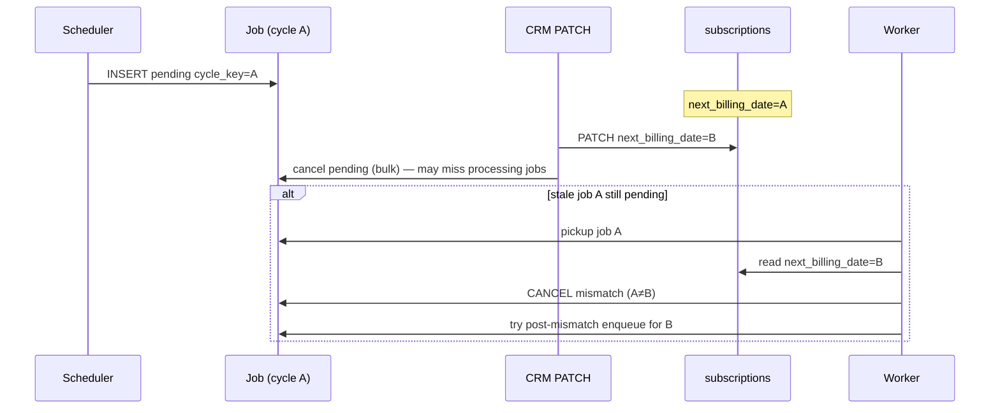

# Billing Job Cancellation Analysis — Sprint 4.2K

**Focus:** `cancelled_job_cycle_mismatch_after_reschedule`  
**Mode:** READ ONLY

---

## Outcome definition

```typescript
// billingRecurringJobPersistence.ts:40
CANCELLED_JOB_CYCLE_MISMATCH: 'cancelled_job_cycle_mismatch_after_reschedule'
```

Persisted in `billing_recurring_jobs.completion_outcome` (migration 130+).  
Historical rows may have been backfilled in `140_billing_recurring_jobs_normalize_cycle_key.sql`.

---

## Single emission point (worker)

**Only** emitted via `cancelBillingRecurringJob` from worker pickup:

```typescript
// recurringBillingJobService.ts:1502-1518
const subNextYmd = normalizeBillingCycleKeyYmd(
  normalizeSubscriptionNextBillingYmd(subscription.next_billing_date) || ...
);
if (subNextYmd && jobCycleCanonical && subNextYmd !== jobCycleCanonical) {
  await cancelBillingRecurringJob(
    client, job.id,
    BILLING_RECURRING_JOB_OUTCOME.CANCELLED_JOB_CYCLE_MISMATCH,
    JSON.stringify({
      reason: 'subscription_next_billing_changed_since_enqueue',
      job_cycle_key_raw: job.cycle_key,
      job_cycle_key_normalized: jobCycleCanonical,
      subscription_next_billing_raw: subscription.next_billing_date,
      subscription_next_billing_normalized: subNextYmd,
    }),
    subNextYmd  // guard input for cycle dual-write
  );
}
```

**Not emitted by:** CRM bulk cancel (uses `cancelled_manual_next_billing_reschedule`), scheduler, manual generate directly.

---

## Preconditions (all required)

| # | Condition |
|---|-----------|
| 1 | Worker picked a `pending` job (`status → processing`) |
| 2 | Subscription row exists |
| 3 | Normalized `job.cycle_key` **≠** normalized `subscription.next_billing_date` |
| 4 | Both normalized values non-empty |

---

## Typical causality chain



---

## Post-cancel behavior (same worker iteration)

Immediately after mismatch cancel (`recurringBillingJobService.ts:1521-1560`):

1. `describeRenewalEnqueueWithDb(subscription_id)` — read-only diagnosis
2. If not blocked → `insertOrReactivateRenewalJob` for current `next_billing_date`
3. Logs: `post_cycle_mismatch_enqueue_ok` | `_blocked` | `_guard_skip` | `_error`

**Historical gap:** Older code cancelled without re-enqueue → empty queue until next scheduler run (`docs/INVESTIGACAO_CANCELLED_CYCLE_MISMATCH_FILA_VAZIA.md`). Current code attempts inline re-enqueue.

---

## Cycle dual-write on mismatch cancel

`cancelBillingRecurringJob` → `subscriptionCyclesOnJobCancelled` with optional guard:

```typescript
// subscriptionCyclesDualWriteService.ts:380-384
if (params.guardObsolete) {
  const subNext = normalizeBillingCycleKeyYmd(params.guardObsolete.subscriptionNextBillingYmd);
  if (subNext && subNext === cycleDate) {
    return; // do NOT mark cycle cancelled
  }
}
```

On mismatch, `guardNext = subNextYmd` (new pointer), `cycleDate = job.cycle_key` (old). Typically **≠** → old cycle marked **`cancelled`**.

---

## Related cancellation outcomes (confusion matrix)

| Outcome | Emitter | Same symptom? |
|---------|---------|---------------|
| `cancelled_job_cycle_mismatch_after_reschedule` | Worker pickup | Job stale vs subscription |
| `cancelled_manual_next_billing_reschedule` | CRM bulk cancel | User changed next billing |
| `cancelled_subscription_not_active` | Worker | Paused/cancelled sub |
| Normalization bug (fixed) | Historical | Raw vs normalized string compare |

See `docs/CORRECAO_NORMALIZACAO_CYCLE_KEY_E_ACTIVE_JOB_EXISTS.md`.

---

## All paths to `cancelBillingRecurringJob`

| Line (approx) | Outcome | When |
|---------------|---------|------|
| 1497 | `cancelled_subscription_missing` | Sub deleted |
| 1507 | **`cancelled_job_cycle_mismatch_after_reschedule`** | **Mismatch** |
| 1689 | `cancelled_subscription_not_active` | Not active |
| 1700 | `cancelled_after_period_end_at_cancel` | Period ended + cancel_at_period_end |
| 1828 | `cancelled_unknown_subscription_type` | Invalid type |

Bulk CRM path bypasses `cancelBillingRecurringJob` and updates jobs directly (`customerInvoiceRecurrenceNextBillingService.ts:153-169`) but still calls `subscriptionCyclesOnJobCancelled`.

---

## Root cause statement

> **Root cause of `cancelled_job_cycle_mismatch_after_reschedule`:** Temporal decoupling between **job enqueue time** (snapshot of `next_billing_date` → `cycle_key`) and **worker pickup time** (live read of `next_billing_date`). Any intervening write to `next_billing_date` — CRM PATCH, contract interval change, resume/reactivate, renewal validation repair, or concurrent renewal advance — invalidates the enqueued job. The cancellation is **intentional** (obsolete job guard); side effects include old cycle `cancelled` and possible queue gap if re-enqueue is blocked.

---

## Contributing factors (evidence-based)

| Factor | Evidence |
|--------|----------|
| Multiple writers to `next_billing_date` | `BILLING_NEXT_BILLING_TRACE.md` |
| Bulk cancel only `status = pending` | Processing jobs may reach worker before cancel |
| Scheduler interval vs user PATCH timing | Race window |
| Billing window block after mismatch | `post_cycle_mismatch_enqueue_blocked` logs |
| Normalization | Fixed but historical data may have dirty `cycle_key` strings |

---

## Forensic queries

```sql
SELECT id, cycle_key, status, completion_outcome, completion_detail, updated_at
FROM billing_recurring_jobs
WHERE subscription_id = :sub_id
  AND completion_outcome = 'cancelled_job_cycle_mismatch_after_reschedule'
ORDER BY updated_at DESC;

SELECT cycle_date, status, skipped_reason
FROM subscription_cycles
WHERE subscription_id = :sub_id
  AND skipped_reason LIKE '%mismatch%';
```

Parse `completion_detail` JSON for `job_cycle_key_normalized` vs `subscription_next_billing_normalized`.

---

## Remediation direction (see BILLING_FINAL_ROOT_CAUSE.md)

- Reduce writers / serialize `next_billing_date` changes with job queue drain
- On PATCH: cancel **pending + processing** for stale cycles
- Idempotent enqueue always after any next_billing change
- Optional: version stamp on subscription compared to job enqueue generation
- Do not remove mismatch guard — it prevents billing wrong competence
