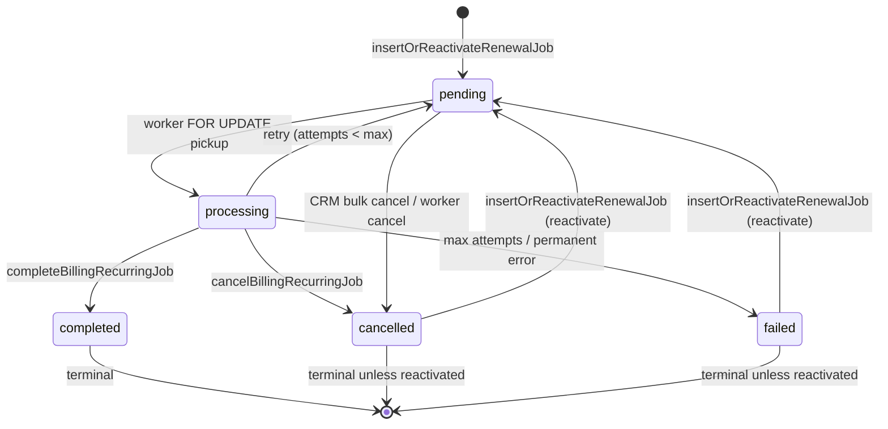

# Billing Job Ownership — Sprint 4.2K

**Entity:** `billing_recurring_jobs`  
**Mode:** READ ONLY

---

## Schema (effective)

| Column | Role |
|--------|------|
| `cycle_key` | Canonical YMD for competence; must match `subscriptions.next_billing_date` at worker pickup |
| `status` | `pending` → `processing` → `completed` \| `cancelled` \| `failed` |
| `completion_outcome` | Stable reason code (migration 130+) |
| `result_invoice_id` | Set on successful completion |
| `job_type` | `renewal` (primary path) |

Unique constraint: one logical cycle per `(subscription_id, tenant_id, normalized cycle_key)` for active jobs (enforced in application layer via `BILLING_JOBS_WHERE_SUB_TENANT_SAME_LOGICAL_CYCLE`).

---

## Who creates jobs?

**Single write entry point:** `insertOrReactivateRenewalJob` (`recurringBillingJobService.ts:356`).

| Caller | Context | Result |
|--------|---------|--------|
| `enqueueRenewalJobs` (scheduler) | Periodic scan of active subscriptions in billing window | INSERT `pending` or reactivate `cancelled`/`failed` |
| `tryEnqueueRenewalJobForSubscriptionId` | After CRM PATCH / resume / reactivate | Same |
| Worker post-mismatch block | After `CANCELLED_JOB_CYCLE_MISMATCH` | `describeRenewalEnqueueWithDb` + insert |
| `ensureJobForManualGenerate` | Manual generate (Sprint 4.2D) | Insert/reactivate for **explicit** `cycleKey` from cycle row |

INSERT SQL (`recurringBillingJobService.ts:503`):

```sql
INSERT INTO billing_recurring_jobs (subscription_id, tenant_id, job_type, cycle_key, scheduled_at, status)
VALUES ($1, $2, 'renewal', $3, now(), 'pending')
```

Reactivation path (`:420–444`): UPDATE `cancelled`/`failed` → `pending`, refresh `cycle_key`, clear locks.

---

## Who updates jobs?

| Operation | Module | Function | Status change |
|-----------|--------|----------|-----------------|
| Pickup | `recurringBillingJobService.ts` | Worker batch | `pending` → `processing` |
| Complete | `billingRecurringJobPersistence.ts` | `completeBillingRecurringJob` | → `completed` |
| Cancel | `billingRecurringJobPersistence.ts` | `cancelBillingRecurringJob` | → `cancelled` |
| Fail / retry | `recurringBillingJobService.ts` | Worker catch | `processing` → `pending` or `failed` |
| Reclaim stale | `billingRecoveryService.ts` | `repairReclaimStaleProcessing` | `processing` → `pending` |
| Reactivate stale pending | `billingRecoveryService.ts` | `repairReactivateStalePendingJobs` | refresh pending |
| CRM reschedule | `customerInvoiceRecurrenceNextBillingService.ts` | `cancelPendingRenewalJobsForSubscription` | `pending` → `cancelled` (bulk) |

---

## Who cancels jobs?

### Path A — `cancelBillingRecurringJob` (single job, with cycle dual-write)

| Outcome constant | Trigger location | Condition |
|------------------|------------------|-----------|
| `cancelled_subscription_missing` | Worker pickup | Subscription row deleted |
| `cancelled_job_cycle_mismatch_after_reschedule` | Worker pickup | `job.cycle_key ≠ next_billing_date` |
| `cancelled_subscription_not_active` | Worker pre-engine | `status !== 'active'` |
| `cancelled_after_period_end_at_cancel` | Worker pre-engine | `cancel_at_period_end` + past `current_period_end` |
| `cancelled_unknown_subscription_type` | Worker pre-engine | Type not saas/customer |
| `cancelled_next_billing_after_db_today` | (defined; grep worker for usage) | Future cycle guard |

### Path B — `cancelPendingRenewalJobsForSubscription` (bulk, CRM)

| Outcome | Trigger |
|---------|---------|
| `cancelled_manual_next_billing_reschedule` | PATCH next billing from paid invoice; contract/lifecycle reschedule |

**Note:** Bulk cancel does **not** pass `guardObsolete` → associated cycles always marked `cancelled`.

---

## Job state transition graph



---

## `completion_outcome` catalog

From `billingRecurringJobPersistence.ts:30–44`:

**Completed:** `completed_invoice_customer`, `completed_invoice_saas`, `completed_no_invoice_no_eligible_items`, `completed_idempotent_*`

**Cancelled:** `cancelled_subscription_missing`, `cancelled_subscription_not_active`, `cancelled_next_billing_after_db_today`, `cancelled_manual_next_billing_reschedule`, **`cancelled_job_cycle_mismatch_after_reschedule`**, `cancelled_after_period_end_at_cancel`, `cancelled_unknown_subscription_type`

**Failed:** `failed_max_attempts`, `failed_permanent_configuration`

---

## Side effects on completion / cancel

Every `completeBillingRecurringJob` / `cancelBillingRecurringJob` invokes:

- `subscriptionCyclesOnJobCompleted` or `subscriptionCyclesOnJobCancelled`
- On successful customer renewal: `advanceSubscriptionAfterCompletedCycle` → updates `subscriptions.next_billing_date`

---

## Scheduler vs Worker vs Manual on same cycle

| Actor | Can touch same `cycle_key`? | Mechanism |
|-------|----------------------------|-----------|
| Scheduler | Yes | Inserts pending if window open and no active job |
| Worker | Yes | Picks pending → processing → complete/cancel |
| Manual generate | Yes | `ensureJobForManualGenerate` → `insertOrReactivateRenewalJob` with explicit cycle from `cycle_id` |
| CRM PATCH | Indirect | Cancels pending jobs for **old** cycle; enqueues for **new** `next_billing_date` |

**Race:** Job enqueued for Jul; user PATCHes next to Aug before worker runs → mismatch cancel on Jul job; post-mismatch enqueue attempts Aug job in same worker tick (`recurringBillingJobService.ts:1521–1560`).

---

## Files reference

| File | Role |
|------|------|
| `recurringBillingJobService.ts` | Scheduler, worker batch, insert/reactivate |
| `billingRecurringJobPersistence.ts` | Complete, cancel, advance subscription |
| `billingManualRenewalService.ts` | Manual job ensure + sync execution |
| `customerInvoiceRecurrenceNextBillingService.ts` | Bulk cancel on reschedule |
| `billingRecoveryService.ts` | Stale job repair |
| `billingRecurringJobPersistence.ts` | Outcome constants |
