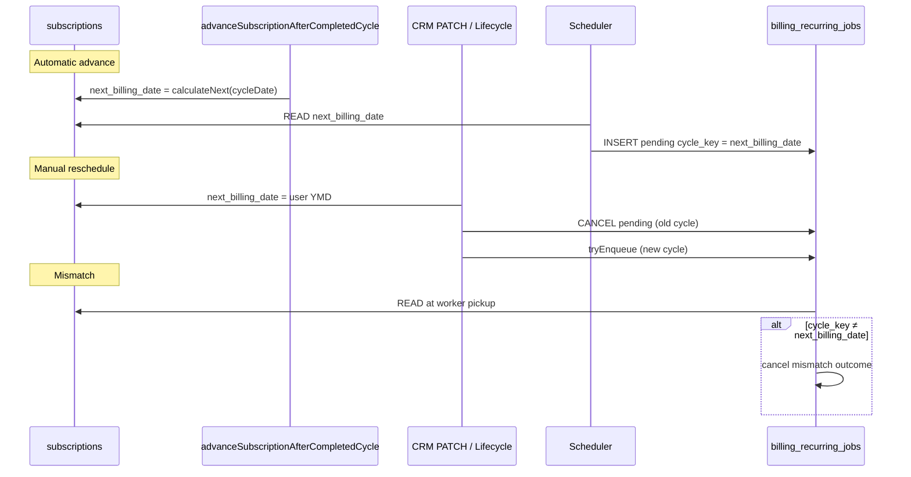

# Billing Next Billing Date Trace — Sprint 4.2K

**Field:** `subscriptions.next_billing_date`  
**Mode:** READ ONLY

---

## Semantic role

`next_billing_date` is the **authoritative pointer** for:

1. Scheduler eligibility — which competence to enqueue next
2. Worker mismatch guard — `job.cycle_key` must equal normalized `next_billing_date` at pickup
3. UI projection layer — `buildFutureCycles` / `buildProjectionEvents` (UX only, Sprint 4.2H)

It is **not** used for deterministic manual generate when `cycle_id` is provided (Sprint 4.2D).

---

## All writers (complete inventory)

| # | Module | Function / context | SQL pattern | Also updates |
|---|--------|-------------------|-------------|--------------|
| 1 | `billingRecurringJobPersistence.ts` | `advanceSubscriptionAfterCompletedCycle` | `UPDATE subscriptions SET next_billing_date = …` via `updateSubscriptionAfterRenewal` | `current_period_*`, `billing_cycle_count`, `billing_anchor_day`, `last_job_at` |
| 2 | `billingSubscriptionService.ts` | `updateSubscriptionAfterRenewal` | Direct UPDATE (called only from #1) | same |
| 3 | `billingSubscriptionService.ts` | `applySaasSubscriptionPeriodIfEmpty` | Bootstrap SaaS first period | `current_period_*`, anchor |
| 4 | `customerInvoiceRecurrenceNextBillingService.ts` | `patchCustomerSubscriptionNextBillingFromPaidInvoice` | Manual CRM reschedule from paid invoice | `billing_anchor_day` |
| 5 | `crmSubscriptionsLifecycleService.ts` | `resumeCrmSubscription` | Resume from paused | `status`, `billing_anchor_day`, metadata |
| 6 | `crmSubscriptionsLifecycleService.ts` | `reactivateCrmSubscription` | Reactivate cancelled | same pattern |
| 7 | `crmSubscriptionsContractService.ts` | `applyContractToSubscriptionImmediate` | Billing interval change on contract | `current_period_end`, `billing_interval`, `amount_cents` |
| 8 | `renewalValidationPipeline.ts` | `repairSubscriptionDatesForRenewal` | **Repair:** align `next_billing_date` to job cycle when mismatch detected pre-engine | `current_period_start` if null |

### Advance logic (primary automatic writer)

`computeFinalNextBillingForCompletedCycle` (`billingRecurringJobPersistence.ts:75`):

```
computedNext = calculateNextBillingDate(cycleDate, billing_interval)
finalNext    = max(computedNext, oldNext)  // never regress if already ahead
```

Called after every successful renewal completion (CRM + SaaS idempotent paths).

---

## Write triggers by business event

| Event | Writer chain |
|-------|--------------|
| Invoice generated (worker/manual) | `completeBillingRecurringJob` → `advanceSubscriptionAfterCompletedCycle` |
| SaaS idempotent reuse | Same advance before complete |
| User PATCH “próxima renovação” on paid invoice | `patchCustomerSubscriptionNextBillingFromPaidInvoice` |
| Contract interval change | `applyContractToSubscriptionImmediate` → `computeCrmContractDatesAfterIntervalChange` |
| Resume / reactivate subscription | `crmSubscriptionsLifecycleService` |
| Pre-renewal data repair | `renewalValidationPipeline.repairSubscriptionDatesForRenewal` |

---

## Readers that **do not** write but depend on value

| Consumer | Behavior if stale |
|----------|-------------------|
| Scheduler `enqueueRenewalJobs` | Enqueues for current `next_billing_date` |
| Worker mismatch check | Cancels job if `≠ cycle_key` |
| `describeRenewalEnqueueWithDb` | Builds enqueue row from subscription join |
| Frontend `buildProjectionEvents` | Projects 12 future months from anchor |
| `ensureJobForManualGenerate` | Fallback cycle key from join when option omitted (backend only) |

---

## Interaction with job cancellation

When `next_billing_date` changes **after** a job was enqueued:

```
T0: next_billing_date = 2026-07-14, job pending cycle_key = 2026-07-14
T1: PATCH next_billing_date = 2026-08-14
    → cancelPendingRenewalJobsForSubscription (Jul job cancelled)
    → tryEnqueueRenewalJobForSubscriptionId (Aug job inserted)
T2: Worker picks stale Jul job (if still in queue) OR Aug job
    → If Jul: mismatch cancel (cancelled_job_cycle_mismatch_after_reschedule)
```

If PATCH bulk-cancel runs but enqueue fails (window blocked), queue can be empty until next scheduler tick — see `docs/INVESTIGACAO_CANCELLED_CYCLE_MISMATCH_FILA_VAZIA.md`.

---

## `billing_anchor_day` coupling

Most writers also set:

```sql
billing_anchor_day = EXTRACT(DAY FROM next_billing_date)::int
```

Contract and PATCH paths keep anchor aligned with manual dates. Interval arithmetic uses `calculateNextBillingDate` with anchor for non-customer types.

---

## Trace diagram



---

## Evidence queries (forensic)

```sql
-- Writers leave audit trails in billing logs:
-- subscription_cycle_advance_applied, customer_subscription_next_billing_manual

SELECT id, next_billing_date, current_period_start, current_period_end,
       billing_cycle_count, updated_at
FROM subscriptions WHERE id = :subscription_id;

SELECT cycle_date, status, skipped_reason, job_id, invoice_id, updated_at
FROM subscription_cycles
WHERE subscription_id = :subscription_id
ORDER BY cycle_date;
```

Compare `subscriptions.next_billing_date` to latest non-terminal cycle row and pending job `cycle_key`.
