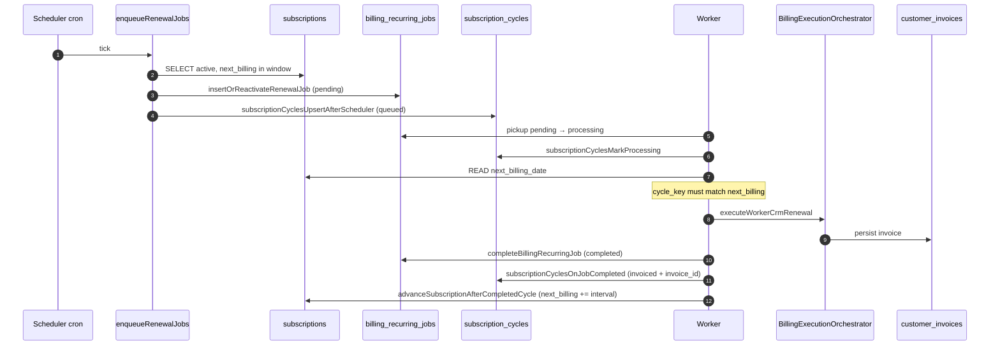
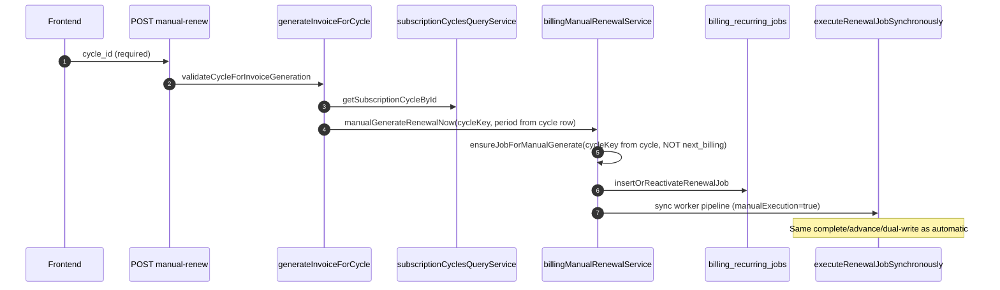
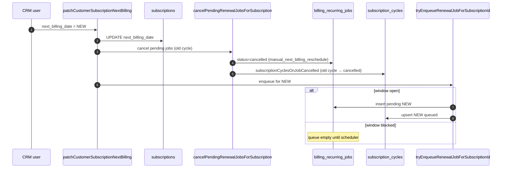
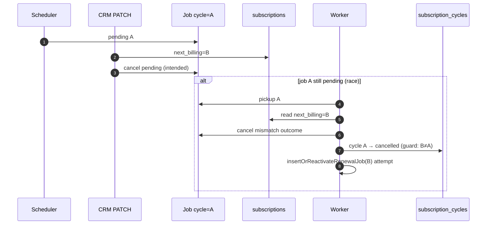
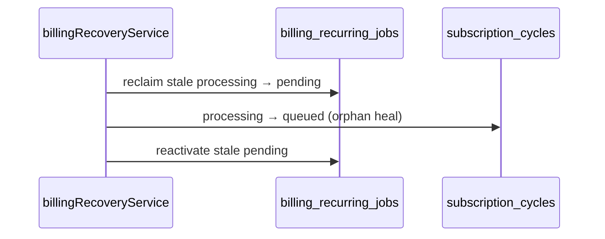
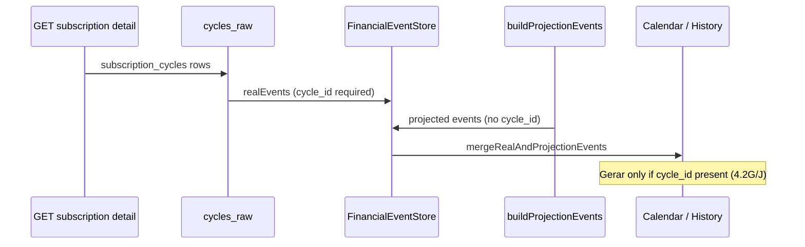

# Billing Runtime Sequence Diagram — Sprint 4.2K

**Mode:** READ ONLY  
**Scope:** Scheduler, Worker, Manual Generate — interaction on same cycle

---

## 1. Happy path — automatic renewal

---

## 2. Manual generate (Sprint 4.2D) — same engine, explicit cycle

**Key:** Manual path uses **cycle row dates**, not subscription `next_billing_date`, for invoice competence. Mismatch guard still applies at worker pickup if subscription pointer diverged.

---

## 3. CRM PATCH next billing — invalidates queued work

---

## 4. Race — mismatch cancel (worker vs PATCH)

---

## 5. Three actors modifying same cycle — proof table

| Time | Scheduler | Worker | Manual Generate | Effective state |
|------|-----------|--------|-----------------|-----------------|
| T1 | Inserts job `pending` Jul | — | — | Job Jul pending; cycle Jul `queued` |
| T2 | Skipped (active exists) | Pickup Jul | — | Job Jul processing; cycle Jul `processing` |
| T3 | — | — | User Gerar Jul with `cycle_id` | `ensureJobForManualGenerate` → skipped_active or sync execute same job |
| T4 | — | Completes Jul | — | Job completed; cycle invoiced; next_billing → Aug |
| T5 | Enqueues Aug | — | — | New job Aug; cycle Aug `queued` |
| T4' | — | — | User Gerar Oct `cycle_id` while next=Aug | Manual creates/reactivates job for **Oct cycle row**; mismatch risk if next still Aug at pickup |

**Proof:** All three call `insertOrReactivateRenewalJob` or worker complete/cancel on the same `(subscription_id, normalized cycle_key)` guard. No separate code path bypasses dual-write.

---

## 6. SaaS vs CRM branch

| Type | Worker branch | Invoice table | Cycle status on complete |
|------|---------------|---------------|--------------------------|
| `customer` | `executeWorkerCrmRenewal` | `customer_invoices` | `invoiced` |
| `saas` | SaaS idempotent / tenant billing | `invoices` (tenant) | `skipped` (tenant_billing meta) |

---

## 7. Recovery loop (out of band)

Does not create new competencies — only repairs stuck states.

---

## 8. Frontend runtime (non-billing, UX only)

Frontend sequences **never** write to `subscription_cycles` or jobs.

---

## File map

| Phase | Primary file |
|-------|--------------|
| Scheduler | `recurringBillingJobService.ts` — `enqueueRenewalJobs`, `insertOrReactivateRenewalJob` |
| Worker batch | `recurringBillingJobService.ts` — `processBillingRecurringJobBatch` |
| CRM engine | `workerCrmRenewalPipeline/workerCrmRenewalPipeline.ts` |
| Persist complete/cancel | `billingRecurringJobPersistence.ts` |
| Cycle dual-write | `subscriptionCyclesDualWriteService.ts` |
| Manual | `billingManualRenewalService.ts`, `billingCycleInvoiceGenerationService.ts` |
| PATCH | `customerInvoiceRecurrenceNextBillingService.ts` |
| Recovery | `billingRecoveryService.ts` |
