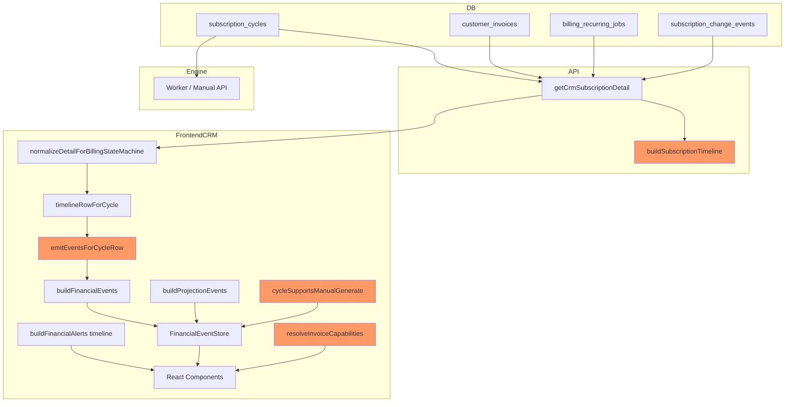
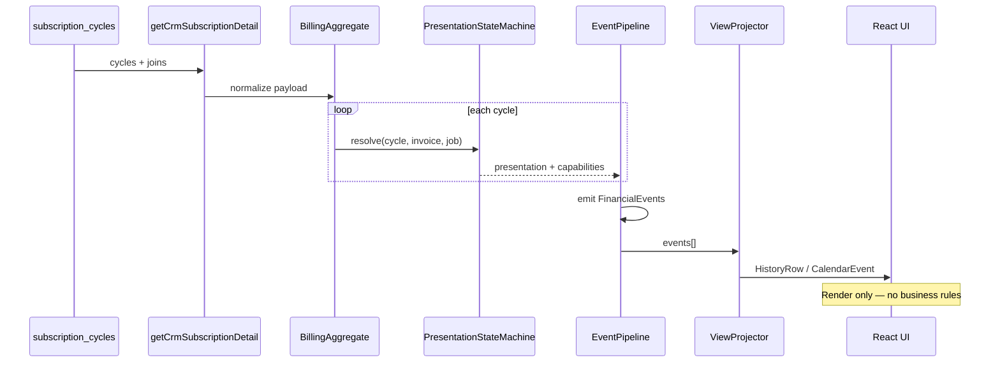
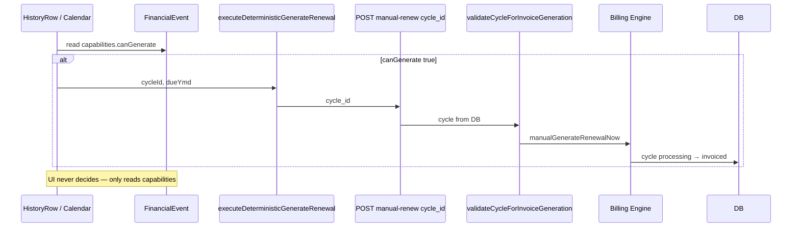
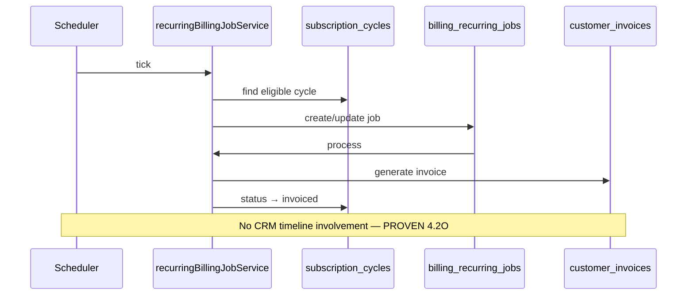
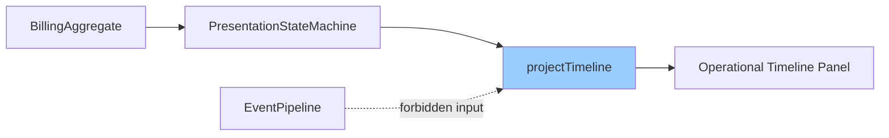

# Billing State Machine Unification Blueprint — Sprint 4.2P

**Mode:** READ ONLY — documentation only; no code, DB, API, frontend, backend, test, or commit changes  
**Date:** 2026-07-02  
**Status:** Documentação-base oficial para implementação **Billing 5.0**  
**Cross-references:** [BILLING_LIFECYCLE_FORENSIC.md](./BILLING_LIFECYCLE_FORENSIC.md) (4.2K), [BILLING_GENERATE_ACTION_FORENSIC.md](./BILLING_GENERATE_ACTION_FORENSIC.md) (4.2L), [BILLING_RUNTIME_CAUSALITY_AUDIT.md](./BILLING_RUNTIME_CAUSALITY_AUDIT.md) (4.2M), [BILLING_TIMELINE_CAUSALITY_AUDIT.md](./BILLING_TIMELINE_CAUSALITY_AUDIT.md) (4.2N), [BILLING_ARCHITECTURE_SIMPLIFICATION_AUDIT.md](./BILLING_ARCHITECTURE_SIMPLIFICATION_AUDIT.md) (4.2O)

**Premissa:** Todas as causas raiz já foram identificadas nas auditorias 4.2K–4.2O. Este documento **consolida** a arquitetura definitiva; não investiga novos bugs.

---

## Conclusão executiva

O Billing atual possui **5+ decisores concorrentes** de estado no CRM (4.2N) e **3 famílias de gates** para o botão Gerar (4.2L), enquanto o **Billing Engine** já opera com `subscription_cycles` como SSOT de persistência (4.2O, 4.2K).

**Billing 5.0** introduz:

1. **Uma máquina de estados de apresentação** (`BillingPresentationStateMachine`) — único decisor de estado **derivado** no CRM.
2. **Um único builder** (`BillingFinancialEventPipeline`) — único emissor de `FinancialEvent` + `Capabilities`.
3. **Timeline exclusivamente apresentação** — derivada do agregado; proibida como input de decisão.
4. **Billing Engine inalterado em ownership** — continua dono de transições persistidas em `subscription_cycles` e `billing_recurring_jobs`.

---

## Respostas às 20 perguntas obrigatórias

### 1. Qual deve ser a única máquina de estados oficial do Billing?

**No CRM (leitura / UX / FinancialEvent):** módulo único **`BillingPresentationStateMachine`** (`resolveBillingCyclePresentation`), consolidando a lógica hoje espalhada em `resolveOperationalState` (backend), `resolveBillingCycleState` (backend + frontend), `normalizeTimelineRowForStateMachine`, e ramos de `emitEventsForCycleRow`.

**Na persistência (escrita / cobrança real):** **`BillingRuntimeEngine`** — transições em `subscription_cycles.status` + jobs. Já é SSOT do engine — **PROVEN** (4.2O, 4.2K). **Não se funde** com a máquina de apresentação; são domínios distintos (read vs write).

### 2. Quais estados oficiais existirão?

**Camada persistida** (`subscription_cycles.status` — já existe no DB):

| Status DB | Papel |
|-----------|-------|
| `pending` | Ciclo materializado, sem fatura |
| `queued` | Na fila do worker |
| `processing` | Geração em andamento |
| `invoiced` | Fatura vinculada |
| `failed` | Falha de geração |
| `skipped` | Ciclo pulado |
| `cancelled` | Ciclo cancelado |

**Camada apresentação** (`BillingCyclePresentationState` — novo contrato unificado):

| Estado | Significado | Origem atual (evidência) |
|--------|-------------|--------------------------|
| `awaiting_generation` | Ciclo elegível, sem fatura, futuro ou gerável agora | `operational_state: awaiting_generation/scheduled/in_queue` (4.2N) |
| `processing` | Job/ciclo em processamento | `cycle.status === 'processing'` |
| `pending_invoice` | Fatura emitida, não paga | `invoice` + status pendente (4.2M L209–215) |
| `paid` | Pago | `invoice.status === 'paid'` |
| `refunded` | Reembolsado/chargeback | `invoice.status` |
| `failed_recoverable` | Falha recuperável — pode Gerar | `failed` + `isRecoverableCycleFailure` (4.2M L124–138) |
| `failed_terminal` | Falha não recuperável | `failed` sem recovery |
| `gateway_failed` | Falha gateway | `operational_state: gateway_failed` (4.2N) |
| `skipped` | Sem nova fatura (definitivo) | `cycle.status === 'skipped'` não recuperável |
| `cancelled` | Cancelado (ciclo ou assinatura) | `cancelled` oficial ou sub cancelada |
| `manual_invoice` | Cobrança manual registrada | `operational_state: manual_invoice` |
| `projected` | Competência futura sem ciclo DB | `kind: 'projected'` (4.2H) |
| `lifecycle` | Evento contrato/pausa (sem ciclo) | `lifecycle_event` (4.2N) |

### 3. Quais transições serão permitidas?

**Billing Engine (escrita — já existe, documentado 4.2K):**

```
pending → queued → processing → invoiced
pending|queued|failed|skipped|cancelled → (manual generate) → processing → invoiced|failed
* → failed | skipped | cancelled
```

**BillingPresentationStateMachine (leitura — sem transições persistidas):**

Função pura `(cycle, invoice?, job?, subscription, today) → PresentationState + Capabilities + EventTypes[]`. Não grava DB. Recomputada a cada `BillingAggregate` refresh.

**Transições proibidas no CRM:** qualquer módulo fora do pipeline oficial que altere `operational_state`, `canGenerate`, ou `FinancialEvent.type` após o build.

### 4. Quais módulos deixam de decidir estados?

| Módulo atual | Evidência decisão hoje | Pós 5.0 |
|--------------|------------------------|---------|
| `resolveOperationalState` | `subscriptionTimelineUx.ts:256` | **Eliminado como decisor** — vira mapper de apresentação |
| `normalizeTimelineRowForStateMachine` | `billingStateMachine.ts:296` | **Eliminado** |
| `timelineRowForCycle` (prioridade timeline) | `subscriptionCyclesSource.ts:69–90` | **Eliminado como decisor** |
| `emitEventsForCycleRow` (ramos soltos) | `subscriptionFinancialEventBuilder.ts:67–244` | **Absorvido** pelo pipeline oficial |
| `cycleSupportsManualGenerate` (isolado) | `subscriptionCyclesSource.ts:59` | **Absorvido** em `Capabilities.canGenerate` |
| `resolveInvoiceCapabilities` (isolado) | `invoiceCapabilities.ts:57` | **Absorvido** em `Capabilities` no evento |
| `buildFinancialAlerts` (timeline direto) | `subscriptionFinancialExperience.ts:397` | **Reescrito** — lê eventos/capabilities |
| `billingSubscriptionExperience*` | múltiplos loops timeline | **Deprecado** ou render-only |
| `subscriptionFinancialConsistency` | timeline `canGenerate` | **Eliminado** |
| `resolveHistoryRowState` | `subscriptionRenewalRecovery.ts` | **Label only** — não decide Gerar |

### 5. Quais módulos passam apenas a consumir estados?

- `FinancialEventStore` — cache de views; **não** recalcula `canGenerate`
- Todos os componentes React financeiros (Tabela 5)
- `financialInsightsEngine` — agrega `FinancialEvent[]`
- `subscriptionBillingGeneration.executeDeterministicGenerateRenewal` — executa ação; não decide elegibilidade
- `SubscriptionRenewalActionsCard` — pode continuar exibindo diagnóstico backend; decisão UI vem do evento

### 6. Quem será o único responsável por construir FinancialEvents?

**`BillingFinancialEventPipeline.buildEvents(aggregate, today)`** — substitui conceitualmente:

- `buildFinancialEvents` + `buildProjectionEvents` + merge
- `normalizeDetailForBillingStateMachine` (pré-processamento)
- `timelineRowForCycle` como input

Localização recomendada: pacote compartilhado `packages/billing-presentation/` (ou `src/lib/billing5/`) — **hipótese de estrutura, NOT PROVEN** como path final.

### 7. Quem será o único responsável por decidir `canGenerate`?

**`BillingPresentationStateMachine.deriveCapabilities`** — única função. Regra espelha backend — **PROVEN** como regra de negócio:

```
canGenerate =
  subscription.status ∉ {cancelled} ∧
  cycle.invoice_id IS NULL ∧
  cycle.status ∈ GENERATABLE_CYCLE_STATUSES
```

Evidência: `billingCycleInvoiceGenerationService.ts:22–28`, `subscriptionCyclesSource.ts:59–67`.

### 8. Quem será o único responsável por decidir `supportsGenerate`?

**Mesmo `deriveCapabilities`** — `supportsGenerate` **deve ser igual** a `canGenerate` para eventos `kind:'real'` com `cycleId` em superfícies calendário/histórico. Elimina divergência 4.2L entre famílias A e B.

Exceções explícitas no contrato:

- `kind:'projected'` → `supportsGenerate: false`, `canGenerate: false`
- Eventos com `invoiceId` → `supportsGenerate: false` (já existe fatura)

### 9. Quem decide `upcoming_cycle`?

**`BillingFinancialEventPipeline`** — ramo único quando `presentationState ∈ { awaiting_generation, failed_recoverable, skipped_recoverable }` e `!invoiceId` e assinatura ativa. Consolida `emitEventsForCycleRow` L124–138 e L218–241 (4.2M).

### 10. Quem decide `invoice_due`?

**`BillingFinancialEventPipeline`** — quando `presentationState === pending_invoice` e fatura não paga/não cancelada. Evidência atual: `emitEventsForCycleRow` L209–215.

### 11. Quem decide `invoice_failed`?

**`BillingFinancialEventPipeline`** — quando `presentationState ∈ { failed_terminal, gateway_failed }`. Evidência: L140–154, L157–165.

### 12. Quem decide `payment`?

**`BillingFinancialEventPipeline`** — quando `presentationState === paid`. Evidência: L90–96 (`isPaid`).

### 13. Quais informações continuam pertencendo ao Billing Engine?

| Dado / decisão | Dono |
|----------------|------|
| `subscription_cycles.status` transições | Worker + manual generate API |
| `billing_recurring_jobs` lifecycle | `recurringBillingJobService` |
| `next_billing_date` avanço | Renewal engine / worker |
| Materialização de ciclos | `subscriptionCyclesDualWriteService` |
| Validação `validateCycleForInvoiceGeneration` | `billingCycleInvoiceGenerationService` |
| Geração de invoice | `customerInvoiceService` / manual renew |
| Idempotência / ownership de job | 4.2K ownership docs |

### 14. Quais informações passam a ser apenas enriquecimento visual?

| Campo | Pós 5.0 |
|-------|---------|
| `status_pt`, `operational_state_pt` | Timeline / labels |
| `cycle_label`, `period_label`, `month_ref` | Timeline |
| `merge_source` (quando timeline existir) | Agrupamento visual |
| `generation_note` (sem impacto em capabilities) | Notas UI |
| Badges de cor (`statusBadge`) | Derivados de `FinancialEvent.type` |
| Projeções futuras (`kind:'projected'`) | UX-only — **já PROVEN** 4.2H |

### 15. Campos obrigatórios em FinancialEvent para eliminar consultas paralelas

Ver **Contrato FinancialEvent** (Tabela 4). Mínimo adicional vs tipo atual (`financialEventTypes.ts:27–48`):

- `capabilities: BillingCapabilities` (embedded)
- `presentationState: BillingCyclePresentationState`
- `invoiceStatus: string | null`
- `isOverdue: boolean`
- `isRecoverable: boolean`
- `subscriptionStatus: string` (snapshot)
- `periodStart`, `periodEnd`
- `jobId`, `jobErrorSnippet` (diagnóstico)
- `primarySurfaceActions: SurfaceAction[]` (opcional — **NOT PROVEN** necessário se capabilities forem suficientes)

### 16. A Timeline continuará existindo?

**Sim — como camada de apresentação opcional.**

| Responsabilidade exclusiva | Proibido |
|----------------------------|----------|
| Renderizar linhas humanizadas por ciclo/fatura/lifecycle | Input para `buildEvents` |
| Unificar contrato + lifecycle para painel operacional | Decidir `canGenerate` |
| Scroll targets / navegação (`timelineNavigation`) | Alterar `presentationState` |
| Export CSV / impressão | Normalização in-memory |

Construção: `mapPresentationToTimelineRows(BillingAggregate, presentationStates[])` — função inversa, idempotente.

### 17. Quais componentes React deixarão de possuir regras próprias?

Todos listados na Tabela 5 e 6. Especialmente:

- `FinancialHistoryRow` — hoje `canGenerateNow && !isProjected` (4.2L)
- `UpcomingPaymentsList` — hoje chama `cycleSupportsManualGenerate` direto
- `NextInvoiceCard` — hoje `!isProjected && cycleId`
- `FinancialCalendarPopover` — hoje `resolveInvoiceCapabilities` isolado

### 18. Quais services backend deixarão de possuir lógica duplicada?

| Service | Duplicação hoje | Pós 5.0 |
|---------|-----------------|---------|
| `subscriptionTimelineUx.resolveOperationalState` | Paralelo a `billingRuntime/billingStateMachine` | Timeline chama SM compartilhado ou recebe estados pré-calculados |
| `billingRuntime/billingStateMachine` vs `src/lib/billingStateMachine.ts` | Dois arquivos mesmo nome (4.2N) | **Um** módulo compartilhado |
| `buildSubscriptionAutomationSummary` | Usa timeline para decisão de copy | Usa `BillingAggregate` |
| Frontend `cycleSupportsManualGenerate` vs backend `GENERATABLE_CYCLE_STATUSES` | Espelho manual | Constante compartilhada ou capabilities do backend na API |

### 19. Existe cenário onde duas máquinas de estado continuarão necessárias?

**Sim — PROVEN e intencional:**

| Máquina | Domínio | Motivo |
|---------|---------|--------|
| **BillingRuntimeEngine FSM** | Persistência / cobrança real | Escreve DB; worker; idempotência |
| **BillingPresentationStateMachine** | CRM read-model | Deriva UX; nunca persiste |

**Não é uma terceira máquina:** projeção (`kind:'projected'`) é emissor sintético sem estado persistido — subproduto do pipeline, não FSM independente.

**NOT PROVEN:** necessidade de FSM separado para `invoice_only` órfãos além do pipeline de orphan invoices.

### 20. Qual será a arquitetura final após a refatoração?

Ver seção **Arquitetura Billing 5.0** e diagramas abaixo.

---

## Tabela 1 — Máquina de estados atual (todos os decisores)

| # | Decisor | Arquivo | O que decide | Conflito conhecido |
|---|---------|---------|--------------|-------------------|
| 1 | `resolveOperationalState` | `packages/backend/.../subscriptionTimelineUx.ts:256` | `operational_state` | vs `cycles_raw.status` (4.2N) |
| 2 | `resolveBillingCycleState` (backend) | `packages/backend/.../billingRuntime/billingStateMachine.ts:83` | Estado dentro de #1 | Duplicata frontend |
| 3 | `resolveBillingCycleState` (frontend) | `src/lib/billingStateMachine.ts:127` | `canGenerate` em SM | vs `cycleSupportsManualGenerate` |
| 4 | `normalizeTimelineRowForStateMachine` | `src/lib/billingStateMachine.ts:296` | Reescrita `operational_state` | Segunda divergência (4.2N) |
| 5 | `cycleSupportsManualGenerate` | `src/lib/subscriptionCyclesSource.ts:59` | `canGenerateNow` History | vs `operational_state` emissão |
| 6 | `emitEventsForCycleRow` | `src/lib/subscriptionFinancialEventBuilder.ts:67` | `FinancialEvent.type` | 0 eventos por ciclo (4.2M) |
| 7 | `resolveInvoiceCapabilities` | `src/lib/invoiceCapabilities.ts:57` | `supportsGenerate` Calendar | vs `canGenerateNow` (4.2L) |
| 8 | `buildFinancialAlerts` | `src/lib/subscriptionFinancialExperience.ts:393` | Alertas por timeline | Paralelo ao store |
| 9 | `getHistoryRows` dedupe | `src/lib/subscriptionFinancialEventStore.ts:156` | Evento “vencedor” por ciclo | Pode ocultar Gerar |
| 10 | `buildProjectionEvents` | `src/lib/subscriptionFinancialProjection.ts:39` | Eventos futuros | `cycleId: null` by design |
| 11 | Backend `validateCycleForInvoiceGeneration` | `billingCycleInvoiceGenerationService.ts:30` | Elegibilidade API | Espelho frontend |
| 12 | Backend worker | `recurringBillingJobService` | Transições reais | SSOT persistência |

---

## Tabela 2 — Máquina de estados proposta (único decisor CRM)

| Camada | Módulo único | Entrada | Saída |
|--------|--------------|---------|-------|
| Agregação | `buildBillingAggregate(apiPayload)` | `cycles_raw`, `invoices[]`, `recent_jobs`, `subscription`, `lifecycle_events` | `BillingAggregate` |
| Apresentação | `BillingPresentationStateMachine.resolve(cycleContext)` | Um ciclo + joins + `today` | `BillingCyclePresentation` |
| Eventos | `BillingFinancialEventPipeline.buildEvents(aggregate)` | Aggregate + presentations[] | `FinancialEvent[]` |
| Projeção | `BillingFinancialEventPipeline.buildProjections(aggregate)` | Mesmo aggregate | `FinancialEvent[]` kind projected |
| Views | `BillingViewProjector` | `FinancialEvent[]` | `HistoryRow[]`, `CalendarEvent[]`, `TimelineRow[]` |

**`BillingCyclePresentation` (por ciclo):**

```typescript
// Contrato conceitual — não implementado
{
  cycleId: string;
  presentationState: BillingCyclePresentationState;
  capabilities: BillingCapabilities;
  eventTypes: FinancialEventType[];  // tipos a emitir
  dueYmd: string;
  periodStart: string | null;
  periodEnd: string | null;
}
```

---

## Tabela 3 — Responsabilidade de cada módulo após unificação

| Módulo | Papel pós 5.0 | Pode decidir? |
|--------|---------------|---------------|
| `BillingPresentationStateMachine` | Único decisor CRM | **SIM** |
| `BillingFinancialEventPipeline` | Único builder de eventos | **SIM** (emissão) |
| `BillingViewProjector` | HistoryRow, CalendarEvent, Timeline | **NÃO** |
| `FinancialEventStore` | Cache + filtros | **NÃO** |
| Componentes React | Render | **NÃO** |
| `buildSubscriptionTimeline` | DTO apresentação | **NÃO** |
| `subscriptionBillingGeneration` | HTTP execute | **NÃO** |
| Billing Engine / worker | Persistência | **SIM** (domínio runtime) |
| `financialInsightsEngine` | Agregação analytics | **NÃO** (deriva de eventos) |

---

## Tabela 4 — Campos oficiais do novo FinancialEvent

| Campo | Tipo | Obrigatório | Propósito |
|-------|------|-------------|-----------|
| `id` | `string` | sim | Estabilidade React |
| `kind` | `'real' \| 'projected'` | sim | Separação runtime vs UX |
| `type` | `FinancialEventType` | sim | Tipo canônico |
| `ymd` | `string` | sim | Data de exibição |
| `dueYmd` | `string \| null` | sim | Vencimento âncora |
| `amountCents` | `number \| null` | sim | Valor |
| `competence` | `string \| null` | sim | Rótulo competência |
| `invoiceId` | `string \| null` | sim | Ações de fatura |
| `cycleId` | `string \| null` | sim* | *Obrigatório se `kind:'real'` |
| `presentationState` | `BillingCyclePresentationState` | sim | Estado unificado |
| `invoiceStatus` | `string \| null` | sim | Elimina re-leitura timeline |
| `capabilities` | `BillingCapabilities` | sim | `canGenerate`, `supportsGenerate`, etc. |
| `isOverdue` | `boolean` | sim | Elimina `isOverdue(row)` em alerts |
| `isRecoverable` | `boolean` | sim | Falha vs upcoming |
| `statusLabel` | `string` | sim | UI |
| `statusBadge` | `FinancialBadgeVariant` | sim | UI |
| `gateway` | `string \| null` | sim | Ações gateway |
| `notes` | `string \| null` | não | Diagnóstico |
| `paidAt` | `string \| null` | não | Histórico |
| `lastUpdatedAt` | `string \| null` | não | Ordenação |
| `periodStart` | `string \| null` | sim | Próxima cobrança |
| `periodEnd` | `string \| null` | sim | Próxima cobrança |
| `jobId` | `string \| null` | não | Accordion técnico |
| `jobErrorSnippet` | `string \| null` | não | Diagnóstico |
| `clientName` | `string \| null` | não | Paridade atual |
| `cycleKey` | `string` | sim | Dedupe History |
| `subscriptionStatus` | `string` | sim | Guards pausa/cancel |

---

## Tabela 5 — Componentes renderizadores puros (pós 5.0)

| Componente | Consome | Regra própria hoje |
|------------|---------|-------------------|
| `FinancialHistoryRow` | `HistoryRow.capabilities.canGenerate` | `canGenerateNow && !isProjected` |
| `FinancialHistory` | `store.filterHistory` | Filtro UI only |
| `FinancialCalendar` | `CalendarEvent[]` | Mês/agrupamento only |
| `FinancialCalendarPopover` | `event.capabilities` | `resolveInvoiceCapabilities` |
| `NextInvoiceCard` | `NextChargeView` | `isProjected` guard |
| `UpcomingPaymentsList` | `event.capabilities` | `cycleSupportsManualGenerate` |
| `UpcomingPaymentCard` | store summary | Nenhuma decisão |
| `FinancialSummarySidebar` | alerts from store | `buildFinancialAlerts(timeline)` |
| `FinancialInsights` | store insights | Nenhuma |
| `FinancialAlert` | alert DTO | Nenhuma |
| `HistoryRowChargeAction` | `onGenerate(cycleId)` | Nenhuma |
| `InvoiceActionsMenu` | `capabilities` | Nenhuma |
| `FinancialTechnicalAccordion` | eventos | Diagnóstico display |
| `SubscriptionOperationalTimelinePanel` | `TimelineRow[]` | Nenhuma |

---

## Tabela 6 — Componentes que deixam de possuir lógica de negócio

| Componente | Lógica removida |
|------------|-----------------|
| `FinancialHistoryRow` | Decisão Gerar |
| `UpcomingPaymentsList` | `cycleSupportsManualGenerate` inline |
| `NextInvoiceCard` | Elegibilidade Gerar / projected guard como decisão |
| `FinancialCalendarPopover` | `resolveInvoiceCapabilities` local |
| `FinancialSummarySidebar` | `buildFinancialAlerts(detail)` direto |
| `SubscriptionRenewalActionsCard` | Pode manter diagnóstico backend como **informação**, não gate UI |
| Experience layer (`SubscriptionSituationCard`, etc.) | Headline status por timeline |

---

## Tabela 7 — Comparação Arquitetura Atual vs Billing 5.0

| Dimensão | Atual (4.2N/4.2O) | Billing 5.0 |
|----------|-------------------|-------------|
| SSOT persistência | `subscription_cycles` (engine) | **Igual** |
| SSOT CRM | Duplo: `cycles_raw` + `timeline` | `BillingAggregate` + presentations |
| Decisores de estado CRM | 5+ | **1** (`BillingPresentationStateMachine`) |
| Builder de eventos | 2 + merge + timeline input | **1** pipeline |
| `canGenerate` vs `supportsGenerate` | Famílias A e B divergem (4.2L) | **1** `capabilities` embedded |
| Timeline | Input de negócio | **Somente apresentação** |
| API detail | `timeline` + `cycles_raw` sem invoice join | `cycles_raw` enriquecido ou `invoices[]` |
| Componentes React | Guards de negócio | **Render puro** |
| Projeção | Pipeline paralelo | Submódulo explícito, mesma fábrica |
| Testes de paridade | Espalhados | Suite única aggregate → events → views |

---

## Análise obrigatória

### Duplicações de decisão ainda existentes (fatos 4.2K–4.2O)

1. `operational_state` (backend) vs `cycles_raw.status` vs `cycleToTimelineRow` fallback.
2. `canGenerateNow` (`cycleSupportsManualGenerate`) vs emissão por `operational_state`.
3. `supportsGenerate` (`invoiceCapabilities`) vs `canGenerateNow`.
4. `resolveBillingCycleState` backend vs frontend (arquivos homônimos).
5. `buildFinancialAlerts(timeline)` vs `FinancialEventStore` events.
6. `resolveHistoryRowState` vs `canGenerateNow` re-assign no store (4.2M L167–176).
7. Backend `GENERATABLE_CYCLE_STATUSES` vs frontend set espelho.
8. `SubscriptionRenewalActionsCard` backend `can_generate_now` vs frontend gates (4.2L S5).

### Mesmo estado decidido mais de uma vez

| Estado / flag | Decisores atuais |
|---------------|------------------|
| Ciclo gerável | #5, #6, #7, #11, normalize SM |
| Ciclo “previsto” vs “falhou” | #1, #4, #6 |
| Fatura pendente vs paga | #6 (`isPaid`), #7, alerts |
| Próxima cobrança | `resolveFirstEligibleCycle`, `resolveNextChargePresentation`, timeline.find |

### Pontos eliminados

- `normalizeDetailForBillingStateMachine` como pré-condição de eventos
- `timelineRowForCycle` como prioridade sobre cycle
- `emitEventsForCycleRow` como árbitro solto
- `cycleSupportsManualGenerate` em componentes e store
- `resolveInvoiceCapabilities` como decisor isolado (vira leitor de `event.capabilities`)
- `buildFinancialAlerts` lendo `detail.timeline` diretamente
- Dedupe `getHistoryRows` que descarta ciclos sem evento — substituído por **garantia**: todo ciclo real gera ≥1 evento ou evento explícito `cycle_silent` (**NOT PROVEN** — decisão de produto se ciclo sem UI é aceitável)

### Pontos que permanecem apenas apresentação

- Timeline rows (labels PT, dots, contract merge)
- `statusBadge` / cores
- Projeções futuras
- Lifecycle narrative
- Insights textuais (derivados)
- Automation summary copy

### Módulos proibidos de tomar decisões de negócio (pós 5.0)

**Proibidos:**

- Qualquer `*.tsx` em `src/components/subscriptions/`
- `subscriptionTimelineUx.ts` (como decisor — apenas mapper)
- `billingSubscriptionExperience.ts` (decisões — deprecar)
- `subscriptionFinancialConsistency.ts`
- `invoiceCapabilities.ts` (como decisor autônomo)
- `subscriptionCyclesSource.cycleSupportsManualGenerate` (público — internalizar no SM)
- `legacyCycleRecovery.ts`

**Permitidos (domínio runtime):**

- `recurringBillingJobService`, `billingManualRenewalService`, `billingCycleInvoiceGenerationService`

---

## Contratos oficiais

### Contrato: `FinancialEvent`

```typescript
type FinancialEventKind = 'real' | 'projected';

type FinancialEventType =
  | 'payment' | 'invoice_generated' | 'invoice_due' | 'invoice_failed'
  | 'invoice_cancelled' | 'invoice_reprocessed' | 'invoice_refunded'
  | 'upcoming_cycle' | 'manual_charge' | 'charge_attempt';

type BillingCapabilities = {
  canGenerate: boolean;           // única fonte — History, Upcoming, Calendar
  supportsGenerate: boolean;      // DEVE === canGenerate para kind:'real' (5.0)
  supportsRegisterPayment: boolean;
  supportsOpen: boolean;
  supportsResolve: boolean;
  supportsReprocess: boolean;
  supportsChangeDue: boolean;
  showBillingActions: boolean;    // false se projected
};

type FinancialEvent = {
  id: string;
  kind: FinancialEventKind;
  type: FinancialEventType;
  ymd: string;
  dueYmd: string | null;
  amountCents: number | null;
  competence: string | null;
  invoiceId: string | null;
  cycleId: string | null;       // obrigatório se kind === 'real'
  presentationState: BillingCyclePresentationState;
  invoiceStatus: string | null;
  capabilities: BillingCapabilities;
  isOverdue: boolean;
  isRecoverable: boolean;
  statusLabel: string;
  statusBadge: string;
  gateway: string | null;
  notes: string | null;
  paidAt: string | null;
  lastUpdatedAt: string | null;
  periodStart: string | null;
  periodEnd: string | null;
  jobId: string | null;
  jobErrorSnippet: string | null;
  clientName: string | null;
  cycleKey: string;
  subscriptionStatus: string;
};
```

**Invariantes:**

1. `kind:'projected'` → `cycleId === null`, `capabilities.canGenerate === false`.
2. `capabilities.supportsGenerate === capabilities.canGenerate` para `kind:'real'`.
3. Todo `cycleId` em `cycles_raw` ativo produz ≥1 `FinancialEvent` com `kind:'real'`.

### Contrato: `BillingAggregate`

```typescript
type BillingAggregate = {
  subscriptionId: string;
  subscription: {
    status: string;
    amount_cents: number;
    billing_interval: string;
    next_billing_date: string | null;
    gateway: string | null;
  };
  cycles: SubscriptionCycleRaw[];      // SSOT referência
  invoicesById: Map<string, InvoiceSnapshot>;
  jobsByCycleKey: Map<string, JobSnapshot>;
  lifecycleEvents: LifecycleEventSnapshot[];
  tenantBilling: TenantBillingSnapshot;
  clientName: string | null;
  builtAt: string;                     // ISO
};

type InvoiceSnapshot = {
  id: string;
  status: string;
  amount_cents: number;
  due_date: string;
  period_start: string | null;
  period_end: string | null;
  created_at: string;
  gateway_status: string | null;
  subscription_cycle_id: string | null;
};

type JobSnapshot = {
  id: string;
  cycle_key: string;
  status: string;
  retry_at: string | null;
  error_message: string | null;
  result_invoice_id: string | null;
};
```

**Fonte:** derivado de `getCrmSubscriptionDetail` + novo campo `invoices[]` ou `cycles` enriquecidos (4.2O).

### Contrato: `Timeline`

```typescript
type TimelineRowKind = 'cycle' | 'invoice_only' | 'lifecycle';

type TimelineRow = {
  id: string;                          // estável para React keys
  kind: TimelineRowKind;
  cycleId: string | null;
  invoiceId: string | null;
  presentationState: BillingCyclePresentationState;
  statusLabel: string;                 // PT
  statusLabelTechnical: string;
  dueYmd: string | null;
  periodStart: string | null;
  periodEnd: string | null;
  amountCents: number | null;
  // Apresentação — NUNCA usados em decisão pós-build:
  dotVariant: string;
  subtitle: string | null;
  lifecycleEventType?: string;
};
```

**Construção:** `projectTimeline(aggregate, presentations)` — **proibido** consumir como input do pipeline inverso.

### Contrato: `BillingCapabilities`

Idêntico ao embedded em `FinancialEvent`. Função única:

```typescript
deriveCapabilities(ctx: CyclePresentationContext): BillingCapabilities
```

Regras normativas (espelham backend — PROVEN):

| Condição | `canGenerate` |
|----------|---------------|
| `subscription.status === 'cancelled'` | `false` |
| `cycle.invoice_id` presente | `false` |
| `cycle.status ∉ GENERATABLE` | `false` |
| `kind === 'projected'` | `false` |
| Caso contrário | `true` |

### Contrato: `HistoryRow`

```typescript
type HistoryRow = {
  id: string;
  cycleId: string | null;
  invoiceId: string | null;
  eventType: FinancialEventType;
  competence: string;
  dueYmd: string | null;
  amountCents: number | null;
  statusLabel: string;
  visual: 'paid' | 'overdue' | 'pending' | 'cancelled' | 'failed' | 'projected';
  capabilities: BillingCapabilities;    // do evento — NÃO recalculado
  isNextCharge: boolean;              // projector only
  isProjected: boolean;
  gateway: string | null;
  notes: string | null;
};
```

**Proibido:** campo `canGenerateNow` separado de `capabilities.canGenerate`.

### Contrato: `CalendarEvent`

```typescript
type CalendarEvent = {
  id: string;
  ymd: string;
  dueYmd: string | null;
  type: FinancialEventType;
  kind: FinancialEventKind;
  cycleId: string | null;
  invoiceId: string | null;
  amountCents: number | null;
  statusLabel: string;
  capabilities: BillingCapabilities;
  isOverdue: boolean;
  popoverSummary: string;
};
```

**Proibido:** chamar `resolveInvoiceCapabilities` no componente.

---

## Diagramas obrigatórios

### Diagrama 1 — Arquitetura atual



### Diagrama 2 — Arquitetura Billing 5.0

```mermaid
flowchart TB
  subgraph DB
    SC[subscription_cycles]
    INV[customer_invoices]
    JOB[billing_recurring_jobs]
    LIFE[subscription_change_events]
  end

  subgraph API
    DET[getCrmSubscriptionDetail v2]
    DET --> AGG[BillingAggregate]
    SC --> DET
    INV --> DET
    JOB --> DET
    LIFE --> DET
  end

  subgraph Billing5Presentation
    SM[BillingPresentationStateMachine]
    PIPE[BillingFinancialEventPipeline]
    PROJ[buildProjections submodule]
    VIEW[BillingViewProjector]
    TL[projectTimeline presentation-only]

    AGG --> SM
    SM --> PIPE
    AGG --> PROJ
    PIPE --> EVENTS[FinancialEvent[]]
    PROJ --> EVENTS
    EVENTS --> VIEW
    SM --> TL
    VIEW --> HIST[HistoryRow]
    VIEW --> CAL[CalendarEvent]
    TL --> TUI[Timeline UI]
  end

  subgraph React
    HIST --> COMP[Pure Components]
    CAL --> COMP
    TUI --> COMP
  end

  subgraph Engine
    WRK[Worker / Manual API unchanged]
    SC --> WRK
  end

  style SM fill:#9f9
  style PIPE fill:#9f9
```

### Diagrama 3 — Fluxo `subscription_cycles` → UI



### Diagrama 4 — Geração manual



### Diagrama 5 — Geração automática



### Diagrama 6 — Timeline após unificação



---

## Arquitetura atual (resumo)

Documentada em 4.2N, 4.2O: DB → API com `timeline` + `cycles_raw` → normalização frontend → emissão condicionada por `operational_state` → store com `canGenerate` paralelo → componentes com guards adicionais.

**Problema estrutural comprovado:** o mesmo ciclo pode ter `cycles_raw.status`, `operational_state`, e `canGenerateNow` inconsistentes (`legacyCancelledCycleRecovery.test.ts` — 4.2N).

---

## Arquitetura futura (Billing 5.0)

```
Persistência (write)                    CRM (read)
─────────────────────                   ─────────────────────────────
subscription_cycles ◄── Billing Engine  BillingAggregate
       ▲                                        │
       │                                        ▼
       └── jobs / invoices              BillingPresentationStateMachine
                                                │
                                                ▼
                                        BillingFinancialEventPipeline
                                                │
                          ┌─────────────────────┼─────────────────────┐
                          ▼                     ▼                     ▼
                   HistoryRow[]          CalendarEvent[]      TimelineRow[] (presentation)
                          │                     │                     │
                          └─────────────────────┴─────────────────────┘
                                                ▼
                                         React (pure render)
```

---

## Mapa completo de responsabilidades

| Responsabilidade | Owner 5.0 |
|------------------|-----------|
| Transição `subscription_cycles.status` | Billing Engine |
| Materializar ciclos | Billing Engine |
| Avançar `next_billing_date` | Billing Engine |
| Validar elegibilidade na API generate | `billingCycleInvoiceGenerationService` |
| Construir agregado CRM | `buildBillingAggregate` |
| Derivar estado apresentação | `BillingPresentationStateMachine` |
| Derivar capabilities | `deriveCapabilities` (dentro do SM) |
| Emitir `FinancialEvent` | `BillingFinancialEventPipeline` |
| Emitir projeções UX | submódulo projection do pipeline |
| Projetar History/Calendar | `BillingViewProjector` |
| Projetar Timeline visual | `projectTimeline` |
| Cache React | `FinancialEventStore` (views only) |
| Executar Gerar (HTTP) | `subscriptionBillingGeneration` |
| Renderizar UI | Componentes React |

---

## Plano de migração em fases

### Fase 0 — Preparação (sem mudança de comportamento)

- Introduzir `BillingAggregate` builder atrás de feature flag.
- Adicionar `invoices[]` ao payload API ou enriquecer `cycles_raw` (4.2O).
- Extrair `GENERATABLE_CYCLE_STATUSES` para módulo compartilhado.
- Suite de paridade: eventos atuais vs eventos 5.0 em fixtures existentes.

### Fase 1 — State Machine unificada (read-only)

- Implementar `BillingPresentationStateMachine` usando regras de `resolveOperationalState` + `resolveBillingCycleState` consolidadas.
- Paridade com `legacyCancelledCycleRecovery` — decisão explícita de produto documentada.

### Fase 2 — Pipeline único de eventos

- `BillingFinancialEventPipeline` substitui `buildFinancialEvents` + input timeline.
- Garantir invariante: todo ciclo → ≥1 evento.
- Embutir `capabilities` em cada evento.

### Fase 3 — Unificar Gerar

- Remover `cycleSupportsManualGenerate` de store e componentes.
- `supportsGenerate === canGenerate` em todo lugar.
- Remover `resolveInvoiceCapabilities` como decisor.

### Fase 4 — Timeline apresentação

- `buildSubscriptionTimeline` vira `projectTimeline` a partir de presentations.
- Remover `normalizeDetailForBillingStateMachine`.

### Fase 5 — Deprecar legado

- Remover `billingSubscriptionExperience` decision paths.
- Remover `subscriptionFinancialConsistency`.
- Remover experience components não usados (**NOT PROVEN** quais rotas ainda montam experience layer).

### Fase 6 — Certificação

- Checklist abaixo verde em staging.

---

## Ordem recomendada de implementação

1. API enrich (`invoices[]` ou cycles enriquecidos)
2. `BillingAggregate` + testes
3. `BillingPresentationStateMachine` + testes paridade
4. `BillingFinancialEventPipeline` + invariante ciclo→evento
5. `capabilities` embedded + remover gates duplicados no store
6. Atualizar componentes React (render puro)
7. `BillingViewProjector` (HistoryRow, CalendarEvent)
8. Timeline presentation-only
9. Remover código legado
10. Certificação + rollout flag

---

## Checklist de certificação

- [ ] Um único módulo exporta `resolveBillingCyclePresentation`
- [ ] Zero imports de `cycleSupportsManualGenerate` em `*.tsx`
- [ ] Zero imports de `resolveInvoiceCapabilities` em `*.tsx`
- [ ] Zero loops `detail.timeline` para decisão em `src/lib` (exceto `projectTimeline`)
- [ ] Todo `cycles_raw[].id` (não cancelado global) → ≥1 `FinancialEvent` kind real
- [ ] `capabilities.canGenerate === capabilities.supportsGenerate` para todos eventos reais
- [ ] Histórico e Calendário mostram Gerar para mesmos ciclos (paridade 4.2L)
- [ ] Projeções nunca têm `cycleId` nem Gerar
- [ ] Billing Engine testes existentes passam sem alteração
- [ ] `legacyCancelledCycleRecovery` comportamento documentado e testado
- [ ] invoice_only órfãos visíveis na timeline OU evento órfão explícito
- [ ] Performance: build aggregate + events < budget (**NOT PROVEN** — definir em impl)

---

## Critérios objetivos — Billing 5.0 pronto para produção

1. **Unicidade:** grep confirma um único decisor CRM (`BillingPresentationStateMachine`).
2. **Contrato:** UI consome apenas `FinancialEvent`, `HistoryRow`, `CalendarEvent`, `TimelineRow` — nunca `cycles_raw` direto para decisão.
3. **Paridade Gerar:** 100% dos ciclos com `canGenerate` no backend API têm `capabilities.canGenerate` no frontend para o mesmo `cycle_id`.
4. **Zero divergência comprovada:** suite automatizada 4.2L scenarios passa.
5. **Engine isolado:** nenhum import de timeline/presentation no worker path.
6. **Rollback:** feature flag `billing5Presentation` desliga em < 5 min sem migração DB.
7. **Observabilidade:** log estruturado quando invariante ciclo→evento falha.

---

## Definition of Done (sprint blueprint)

| Critério | Atendido neste doc |
|----------|-------------------|
| Existir apenas um decisor oficial de estado (CRM) | **Sim** — `BillingPresentationStateMachine` |
| Nenhum componente React com regra de negócio | **Especificado** — Tabela 5/6 |
| Nenhum componente decide `canGenerate` | **Especificado** — `capabilities` only |
| Nenhum componente decide `supportsGenerate` | **Especificado** |
| Timeline apenas apresentação | **Especificado** — Diagrama 6 |
| `FinancialEvent` único contrato UI | **Especificado** — contrato oficial |
| Blueprint suficiente sem novas auditorias | **Sim** — consolida 4.2K–4.2O |

---

## Riscos

| Risco | Mitigação |
|-------|-----------|
| Regressão legacy false-cancel | Teste explícito + decisão produto na Fase 1 |
| invoice_only órfãos | Fase 0 inventário dados |
| Performance aggregate | Cache no store; build server-side **NOT PROVEN** necessário |
| Rollout parcial | Feature flag por tenant |
| Duplicação backend/frontend SM | Pacote compartilhado na Fase 0 |

---

## NOT PROVEN (explicitamente)

- Volume de assinaturas com faturas `invoice_only` sem ciclo.
- Quais rotas ainda montam experience layer legado vs financial tab única.
- Path final do pacote (`packages/billing-presentation` vs `src/lib/billing5`).
- Budget de performance para rebuild aggregate.
- Se evento `cycle_silent` é necessário quando ciclo não deve aparecer na UI.

---

## Referência rápida — quem decide o quê hoje vs 5.0

| Decisão | Hoje | Billing 5.0 |
|---------|------|-------------|
| FinancialEvents | `emitEventsForCycleRow` | `BillingFinancialEventPipeline` |
| canGenerate | `cycleSupportsManualGenerate` | `deriveCapabilities` |
| supportsGenerate | `resolveInvoiceCapabilities` | `deriveCapabilities` |
| upcoming_cycle | `emitEventsForCycleRow` L218–241 | Pipeline + `presentationState` |
| invoice_due | `emitEventsForCycleRow` L209 | Pipeline |
| invoice_failed | `emitEventsForCycleRow` L140–165 | Pipeline |
| payment | `emitEventsForCycleRow` L90 | Pipeline |
| Persistência cycle | Billing Engine | **Inalterado** |
| Timeline | Input de negócio | **Apresentação** |

---

*Este documento é a base oficial para implementação da Billing 5.0. Nenhuma linha de código foi alterada na Sprint 4.2P.*
