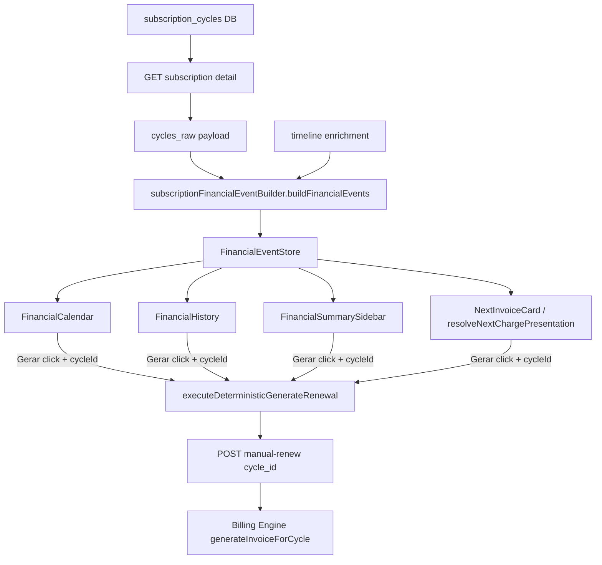

# BILLING_UI_SOURCE_GRAPH — Sprint 4.2G

Single canonical data flow for subscription financial UI.



## Forbidden paths (removed)

```
next_billing_date ──X──> FinancialEvent (projection)
buildFutureCycles() ──X──> FinancialEvent
dueYmd heuristic ──X──> cycle resolution
earliest / next-charge fallback ──X──> generate payload
```

## Module map

| Layer | Module |
|-------|--------|
| Cycle source | `subscriptionCyclesSource.ts` |
| Event builder | `subscriptionFinancialEventBuilder.ts` |
| Event store | `subscriptionFinancialEventStore.ts` |
| Next charge | `subscriptionFinancialEvents.ts`, `subscriptionNextInvoiceResolver.ts` |
| Generation | `subscriptionBillingGeneration.ts` |
| Capabilities | `invoiceCapabilities.ts` (requires `cycleId` for `supportsGenerate`) |

## Parity rule

Every competency visible in Calendar, History, Sidebar, and Next Invoice must correspond to exactly one row in `cycles_raw` with a non-null `id` used as `cycle_id` on events and generate actions.
