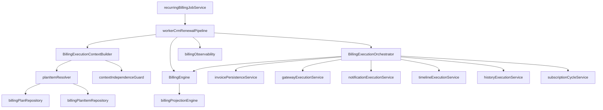
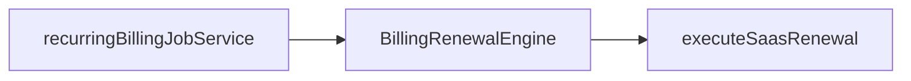

# Billing Engine 3.0 — Dependency Graph

## CRM renewal (production)



## SaaS renewal (parallel path)



## Removed dependencies (must not reappear)

```
executeCustomerRenewal
crmRenewalCustomerResolver
crmSubscriptionContractRenewalOverlay
buildBillingItemsFromInvoice
billingEngineV2/*
billingPersistence/*
```

## Shared infrastructure

| Consumer | Dependency |
|----------|------------|
| Worker | `billingRecurringJobPersistence`, `billingLogger` |
| Orchestrator | `customerInvoiceService`, gateway adapters |
| Diagnosis | `resolvePlanAndItems`, `recurringBillingJobService` |
| Contract patch | `crmContractMetadata` (no renewal overlay) |

## Public exports

- `billingEngine/index.ts` → `BillingEngine`, builders, `BILLING_ENGINE_VERSION`
- `billingExecution/index.ts` → `BillingExecutionOrchestrator`, `EXECUTION_ORCHESTRATOR_VERSION`
