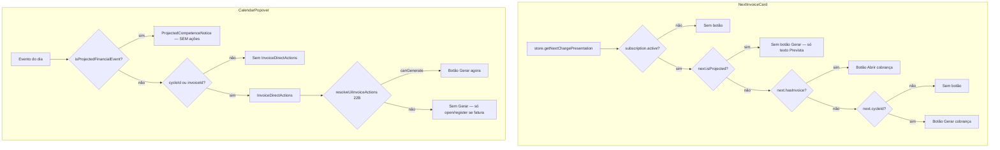

# Investigação — Botão "Gerar" ausente (pós Sprint 5.0-22B)

**Modo:** READ ONLY (sem alteração de código)  
**Data:** 2026-07-04  
**Contexto:** Após gerar a próxima cobrança, o botão Gerar não aparece no card Próxima cobrança nem no calendário para competências previstas.

---

## Resumo executivo

| Sintoma | Veredicto | Relacionado ao 22B? |
|---------|-----------|---------------------|
| Card **Próxima cobrança** sem botão **Gerar** após gerar | **Comportamento esperado** quando a próxima competência é **projetada** (`isProjected=true`); ou card mostra **Abrir** se ainda aponta para fatura recém-gerada | Parcial — wiring 22B expõe `aggregate.nextInvoice` fielmente |
| Calendário **sem Gerar** em dots **previstos** | **Comportamento intencional** desde Sprint 4.2H — React bloqueia ações em eventos `kind: projected` | **Não introduzido no 22B** — já era assim |
| Calendário **sem Gerar** em ciclo **real** (com `cycleId`) | Possível regressão 22B em `billingUiActions` (checagem mais restrita que legado) | **Sim — investigar se ciclo existe mas botão some** |

**Conclusão:** Na maioria dos casos reportados, **não há bug de renderização silenciosa** — existem **três portões independentes** que ocultam o botão Gerar, documentados abaixo. O wiring 22B **não removeu** o botão do calendário projected (ele **nunca** passou pelo popover de ações). Pode haver **regressão pontual** no popover para ciclos reais com status fora de `generateCycleIds`.

---

## Fluxo de decisão — onde o botão Gerar nasce ou morre



---

## Sintoma 1 — Card "Próxima cobrança" sem botão Gerar

### Como o card decide mostrar o botão

Arquivo: `src/components/subscriptions/financial/NextInvoiceCard.tsx`

```typescript
const showAction =
  detail.subscription.status === 'active' &&
  !next.isProjected &&
  (next.hasInvoice ? onOpenInvoice : next.cycleId && onGenerateBilling);
```

O botão **Gerar** só aparece quando **todas** as condições são verdadeiras:

1. Assinatura `active`
2. **`next.isProjected === false`** ← portão crítico
3. Sem fatura na competência (`!hasInvoice`) **e** `next.cycleId` definido

Se `hasInvoice === true`, o card mostra **Abrir cobrança**, não Gerar — isso é correto para a fatura que acabou de ser gerada.

### Fonte dos dados (pós 22B)

`store.getNextChargePresentation()` → `buildNextChargePresentationFromAggregate()` → **`aggregate.nextInvoice`**

Arquivo: `src/lib/billingCutover/adapters/nextInvoiceAdapter.ts`

| Campo UI | Regra Aggregate |
|----------|-----------------|
| `isProjected` | `true` quando **não há ciclo elegível** em `cycles[]` e cai na **primeira projeção futura** |
| `cycleId` | **`null` se projetado** (linha 68: `cycleId: isProjected ? null : next.cycleId`) |
| `hasInvoice` | `true` se `nextInvoice.metadata.invoiceId` preenchido |

Aggregate: `resolveNextInvoiceFromAggregate()` em `src/lib/billingAggregate/nextInvoiceSnapshot.ts` — após consumir todos os ciclos com fatura, retorna projeção UX sem linha em `subscription_cycles`.

### Cenários após "Gerar a próxima"

| Estado pós-geração | O que o card mostra | Botão Gerar? |
|--------------------|---------------------|--------------|
| Fatura criada no ciclo C1; **existe C2** em `cycles_raw` sem fatura | Próxima = C2, `isProjected=false`, `hasInvoice=false` | **Sim** |
| Fatura criada no C1; **não existe** próximo ciclo no banco ainda | Próxima = projeção de calendário, `isProjected=true`, subtitle *"Previsão — ciclo oficial será criado pelo agendador"* | **Não** (intencional) |
| Card ainda reflete C1 com fatura nova | `hasInvoice=true` | **Abrir**, não Gerar |
| Assinatura pausada/cancelada | `showAction=false` | **Não** |

**Interpretação mais provável do relato:** depois de gerar, o **próximo mês ainda não tem linha em `subscription_cycles`** (só projeção UX). O Aggregate marca `isProjected=true` e o React **esconde o Gerar de propósito** — alinhado à certificação 4.1L (*"Botão só na primeira prevista"*, projeções automáticas).

**Alternativa ainda disponível:** FAB **Gerar próxima** em `SubscriptionActionsPanel` (`showRenewalGenerate: active`) — não depende de `isProjected` no card.

---

## Sintoma 2 — Calendário sem botão Gerar em "faturas previstas"

### Portão 1 — React bloqueia popover para projeções

Arquivo: `src/components/subscriptions/financial/FinancialCalendarPopover.tsx`

```typescript
const projected = isProjectedFinancialEvent(ev);
const showBillingActions = !projected && (hasCycleId || Boolean(ev.invoiceId));

// ...
{showProjectionNotice ? (
  <ProjectedCompetenceNotice ev={ev} />   // "será criada automaticamente"
) : showBillingActions ? (
  <InvoiceDirectActions ... />
) : null}
```

Para **qualquer** evento `kind: 'projected'`:

- **`showBillingActions = false`**
- Usuário vê apenas `ProjectedCompetenceNotice` — **sem** `InvoiceDirectActions`
- **Nunca chega** a testar capabilities

Isso **predates 22B** (Sprint 4.2H — projeções UX sem `cycle_id`). Documentado em `docs/billing/BILLING_CALENDAR_GENERATION_AUDIT.md` § "`cycle_id` null scenarios".

### Portão 2 — Projeções não têm `cycleId`

Eventos projetados vêm de `aggregate.calendar` com `isProjected: true` e **`cycleId: null`** (sem linha no banco).

Mesmo que o popover permitisse ações, `executeDeterministicGenerateRenewal` **exige `cycle_id`** (`subscriptionBillingGeneration.ts` — erro `CYCLE_ID_REQUIRED`).

### Portão 3 — Wiring 22B (`billingUiActions`)

Se o evento **não** for projetado mas for `upcoming_cycle` **com** `cycleId`:

```typescript
// billingUiActions.ts
const canGenerate =
  cycleCanGenerateFromUiCapabilities(caps, input.cycleId) &&
  (forecast || (failed && !hasInvoice));

// uiCapabilitiesAdapter.ts
cycleCanGenerateFromUiCapabilities → cycleId deve estar em generateCycleIds
generateCycleIds → cycles sem invoice + status ∈ {pending, queued, failed, skipped, cancelled}
```

**Diferença vs legado** (`invoiceCapabilities.ts`):

| Regra | Legado | 22B |
|-------|--------|-----|
| `upcoming_cycle` sem fatura | `supportsGenerate` se **`cycleId` qualquer** | `supportsGenerate` se **`cycleId ∈ generateCycleIds`** |
| Ciclo com status ex. `processing` / `awaiting_generation` | Poderia mostrar Gerar (só exigia cycleId) | **Não** entra em `generateCycleIds` → **sem Gerar** |

**Possível regressão 22B:** dot no calendário ligado a ciclo real com status **fora** de `GENERATABLE_CYCLE_STATUSES` — antes aparecia Gerar, agora não.

---

## Matriz de portões — todos os pontos que escondem Gerar

| # | Camada | Condição | Afeta NextInvoice | Afeta Calendar projected | Afeta Calendar real |
|---|--------|----------|-------------------|------------------------|---------------------|
| P1 | React | `next.isProjected` | ✅ | — | — |
| P2 | React | `next.hasInvoice` → Abrir | ✅ | — | — |
| P3 | React | `!projected` no popover | — | ✅ | — |
| P4 | Dados | `cycleId === null` | ✅ (se projetado) | ✅ | raro |
| P5 | 22B caps | `cycleId ∉ generateCycleIds` | via histórico | — | ✅ possível |
| P6 | 22B caps | `forecast && !cycleId` | — | ✅ | — |
| P7 | API | `cycle_id` obrigatório | — | ✅ (impede mesmo se UI mostrasse) | — |

---

## Histórico financeiro (referência)

Botão **Gerar agora** na linha:

```typescript
// FinancialHistoryRow.tsx
row.canGenerateNow && !row.isProjected
```

Pós 22B, `canGenerateNow` vem de `cycleCanGenerateFromUiCapabilities` no `historyAdapter.ts` — mesma lista `generateCycleIds` que o calendário.

Se o **histórico** mostra Gerar na próxima linha mas o **card** não, a causa é quase sempre **`next.isProjected=true`** no card enquanto o histórico lista um ciclo real diferente (dedupe aggregate vs nextInvoice).

---

## Evidências de auditorias anteriores (já conhecidas)

| Documento | Achado relevante |
|-----------|-------------------|
| `BILLING_CALENDAR_GENERATION_AUDIT.md` | Projeções **nunca** têm `cycle_id`; Gerar no calendário projected enviaria payload inválido |
| `BILLING_RUNTIME_CAUSALITY_AUDIT.md` | `canGenerateNow && !isProjected` — projeções excluídas por design |
| `FUNCTIONAL_GAP_MATRIX.md` (22A) | `aggregate.capabilities` existia mas não estava wired — **22B wired** com checagem estrita |
| `FINANCIAL_EXPERIENCE_CERTIFICATION.md` | *"Destaque migra após gerar"* — espera migrar destaque, não necessariamente Gerar em projeção |

---

## Diagnóstico recomendado (manual, 2 min)

Na assinatura onde o problema ocorre, após gerar:

1. **DevTools → React / inspecionar store** (ou abrir accordion técnico):
   - `store.getNextChargePresentation()` → anotar `isProjected`, `cycleId`, `hasInvoice`
   - `store.getUiCapabilities()?.generateCycleIds`

2. **Comparar:**
   - Se `isProjected: true` → **comportamento esperado** no card (sem Gerar)
   - Se `hasInvoice: true` → card correto mostra **Abrir**
   - Se `isProjected: false`, `cycleId` set, sem botão → **bug** (investigar refresh do provider / payload)

3. **No calendário**, clicar dot previsto:
   - Se aparece *"Esta cobrança será criada automaticamente"* → **comportamento esperado** (P3)
   - Se dot é ciclo real (não previsto) e sem Gerar → verificar status do ciclo vs `generateCycleIds` (**regressão 22B P5**)

---

## Recomendações para sprint corretiva (não implementadas aqui)

| Prioridade | Ação | Escopo |
|------------|------|--------|
| **P0 — UX** | Documentar na UI que projeções não são geráveis manualmente (já existe `ProjectedCompetenceNotice`) | Produto |
| **P1 — NextInvoice** | Se produto exige Gerar na "próxima prevista", relaxar `!next.isProjected` **ou** criar ciclo antecipadamente no backend | React + API |
| **P1 — Calendar** | Não mostrar Gerar em projected (manter) **ou** resolver `dueYmd → cycle_id` antes de abrir ações (audit 4.2F) | Adapter |
| **P2 — Paridade 22B** | Alinhar `resolveUiInvoiceActions` ao legado: `(forecast && cycleId)` sem exigir `generateCycleIds.includes` para `upcoming_cycle` | `billingUiActions.ts` |
| **P2 — Paridade 22B** | Expor `aggregate.nextInvoice.isProjected` + `generateCycleIds` no card para tooltip quando botão ausente | UX debug |

---

## Resposta direta às duas queixas

### "Após gerar a próxima, a próxima não está vendo com o botão"

**Por quê:** O card só renderiza Gerar quando `next.isProjected === false` e existe `cycleId` real. Após gerar, se o próximo mês ainda **não existe como ciclo no banco**, o Aggregate devolve **`isProjected: true`** e o componente **suprime o botão** (mostra subtítulo de previsão automática). Se ainda mostra a fatura recém-gerada, o botão correto é **Abrir**, não Gerar.

### "No calendário não aparece Gerar para faturas previstas"

**Por quê:** Competências **previstas** (`kind: projected`) são **bloqueadas no React** (`FinancialCalendarPopover` linha 38) e substituídas por aviso de geração automática. Isso é **intencional** desde 4.2H e **independente** do wiring 22B. Projeções não têm `cycle_id` e a API exige `cycle_id` para geração manual.

---

## Arquivos-chave consultados

| Arquivo | Papel |
|---------|-------|
| `NextInvoiceCard.tsx` | Portão `!isProjected` |
| `FinancialCalendarPopover.tsx` | Portão `!projected` |
| `billingCutover/adapters/nextInvoiceAdapter.ts` | `cycleId` null se projetado |
| `billingCutover/billingUiActions.ts` | Capabilities 22B |
| `billingCutover/adapters/uiCapabilitiesAdapter.ts` | `generateCycleIds` |
| `billingAggregate/nextInvoiceSnapshot.ts` | Próxima = ciclo ou projeção |
| `invoiceCapabilities.ts` | Comportamento legado (referência) |
| `ProjectedCompetenceNotice.tsx` | Mensagem calendário projected |

---

**Veredicto final:** O relato é **consistente com regras certificadas** (projeção ≠ geração manual), amplificadas pelo wiring 22B que alimenta a UI fielmente pelo Aggregate. Correção só é necessária se o **produto** exigir Gerar em projeções ou se ciclos **reais** com `cycleId` deixaram de mostrar botão por regressão em `billingUiActions` (status fora de `generateCycleIds`).
