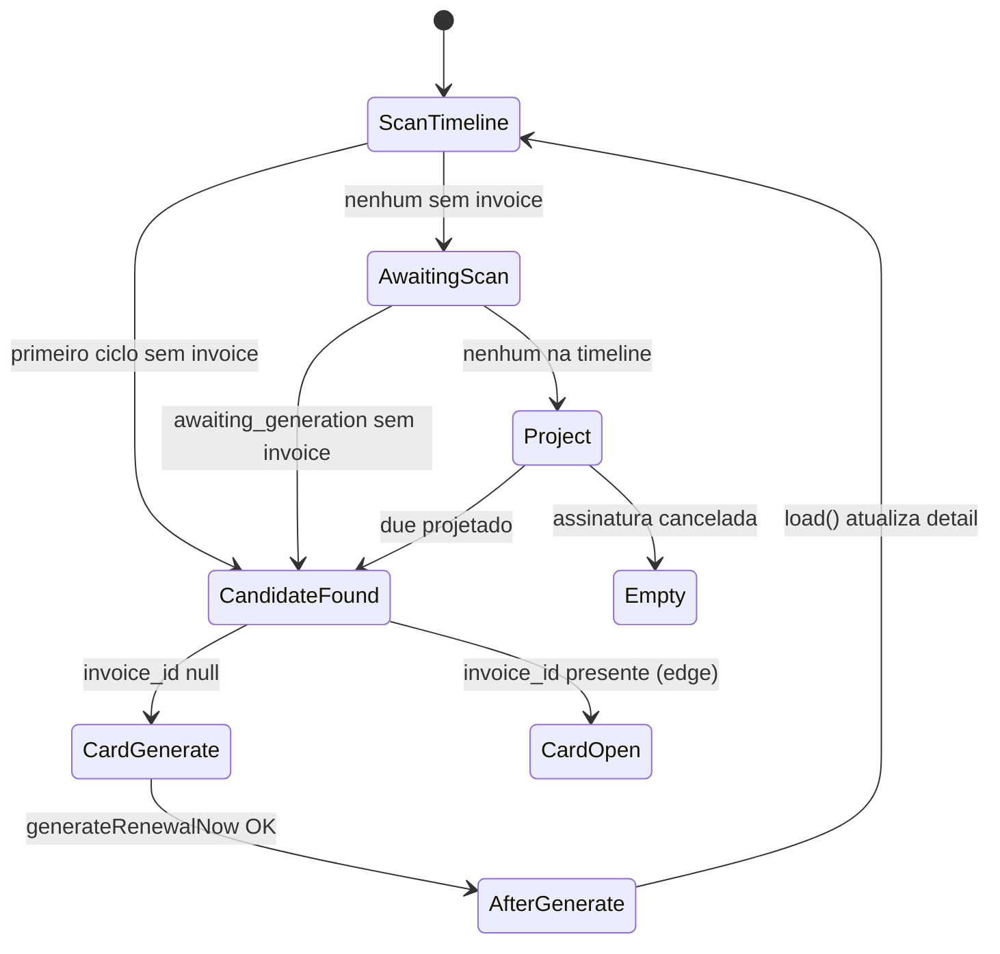

# Next Invoice State Machine — Sprint 4.1K

## Estados do candidato

| Estado | Card | Ação |
|--------|------|------|
| Sem invoice | Próxima cobrança | Gerar cobrança |
| Com invoice (edge) | Próxima cobrança | Abrir cobrança |
| Após gerar | Histórico + card promovido | Próxima competência |

## Invariantes

- Nunca duplicar competência no card
- Nunca perder competência futura
- Card sempre aponta para **primeiro ciclo futuro sem invoice**

_Sprint 4.1K_
