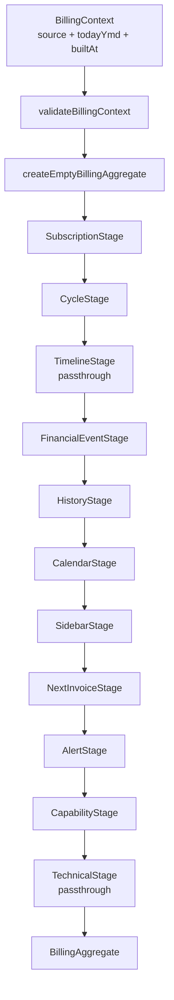
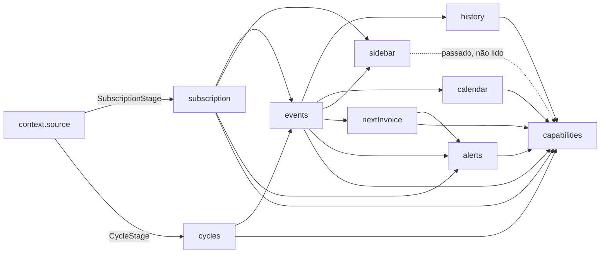
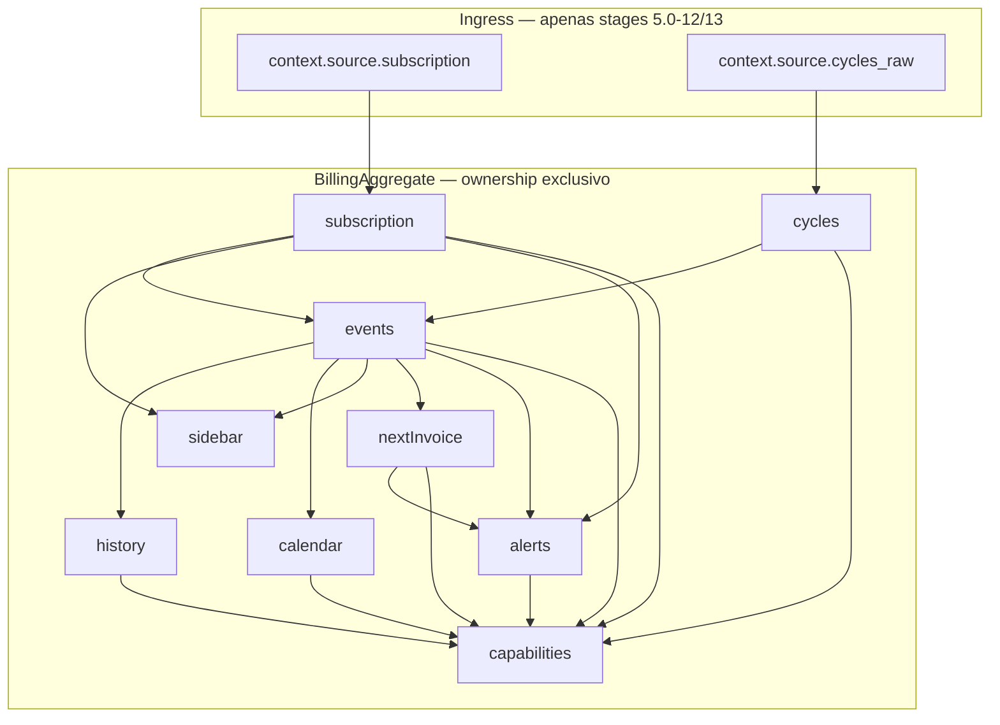
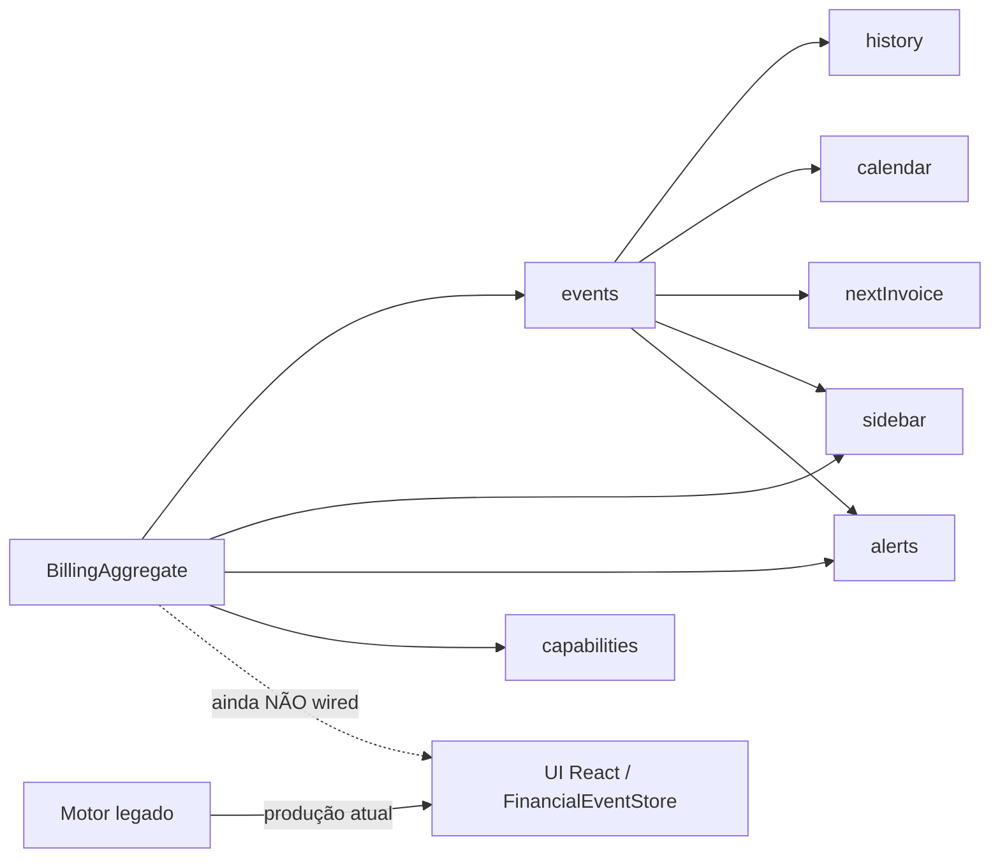

# Billing Aggregate Architecture Certification — Sprint 5.0-20A

**Mode:** READ ONLY — CERTIFICATION  
**Date:** 2026-07-03  
**Scope:** Sprints 5.0-11 … 5.0-20 (`src/lib/billingAggregate/**`)  
**Constitution:** [BILLING_ARCHITECTURE_SPECIFICATION.md](./BILLING_ARCHITECTURE_SPECIFICATION.md) (Sprint 4.2R)  
**Roadmap:** [BILLING_IMPLEMENTATION_ROADMAP.md](./BILLING_IMPLEMENTATION_ROADMAP.md)

**Rules obeyed:** nenhum código alterado, nenhum commit, nenhuma correção — apenas análise e laudo.

---

## 1. Objetivo

Certificar se o Billing Aggregate implementado nas sprints 5.0-11 a 5.0-20 atende à especificação arquitetural da Sprint 4.2R e está **apto para iniciar o Shadow Mode (5.0-21)**.

---

## 2. Pipeline completo do Aggregate

**Ordem canônica** (`BILLING_AGGREGATE_PIPELINE_STAGES`):

1. SubscriptionStage (5.0-12)  
2. CycleStage (5.0-13)  
3. TimelineStage (placeholder)  
4. FinancialEventStage (5.0-14)  
5. HistoryStage (5.0-15)  
6. CalendarStage (5.0-16)  
7. SidebarStage (5.0-17)  
8. NextInvoiceStage (5.0-18)  
9. AlertStage (5.0-19)  
10. CapabilityStage (5.0-20)  
11. TechnicalStage (placeholder)

---

## 3. Fluxo de dependências entre stages

---

## 4. Mapa de ownership dos dados

---

## 5. Fluxo Aggregate → Views

**Estado atual:** o Aggregate **não é consumido** por componentes React. A UI permanece no motor legado (`FinancialEventStore` e derivados).

---

## Tabela 1 — Dependency Graph

| Stage | Lê | Escreve | Depende de |
|-------|-----|---------|------------|
| SubscriptionStage | `context.source.subscription` | `subscription` | BillingContext (ingress) |
| CycleStage | `context.source.cycles_raw`, `subscription.id` | `cycles` | BillingContext (ingress) |
| TimelineStage | — | — | passthrough |
| FinancialEventStage | `subscription`, `cycles` | `events` | Subscription + Cycle |
| HistoryStage | `events` | `history` | FinancialEvent |
| CalendarStage | `events` | `calendar` | FinancialEvent |
| SidebarStage | `subscription`, `events` | `sidebar` | Subscription + FinancialEvent |
| NextInvoiceStage | `events` | `nextInvoice` | FinancialEvent |
| AlertStage | `subscription`, `events`, `nextInvoice` | `alerts` | Subscription + FinancialEvent + NextInvoice |
| CapabilityStage | subscription, cycles, events, history, calendar, sidebar*, nextInvoice, alerts | `capabilities` | todas as stages anteriores |
| TechnicalStage | — | — | passthrough |

\* `sidebar` é passado a `buildCapabilitiesFromAggregate` mas **não é lido** no corpo da função (ver Observação O-3).

---

## Tabela 2 — Stage Responsibilities

| Stage | Responsabilidade única | Sprint |
|-------|------------------------|--------|
| SubscriptionStage | Normalizar assinatura → `BillingSubscriptionSnapshot` | 5.0-12 |
| CycleStage | Mapear `cycles_raw` 1:1 → `BillingCycleSnapshot[]` | 5.0-13 |
| TimelineStage | Reservado (passthrough) | 5.0-11 |
| FinancialEventStage | Emitir 1 evento real por ciclo | 5.0-14 |
| HistoryStage | Projetar history 1:1 a partir de events | 5.0-15 |
| CalendarStage | Projetar calendar 1:1 a partir de events | 5.0-16 |
| SidebarStage | Resumo subscription + events | 5.0-17 |
| NextInvoiceStage | Selecionar evento mais antigo como próxima cobrança | 5.0-18 |
| AlertStage | Alertas determinísticos do Aggregate | 5.0-19 |
| CapabilityStage | Flags centralizadas de capacidade | 5.0-20 |
| TechnicalStage | Reservado (passthrough) | 5.0-11 |

---

## Tabela 3 — Legacy Dependency Check

| Módulo legado | Presente em `billingAggregate/**`? | Evidência |
|---------------|-------------------------------------|-----------|
| FinancialEventStore | **NÃO** | `grep` = 0 |
| subscriptionFinancialEventBuilder | **NÃO** | `grep` = 0 |
| subscriptionFinancialProjection | **NÃO** | `grep` = 0 |
| subscriptionFinancialExperience | **NÃO** | `grep` = 0 |
| billingSubscriptionExperience | **NÃO** | `grep` = 0 |
| subscriptionTimelineUx | **NÃO** | `grep` = 0 |
| billingStateMachine | **NÃO** | `grep` = 0 |
| resolveInvoiceCapabilities | **NÃO** | `grep` = 0 |
| cycleSupportsManualGenerate | **NÃO** | `grep` = 0 |
| subscriptionNextInvoiceResolver | **NÃO** | `grep` = 0 |
| resolveNextChargePresentation | **NÃO** | `grep` = 0 |

**Única dependência externa de tipo:** `@/services/crmSubscriptions` (`CrmSubscriptionDetailPayload` e tipos relacionados) — contrato de transporte HTTP / payload de entrada, **não** motor de apresentação legado.

---

## Tabela 4 — Data Ownership

| Dado | Owner | Quem pode ler após produção |
|------|-------|-----------------------------|
| `context.source` | BillingContext (ingress) | Apenas SubscriptionStage e CycleStage |
| `subscription` | SubscriptionStage | FinancialEvent, Sidebar, Alert, Capability |
| `cycles` | CycleStage | FinancialEvent, Capability |
| `events` | FinancialEventStage | History, Calendar, Sidebar, NextInvoice, Alert, Capability |
| `history` | HistoryStage | Capability (contagem) |
| `calendar` | CalendarStage | Capability (contagem) |
| `sidebar` | SidebarStage | Capability (passado, não lido) |
| `nextInvoice` | NextInvoiceStage | Alert, Capability |
| `alerts` | AlertStage | Capability |
| `capabilities` | CapabilityStage | (terminal — nenhum consumidor interno) |

---

## Tabela 5 — Aggregate Field Producers

| Campo | Producer | Status |
|-------|----------|--------|
| `subscriptionId`, `builtAt`, `todayYmd`, `sourceSignature` | `createEmptyBillingAggregate` | Preenchido |
| `subscription` | SubscriptionStage | Preenchido |
| `cycles` | CycleStage | Preenchido |
| `events` | FinancialEventStage | Preenchido |
| `history` | HistoryStage | Preenchido |
| `calendar` | CalendarStage | Preenchido |
| `sidebar` | SidebarStage | Preenchido |
| `nextInvoice` | NextInvoiceStage | Preenchido (`null` se sem events) |
| `alerts` | AlertStage | Preenchido |
| `capabilities` | CapabilityStage | Preenchido |
| `invoices` | — | Sempre `[]` (reservado 4.2R §6.1) |
| `timeline` | TimelineStage | Sempre `[]` (passthrough) |
| `technical` | TechnicalStage | Shell vazio (passthrough) |

---

## Tabela 6 — Aggregate Field Consumers

| Campo | Consumidores internos | Consumidor UI |
|-------|----------------------|---------------|
| `subscription` | FinancialEvent, Sidebar, Alert, Capability | Nenhum |
| `cycles` | FinancialEvent, Capability | Nenhum |
| `events` | History, Calendar, Sidebar, NextInvoice, Alert, Capability | Nenhum |
| `history` | Capability (count) | Nenhum |
| `calendar` | Capability (count) | Nenhum |
| `sidebar` | Capability (input não lido) | Nenhum |
| `nextInvoice` | Alert, Capability | Nenhum |
| `alerts` | Capability (count) | Nenhum |
| `capabilities` | — | Nenhum |
| `invoices` | — | Nenhum |
| `timeline` | — | Nenhum |
| `technical` | — | Nenhum |

---

## Tabela 7 — Duplicate Responsibilities

| Par | Avaliação |
|-----|-----------|
| History × Calendar | **Projeções paralelas intencionais** da mesma coleção `events` (1:1). Não há duplicação de decisão de negócio. |
| Sidebar × NextInvoice | Responsabilidades distintas (resumo vs seleção de evento). |
| Sidebar.lastEvent × NextInvoice | Sidebar usa evento **mais recente**; NextInvoice usa evento **mais antigo**. Critérios opostos, sem conflito. |
| Alerts × Capabilities | Alerts = sinais informativos; Capabilities = flags booleanas. Domínios distintos. |
| TimelineStage × timeline field | Ambos vazios — sem responsabilidade ativa. |

**Veredito:** nenhuma duplicação indevida de responsabilidade de decisão.

---

## Tabela 8 — Architectural Risks

| ID | Risco | Severidade | Mitigação / impacto no Shadow Mode |
|----|-------|------------|-------------------------------------|
| R-1 | `builtAt` usa `new Date().toISOString()` — não determinístico | Baixa | Não afeta decisões de negócio; signature de negócio usa `sourceSignature` + contagens |
| R-2 | `billingContextSourceSignature` lê `detail.timeline` | Média-baixa | Apenas rastreabilidade; stages de negócio pós-ingress **não** leem timeline |
| R-3 | NextInvoice = evento mais antigo, não “próxima cobrança elegível” legada | Média | Shadow Mode deve comparar semanticamente; gap conhecido documentado em 5.0-18 |
| R-4 | Capabilities simplificadas ≠ `canGenerate` / `supportsGenerate` legado | Média | Shadow Mode CERT-15 deve medir divergência |
| R-5 | Sem projeções UX (`kind: projected`) | Média | Aggregate só eventos reais; projeções são camada separada na 4.2R |
| R-6 | `invoices[]` e `lifecycle_events` ausentes no Aggregate (4.2R §6.1) | Média | Ingress ainda via `cycles_raw` + subscription; invoices não materializados |
| R-7 | `sidebar` passado a Capabilities sem uso | Baixa | Dead input; sem impacto funcional |
| R-8 | TimelineStage / TechnicalStage passthrough | Baixa | Reservados; não bloqueiam Shadow Mode |

---

## Tabela 9 — Shadow Mode Readiness

| Critério | Status | Notas |
|----------|--------|-------|
| Aggregate isolado do motor legado | **PASS** | Zero imports de apresentação legada |
| Aggregate isolado da UI | **PASS** | Nenhum componente React importa `billingAggregate` |
| Aggregate isolado do Backend/Worker/Scheduler | **PASS** | Módulo frontend puro |
| Pipeline linear e unidirecional | **PASS** | `reduce` sobre stages ordenadas |
| Stages de negócio implementadas (9/9) | **PASS** | Timeline/Technical são placeholders reservados |
| Determinismo de campos de negócio | **PASS** | Dado `source` + `todayYmd` fixos |
| Imutabilidade por stage | **PASS** | Spread `{...aggregate, field}` — sem mutação in-place |
| Golden Dataset coberto | **PASS** | Harness + testes por stage |
| Certification Suite (legado) verde | **PASS** | Snapshots visuais do motor atual intactos |
| Regression Suite 4.2K–4.2Q verde | **PASS** | Motor legado não alterado |
| Paridade semântica com legado | **NÃO CERTIFICADA** | Objetivo explícito do Shadow Mode (5.0-21) |
| Pronto para iniciar 5.0-21 | **SIM** | Com observações R-3, R-4, R-5, R-6 |

---

## 6. Respostas às perguntas obrigatórias

| # | Pergunta | Resposta |
|---|----------|----------|
| 1 | Existe qualquer import do motor legado dentro do Aggregate? | **NÃO.** Apenas tipos de `crmSubscriptions` (payload de transporte). |
| 2 | Existe qualquer stage utilizando `context.source` diretamente? | **SIM — apenas ingress:** SubscriptionStage e CycleStage. Stages posteriores usam somente `aggregate.*`. |
| 3 | Existe qualquer stage utilizando `detail.timeline`? | **NÃO** nas stages de negócio. `billingContextSourceSignature` e validação leem `timeline` apenas para assinatura/shape check. |
| 4 | Existe qualquer stage utilizando `cycles_raw`? | **SIM — apenas CycleStage** (mapper 1:1 de ingress). Demais stages usam `aggregate.cycles`. |
| 5 | Existe qualquer mutação do Aggregate durante o pipeline? | **NÃO.** Cada stage retorna novo objeto via spread. |
| 6 | Alguma stage recalcula informações já produzidas anteriormente? | **NÃO.** Cada campo é escrito uma vez pelo seu producer. |
| 7 | Existe alguma duplicação de responsabilidade entre stages? | **NÃO indevida.** History/Calendar são projeções paralelas intencionais. |
| 8 | Existe algum campo produzido e nunca utilizado? | **SIM (observação):** `invoices`, `timeline`, `technical` vazios; `sidebar` não lido em Capabilities. |
| 9 | Existe alguma dependência circular entre stages? | **NÃO.** Grafo acíclico linear. |
| 10 | Existe algum risco de race condition? | **NÃO.** Pipeline síncrono puro, sem I/O nem estado compartilhado mutável. |
| 11 | Existe algum comportamento não determinístico? | **Parcial:** `builtAt` (timestamp). Campos de negócio são determinísticos com `todayYmd` fixo. |
| 12 | Existe alguma quebra da arquitetura definida na Sprint 4.2R? | **Nenhuma quebra estrutural.** Gaps semânticos conhecidos (sem `invoices[]` no wire, sem projeções, NextInvoice/Capabilities simplificados) são esperados pré-Shadow Mode. |
| 13 | Todas as stages dependem exclusivamente das stages anteriores? | **SIM** após ingress. Ingress depende de `BillingContext.source` por design. |
| 14 | Existe algum risco arquitetural para o Shadow Mode? | **Riscos semânticos (R-3–R-6), não estruturais.** O Shadow Mode existe precisamente para medi-los. |

---

## 7. Certification Checklist

| Item | Status |
|------|--------|
| Aggregate totalmente determinístico (negócio) | **PASS** (exceto `builtAt`) |
| Aggregate imutável (por stage) | **PASS** |
| Nenhuma dependência do motor legado | **PASS** |
| Nenhuma dependência da UI | **PASS** |
| Nenhuma dependência do Backend | **PASS** |
| Nenhuma dependência de Timeline (decisão) | **PASS** |
| Nenhuma dependência de `cycles_raw` (pós-ingress) | **PASS** |
| Pipeline linear | **PASS** |
| Responsabilidade única por stage | **PASS** |
| Golden Dataset totalmente coberto | **PASS** |
| Certification Suite verde | **PASS** |
| Regression Suite verde | **PASS** |

---

## 8. Observações formais

| ID | Observação |
|----|------------|
| O-1 | Ingress legítimo: SubscriptionStage e CycleStage leem `context.source` (subscription / cycles_raw). Isso é o contrato de entrada do Aggregate, não violação de isolamento pós-build. |
| O-2 | `billingContextSourceSignature` inclui fragmentos de `timeline` para rastreabilidade. Não alimenta decisões de stages de negócio. |
| O-3 | `sidebar` é argumento de Capabilities mas não é consumido no corpo — dead input inofensivo. |
| O-4 | Campos `invoices`, `timeline` (derivada), `technical` e stages Timeline/Technical permanecem reservados/vazios. |
| O-5 | Paridade semântica com o motor legado **não** é objeto desta certificação — é objeto do Shadow Mode (5.0-21). |

---

## 9. Parecer final

### Status: **APPROVED_WITH_OBSERVATIONS**

### Motivo

O Billing Aggregate (5.0-11 … 5.0-20) implementa um **pipeline linear, imutável e isolado**, sem imports do motor de apresentação legado, sem consumo pela UI e sem acoplamento a Backend/Worker/Scheduler. As nove stages de negócio obrigatórias estão implementadas com responsabilidade única e ordem canônica alinhada à constituição 4.2R.

As observações (O-1 … O-5 e riscos R-3 … R-6) referem-se a **gaps semânticos esperados** (NextInvoice simplificado, Capabilities simplificadas, ausência de projeções e de `invoices[]` no wire) — não a violações estruturais que impediriam o Shadow Mode.

### Pendências encontradas

1. Preencher semanticamente `invoices[]` / lifecycle quando a API evoluir (4.2R §6.1) — fora do escopo 5.0-20.  
2. Remover ou consumir o input `sidebar` em Capabilities (higiene).  
3. TimelineStage / TechnicalStage ainda placeholders.  
4. Paridade com legado **não medida** — pendência explícita do 5.0-21.

### Riscos restantes

Riscos **semânticos** de divergência no Shadow Mode (NextInvoice, Capabilities, ausência de projeções). Riscos **estruturais** (circularidade, mutação, legado, race) **não encontrados**.

### Apto para Sprint 5.0-21 Shadow Mode?

# **SIM — o Aggregate está apto para iniciar a Sprint 5.0-21 Shadow Mode.**

O Shadow Mode deve:

1. Executar `buildBillingAggregateFromDetail(detail, today)` em paralelo ao `FinancialEventStore`.  
2. Comparar superfícies (events, history, calendar, nextInvoice, alerts, capabilities) sem alterar a UI.  
3. Registrar divergências (especialmente R-3, R-4, R-5) sem cutover.  
4. Manter o motor legado como única fonte de renderização até certificação de equivalência.

---

*Sprint 5.0-20A — nenhum arquivo de código foi alterado. Este documento é o laudo oficial de certificação arquitetural pré-Shadow Mode.*
