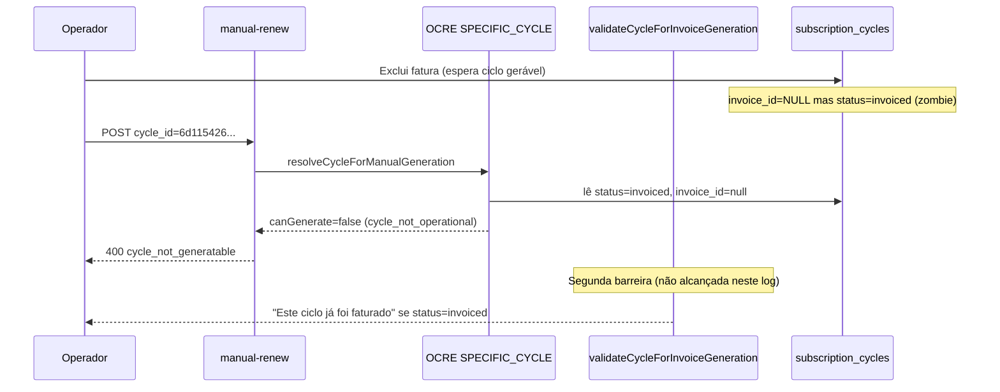

# Sprint 5.0-24B — Geração de Fatura em Ciclo Passado / Re-geração após Exclusão

**Modo:** INVESTIGATION ONLY (sem alteração de código neste sprint)  
**Data:** 2026-07-07  
**Assinatura:** `f585a448-0bb4-4ac4-976f-106efddbdd1c`  
**Tenant:** `4ecc0b33-aecd-4489-a5ae-0d7c6395c35d`  
**Ciclo alvo do log:** `6d115426-b776-4ac8-b737-4a75a363bd2c` (`cycle_date = 2026-07-23`)

---

## 1. Sintoma reportado

1. Operador **exclui** a fatura de um mês/ciclo anterior.
2. Na assinatura, clica **Gerar cobrança** na competência correspondente.
3. API retorna **400** com `result: cycle_not_generatable` / `CYCLE_NOT_GENERATABLE`.
4. Nenhuma nova fatura é criada.

### Evidência do log (backend)

```
POST /api/crm-subscriptions/f585a448-.../manual-renew
cycle_id: 6d115426-b776-4ac8-b737-4a75a363bd2c
→ HTTP 400, result: cycle_not_generatable, stage: CYCLE_RESOLUTION
```

### Evidência do console (frontend)

```json
{
  "event": "manual_renew_response_failure",
  "result": "cycle_not_generatable",
  "error_code": "CYCLE_NOT_GENERATABLE",
  "stage": "CYCLE_RESOLUTION"
}
```

---

## 2. Estado do banco no momento do erro

Ciclo clicado (`6d115426-...`):

| Campo | Valor | Problema |
|-------|-------|----------|
| `cycle_date` | `2026-07-23` | OK |
| `status` | **`invoiced`** | Bloqueia geração |
| `invoice_id` | **`NULL`** | Sem fatura — deveria ser gerável |
| `job_id` | `fe71e368-efa5-4fab-b324-d638c14bb9a0` | Job antigo ainda vinculado |
| `processed_at` | `2026-07-05` | Resíduo do ciclo anterior |

**Outros ciclos na mesma condição “zombie”** (mesmo padrão `invoiced` + `invoice_id = null`):

- `65804762-57d4-4564-9b44-6a2614cb5cbb` (`2026-07-16`)

Isso confirma que o problema **não é pontual** — há competências órfãs após exclusão de fatura.

---

## 3. Cadeia de rejeição (call stack)

```
POST manual-renew (crmSubscriptionsController.ts:516)
  → manualRenewSubscription
    → generateInvoiceForCycle (billingCycleInvoiceGenerationService.ts:50)
      → resolveCycleForManualGeneration (operationalCompetencyResolver.ts:164)
          → resolveOperationalCompetencyFromContext (mode: SPECIFIC_CYCLE)
          → resolveSpecificCycle (operationalCompetencyResolverCore.ts:135)
      ❌ PARADA 1 — linha 187-188 operationalCompetencyResolver.ts
         if (!resolved.canGenerate && resolution !== 'READY_TO_GENERATE')
           → cycle_not_generatable

      (se passasse OCRE)
      → validateCycleForInvoiceGeneration (billingCycleInvoiceGenerationService.ts:20)
      ❌ PARADA 2 — linha 24-27
         status === 'invoiced' → "Este ciclo já foi faturado."
         → cycle_not_generatable (stage: CYCLE_VALIDATION)
```

No caso atual, a requisição **morre na PARADA 1** (`stage: CYCLE_RESOLUTION` no log).

---

## 4. Root cause

### RC-1 — Estado zombie `invoiced` sem `invoice_id` (causa primária)

Após excluir a fatura, o ciclo deveria voltar a ser gerável. O código de exclusão **prevê** isso:

```sql
-- customerInvoiceAdminService.ts:449-465 (detachSubscriptionCyclesInvoiceRef)
UPDATE subscription_cycles
SET invoice_id = NULL,
    status = CASE WHEN status = 'invoiced' THEN 'pending' ELSE status END,
    processed_at = CASE WHEN status = 'invoiced' THEN NULL ELSE processed_at END
WHERE tenant_id = $1 AND invoice_id = $2
```

Porém, no banco, o ciclo permanece `status = invoiced` com `invoice_id = NULL`.

**Hipóteses para o estado inconsistente:**

| # | Hipótese | Probabilidade |
|---|----------|---------------|
| H1 | Exclusão física **não passou** por `purgeOneCustomerInvoiceRow` / `detachSubscriptionCyclesInvoiceRef` (ex.: cancelou mas não excluiu; outro endpoint; limpeza manual) | Alta |
| H2 | `invoice_id` foi limpo **sem** reset de `status` (script, repair, ou versão antiga do delete antes do Sprint 23E) | Alta |
| H3 | Cancelamento de fatura (`PATCH status=cancelled`) **não desvincula** o ciclo — só o delete físico chama `detach` | Média |
| H4 | Recovery `heal_orphan_cycles` marca `invoiced`+null como **`failed`** em vez de `pending` (`billingRecoveryService.ts:920-927`) — piora re-geração | Média (se recovery rodou) |

### RC-2 — Regra de geração usa `status`, não `invoice_id` (causa estrutural)

Mesmo com UI Sprint 23F alinhada à regra `invoice_id == NULL → Gerar`, o **backend** ainda exige:

```typescript
// operationalCompetencyResolverCore.ts:6-12
GENERATABLE_CYCLE_STATUSES = { pending, queued, failed, skipped, cancelled }
// "invoiced" NÃO está na lista

// isGeneratable (linha 96-98)
if (cycle.invoice_id) return false;
return GENERATABLE_CYCLE_STATUSES.has(cycle.status);
```

Para `status=invoiced` + `invoice_id=null`:

- `resolveSpecificCycle` → `reason: cycle_not_operational`, `canGenerate: false` (linha 184-192)
- `validateCycleForInvoiceGeneration` → `"Este ciclo já foi faturado."` (linha 25-26)

**Desalinhamento:** frontend 23F = `invoice_id`; backend generate = `status ∈ GENERATABLE`.

### RC-3 — Job concluído ainda vinculado (bloqueio secundário)

O ciclo `6d115426-...` mantém `job_id` de um job já **completed** com fatura apagada.

`billingManualRenewalService.ts:412-429` só reativa job quando `skipped_completed_cycle` **e** `result_invoice_id IS NULL`. Se o job ainda referencia a fatura deletada, o caminho de revive pode falhar mesmo após corrigir o status do ciclo.

---

## 5. Por que “meses anteriores” e “futuros” falham pelo mesmo motivo

A regra atual **não distingue passado vs futuro** no `SPECIFIC_CYCLE` quando `cycle_id` é enviado explicitamente.

O bloqueio é puramente:

```
invoice_id IS NULL  AND  status NOT IN (pending|queued|failed|skipped|cancelled)
→ cycle_not_generatable
```

Portanto:

- Ciclo **passado** com zombie `invoiced` → bloqueado  
- Ciclo **futuro** com zombie `invoiced` → bloqueado  
- Ciclo **pending** sem invoice → geraria normalmente  

O problema observado não é “data no passado” — é **estado inconsistente pós-delete**.

---

## 6. Fluxos de exclusão de fatura (o que cada um faz no ciclo)

| Ação do operador | Endpoint / serviço | Desvincula `subscription_cycles`? | Reset `status → pending`? |
|------------------|-------------------|-------------------------------------|---------------------------|
| Cancelar fatura (pendente) | `patchCustomerInvoiceWithGateway` status=cancelled | **Não** | **Não** |
| Excluir fatura assinatura (cancelled/failed) | `deleteCustomerInvoiceWithGateway` → `purgeOneCustomerInvoiceRow` | **Sim** (`detachSubscriptionCyclesInvoiceRef`) | **Sim** (se status era invoiced) |
| Excluir fatura paga/pendente ativa | Bloqueado — exige cancelar antes | — | — |
| Confirmar pagamento manual | `confirmCustomerInvoiceManualPayment` | Não | Não |

**Gap operacional:** cancelar ≠ regenerável automaticamente; só delete físico (cancelled/failed) chama detach.

---

## 7. Solução proposta (sem implementar neste sprint)

### 7.1 Correção imediata — dados (operador / suporte)

Para destravar **esta assinatura** antes de deploy de código:

```sql
-- Diagnóstico
SELECT id, cycle_date, status, invoice_id, job_id, processed_at
FROM subscription_cycles
WHERE subscription_id = 'f585a448-0bb4-4ac4-976f-106efddbdd1c'
  AND invoice_id IS NULL
  AND status = 'invoiced'
ORDER BY cycle_date;

-- Reparo (ciclo alvo + demais zombies)
UPDATE subscription_cycles
SET status = 'pending',
    processed_at = NULL,
    updated_at = now()
WHERE subscription_id = 'f585a448-0bb4-4ac4-976f-106efddbdd1c'
  AND invoice_id IS NULL
  AND status = 'invoiced';

-- Opcional: reativar job órfão do ciclo 2026-07-23
UPDATE billing_recurring_jobs
SET status = 'pending',
    result_invoice_id = NULL,
    completion_outcome = NULL,
    completion_detail = NULL,
    retry_at = NULL,
    locked_at = NULL,
    locked_by = NULL,
    error_message = NULL,
    updated_at = now()
WHERE id = 'fe71e368-efa5-4fab-b324-d638c14bb9a0'
  AND subscription_id = 'f585a448-0bb4-4ac4-976f-106efddbdd1c';
```

Depois: **Gerar cobrança** com `cycle_id = 6d115426-b776-4ac8-b737-4a75a363bd2c`.

### 7.2 Correção de produto — regra única `invoice_id` (recomendada)

Alinhar backend à regra já adotada na UI (Sprint 23F):

| Condição | Ação |
|----------|------|
| `invoice_id IS NOT NULL` | Abrir fatura |
| `invoice_id IS NULL` | Permitir Gerar (qualquer `cycle_date`, passado ou futuro) |
| `subscription.status = cancelled` | Bloquear |

**Arquivos a alterar (próximo sprint de implementação):**

1. `src/lib/operationalCompetencyResolverCore.ts` — `isGeneratable()` / `resolveSpecificCycle()`: tratar `!invoice_id` como gerável independente de `status=invoiced` residual  
2. `packages/backend/src/services/billingCycleInvoiceGenerationService.ts` — `validateCycleForInvoiceGeneration()`: remover gate por `status=invoiced`; manter só `invoice_id`  
3. `packages/backend/src/services/operationalCompetencyResolver.ts` — `resolveCycleForManualGeneration()`: aceitar `READY_TO_GENERATE` quando `invoice_id` null no modo `SPECIFIC_CYCLE`

**Não alterar:** Materializer, Scheduler, Worker core, OCRE de projeção cronológica (apenas gate de geração explícita por `cycle_id`).

### 7.3 Correção de delete — garantir ciclo sempre consistente

1. **`detachSubscriptionCyclesInvoiceRef`** — chamar também em:
   - cancelamento de fatura de assinatura (`patchCustomerInvoiceWithGateway` status=cancelled), **ou**
   - novo passo pós-cancel que limpe `invoice_id` e resete `status` se operador for re-gerar

2. **Idempotência** — repair automático no GET da assinatura ou pré-`manual-renew`:

```sql
UPDATE subscription_cycles
SET status = 'pending', processed_at = NULL
WHERE invoice_id IS NULL AND status = 'invoiced';
```

3. **`billingRecoveryService.repairOrphanCycles`** — hoje seta `failed` (linha 924); para re-geração manual, deveria setar **`pending`**, não `failed`.

### 7.4 Job revive para re-geração retroativa

Estender `ensureJobForManualGenerate` / `skipped_completed_cycle`:

- Se ciclo tem `invoice_id IS NULL` e job `completed` com `result_invoice_id` apontando para fatura inexistente → **reativar job** ou **inserir novo** para o `cycle_key` histórico.
- Já existe esboço em `billingManualRenewalService.ts:412-427`; falta cobrir job com `result_invoice_id` de fatura deletada (não só `NULL`).

### 7.5 Critérios de aceite (próxima implementação)

| # | Cenário | Resultado esperado |
|---|---------|-------------------|
| A | Excluir fatura de ciclo Jul/23 → Gerar | Nova invoice criada para `cycle_date=2026-07-23` |
| B | Ciclo passado nunca faturado (`pending`) | Gerar funciona |
| C | Ciclo futuro sem invoice | Gerar funciona |
| D | Ciclo com invoice ativa | Gerar bloqueado; Abrir disponível |
| E | Após gerar, `status=invoiced` + `invoice_id` preenchido | Estado consistente |

---

## 8. Diagrama causal



---

## 9. Resumo executivo

| Pergunta | Resposta |
|----------|----------|
| Por que não gera? | Ciclo em estado **zombie** (`invoiced` + `invoice_id` null) + backend que só permite gerar por **status**, não por `invoice_id`. |
| É bug de “mês passado”? | **Não** — é bug de **estado pós-delete** + **regra backend desalinhada** com UI 23F. |
| O delete deveria ter corrigido? | **Sim**, se passou por `purgeOneCustomerInvoiceRow`; no banco, **não ocorreu** para estes ciclos. |
| Solução rápida? | SQL repair `invoiced`→`pending` onde `invoice_id IS NULL` + reativar job. |
| Solução definitiva? | Backend: `invoice_id` como SSOT para gerar; delete/cancel sempre normalizar ciclo; revive job para re-geração retroativa. |

---

## 10. Escopo preservado (não alterado nesta investigação)

- Scheduler  
- Worker (`processNextBatch` core)  
- Materializer (`ensureSubscriptionCycle`)  
- Gateway / WhatsApp  
- OCRE cronológico (NEXT_GENERATE) — apenas documentado o gate `SPECIFIC_CYCLE`

---

## 11. Próximo passo recomendado

Sprint de **implementação** (ex.: 5.0-24B-fix) com:

1. Repair automático de zombies no path `manual-renew`  
2. Alinhamento `validateCycleForInvoiceGeneration` + OCRE `SPECIFIC_CYCLE` à regra `invoice_id`  
3. Teste de regressão: excluir fatura → gerar ciclo passado (`6d115426-...`)  
4. Opcional: unificar cancel+detach para não depender só de delete físico
