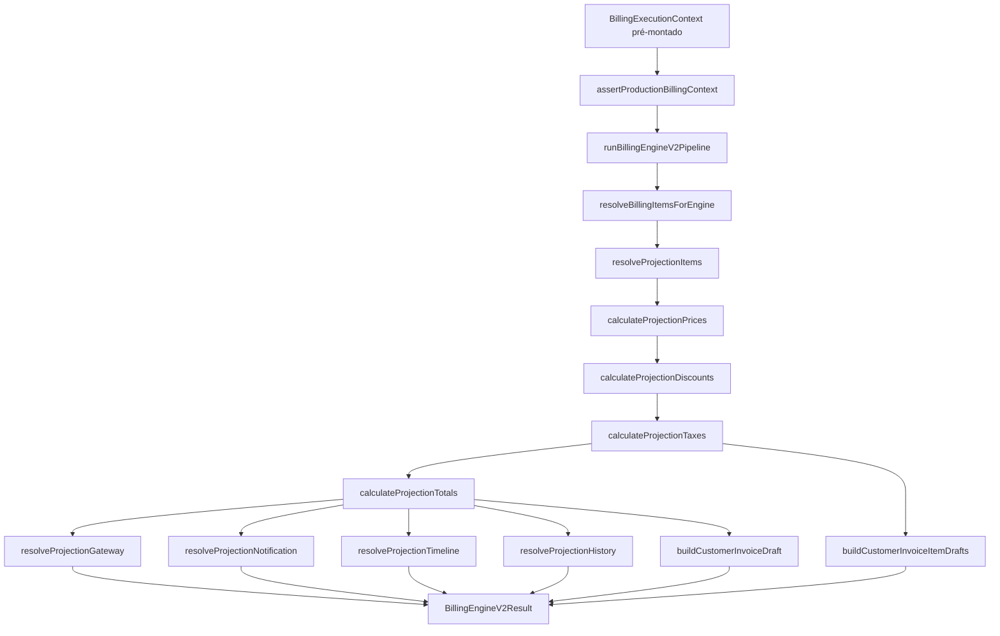

# AUDIT — BillingEngine V2 Independence (Sprint 3.0A)

**Data:** 2026-06-25  
**Modo:** AUDIT ONLY — Nenhuma alteração funcional realizada  
**Escopo:** Comprovar independência do `BillingEngineV2` em relação ao motor legado baseado em cópia da fatura anterior.

---

## Resumo Executivo

| Métrica | Resultado |
|---------|-----------|
| **Módulo `billingEngineV2/`** | Zero imports de resolvers legados no grafo de execução |
| **Projection (pipeline V2)** | Puro — sem DB, sem `customer_invoices` |
| **Context Builder (upstream)** | **Contém fallback legado** em `planItemResolver.ts` |
| **Shadow / Consistency** | Não alimentam o Engine; apenas validação/comparação |
| **Guards do Engine** | Bloqueiam 3 vetores legados explícitos |
| **Lacuna de proveniência** | Itens copiados de invoice podem passar se metadata for sanitizada |
| **Worker wiring (3.1)** | **Não recomendado** sem hardening do builder + cutover |

### Respostas obrigatórias

#### 1. O BillingEngineV2 é realmente independente do motor legado?

## **NÃO** (independência sistêmica incompleta)

**Evidências:**

1. O código de execução de `BillingEngineV2.execute()` **não importa nem chama** `resolveCrmRenewalPreviousInvoice`, `getCustomerInvoiceItems`, `overlayCrmContractOnRenewalItems` nem `executeCustomerRenewal` — confirmado por varredura estática em `packages/backend/src/billingEngineV2/*.ts` (16 arquivos, excl. testes).
2. O pipeline opera **exclusivamente** sobre `context.resolvedItems` → `BillingPlanItemRow` já materializados no contexto; Projection Item Resolver apenas mapeia `context.resolvedItems` (`projectionItemResolver.ts:12-17`).
3. **Porém**, o caminho natural de montagem de contexto em produção (`billingExecutionContextBuilder` → `resolvePlanAndItems`) **ainda invoca o resolver legado** quando não há billing items persistidos (`planItemResolver.ts:147-204`).
4. O guard do engine **rejeita** `plan_source = virtual_from_invoice_template`, mas **não valida proveniência** de cada `BillingPlanItemRow` (ex.: `snapshot_strategy: 'invoice_snapshot'`, `metadata.context_virtual` permanecem permitidos).
5. `virtual_from_subscription` é **permitido** pelo engine (apenas warning em `collectProductionWarnings`) — plano virtual sem itens persistidos resulta em falha (`BILLING_ITEMS_REQUIRED`), mas não impede itens sintéticos injetados pelo caller.

**Conclusão:** O motor V2 é **autônomo no grafo de chamadas**, mas **não é independente no sistema** enquanto o builder upstream puder hidratar o contexto via fatura anterior.

---

#### 2. Existe qualquer dependência indireta restante?

## **SIM**

**Evidências:**

| # | Dependência | Classificação | Impacto |
|---|-------------|---------------|---------|
| 1 | `billingExecutionContext/planItemResolver.ts` → `resolveCrmRenewalPreviousInvoice` + `getCustomerInvoiceItems` + `buildBillingItemsFromInvoice` | **P1** | Builder upstream — não importado pelo engine, mas afeta contexto real |
| 2 | `billingEngineV2/types.ts` → `billingShadow/types.ts` → import de tipo `BillingRenewalExecutionMode` de `billingRenewalEngine` | **P2** | Acoplamento de tipos; sem chamada em runtime |
| 3 | `billingEngineV2/engineLogger.ts` → `services/billingLogger.ts` | **P3** | Infra compartilhada; não é motor legado |
| 4 | Calculadores Projection compartilhados com Shadow/Certification | **P2** | Reuso intencional; sem consulta a invoice |
| 5 | `billingPlanItems/factory.ts` → `buildBillingItemsFromInvoice` usa tipos de `customerInvoiceService` | **P1** | Usado apenas no fallback do builder, não no engine |
| 6 | `projectionService.ts` → `normalizeLegacyRenewal` | **P3** | Fora do grafo do Engine; usado por APIs de projeção |
| 7 | Campo `metadata.invoice_items_snapshot` no tipo `BillingExecutionContext` | **P2** | Legado no contrato de dados; guard do engine bloqueia uso operacional |

---

#### 3. É seguro conectar o BillingEngineV2 ao Worker na Sprint 3.1?

## **NÃO**

**Evidências:**

1. Worker atual: `processNextBatch` → `BillingRenewalEngine.execute` → `executeCustomerRenewal` (motor V1) — Sprint 2.4C confirmou 100% renovações `customer` no V1.
2. Integração típica 3.1 usaria `billingExecutionContextBuilder.build()` → `BillingEngineV2.execute()` — para assinaturas **sem billing items persistidos**, o builder tenta fallback legado → `plan_source = virtual_from_invoice_template` → engine **lança `LEGACY_INVOICE_TEMPLATE_FORBIDDEN`** → renovação falha.
3. `diagnostics.engineReady` no builder já sinaliza `planResolution.hasPersistedPlan` — maioria das assinaturas legadas terá `engineReady: false`.
4. Cutover orchestrator (Sprint 2.3G) e certification suite existem, mas **não estão conectados ao worker**.
5. Guards do engine são necessários porém **insuficientes** sem: (a) remoção do fallback no builder, (b) migração de plan/items, (c) gating por subscription no cutover.

---

## Arquitetura Real do BillingEngineV2



**Observação crítica:** O Engine **não constrói** o contexto. Assume `BillingExecutionContext` já populado.

---

## Árvore Completa de Dependências

### Nível 0 — `BillingEngineV2.execute`

```
billingEngineV2.ts
├── billingEngineContextGuard.ts          [types only: BillingExecutionContext]
├── billingEnginePipeline.ts
│   ├── billingItemResolver.ts            → billingProjection/projectionItemResolver
│   ├── billingPriceCalculator.ts         → billingProjection/projectionPriceCalculator
│   ├── billingDiscountCalculator.ts    → billingProjection/projectionDiscountCalculator
│   ├── billingTaxCalculator.ts           → billingProjection/projectionTaxCalculator
│   ├── billingTotalsCalculator.ts        → billingProjection/projectionTotalCalculator
│   ├── billingGatewayPayloadBuilder.ts   → billingProjection/projectionGatewayResolver
│   ├── billingNotificationBuilder.ts     → billingProjection/projectionNotificationResolver
│   ├── billingTimelineBuilder.ts         → billingProjection/projectionTimelineResolver
│   ├── billingHistoryBuilder.ts          → billingProjection/projectionHistoryResolver
│   └── billingProjection/projectionHash.ts
├── billingInvoiceBuilder.ts              [types: BillingExecutionContext, TaxedProjectionItem]
├── billingNotificationBuilder.ts         [re-chamado no execute para array]
├── engineLogger.ts                       → services/billingLogger
└── types.ts
    ├── billingExecutionContext/types
    ├── billingShadow/types               [Normalized* payloads]
    └── billingProjection/* types
```

### Nível 1 — Projection (transitivo do Engine)

```
billingProjection/* (pipeline puro)
├── billingExecutionContext/types         [somente tipos + context fields]
├── billingShadow/types                   [somente tipos Normalized*]
├── node:crypto                           [projectionHash]
└── SEM: customerInvoiceService, crmRenewalCustomerResolver, executeCustomerRenewal
```

**Exceção fora do grafo do Engine:** `projectionService.ts` importa `legacyRenewalNormalizer` para APIs de comparação — **não transitivo** para `BillingEngineV2`.

### Nível 2 — ExecutionContext (upstream, não importado pelo Engine)

```
billingExecutionContextBuilder.ts
├── planItemResolver.ts                   ⚠️ LEGACY FALLBACK
│   ├── resolveCrmRenewalPreviousInvoice
│   ├── getCustomerInvoiceItems
│   └── buildBillingItemsFromInvoice
├── resolveBillingItems.ts                [puro — filtra BillingPlanItemRow]
├── billingPlan/billingPlanRepository
├── billingPlanItems/repository
└── services/billingSubscriptionService
```

### Nível 3 — Shadow (paralelo, não alimenta Engine)

```
billingShadowExecutor.ts
├── billingExecutionContextBuilder        [mesmo builder com fallback]
├── BillingProjectionEngine
├── normalizeLegacyRenewal                  ⚠️ lê customer_invoice_items
└── renewalComparisonService
```

---

## Dependências Diretas

| Arquivo Engine | Import | Legado? |
|----------------|--------|---------|
| `billingEngineV2.ts` | `billingExecutionContext/types` | Não |
| `billingEngineV2.ts` | `billingProjection/*` | Não |
| `billingItemResolver.ts` | `projectionItemResolver` | Não |
| `billingPriceCalculator.ts` | `projectionPriceCalculator` | Não |
| `billingDiscountCalculator.ts` | `projectionDiscountCalculator` | Não |
| `billingTaxCalculator.ts` | `projectionTaxCalculator` | Não |
| `billingTotalsCalculator.ts` | `projectionTotalCalculator` | Não |
| `billingGatewayPayloadBuilder.ts` | `projectionGatewayResolver` | Não |
| `billingNotificationBuilder.ts` | `projectionNotificationResolver` | Não |
| `billingTimelineBuilder.ts` | `projectionTimelineResolver` | Não |
| `billingHistoryBuilder.ts` | `projectionHistoryResolver` | Não |
| `billingInvoiceBuilder.ts` | context + pipeline types | Não |
| `types.ts` | `billingShadow/types` | P2 (tipos compartilhados) |
| `engineLogger.ts` | `billingLogger` | P3 |

**Resultado:** Nenhuma dependência direta do motor legado no pacote `billingEngineV2/`.

---

## Dependências Indiretas

| Caminho | Mecanismo | Classificação |
|---------|-----------|---------------|
| Worker 3.1 → ContextBuilder → planItemResolver | Fallback SQL em `customer_invoices` | **P1** |
| Context com itens virtuais `ctx-item-*` | Originados por `buildBillingItemsFromInvoice` | **P1** (bloqueados se `plan_source` correto) |
| `billingShadow/types` → `BillingRenewalExecutionMode` | Tipo do pacote renewal engine | **P2** |
| `snapshot_strategy: 'invoice_snapshot'` em items | Metadata de origem invoice | **P2** (não bloqueado pelo guard) |
| Feature flags em `context.featureFlags` | Lidos no contexto, **não** ramificam engine | **P3** |

---

## Dependências Transitivas

Varredura de símbolos obrigatórios no grafo Engine + Projection pipeline:

| Símbolo | billingEngineV2 | billingProjection (pipeline) | billingExecutionContext |
|---------|-----------------|------------------------------|-------------------------|
| `resolveCrmRenewalPreviousInvoice` | ❌ | ❌ | ✅ `planItemResolver.ts` |
| `getCustomerInvoiceItems` | ❌ | ❌ | ✅ `planItemResolver.ts` |
| `overlayCrmContractOnRenewalItems` | ❌ | ❌ | ❌ |
| `findCustomerInvoiceBySubscriptionAndPeriod` | ❌ | ❌ | ❌ (via resolver) |
| `executeCustomerRenewal` | ❌ | ❌ | ❌ |
| `customer_invoices` (string/SQL) | ❌ (só comentário) | ❌ | ❌ |
| `customer_invoice_items` | ❌ | ❌ | ❌ |
| `virtual_from_invoice_template` | ✅ guard rejeita | ❌ | ✅ produz no fallback |
| `legacy_invoice_copy` | ✅ guard rejeita | ❌ | ❌ (factory default) |
| `crmRenewalCustomerResolver` | ❌ | ❌ | ✅ import |

---

## Projection Audit

| Pergunta | Resposta | Evidência |
|----------|----------|-----------|
| Projection utiliza apenas Billing Plan? | **Parcial** | Usa `context.billingPlan` + `context.resolvedItems` |
| Projection consulta Billing Plan Items? | **Sim** | Via `context.resolvedItems[].item` (BillingPlanItemRow) |
| Projection consulta `customer_invoices`? | **Não** | Zero matches em `billingProjection/` |
| Projection consulta `customer_invoice_items`? | **Não** | Zero matches |
| Projection utiliza `virtual_from_invoice_template`? | **Não** | Apenas repassa `plan_source` em metadata |
| Projection possui fallback legado? | **Não** no pipeline | `projectionService.ts` compara com legacy (fora do pipeline) |

**Pipeline puro (`buildProjectedInvoice`):** idêntico ao `runBillingEngineV2Pipeline` — 100% em memória sobre `BillingExecutionContext`.

---

## ExecutionContext Audit

| Pergunta | Resposta | Evidência |
|----------|----------|-----------|
| Contexto 100% construído sem invoice anterior? | **Não sempre** | Fallback em `planItemResolver.ts:147-204` |
| Campo derivado do legado? | **Sim** | `metadata.invoice_items_snapshot`, `plan_source` |
| Snapshot legado obrigatório? | **Não** | Opcional; engine rejeita se presente |
| Invoice anterior armazenada no contexto? | **Não diretamente** | Snapshot de linhas + items virtuais derivados |

**Fluxos de `plan_source`:**

| Fonte | Condição | Engine |
|-------|----------|--------|
| `persisted_plan` | Plan + items no DB | ✅ Permitido |
| `virtual_from_subscription` | Sem plan persistido | ⚠️ Warning; falha se sem items |
| `virtual_from_invoice_template` | Fallback legado | ❌ `LEGACY_INVOICE_TEMPLATE_FORBIDDEN` |

---

## Builder Audit

### BillingInvoiceBuilder (`billingInvoiceBuilder.ts`)

| Verificação | Status |
|-------------|--------|
| Origem exclusiva Billing Plan | ✅ `billing_plan_id`, `version`, `revision` de `context.billingPlan` |
| Origem exclusiva Billing Items | ✅ drafts de `pipeline.taxed[].resolved.item` |
| Consulta indireta legado | ❌ Nenhuma |

### BillingGatewayPayloadBuilder

| Verificação | Status |
|-------------|--------|
| Origem Billing Plan | ✅ `billing_plan_id` no payload |
| Consulta legado | ❌ Usa `context.gateway` + `grandTotal` |

### BillingNotificationBuilder

| Verificação | Status |
|-------------|--------|
| Origem contexto | ✅ `context.notifications` + `cycle_key` |
| Consulta legado | ❌ |

### BillingTimelineBuilder / BillingHistoryBuilder

| Verificação | Status |
|-------------|--------|
| Origem contexto | ✅ eventos do contexto ou defaults sintéticos |
| Consulta legado | ❌ |

---

## Calculator Audit

| Módulo | DB? | Invoice anterior? | Projection legada? | Só Context/pipeline? |
|--------|-----|-------------------|--------------------|-----------------------|
| `billingPriceCalculator` | ❌ | ❌ | ❌ (reusa projection) | ✅ items priced |
| `billingDiscountCalculator` | ❌ | ❌ | ❌ | ✅ |
| `billingTaxCalculator` | ❌ | ❌ | ❌ | ✅ usa `item.total_amount` pré-calculado |
| `billingTotalsCalculator` | ❌ | ❌ | ❌ | ✅ |

**Nota:** `projectionTaxCalculator` usa `item.resolved.item.total_amount` do `BillingPlanItemRow` em vez de recalcular imposto — depende da qualidade dos dados do item, não do motor legado.

---

## Shadow Boundary

```
BillingEngineV2  ──X──►  billingShadow/*     (sem import de executor/normalizer)
billingShadow    ──X──►  BillingEngineV2     (zero referências)
```

- Shadow **consome** `BillingProjectionEngine` + `billingExecutionContextBuilder` após V1 executar.
- `legacyRenewalNormalizer` lê `getCustomerInvoiceItems` para normalizar resultado V1 — **nunca** alimenta o Engine V2.
- Tipos `Normalized*` em `billingShadow/types.ts` são **reutilizados** pelo Engine para payloads — boundary de tipos apenas (**P2**).

---

## Consistency Boundary

```
BillingConsistencyValidator
  → billingExecutionContextBuilder (opcional)
  → validateBillingPlan / validateBillingItems / checks
  → NÃO importa BillingEngineV2
  → NÃO fornece dados ao Engine
```

- Uso exclusivamente **validação** e relatórios.
- `integrationChecks.ts` aceita `legacy_invoice_copy` como strategy válida — relevante para consistency, não para engine guards.

---

## Legacy References

### Dentro do grafo Engine (runtime)

| Referência | Tipo |
|------------|------|
| Comentário em `billingEngineV2.ts:5` | Documentação |
| Guards em `billingEngineContextGuard.ts` | Rejeição explícita |
| Testes em `billingEngineV2.test.ts` | Assert negativo |

### Fora do grafo Engine (upstream / paralelo)

| Arquivo | Referência | Classificação |
|---------|------------|---------------|
| `planItemResolver.ts` | Resolver + factory invoice | **P1** |
| `billingPlanFactory.ts` | Default `legacy_invoice_copy` | **P2** (virtual plan override para `billing_plan_items`) |
| `legacyRenewalNormalizer.ts` | Shadow only | **P3** |
| `projectionService.ts` | Comparação legacy | **P3** |
| `executeCustomerRenewal.ts` | Produção V1 | **P0** (paralelo, não no V2) |

---

## Riscos

| ID | Risco | Sev | Descrição |
|----|-------|-----|-----------|
| R1 | Builder fallback ativo | **P1** | ContextBuilder hidrata via invoice quando DB sem items |
| R2 | Proveniência de items não validada | **P1** | Guard checa metadata, não `snapshot_strategy` / `origin` por item |
| R3 | `virtual_from_subscription` permitido | **P2** | Plano virtual sem persistência — warning only |
| R4 | Conexão Worker sem cutover | **P0** | Falha em massa para subs sem plan/items persistidos |
| R5 | Tipos compartilhados com Shadow/Renewal | **P2** | Acoplamento arquitetural futuro |
| R6 | `engineReady` ignorado pelo Engine | **P1** | Builder calcula flag; engine não a usa como gate |

---

## Checklist de Independência

| # | Item | Status |
|---|------|--------|
| 1 | Árvore completa de dependências produzida | ✅ |
| 2 | Todos os imports de `billingEngineV2/` auditados | ✅ (16 arquivos) |
| 3 | Pipeline Projection auditado | ✅ |
| 4 | `planItemResolver` fallback documentado | ✅ |
| 5 | Guards do engine documentados | ✅ |
| 6 | Shadow não alimenta Engine | ✅ |
| 7 | Consistency não alimenta Engine | ✅ |
| 8 | Varredura de símbolos obrigatórios | ✅ |
| 9 | Nenhuma alteração funcional | ✅ |
| 10 | Engine gera invoice sem DB no execute | ✅ |
| 11 | ContextBuilder livre de legado | ❌ |
| 12 | 100% subs produção compatíveis hoje | ❌ |

---

## Conclusão

O **BillingEngineV2** cumpre o desenho da Sprint 3.0 no **escopo do módulo**: pipeline puro, delegação aos calculadores Projection, guards contra vetores legados explícitos, zero chamadas a `customer_invoices` / resolvers V1 durante `execute()`.

A **independência sistêmica** permanece **incompleta** porque:

1. O **único produtor realista** de `BillingExecutionContext` em produção (`billingExecutionContextBuilder`) ainda contém fallback legado em `planItemResolver.ts`.
2. Os **guards** protegem contra `plan_source` e `invoice_items_snapshot` conhecidos, mas **não auditam proveniência item-a-item**.
3. A **maioria das renovações CRM** ainda depende de template de fatura (Sprint 2.4C) — conectar o Worker agora trocaria falhas silenciosas V1 por falhas explícitas V2.

**Pré-requisitos Sprint 3.1 (recomendados, fora desta auditoria):**

- Remover ou isolar fallback em `planItemResolver` para caminho Worker V2
- Exigir `has_persisted_plan && engineReady` antes de rotear para V2
- Usar cutover orchestrator por subscription
- Migrar plan/items para assinaturas elegíveis

---

## Metodologia

- Leitura estática de `billingEngineV2/`, `billingProjection/` (pipeline), `billingExecutionContext/`, `billingShadow/`, `billingConsistency/`
- `grep` dos 12 símbolos obrigatórios em `packages/backend/src`
- Rastreamento de imports transitivos manual
- Cruzamento com `AUDIT_LEGACY_DEPENDENCIES.md` (Sprint 2.4C)
- **Nenhum arquivo de código foi modificado**
