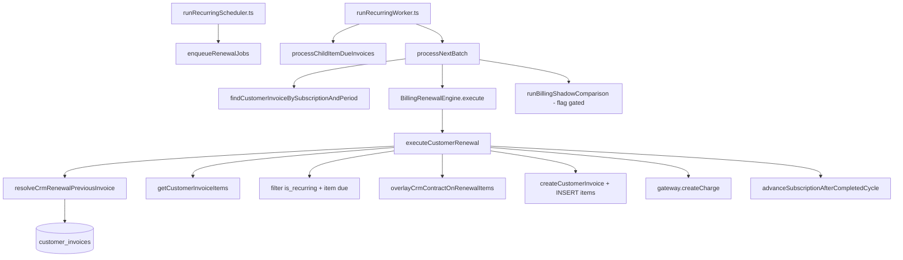

# AUDIT — Billing Legacy Dependencies (Sprint 2.4C)

**Data:** 2026-06-26  
**Modo:** AUDIT ONLY — Nenhuma alteração funcional realizada  
**Objetivo:** Inventariar toda dependência do motor legado baseado em **cópia da fatura anterior** antes da ativação do Billing Engine V2.

---

## Resumo Executivo

| Métrica | Valor |
|---------|-------|
| **Motor legado em produção** | Ativo — 100% das renovações `customer` |
| **Ponto único de execução V1** | `executeCustomerRenewal` |
| **Resolver de template** | `resolveCrmRenewalPreviousInvoice` |
| **Flag `BILLING_PLAN_V2`** | Default `false`; provider V2 é **stub** (`implemented: false`) |
| **V2 em produção** | Inexistente — apenas shadow, projection, certification (READ) |
| **Símbolos ausentes** | `copyRecurringInvoice`, `cloneInvoiceItems`, `previousInvoiceResolver`, `invoiceTemplateResolver` |
| **Imports mortos confirmados** | `recurringBillingJobService.ts` (3 símbolos V1 importados, zero chamadas) |
| **Recomendação** | **NÃO PRONTO** para remover o motor legado |

### Resposta obrigatória

> **É seguro remover definitivamente o motor legado baseado em cópia da fatura anterior?**

## **NÃO**

**Evidências:**

1. O worker de produção (`runRecurringWorker` → `processNextBatch` → `BillingRenewalEngine.execute` → `executeCustomerRenewal`) **ainda cria faturas copiando linhas** da fatura anterior via `getCustomerInvoiceItems` + `INSERT customer_invoice_items`.
2. `BILLING_PLAN_V2=true` **não substitui** o motor — `BillingPlanProviderV2` retorna `not_implemented`.
3. O fallback V2 em `planItemResolver.ts` **reutiliza o mesmo resolver legado** quando não há billing items persistidos (`virtual_from_invoice_template`).
4. Não existe caminho alternativo de renovação `customer` que use `BillingProjectionEngine` para **gerar** invoices em produção.
5. Remoção imediata causaria falha permanente em assinaturas sem billing plan/items persistidos e em todo o fluxo de recorrência CRM.

---

## Mapa Completo do Fluxo Legado



**Fluxo manual (mesmo motor V1):**

```text
crmSubscriptionsController
  → billingManualRenewalService.manualRenewSubscription
  → diagnoseRenewalForTenant (resolveCrmRenewalPreviousInvoice)
  → executeRenewalJobSynchronously
  → processNextBatch
  → BillingRenewalEngine.execute → executeCustomerRenewal
```

**Fluxo V2 READ (não substitui produção):**

```text
billingExecutionContextBuilder
  → planItemResolver.resolvePlanAndItems
  → [fallback] resolveCrmRenewalPreviousInvoice + buildBillingItemsFromInvoice
  → BillingProjectionEngine / Consistency / Shadow / Certification
```

---

## Pontos que Ainda Dependem da Fatura Anterior

### P0 — Bloqueia ativação V2

| # | Arquivo | Função / símbolo | Dependência |
|---|---------|------------------|-------------|
| 1 | `services/billingRenewalEngine/executeCustomerRenewal.ts` | `executeCustomerRenewal` | Resolve template, copia itens, cria invoice, gateway |
| 2 | `services/crmRenewalCustomerResolver.ts` | `resolveCrmRenewalPreviousInvoice` | 5 estratégias SQL em `customer_invoices` + sintético `crm_contract` |
| 3 | `services/crmSubscriptionContractRenewalOverlay.ts` | `overlayCrmContractOnRenewalItems` | Sobrescreve valores copiados do template |
| 4 | `services/billingRenewalEngine/billingRenewalEngine.ts` | `BillingRenewalEngine.execute` | Roteia `customer` → `executeCustomerRenewal` |
| 5 | `services/recurringBillingJobService.ts` | `processNextBatch` | Orquestra worker; delega ao engine |
| 6 | `services/recurringBillingJobService.ts` | `enqueueRenewalJobs` | Scheduler cria jobs de renovação |
| 7 | `services/customerInvoiceService.ts` | `findCustomerInvoiceBySubscriptionAndPeriod` | Idempotência + lookup de template |
| 8 | `services/customerInvoiceService.ts` | `getCustomerInvoiceItems` | Carrega linhas do template |
| 9 | `scripts/runRecurringWorker.ts` | `main` | Entry point worker |
| 10 | `scripts/runRecurringScheduler.ts` | `main` | Entry point scheduler |

**Estratégias de lookup (`resolveCrmRenewalPreviousInvoice`):**

1. `current_period_start` exato  
2. Ciclo anterior calculado  
3. Última invoice antes do ciclo  
4. Última invoice qualquer  
5. Itens sintéticos de `subscriptions.metadata.crm_contract`

**Pipeline de cópia (`executeCustomerRenewal`):**

- Stage `PREVIOUS_INVOICE` em `renewalPipelineTrace`
- Filtra `is_recurring`, aplica `resolveMainRenewalItemDue` (E2)
- `overlayCrmContractOnRenewalItems`
- `createCustomerInvoice` + loop `INSERT INTO customer_invoice_items` copiando campos do template

### P1 — Deve ser removido/substituído antes do deploy V2

| # | Arquivo | Função | Dependência |
|---|---------|--------|-------------|
| 11 | `billingExecutionContext/planItemResolver.ts` | `resolvePlanAndItems` | Fallback `virtual_from_invoice_template` via resolver V1 |
| 12 | `billingPlanItems/factory.ts` | `buildBillingItemsFromInvoice` | Converte linhas de invoice em billing items V2 |
| 13 | `services/renewalDiagnosisService.ts` | `diagnoseRenewal` | `template_resolvable` via `resolveCrmRenewalPreviousInvoice` |
| 14 | `services/billingManualRenewalService.ts` | `manualRenewSubscription` | UI/API manual → mesmo pipeline V1 |
| 15 | `controllers/crmSubscriptionsController.ts` | handlers manual renewal | Expõe motor legado |
| 16 | `services/recurringCustomerRenewalItemDueAnchor.ts` | `resolveMainRenewalItemDue` | Lógica E2 no template copy |
| 17 | `services/recurringBillingJobService.ts` | `processChildItemDueInvoices` | Copia item de invoice pai → child invoice (E2) |
| 18 | `services/crmSubscriptionsContractService.ts` | usa `getCustomerInvoiceItems` | Leitura de itens para contrato |
| 19 | `services/renewalErrorClassification.ts` | `missing_previous_invoice_template` | Classificação operacional |
| 20 | `services/billingRenewalError.ts` | stage `PREVIOUS_INVOICE` | Erros de template |
| 21 | `services/renewalPipelineTrace.ts` | stage `PREVIOUS_INVOICE` | Telemetria |

### P2 — Pode permanecer temporariamente (READ / comparação)

| # | Arquivo | Função | Uso |
|---|---------|--------|-----|
| 22 | `billingShadow/legacyRenewalNormalizer.ts` | `normalizeLegacyRenewal` | Normaliza saída V1 para comparação |
| 23 | `billingShadow/billingShadowExecutor.ts` | `runBillingShadowComparison` | Pós-renewal shadow (flag) |
| 24 | `billingProjection/projectionService.ts` | `compareProjectionWithLegacy` | API superadmin |
| 25 | `billingCertification/billingCertificationEngine.ts` | `loadLatestInvoiceId` | Baseline legacy na certificação |
| 26 | `billingMigrationSimulator/billingMigrationSimulatorEngine.ts` | `normalizeLegacyRenewal` | Simulação de migração |
| 27 | `billingPlan/billingPlanFactory.ts` | `buildBillingPlanFromSubscription` | `billing_strategy: legacy_invoice_copy` |
| 28 | `billingPlan/billingPlanProvider.ts` | `LegacySubscriptionProvider` | Documenta motor atual |

### P3 — Código morto / sem impacto operacional direto

| # | Arquivo | Evidência |
|---|---------|-----------|
| 29 | `services/recurringBillingJobService.ts` | Imports não usados: `resolveCrmRenewalPreviousInvoice`, `overlayCrmContractOnRenewalItems`, `getCustomerInvoiceItems` |
| 30 | `billingShadow/shadowPlanResolver.ts` | `resolveShadowBillingPlanAndItems` — exportado, sem callers em produção |
| 31 | `billingShadow/billingRenewalShadowEngine.ts` | Usado apenas em testes |
| 32 | `services/billingRenewalEngine/types.ts` | Campo `invoiceTemplate?` nunca populado |
| 33 | `scripts/build-executeCustomerRenewal.mjs` | Codegen B0.3 |
| 34 | `scripts/clean-recurringBillingJobService.mjs` | Script one-off |

---

## Símbolos Pesquisados — Resultado

| Símbolo | Status | Localização real |
|---------|--------|------------------|
| `resolveCrmRenewalPreviousInvoice` | ✅ Existe | `crmRenewalCustomerResolver.ts` |
| `overlayCrmContractOnRenewalItems` | ✅ Existe | `crmSubscriptionContractRenewalOverlay.ts` |
| `executeCustomerRenewal` | ✅ Existe | `billingRenewalEngine/executeCustomerRenewal.ts` |
| `legacyRenewal` / `normalizeLegacyRenewal` | ✅ Existe | `billingShadow/legacyRenewalNormalizer.ts` |
| `crmRenewalCustomerResolver` | ✅ Módulo | Arquivo `crmRenewalCustomerResolver.ts` |
| `copyRecurringInvoice` | ❌ Ausente | Lógica inline em `executeCustomerRenewal` |
| `cloneInvoiceItems` | ❌ Ausente | Lógica inline em `executeCustomerRenewal` |
| `previousInvoiceResolver` | ❌ Ausente | Substituído por `resolveCrmRenewalPreviousInvoice` |
| `invoiceTemplateResolver` | ❌ Ausente | — |

---

## Repositories e Acesso a `customer_invoices` como Template

| Arquivo | Função | Uso como template | Classificação |
|---------|--------|-------------------|---------------|
| `services/customerInvoiceService.ts` | `findCustomerInvoiceBySubscriptionAndPeriod` | Lookup principal do template | **P0** |
| `services/customerInvoiceService.ts` | `getCustomerInvoiceItems` | Linhas copiadas na renovação | **P0** |
| `services/crmRenewalCustomerResolver.ts` | `findLatestSubscriptionInvoiceBefore` | Fallback lookup | **P0** |
| `services/crmRenewalCustomerResolver.ts` | `findLatestSubscriptionInvoiceAny` | Fallback lookup | **P0** |
| `billingPlan/billingPlanRepository.ts` | `findActiveBySubscription` | Ausência dispara fallback V1 em resolver | **P1** |
| `billingPlanItems/repository.ts` | effective items | Ausência dispara fallback invoice template | **P1** |
| `billingShadow/billingShadowReportRepository.ts` | shadow reports | Não usa template operacional | **P2** |

---

## Workers

| Worker | Arquivo | Dependência legada | Classificação |
|--------|---------|-------------------|---------------|
| Recurring worker | `scripts/runRecurringWorker.ts` | `processNextBatch` → V1 engine | **P0** |
| Billing worker adapter | `workerRuntime/billingWorkerAdapter.ts` | Wrapper heartbeat | **P0** |
| Child item worker | `processChildItemDueInvoices` em `recurringBillingJobService.ts` | Copia linha de invoice pai | **P1** |

**`processNextBatch`:** Após extração B0.3, **não** contém cópia inline — delega a `BillingRenewalEngine.execute`. Shadow hook `runBillingShadowComparison` é flag-gated (`BILLING_PLAN_V2_SHADOW`).

---

## Schedulers

| Scheduler | Arquivo | Dependência | Classificação |
|-----------|---------|-------------|---------------|
| Recurring scheduler | `scripts/runRecurringScheduler.ts` | `enqueueRenewalJobs` — jobs alimentam pipeline V1 | **P0** |

O scheduler **não** resolve invoice anterior diretamente; depende indiretamente do motor que o worker executa.

---

## Notifications

| Ponto | Dependência de template legado? | Evidência |
|-------|--------------------------------|-----------|
| `executeCustomerRenewal` pós-gateway | **Indireta** | Notificação enfileirada após invoice **criada pelo copy** (`notificationStatus: 'queued'`) |
| Notification Engine | **Não** | Dispara sobre invoice já criada; não lê template anterior |
| `billingProjection` / shadow | **Não operacional** | Payload simulado a partir de projection |

**Conclusão:** Notificações não implementam copy de template, mas **dependem do resultado** do motor legado para existir a invoice a notificar.

---

## Gateway

| Ponto | Dependência de template legado? | Evidência |
|-------|--------------------------------|-----------|
| `executeCustomerRenewal` | **Indireta** | `gateway.createCharge` usa invoice criada após copy; valores derivados dos itens copiados |
| `processChildItemDueInvoices` | **Parcial** | `amount_cents` da linha pai (`row.total_cents`), não re-resolve template de ciclo |
| V2 Projection gateway payload | **Não operacional** | Simulado em context/projection |

---

## Fallbacks Encontrados

| Fallback | Onde | Comportamento | Classificação |
|----------|------|---------------|---------------|
| Sem invoice anterior | `crmRenewalCustomerResolver.ts` | Sintético de `crm_contract` metadata | **P0** |
| Sem template resolvível | `executeCustomerRenewal.ts` | `RenewalHardeningError` permanente | **P0** |
| Sem itens elegíveis | `executeCustomerRenewal.ts` | Avança ciclo sem invoice (`COMPLETED_NO_INVOICE`) | **P0** |
| Sem billing plan persistido (V2) | `planItemResolver.ts` | `virtual_from_subscription` | **P1** |
| Sem billing items (V2) | `planItemResolver.ts` | `resolveCrmRenewalPreviousInvoice` → `virtual_from_invoice_template` | **P1** |
| `BILLING_PLAN_V2=true` | `billingPlanProvider.ts` | **Não altera motor** — stub | **P2** |
| Idempotência invoice existente | `processNextBatch` | Reusa invoice do período | **P0** (não é copy, mas acoplado ao modelo legado) |

---

## Feature Flags Inventariadas

| Flag | Arquivo | Default | Efeito no motor copy |
|------|---------|---------|---------------------|
| `BILLING_PLAN_V2` | `config/billingEnv.ts` | `false` | **Nenhum** em produção |
| `BILLING_PLAN_V2_SHADOW` | `config/billingEnv.ts` | `false` | Shadow READ pós-renewal |
| `BILLING_CHILD_ITEM_INVOICES_ENABLED` | `config/billingEnv.ts` | `true` | E2 child invoices |
| `BILLING_ALERT_ON_NO_INVOICE_CYCLE` | `config/billingEnv.ts` | `false` | Alerta ciclo sem invoice |
| `billing_recovery.shadow_metrics_v1` | migration SQL | `false` | Platform flag separada |
| Context `billing_plan_v2` | `billingExecutionContext/types.ts` | em context | Metadata apenas |

---

## Código Morto e Duplicação Funcional

### Imports mortos (confirmado — import sem chamada)

**`packages/backend/src/services/recurringBillingJobService.ts`:**

- `resolveCrmRenewalPreviousInvoice`
- `overlayCrmContractOnRenewalItems`
- `getCustomerInvoiceItems` (importado, **zero** `getCustomerInvoiceItems(` no arquivo)

### Exports sem callers de produção

- `resolveShadowBillingPlanAndItems` (`billingShadow/shadowPlanResolver.ts`) — superseded por `planItemResolver`
- `BillingRenewalShadowEngine` — apenas `billingShadow.test.ts`
- `BillingPlanProviderV2` — stub; só testes

### Duplicação funcional

| Capacidade | Implementação legada (P0) | Implementação V2 (READ) |
|------------|---------------------------|-------------------------|
| Resolver template | `resolveCrmRenewalPreviousInvoice` | `planItemResolver` (reusa o mesmo) |
| Montar itens | Copy SQL + overlay | `buildBillingItemsFromInvoice` |
| Calcular totais | Inline no INSERT | `BillingProjectionEngine` |
| Validar | `renewalDiagnosisService` | `BillingConsistencyValidator` |
| Comparar | — | Shadow / Simulator / Certification |

**Risco:** Duas fontes de verdade paralelas até cutover — V2 pode divergir se billing items não estiverem persistidos para todos os tenants.

---

## Controllers e Rotas Afetadas

| Rota / controller | Impacto |
|-------------------|---------|
| `crmSubscriptionsController` | Manual renewal → V1 |
| `superadminBillingController` | Shadow, projection, certification (READ) |
| `customerInvoicesController` | `getCustomerInvoiceItems` (leitura, não renewal) |
| `recurringBillingJobService` re-export | `diagnoseRenewal` |

### Frontend

| Arquivo | Referência |
|---------|------------|
| `src/components/subscriptions/SubscriptionRenewalActionsCard.tsx` | Mensagem `invoice_template_missing` |

---

## Testes Afetados

| Arquivo de teste | Cobertura legada |
|------------------|------------------|
| `crmRenewalCustomerResolver.test.ts` | Resolver template |
| `crmSubscriptionsContractService.test.ts` | Overlay contrato |
| `billingRenewalEngine/billingRenewalEngine.test.ts` | Roteamento para `executeCustomerRenewal` |
| `billingManualRenewalExecution.test.ts` | Manual renewal + diagnosis |
| `renewalManualReadiness.test.ts` | `template_resolvable` |
| `renewalErrorClassification.test.ts` | `missing_previous_invoice_template` |
| `renewalPipelineTrace.test.ts` | Stage `PREVIOUS_INVOICE` |
| `billingShadow/billingShadowExecutor.test.ts` | `normalizeLegacyRenewal` |
| `billingPlan/billingPlanProvider.test.ts` | Flag V2 stub |
| `billingPlan/billingPlanFeatureFlag.test.ts` | `BILLING_PLAN_V2` |

---

## Riscos para Ativação do V2

| Risco | Severidade | Descrição |
|-------|------------|-----------|
| **R1 — Produção 100% V1** | Crítico | Nenhum tenant usa projection para cobrar |
| **R2 — Fallback compartilhado** | Alto | V2 READ ainda chama resolver V1 sem billing items |
| **R3 — Primeira fatura** | Alto | Assinaturas sem invoice anterior dependem de sintético `crm_contract` |
| **R4 — E2 child path** | Médio | `processChildItemDueInvoices` copia de invoice pai independente do V2 |
| **R5 — Duplicação** | Médio | Regras em copy inline vs projection podem divergir |
| **R6 — Diagnosis/UI** | Médio | Manual renewal bloqueia se `template_resolvable=false` |
| **R7 — Imports mortos** | Baixo | Confusão em manutenção; não afeta runtime |

---

## Plano de Remoção por Prioridade

### Fase 1 — Pré-requisitos (antes de qualquer cutover)

- [ ] **P0** Implementar motor V2 de **escrita** (renewal production) usando `BillingProjectionEngine`
- [ ] **P0** Garantir billing plan + items persistidos para 100% assinaturas ativas (certification suite)
- [ ] **P0** Eliminar fallback `virtual_from_invoice_template` ou torná-lo explicitamente temporário com TTL
- [ ] **P1** Rewire `diagnoseRenewal` para validar V2 readiness em vez de template copy
- [ ] **P1** Decidir destino do path E2 (`processChildItemDueInvoices`)

### Fase 2 — Cutover (Sprint 2.4C+ / Activation)

- [ ] **P0** Feature flag por tenant: V2 gera invoice; V1 desligado
- [ ] **P0** Dual-write ou shadow obrigatório durante janela de observação
- [ ] **P0** Remover chamada `executeCustomerRenewal` do hot path

### Fase 3 — Limpeza pós-estabilização

- [ ] **P1** Remover `resolveCrmRenewalPreviousInvoice` do `planItemResolver`
- [ ] **P2** Manter `normalizeLegacyRenewal` apenas para auditoria histórica ou remover após TTL
- [ ] **P3** Limpar imports mortos em `recurringBillingJobService.ts`
- [ ] **P3** Remover `shadowPlanResolver`, `BillingRenewalShadowEngine` se não usados
- [ ] **P3** Remover campo `invoiceTemplate?` não populado

---

## Checklist Final de Remoção

| Item | Status atual |
|------|--------------|
| Motor V2 gera invoices em produção | ❌ |
| 100% assinaturas com billing plan/items | ❌ (certificação operacional pendente) |
| Fallback invoice template eliminado | ❌ |
| `executeCustomerRenewal` sem callers | ❌ |
| `resolveCrmRenewalPreviousInvoice` sem callers | ❌ |
| Worker/scheduler desacoplados do copy | ❌ |
| Gateway/notifications testados com V2 | ❌ |
| Regression + certification lab verdes em prod data | ⚠️ Lab local OK; dados reais pendente |
| Imports mortos removidos | ❌ |
| Documentação de cutover aprovada | ✅ (sprints 2.3G–2.4B) |

---

## Inventário Consolidado por Tipo

### Arquivos P0 (10)

1. `packages/backend/src/services/billingRenewalEngine/executeCustomerRenewal.ts`
2. `packages/backend/src/services/crmRenewalCustomerResolver.ts`
3. `packages/backend/src/services/crmSubscriptionContractRenewalOverlay.ts`
4. `packages/backend/src/services/billingRenewalEngine/billingRenewalEngine.ts`
5. `packages/backend/src/services/recurringBillingJobService.ts`
6. `packages/backend/src/services/customerInvoiceService.ts`
7. `packages/backend/src/scripts/runRecurringWorker.ts`
8. `packages/backend/src/scripts/runRecurringScheduler.ts`
9. `packages/backend/src/services/billingRecurringJobPersistence.ts`
10. `packages/backend/src/workerRuntime/billingWorkerAdapter.ts`

### Classes / funções P0 (8)

- `executeCustomerRenewal`
- `resolveCrmRenewalPreviousInvoice`
- `overlayCrmContractOnRenewalItems`
- `BillingRenewalEngine.execute`
- `processNextBatch`
- `enqueueRenewalJobs`
- `findCustomerInvoiceBySubscriptionAndPeriod`
- `getCustomerInvoiceItems`

### Helpers legados P1 (6)

- `buildSyntheticRenewalItemsFromSubscription`
- `buildBillingItemsFromInvoice`
- `resolveMainRenewalItemDue`
- `diagnoseRenewal` / `diagnoseRenewalForTenant`
- `manualRenewSubscription`
- `processChildItemDueInvoices`

---

## Critérios de Sucesso da Auditoria

| Critério | Atendido |
|----------|----------|
| 100% dependências legadas identificadas | ✅ |
| Nenhum ponto sem classificação P0–P3 | ✅ |
| Nenhum fallback oculto sem documentação | ✅ |
| Inventário completo para remoção | ✅ |
| Nenhuma alteração funcional | ✅ |

---

## Conclusão

O motor legado **não está isolado** — ele é o **único caminho de renovação CRM em produção**. O Billing Engine V2 foi construído em camadas READ ONLY (context, projection, consistency, shadow, certification, lab) que **observam ou simulam** o legado, mas **não o substituem**.

A remoção definitiva do padrão "cópia da fatura anterior" **não é segura** até:

1. Existir motor V2 de escrita no worker/scheduler  
2. Todos os tenants passarem na certification suite com dados reais  
3. Fallbacks `virtual_from_invoice_template` serem eliminados ou aceitos como exceção documentada com plano de migração  

**Status para Sprint 2.4C+ (Activation):** **NÃO PRONTO**
