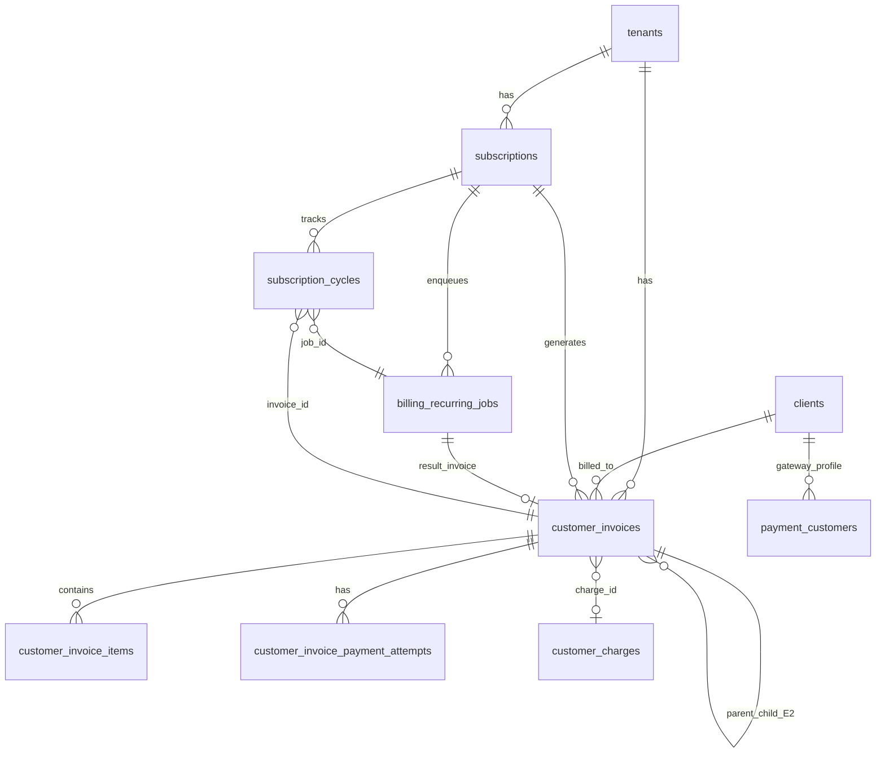
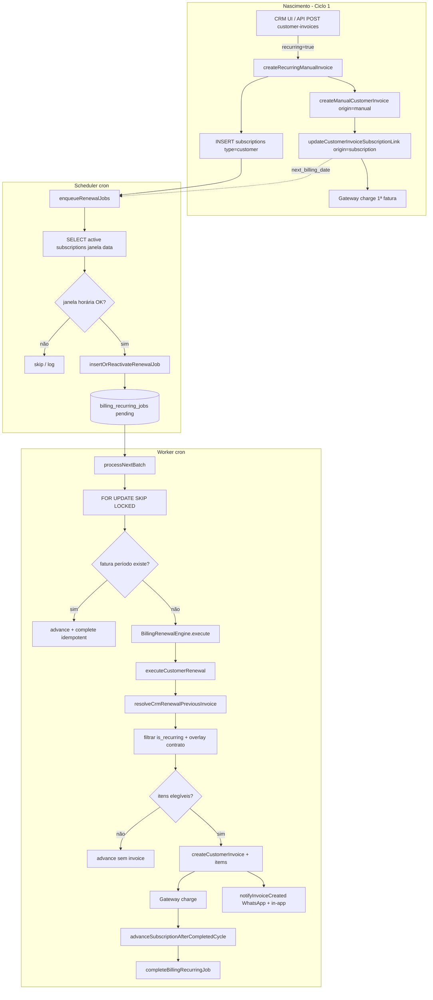

# AUDITORIA ARQUITETURAL P0 — Motor de Faturas Recorrentes do CRM

**Data:** 2026-06-25  
**Modo:** READ ONLY — nenhuma alteração de código, banco ou migrations  
**Escopo:** recurso usado pelos **clientes do CRM** para cobrar **seus próprios clientes** (`subscriptions.type = 'customer'`).  
**Fora de escopo:** assinaturas SaaS do PainelCRM (`type = 'saas'`, `tenant_billing`).

---

## Resumo executivo

O motor de faturas recorrentes do CRM **não é um módulo isolado**. É uma especialização do **Billing Engine compartilhado** (scheduler + worker + `billing_recurring_jobs`) aplicada a assinaturas `type = 'customer'`, com criação de faturas em `customer_invoices` / `customer_invoice_items`.

A **primeira fatura** nasce pelo painel (manual ou link de pagamento) via fluxo em duas etapas: fatura manual → vínculo à `subscription`. As **renovações** copiam itens recorrentes da fatura anterior (com overlay de contrato em metadata), filtram por `is_recurring`, criam nova `customer_invoice`, cobram no gateway e avançam `subscriptions.next_billing_date`.

**Resposta objetiva (pergunta 10):** o sistema utiliza **(C) mistura dos dois** — fatura anterior como template operacional + metadata de contrato/assinatura como overlay/fallback. Não existe tabela `recurring_template` dedicada.

**Conclusão final:** o motor atual **é suficientemente sólido para evoluir incrementalmente**, desde que se preserve compatibilidade e se continue a extração/hardening já iniciada (B0.x, `BillingRenewalEngine`, `subscription_cycles`). **Não** se recomenda um motor greenfield paralelo; recomenda-se **evolução por fases** sobre a mesma fila (`billing_recurring_jobs`) e o mesmo modelo relacional.

---

## 1. Como nasce uma Fatura Recorrente?

### 1.1 Modelo conceitual

| Conceito | Existe? | Onde |
|----------|---------|------|
| Tabela própria de “recorrência” | **Não** | — |
| `recurring_invoice` / `recurring_template` | **Não** | — |
| `parent_invoice` (E2 filhas) | **Sim** | `customer_invoices.parent_invoice_id` — faturas filhas por item, não o ciclo principal |
| `subscription` | **Sim** | `subscriptions` com `type = 'customer'` |
| Flag em fatura | **Sim** | `origin`, `invoice_type` |
| Metadata de contrato | **Sim** | `subscriptions.metadata` → `crm_contract`, `pending_crm_contract` |
| Fila de processamento | **Sim** | `billing_recurring_jobs` (`cycle_key` = vencimento do ciclo) |
| Ledger de ciclos | **Sim** (paralelo) | `subscription_cycles` (dual-write) |

### 1.2 Tabelas e flags na primeira fatura

**`subscriptions`** (`database/init/67_subscriptions.sql`):

- `type = 'customer'`, `customer_id` → `clients.id`
- `billing_interval`, `next_billing_date`, `current_period_start/end`
- `cycles_unlimited`, `max_cycles` (`154_subscriptions_cycles_config.sql`)
- `metadata` JSONB (contrato CRM)

**`customer_invoices`** (`70_customer_invoices.sql`, `71_customer_invoices_manual_support.sql`):

- `origin`: `'manual' | 'subscription' | 'api' | 'import'`
- `invoice_type`: `'recurring' | 'manual' | 'child'`
- Regra: `origin = 'subscription'` ⇔ `subscription_id IS NOT NULL`
- UNIQUE `(subscription_id, period_start)` para faturas de ciclo (exceto filhas E2)

### 1.3 Fluxo de nascimento (primeira fatura recorrente)

```
POST /api/customer-invoices  (recurring=true)
  → createRecurringManualInvoice()          customerBillingService.ts:560
      → createSubscription(type=customer)   billingSubscriptionService.ts
      → createManualInvoice()               → createManualCustomerInvoice (origin=manual)
      → updateCustomerInvoiceSubscriptionLink()
           SET origin='subscription', invoice_type='recurring', subscription_id, period_*
```

Evidência do vínculo:

```665:676:packages/backend/src/services/customerInvoiceService.ts
export async function updateCustomerInvoiceSubscriptionLink(...) {
  await pool.query(
    `UPDATE customer_invoices
     SET subscription_id = $1, period_start = $2, period_end = $3, origin = 'subscription', invoice_type = 'recurring', updated_at = now()
     WHERE id = $4`,
```

**Timing do primeiro ciclo:** `current_period_start = due_date` da primeira fatura; `next_billing_date = periodEnd` calculado por `calculateNextBillingDate` (`customerBillingService.ts:587-606`). O worker dispara quando essa data entra na janela do scheduler.

### 1.4 Link de pagamento (cliente ainda não definido)

Mesmo `createRecurringManualInvoice` com `client_id: null` → subscription criada sem `customer_id`; ao completar o link (`completePaymentByToken`), cliente é criado/vinculado e cobrança gerada (`customerBillingService.ts` ~638+).

---

## 2. Como a próxima fatura é criada?

### 2.1 Mecanismo principal: **cópia de itens da fatura anterior** (não cópia integral da fatura)

Pipeline em `executeCustomerRenewal` (`packages/backend/src/services/billingRenewalEngine/executeCustomerRenewal.ts`):

| Etapa | Função | O que faz |
|-------|--------|-----------|
| 1 | `applyPendingCrmSubscriptionContractIfDue` | Aplica contrato pendente em metadata |
| 2 | `validateRenewalContext` | Valida assinatura, cliente, datas, gateway |
| 3 | `resolveCrmRenewalPreviousInvoice` | Localiza “fatura template” |
| 4 | `getCustomerInvoiceItems` | Carrega linhas da fatura anterior |
| 5 | Filtro | Só `is_recurring = true`; exclui E2; avança `scheduled_due_date` |
| 6 | `overlayCrmContractOnRenewalItems` | Sobrescreve valores do contrato em metadata |
| 7 | Se 0 itens elegíveis | Avança ciclo **sem** nova fatura (`completed_no_invoice_no_eligible_items`) |
| 8 | `createCustomerInvoice` | INSERT nova fatura `origin=subscription`, `invoice_type=recurring` |
| 9 | INSERT items | Copia campos das linhas elegíveis |
| 10 | Gateway | `createCharge` + `updateCustomerInvoiceGatewayData` |
| 11 | `advanceSubscriptionAfterCompletedCycle` | Atualiza `next_billing_date`, contadores |
| 12 | `completeBillingRecurringJob` | Job `completed` |

Evidência do filtro de itens:

```276:302:packages/backend/src/services/billingRenewalEngine/executeCustomerRenewal.ts
  // D5: só linhas com is_recurring=true entram na próxima fatura de ciclo
  for (const it of prevItems) {
    if (!it.is_recurring) continue;
    ...
    includedItems.push({ ...it, next_due_date: nextDue });
  }
  const overlaidItems = overlayCrmContractOnRenewalItems(metaR.rows[0]?.metadata, includedItems);
```

### 2.2 Resolução da “fatura anterior” (template operacional)

`crmRenewalCustomerResolver.ts` — ordem de lookup:

1. `current_period_start` exato → `findCustomerInvoiceBySubscriptionAndPeriod`
2. Ciclo anterior calculado por intervalo
3. Última fatura `origin=subscription`, não `child`, com `period_start < ciclo`
4. Última fatura de assinatura qualquer
5. **Fallback sintético** a partir de `subscriptions.metadata.crm_contract` ou `amount_cents` (`resolved_via: 'subscription_contract_items'`)

SQL típico (faturas anteriores):

```80:87:packages/backend/src/services/crmRenewalCustomerResolver.ts
     WHERE ci.subscription_id = $1::uuid
       AND ci.origin = 'subscription'
       AND COALESCE(ci.invoice_type, '') <> 'child'
       AND ci.period_start < $2::date
```

### 2.3 O que **não** é usado

| Mecanismo | Usado para renovação CRM? |
|-----------|---------------------------|
| Cópia byte-a-byte da última fatura | **Não** — nova row + itens filtrados |
| Tabela `recurring_template` | **Não existe** |
| Contrato como única fonte | **Parcial** — overlay + fallback sintético |
| Projeto | **Não** na renovação — só FK opcional na 1ª fatura |

Renovações usam `createCustomerInvoice` (`customerInvoiceService.ts:143-188`), não `createManualCustomerInvoice`.

---

## 3. Caminhos que criam a primeira fatura

| Caminho | Entrada | Cria subscription? | Estrutura da 1ª fatura | Recorrente? |
|---------|---------|-------------------|------------------------|-------------|
| **Manual avulsa** | `POST /api/customer-invoices` sem `recurring` | Não | `origin=manual`, sem `subscription_id` | Não |
| **Manual recorrente** | `recurring=true` + `billing_interval` | **Sim** | Manual → patch `origin=subscription` | **Sim** |
| **Link de pagamento** | Recorrente com `client_id=null` | **Sim** (cliente depois) | Idem | **Sim** |
| **Projeto** | `project_id` no body | Só se `recurring=true` | FK `project_id` na invoice | Opcional |
| **Proposta/contrato** | `convertAcceptedProposalToInvoice` | **Não** | `origin=manual`, `proposal_id` | **Não** (one-off) |
| **Contrato CRM (patch)** | `patchCrmSubscriptionContract` | N/A | Atualiza metadata + faturas abertas | Afeta **futuras** renovações |
| **Checkout loja** | `storePublicCheckoutService` | Não | `origin=manual`, avulsa | Não |
| **API `origin=api`** | Schema permite | — | **Sem writer** encontrado no backend | — |
| **Import `origin=import`** | Schema permite | — | **Sem writer** encontrado | — |
| **Worker** | `executeCustomerRenewal` | N/A | Ciclo 2+ | Renovação |

**Diferenças estruturais importantes:**

- Recorrente: sempre passa por `subscriptions` + vínculo posterior da fatura.
- Proposta/checkout: fatura manual sem subscription — **não entram** no motor automático.
- Itens em fatura manual default `is_recurring ?? true` (`createManualCustomerInvoice`); linhas com `is_recurring=false` não renovam.

---

## 4. Tabelas e relacionamentos

### 4.1 Diagrama ER (núcleo CRM recorrente)



### 4.2 Inventário de tabelas

| Tabela | Migração principal | Papel no CRM recorrente |
|--------|-------------------|-------------------------|
| `subscriptions` | 67, 154, 276, 277 | Entidade de recorrência; `next_billing_date` dirige scheduler |
| `customer_invoices` | 70-71, 77-78, 81, 118, 235 | Artefato financeiro por ciclo |
| `customer_invoice_items` | 76, 80 | Linhas; `is_recurring`, `scheduled_due_date`, intervalo por item |
| `billing_recurring_jobs` | 69, 130, 140 | Fila; UNIQUE `(subscription_id, cycle_key)` |
| `subscription_cycles` | 141, 143 | Ledger paralelo de ciclo |
| `subscription_change_events` | 277, 278 | Histórico de alterações contratuais |
| `payment_customers` | 70 | Cliente no gateway |
| `customer_invoice_payment_attempts` | 82 | Tentativas de pagamento |
| `customer_charges` | 79 | Agrupamento opcional |
| `clients` | (CRM) | Cliente final |
| `tenants` | — | Config cobrança: timezone, janela, dias antecipação |
| `platform_notification_deliveries` | — | Rastreio envio WhatsApp/in-app |
| `notifications` | — | Notificações internas admins |

**Não existem:** `recurring_templates`, `recurring_invoices`, `parent_invoice` para ciclo principal (só E2 child).

---

## 5. Scheduler

### 5.1 Entry point

`packages/backend/src/scripts/runRecurringScheduler.ts` → `enqueueRenewalJobs()` (`recurringBillingJobService.ts` ~1014+), cron ~10-15 min.

### 5.2 Como encontra recorrências

SQL candidatos (assinaturas `active`, data de geração ≤ `CURRENT_DATE`):

- Join `subscriptions` + `tenants`
- Filtro: `(next_billing_date - dias_efetivos_antecipação) <= CURRENT_DATE`
- `BILLING_EFFECTIVE_GENERATE_DAYS_BEFORE_SQL` limita dias pelo intervalo (weekly 6 … yearly 365)
- LIMIT 500 por execução

### 5.3 Janela horária local (Fase 2)

Por tenant: `timezone`, `recurring_generate_time_local`, `invoice_notify_*`  
`buildBillingWindowDiagnostic` — fora da janela: **não enfileira** (`too_early_local_time`, `outside_local_window`).

### 5.4 Enfileiramento e anti-duplicidade

`insertOrReactivateRenewalJob` (`recurringBillingJobService.ts:328+`):

| Situação | Ação |
|----------|------|
| Job `pending`/`processing` mesmo ciclo lógico | `skipped_active_exists` |
| Job `completed` mesmo ciclo | `skipped_completed_cycle` |
| Job `failed`/`cancelled` mesmo ciclo | **Reativa** para `pending`, zera retry |
| Novo ciclo | INSERT com `cycle_key` canônico (YYYY-MM-DD) |
| Violação UNIQUE | Catch `23505`, reconcilia |

**Chave de deduplicação:** `UNIQUE(subscription_id, cycle_key)` (`69_billing_recurring_jobs.sql:22`).

**Idempotência na fatura:** `UNIQUE(subscription_id, period_start)` em `customer_invoices`.

**Normalização de ciclo:** `BILLING_JOBS_WHERE_SUB_TENANT_SAME_LOGICAL_CYCLE` — `cycle_key` com ou sem sufixo timestamp.

### 5.5 Outras ações do scheduler

- `expireCancelledSubscriptions()` no início
- Resolução de `customer_id` CRM antes de enfileirar
- `subscriptionCyclesUpsertAfterScheduler` (dual-write)
- Logs: `[BILLING]`, `subscriptionBillingLog`, `[RENEWAL_TRACE] phase=scheduler_enqueue`

---

## 6. Worker — pipeline completo

### 6.1 Entry point

`runRecurringWorker.ts`:

1. `processChildItemDueInvoices()` — E2 itens com vencimento próprio
2. `processNextBatch(workerId)` — renovações principais
3. `flushBillingNotificationSideEffects()`
4. `processNotificationOutboundRetriesBatch(50)`

### 6.2 `processNextBatch` (CRM branch)

```
reclaimStaleBillingProcessingJobs (processing antigo → pending)
sanitizePendingBillingJobLocks
SELECT pending FOR UPDATE SKIP LOCKED (100)
  → UPDATE processing + locked_by
  → getSubscriptionById
  → guards: missing, cycle mismatch, janela horária, status≠active, cancel_at_period_end
  → findCustomerInvoiceBySubscriptionAndPeriod (idempotência)
  → BillingRenewalEngine.execute → executeCustomerRenewal (type=customer)
  → catch: retry 1h/1d/3d ou failed permanente
```

### 6.3 Validação (`renewalValidationPipeline.ts`)

Etapas: subscription, tenant, status, customer (`resolveAndPersistSubscriptionCustomerId`), client, datas (com auto-repair), intervalo, contrato, alinhamento `cycle_key`.

### 6.4 Gateway

- `payment_customers` por tenant+client
- `createCharge` com idempotency `customer_renew_{subscriptionId}_{periodStart}`
- Recriação de customer Asaas se inválido

### 6.5 Advance (pós-sucesso)

`advanceSubscriptionAfterCompletedCycle` (`billingRecurringJobPersistence.ts`):

- `computeFinalNextBillingForCompletedCycle` — próximo vencimento pelo **dia do ciclo**, não `billing_anchor_day` legado
- `updateSubscriptionAfterRenewal`: `next_billing_date`, `current_period_start/end`, `billing_cycle_count++`
- `subscriptionCyclesOnJobCompleted`

### 6.6 Histórico / timeline

| Camada | Onde | Escrita na renovação? |
|--------|------|------------------------|
| `subscription_cycles` | dual-write services | Sim |
| `subscription_change_events` | lifecycle/contrato | Indireto (contrato) |
| UI timeline | `subscriptionTimelineUx`, `crmSubscriptionsService` | Leitura agregada |
| `[RENEWAL_TRACE]` | `renewalAttemptTrace.ts` | Logs console |
| `[BILLING_JOB_TRACE]` | B0.2.3 | Logs console |

---

## 7. Validações — quando NÃO cria nova fatura

| Condição | Resultado | Onde |
|----------|-----------|------|
| Fatura já existe para `(subscription_id, period_start)` | **Reutiliza** — advance + job idempotente | `processNextBatch` ~1735 |
| 0 itens `is_recurring` elegíveis | **Não cria** — advance + `completed_no_invoice_no_eligible_items` | `executeCustomerRenewal` 308-357 |
| Assinatura paused/cancelled | **Cancela** job | `executeCustomerRenewal` 117-149 |
| Validação permanente falha | **Throw** → job failed/retry | `validateRenewalContext` |
| Sem fatura anterior e sem contrato sintético | **Falha** `no_prior_invoice` | `crmRenewalCustomerResolver` |
| Cycle mismatch job vs subscription | **Cancela** job, tenta re-enqueue | `processNextBatch` |
| Fora janela horária (auto) | **Requeue** retry +15 min | `processNextBatch` |
| `cancel_at_period_end` após período | **Cancela** | `processNextBatch` |
| E2: item com `scheduled_due_date` futuro | **Excluído** do ciclo principal; pode gerar child invoice | `resolveMainRenewalItemDue` |

**Retry:** backoff 1h / 1d / 3d em erro transitório; `retry_at` futuro bloqueia worker automático (não manual com `manualExecution`).

---

## 8. Notificações

### 8.1 Disparo na criação

`createCustomerInvoice` → `notifyInvoiceCreated` (`customerInvoiceService.ts:178-182`):

```184:198:packages/backend/src/services/invoiceNotificationsService.ts
export function notifyInvoiceCreated(...) {
  publishInvoiceCreatedNotification({ ... });  // WhatsApp transacional
  scheduleBillingNotificationSideEffect('invoice_in_app.created', () =>
    notifyInvoiceInApp(params.invoiceId, 'invoice_created'),
  );
}
```

### 8.2 Canais

| Canal | Mecanismo | Quando |
|-------|-----------|--------|
| **WhatsApp** | `publishInvoiceCreatedNotification` → `gateAndPublish` evento `invoice.created` | Toda fatura criada (manual + renovação) |
| **In-app (admins)** | `notifyInvoiceInApp` → tabela `notifications` | Idem, flush no worker |
| **Due soon / overdue** | Workers digest | Cron separado |
| **Pago** | `notifyInvoicePaid` | Transição de status |
| **Retry outbound** | `processNotificationOutboundRetriesBatch` | Após worker batch |

Renovação **não** tem template distinto no engine — mesma notificação `invoice.created`.

Config tenant: `invoice_notify_same_as_generation`, `invoice_notify_time_local` afeta **janela** do scheduler, não um segundo envio no engine.

---

## 9. Problemas arquiteturais documentados

### 9.1 Acoplamento SaaS + CRM

Mesmo `subscriptions`, `billing_recurring_jobs`, `recurringBillingJobService`, `BillingRenewalEngine`. Branch `subscription.type === 'customer'` vs `saas`. Mudanças no worker SaaS arriscam regressão CRM.

### 9.2 Primeira fatura em duas fases

`createManualCustomerInvoice` (`origin=manual`) → `updateCustomerInvoiceSubscriptionLink`. Janela de inconsistência com CHECK do schema; renovação assume fatura com `origin=subscription`.

### 9.3 Template = fatura anterior (fragilidade)

Mudança de periodicidade desalinha `current_period_start` vs `period_start` — exige `crmRenewalCustomerResolver` com 5 estratégias de lookup e itens sintéticos.

### 9.4 Três fontes de verdade do ciclo

1. `subscriptions.next_billing_date`
2. `billing_recurring_jobs.cycle_key` + status
3. `subscription_cycles.cycle_date` + status

Dual-write e backfill (`141_subscription_cycles_phase1.sql`) aumentam risco de drift.

### 9.5 Transações inconsistentes

`executeCustomerRenewal`: validação usa `client` (RLS worker); alguns INSERTs e gateway usam `pool` global — fronteira transacional fraca.

### 9.6 Sucesso sem fatura

`completed_no_invoice_no_eligible_items` avança assinatura sem `customer_invoice` — correto operacionalmente, confuso em relatórios e timeline.

### 9.7 E2 (child invoices) paralelo

`processChildItemDueInvoices` separado; flag `BILLING_CHILD_ITEM_INVOICES_ENABLED`. Duplica lógica de gateway e exclui itens do ciclo principal.

### 9.8 Contrato em JSONB

`subscriptions.metadata.crm_contract` não normalizado; overlay em runtime; fallback sintético mascara ausência de fatura seed.

### 9.9 Monólito `recurringBillingJobService.ts`

~2200 linhas: scheduler, worker, enqueue, child invoices, SaaS idempotency. Extração B0.3 (`BillingRenewalEngine`) é **parcial**.

### 9.10 Origens `api`/`import` sem implementação

Schema CHECK permite valores sem writers — dívida de modelo.

### 9.11 Concorrência

- `FOR UPDATE SKIP LOCKED` no worker
- Job `processing` stale reclaim (20 min default)
- Race manual vs worker documentada em B0.2.2 (`prepare` não afeta `processing`)
- Idempotência por `(subscription_id, period_start)`

### 9.12 Notificações acopladas à criação

Toda renovação dispara `invoice.created` igual à primeira fatura — sem distinção semântica “renovação”.

---

## 10. Resposta explícita: (A), (B) ou (C)?

### **(C) Mistura dos dois**

| Fonte | Papel |
|-------|-------|
| **Fatura anterior** | Template operacional principal — itens `is_recurring`, valores, descrições |
| **Metadata contrato** | Overlay de preços/itens + fallback sintético se não há fatura |
| **Subscription** | `billing_interval`, `next_billing_date`, `amount_cents` |
| **Estrutura própria** | `subscriptions` + `billing_recurring_jobs` + `subscription_cycles` — **não** uma entidade “template” separada |

Justificativa em código: `resolveCrmRenewalPreviousInvoice` + loop de cópia de itens + `overlayCrmContractOnRenewalItems` + `buildSyntheticRenewalItemsFromSubscription`.

---

## 11. Fluxograma completo (arquitetura atual)



---

## 12. Componentes e responsabilidades

| Componente | Responsabilidade |
|------------|------------------|
| `customerBillingService` | 1ª fatura recorrente + link pagamento |
| `customerInvoiceService` | CRUD faturas/itens; `createCustomerInvoice` renovação |
| `billingSubscriptionService` | CRUD `subscriptions` |
| `recurringBillingJobService` | Scheduler, worker, enqueue, E2 child |
| `billingRenewalEngine` | Orquestração renovação (B0.3) |
| `executeCustomerRenewal` | Lógica financeira CRM por ciclo |
| `crmRenewalCustomerResolver` | Template = fatura anterior |
| `crmSubscriptionContractRenewalOverlay` | Overlay contrato em itens |
| `crmSubscriptionsContractService` | Patch contrato, pending apply |
| `billingRecurringJobPersistence` | complete/cancel/advance job |
| `renewalDiagnosisService` | Diagnóstico + prontidão manual |
| `billingManualRenewalService` | Ações manuais “gerar agora” |
| `subscriptionCyclesDualWriteService` | Ledger `subscription_cycles` |
| `invoiceNotificationsService` | WhatsApp + in-app |
| `runRecurringScheduler.ts` / `runRecurringWorker.ts` | Cron entry points |

### APIs principais (CRM)

| Método | Rota | Função |
|--------|------|--------|
| POST | `/api/customer-invoices` | Criar manual/recorrente |
| GET | `/api/customer-invoices/...` | Detalhe, histórico |
| POST | `/api/crm-subscriptions/:id/manual-renew` | Renovação síncrona manual |
| GET | `/api/crm-subscriptions/:id/renewal-diagnosis` | Diagnóstico |
| PATCH | `/api/crm-subscriptions/:id/contract` | Contrato CRM |
| GET/POST | `/public/customer-invoices/pay/:token` | Link pagamento |

---

## 13. Plano de evolução (sem implementação)

### Fase 1 — Correções obrigatórias (estabilização P0)

Compatibilidade total; sem mudar modelo de dados.

1. **Manual renewal:** reclaim de jobs `processing` no prepare manual (evidência B0.2.2).
2. **Frontend:** tratar HTTP 400 com corpo estruturado (`job_not_executed`) — não mascarar como `request_error`.
3. **Observabilidade:** manter `[BILLING_JOB_TRACE]` até causa raiz fechada em produção.
4. **Guards UI:** datas inválidas em `formatYmdBr` (evitar `Invalid time value`).
5. **Documentar** `completed_no_invoice_no_eligible_items` na UI/timeline como estado explícito.
6. **Alinhar** `pool` vs `client` em `executeCustomerRenewal` para INSERTs críticos (mesma conexão worker).

### Fase 2 — Refatorações (reduzir acoplamento)

1. **Completar extração B0.3:** mover SaaS para `executeSaasRenewal` isolado; CRM só em `executeCustomerRenewal`.
2. **Dividir** `recurringBillingJobService.ts` em módulos: scheduler, worker batch, enqueue, child E2.
3. **Unificar** resolução de template em serviço único testável (`CrmRenewalTemplateResolver`).
4. **Contrato:** validar metadata com schema Zod; rejeitar overlay inválido cedo.
5. **Notificações:** evento `invoice.renewed` distinto de `invoice.created` (opt-in tenant).
6. **Implementar ou remover** `origin=api|import` do CHECK.

### Fase 3 — Arquitetura ideal (alvo)

Preservar tabelas existentes; evoluir semântica.

```
subscriptions (customer)
    ↓
subscription_cycles  ← fonte de verdade operacional do ciclo
    ↓
billing_recurring_jobs  ← fila derivada do ciclo (não dupla verdade)
    ↓
customer_invoices  ← artefato imutável por ciclo
```

- **Template explícito:** versão de “plano de cobrança” em `subscriptions.metadata` ou tabela `subscription_billing_plans` (nova, opcional) — fatura anterior vira **cache**, não fonte única.
- **Motor CRM dedicado** como façade sobre `BillingRenewalEngine` (mesmo worker, branch isolado).
- **Transação única** por ciclo: invoice + items + job complete + cycle advance.
- **E2** integrado ao mesmo pipeline com estágio “child items” antes do ciclo principal.

### Fase 4 — Migração segura

1. **Feature flags** por tenant (`subscription_cycles` já tem flags em 143).
2. **Backfill** ciclos ausentes a partir de `customer_invoices` + jobs (script idempotente — já parcialmente em 141).
3. **Shadow mode:** novo resolver de template em paralelo, comparar resultado sem gravar.
4. **Rollout:** tenant piloto → % tenants → default on.
5. **Rollback:** flags desligam novo resolver; jobs antigos continuam válidos por `cycle_key`.
6. **Sem big bang:** nunca desligar worker antigo até métricas de paridade (faturas/ciclo, valor, notificações).

---

## 14. Riscos, gargalos e inconsistências

| Categoria | Item | Severidade |
|-----------|------|------------|
| Risco | Race manual/worker em job `processing` | Alta |
| Risco | Drift `next_billing_date` vs `cycle_key` vs `subscription_cycles` | Alta |
| Risco | Renovação sem fatura interpretada como sucesso | Média |
| Gargalo | `recurringBillingJobService` monolítico | Média |
| Gargalo | Scheduler LIMIT 500 / worker LIMIT 100 | Baixa escala |
| Inconsistência | Proposta/checkout não criam subscription | Média (UX) |
| Inconsistência | Duas fases na 1ª fatura recorrente | Média |
| Idempotência | Forte em DB; fraca em concorrência prepare manual | Média |

---

## 15. Conclusão objetiva

### O motor atual é suficientemente sólido para evoluir, ou recomenda-se criar um novo motor?

**Recomendação: evoluir o motor existente**, preservando compatibilidade — **não** criar um motor greenfield substituto.

**Justificativa técnica:**

1. **Modelo relacional maduro:** `subscriptions`, `customer_invoices`, `billing_recurring_jobs`, UNIQUE constraints e idempotência por período já resolvem o núcleo do problema.
2. **Pipeline funcional end-to-end:** scheduler → fila → worker → gateway → notificações → advance está implementado e em produção.
3. **Extração em curso:** `BillingRenewalEngine` / `executeCustomerRenewal` (B0.3) e hardening B0.x mostram caminho de modularização **sem** reescrever dados.
4. **Custo de greenfield:** duplicar fila, migrations, UI timeline, diagnóstico, link pagamento e gateway idempotency geraria **anos** de paridade e risco de dupla cobrança.
5. **Dívida é operacional/arquitetural, não fundacional:** template via fatura anterior, dual-write de ciclos e acoplamento SaaS são **refatoráveis por fases** (Plano §13).

**Condição:** a evolução só é segura se Fase 1 (estabilização P0, traces B0.2.3, correção manual) for concluída antes de mudanças estruturais na Fase 2-3.

---

## Referências de código (índice)

| Tema | Arquivo |
|------|---------|
| 1ª fatura recorrente | `packages/backend/src/services/customerBillingService.ts` |
| API criação | `packages/backend/src/controllers/customerInvoicesController.ts` |
| Renovação CRM | `packages/backend/src/services/billingRenewalEngine/executeCustomerRenewal.ts` |
| Template resolver | `packages/backend/src/services/crmRenewalCustomerResolver.ts` |
| Scheduler/worker | `packages/backend/src/services/recurringBillingJobService.ts` |
| Engine | `packages/backend/src/services/billingRenewalEngine/billingRenewalEngine.ts` |
| Persistência job | `packages/backend/src/services/billingRecurringJobPersistence.ts` |
| Diagnóstico | `packages/backend/src/services/renewalDiagnosisService.ts` |
| Notificações | `packages/backend/src/services/invoiceNotificationsService.ts` |
| Cron | `packages/backend/src/scripts/runRecurringScheduler.ts`, `runRecurringWorker.ts` |
| Auditorias relacionadas | `docs/billing/AUDIT_P0_MANUAL_RENEWAL_PIPELINE_FORENSICS.md`, `B0_2_2_*.md`, `BILLING_ENGINE_ARCHITECTURE_REVIEW_V1.md` |

---

*Documento gerado em modo READ ONLY — nenhum arquivo de código ou banco foi alterado.*
