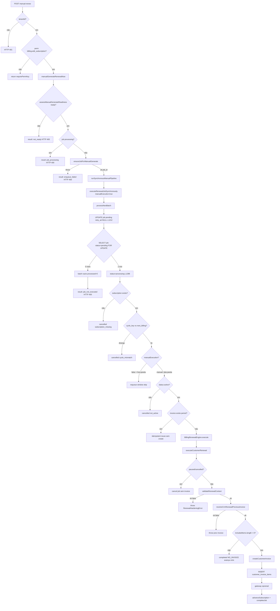

# AUDITORIA FORENSE P0 — Manual Renewal Pipeline (READ ONLY)

**Data:** 2026-06-25  
**Escopo:** `POST /api/crm-subscriptions/:id/manual-renew` (alias admin) até `customer_invoices` criada  
**Modo:** somente leitura — nenhuma alteração de código/banco/API  

---

## 1. Resumo executivo

O pipeline manual **não** chama `BillingRenewalEngine.execute()` diretamente. O caminho real é:

```
Controller → manualGenerateRenewalNow → runSynchronousManualPipeline
  → executeRenewalJobSynchronously → processNextBatch(manualExecution:true)
    → [orquestração worker] → BillingRenewalEngine.execute()
      → executeCustomerRenewal → createCustomerInvoice (se elegível)
```

**Uma nova fatura só é criada** quando o fluxo chega a `createCustomerInvoice()` em `executeCustomerRenewal.ts` **e** `includedItems.length > 0` **e** não houve atalho idempotente antes do engine.

### Pontos que impedem criação de **nova** fatura (ordenados por frequência provável em produção)

| # | Ponto | Arquivo | Linha(s) | Condição | Efeito |
|---|--------|---------|----------|----------|--------|
| **A** | Batch vazio | `recurringBillingJobService.ts` | 1237–1268, 443–447 em `billingManualRenewalService.ts` | `SELECT … status='pending'` retorna 0 linhas | `job_not_executed`, **0ms**, sem engine, **sem invoice** |
| **B** | Pré-voo `not_ready` | `billingManualRenewalService.ts` | 535–552 | `assessManualGenerateReadiness` → blockers | Retorno imediato, **sem engine** |
| **C** | Sem itens elegíveis | `executeCustomerRenewal.ts` | 308–398 | `includedItems.length === 0` | Job `completed`, **sem nova invoice** (avança ciclo) |
| **D** | Idempotência | `recurringBillingJobService.ts` | 1620–1646 | `findCustomerInvoiceBySubscriptionAndPeriod` encontra fatura | Reutiliza existente, **não chama** `createCustomerInvoice` |
| **E** | Validação / prev invoice | `executeCustomerRenewal.ts` | 159–175, 214–242 | `validation.ok === false` ou `prevResolution.ok === false` | `throw RenewalHardeningError` → job `failed`/`pending` |
| **F** | Job cancelado | `executeCustomerRenewal.ts` / `processNextBatch` | 117–149, 1341–1674 | status paused/cancelled, cycle mismatch, etc. | `cancelled`, **sem invoice** |
| **G** | `request_error` (frontend) | `SubscriptionRenewalActionsCard.tsx` | 123–131 | `apiClient.post` lança (rede/5xx sem body) | UI mostra erro; backend pode nem processar |

**Não existe HTTP 409** no handler manual-renew. Respostas: **200**, **400**, **401**, **500** apenas.

---

## 2. Modelo de transação SQL

| Pergunta | Resposta factual (código) |
|----------|---------------------------|
| Onde começa transação explícita? | **Em lugar nenhum** — não há `BEGIN`/`COMMIT`/`ROLLBACK` no pipeline manual |
| `withBillingWorkerRlsBypass` | `db.ts:50–64` — `pool.connect()`, `set_config bypass_rls`, `dbRequestStorage.run({ client })`, `client.release()` |
| Commit? | **Autocommit por statement** (PostgreSQL default) |
| Rollback explícito? | **Não** |
| Invoice criada e depois rollback? | **Não** — se `INSERT customer_invoices` commitou, permanece mesmo se passo posterior falhar |
| `pool.query` dentro do worker | Usa `store.client` quando dentro de `withBillingWorkerRlsBypass` (`db.ts:105–110`) |

**Implicação forense:** falha após `createCustomerInvoice` pode deixar fatura órfã (sem itens ou job incompleto), mas **não** há rollback que apague a invoice.

---

## 3. Fluxograma completo com pontos de interrupção



---

## 4. Camada HTTP — Controller

### 4.1 Rota

| Item | Valor |
|------|--------|
| Arquivo | `packages/backend/src/routes/crmSubscriptionsRoutes.ts` |
| Linha | 39 |
| Método | `POST /:id/manual-renew` |
| Handler | `postCrmSubscriptionManualRenewHandler` |

### 4.2 `postCrmSubscriptionManualRenewHandler`

| Campo | Detalhe |
|-------|---------|
| Arquivo | `packages/backend/src/controllers/crmSubscriptionsController.ts` |
| Linhas | 486–500 |
| Chamado por | Express router |
| Chama | `manualRenewSubscription` → `manualGenerateRenewalNow` |

| Etapa | Linha | Entrada | Saída | Exception? | Persiste? |
|-------|-------|---------|-------|------------|-----------|
| tenantId check | 488–491 | `req.tenantId` | HTTP 401 JSON | Não | Não |
| permissão | 493 | `requirePermKey('billing.edit_subscription')` | return silencioso ou segue | Não | Não |
| execução | 495 | `tenantId`, `id`, actor | `ManualBillingExecutionResult` | Pode propagar | Não |
| resposta | 496 | `result.success` | HTTP **200** ou **400** + body | Não | Não |
| catch | 497–499 | qualquer throw | HTTP **500** `{ error: 'Erro na renovação manual' }` | Engole stack | Não |

**`request_error`:** **não** é produzido pelo controller. Só no frontend quando `catch` na requisição.

**HTTP 409:** **não utilizado** neste handler.

---

## 5. Manual Renewal Service — pré-pipeline

### 5.1 `manualGenerateRenewalNow`

| Campo | Valor |
|-------|--------|
| Arquivo | `billingManualRenewalService.ts` |
| Linhas | 526–627 |

#### 5.1.1 `diagnoseRenewalForTenant` + `assessManualGenerateReadiness`

| Linha | Condição | Retorno | Chega ao engine? | HTTP |
|-------|----------|---------|------------------|------|
| 533–534 | sempre | diagnosis | — | — |
| 535–552 | `!readiness.ready` | `emptyManualResult`, `result:'not_ready'` | **Não** | 400 |
| 555–564 | `findProcessingJobId` retorna id | `result:'job_processing'` | **Não** | 400 |

**Blockers em `assessManualGenerateReadiness`** (`renewalDiagnosisService.ts:71–90`):

- `subscription_not_found`
- `status_*` (não active)
- `type_*` (não customer)
- `customer_unresolvable`
- `invoice_template_missing` / `no_prior_invoice` / reason da invoice
- `enqueue_*` (exceto janela horária e `active_job_exists` / `completed_cycle_guard`)

**Log `[RENEWAL_TRACE]`:** **não** emitido nesta fase (só `[BILLING_MANUAL]`).

#### 5.1.2 `ensureJobForManualGenerate` (L234–318)

| Linha | Condição | Exception / retorno | Persiste |
|-------|----------|---------------------|----------|
| 239–241 | join ausente / tenant errado | `throw Assinatura não encontrada` | Não |
| 243–245 | status ≠ active ou type ≠ customer | `throw não elegível` | Não |
| 247–250 | job `processing` | `throw Já existe job em processamento` | Não |
| 252–257 | `!customer_id` | `resolveAndPersistSubscriptionCustomerId` | **UPDATE subscriptions** se resolver |
| 260–265 | contract apply | `catch {}` **engole** erro | Pode persistir contrato se sucesso |
| 277–279 | pending existente | `prepareJobForImmediateRun` | **UPDATE billing_recurring_jobs** |
| 282–303 | insert outcomes | vários throws | INSERT/UPDATE jobs |
| 301–302 | `skipped_completed_cycle` | `throw ciclo já processado` | Não |

`prepareJobForImmediateRun` (L220–231): `UPDATE … status='pending', retry_at=NULL` **somente** se `status IN ('pending','failed')`.

#### 5.1.3 `runSynchronousManualPipeline` (L386–485)

| Linha | Função | Entrada | Saída |
|-------|--------|---------|-------|
| 399–407 | `logManualRenewal` | metadata | stdout `[MANUAL_RENEWAL]` |
| 410 | `executeRenewalJobSynchronously` | jobId, workerId, `{ manualExecution: true }` | `SynchronousRenewalJobResult` |
| 413 | `flushBillingNotificationSideEffects` | — | `{ drained }` |
| 429–451 | mapeamento sucesso | job_status, batch counts | `success`, `message`, `result` |

**Mapeamento crítico `job_not_executed` (L443–447):**

```
if (exec.processed === 0 && exec.failed === 0) {
  success = false;
  result = 'job_not_executed';
  message = 'O job não foi executado — pode estar bloqueado...';
}
```

| Campo | Valor |
|-------|--------|
| Transaction | Nenhuma |
| Rollback | Não |
| Catch interno | Não — exceções propagam para controller → 500 |

**Auditoria `insertManualRenewalAudit` (L115–126):** `catch {}` engole falha de INSERT em `billing_recovery_audit` — **não** afeta fatura.

**Auditoria `probeNotificationSent` (L376–377):** `catch {}` retorna `false` — **não** afeta fatura.

---

## 6. Worker síncrono — `executeRenewalJobSynchronously` / `processNextBatch`

### 6.1 `executeRenewalJobSynchronously`

| Arquivo | `recurringBillingJobService.ts` |
| Linhas | 888–917 |
| Chama | `processNextBatch(workerId, { onlyJobId, manualExecution })` |
| Depois | `pool.query` snapshot job + LEFT JOIN `customer_invoices` |

**Não lança** se batch vazio — retorna `processed:0, failed:0, cancelled:0` + `job_status` do DB.

### 6.2 `processNextBatch` — modo manual

Envolvido em `withBillingWorkerRlsBypass` (L1205).

#### Preparação manual (L1212–1227)

```sql
UPDATE billing_recurring_jobs SET status='pending', scheduled_at=now(), retry_at=NULL, ...
WHERE id=$1 AND status IN ('pending', 'failed')
```

| Pode falhar silenciosamente? | **Sim** — se job está `processing` ou `completed`, **0 rows updated** |
| Persiste? | Sim (quando match) |
| Rollback? | Não |

#### Seleção do job (L1237–1244) — **PONTO CRÍTICO A**

```sql
SELECT … FROM billing_recurring_jobs
WHERE id=$1 AND status='pending'
FOR UPDATE
```

| Se 0 rows | `jobs.length===0` → loop não executa → `processed=0, failed=0, cancelled=0` |
| `[RENEWAL_TRACE]` | **Não** — trace `worker_pickup` (L1326) só roda dentro do loop |

**Causas de 0 rows após `ensureJobForManualGenerate`:**

1. Race: outro processo marcou `processing` entre ensure e batch  
2. `prepareJobForImmediateRun` não aplicou (status não pending/failed)  
3. `manual_execution_job_prepared` não aplicou pelo mesmo motivo  
4. Job id incorreto (improvável pós-ensure)

#### Dentro do loop — antes do engine

| Linha | Guard | Efeito | Nova invoice? |
|-------|-------|--------|---------------|
| 1341–1344 | subscription null | `cancelled` subscription_missing | Não |
| 1351–1416 | cycle mismatch | `cancelled` + continue | Não |
| 1473–1530 | janela horária | **Ignorado se `manualExecution`** | — |
| 1533–1541 | status ≠ active | `cancelled` not_active | Não |
| 1543–1553 | cancel_at_period_end | `cancelled` after_period_end | Não |
| 1620–1646 | invoice idempotente | `complete` idempotent, **continue** | **Não** (reusa) |

Primeiro `[RENEWAL_TRACE]` no worker: **`worker_pickup`** L1326 (após job selecionado).

#### Chamada ao engine (L1648–1665)

```typescript
await BillingRenewalEngine.execute({
  executionMode: options?.manualExecution ? 'manual' : 'automatic',
  ...
});
```

#### Catch do worker (L1677–1775)

| Erro | Comportamento | Persiste |
|------|---------------|----------|
| `RenewalHardeningError` | `classifyRenewalError`, UPDATE job pending/failed + retry_at | Sim |
| Outros | idem | Sim |
| `logRenewalAttemptTrace` | phase `worker_error` L1718 | — |

**Não há rollback** de invoice se já foi criada antes do throw.

---

## 7. BillingRenewalEngine

| Arquivo | `billingRenewalEngine/billingRenewalEngine.ts` |
| Linhas | 67–123 |
| Roteamento | `customer` → `executeCustomerRenewal`; `saas` → `executeSaasRenewal` |
| Throw | tipo assinatura desconhecido L104 |

**Manual CRM** usa `executeCustomerRenewal` com `executionMode: 'manual'`.

---

## 8. `executeCustomerRenewal` — pipeline financeiro

| Arquivo | `billingRenewalEngine/executeCustomerRenewal.ts` |

### 8.1 Contract (L100–111)

| catch | L105–110 | **Engole** erro de `applyPendingCrmSubscriptionContractIfDue` | Continua |
| Persiste? | Se sucesso antes do catch | possível UPDATE subscription |

### 8.2 Inactive subscription (L117–149)

| Condição | `paused` ou `cancelled` |
| Ação | `cancelBillingRecurringJob` + return `success:false, cancelled:true` |
| Invoice | **Não criada** |
| `[RENEWAL_TRACE]` | `worker_cancel` L129 |

### 8.3 Validation Pipeline (L152–175)

Chama `validateRenewalContext` (`renewalValidationPipeline.ts:150–354`).

| Stage | Linha validation | reason_code | Lança? |
|-------|------------------|-------------|--------|
| subscription | 163–171 | subscription_missing | retorna ok:false |
| tenant | 178–186 | tenant_not_found | ok:false |
| status | 189–197 | subscription_not_active | ok:false |
| type | 200–208 | subscription_type_unsupported | ok:false |
| job/dates | 211–265 | vários | ok:false |
| customer | 268–277 | missing_customer_id | ok:false |
| client | 292–300 | client_not_found | ok:false |

Se `!validation.ok` → `logRenewalAttemptTrace` **`worker_error`** L160 → **`throw RenewalHardeningError`** L174.

**Date repair** (dentro de validation, L223–225): pode **UPDATE subscriptions** (`current_period_start`, `next_billing_date`).

**Customer resolution** (L268): `resolveAndPersistSubscriptionCustomerId` — pode **UPDATE subscriptions.customer_id**.

### 8.4 Previous Invoice (L206–243)

`resolveCrmRenewalPreviousInvoice` (`crmRenewalCustomerResolver.ts:145+`)

**Strategies (ordem):**

1. `current_period_start_exact` — invoice no `current_period_start`  
2. `computed_previous_cycle` — ciclo anterior por intervalo  
3. `latest_before_cycle`  
4. `latest_subscription_invoice_any`  
5. `subscription_contract_items` — itens sintéticos  

| Falha | reason | L206–242 |
|-------|--------|----------|
| `missing_current_period_start` | sem current_period_start | throw |
| `no_prior_invoice` | nenhuma strategy encontrou | throw |

**`[RENEWAL_TRACE]`:** `worker_error` com `invoice_resolution` antes do throw.

### 8.5 Item eligibility (L276–398) — **PONTO CRÍTICO C**

Filtra `is_recurring`, E2 child path, `itemDue > periodStart`.

Se `includedItems.length === 0`:

- `advanceSubscriptionAfterCompletedCycle` — **persiste** next_billing  
- `completeBillingRecurringJob` — outcome `COMPLETED_NO_INVOICE_NO_ELIGIBLE_ITEMS`  
- **return `success: true`** no engine (L387–398)  
- **`createCustomerInvoice` NÃO é chamado**

No manual service (L429–434): HTTP **200**, `success: true`, `invoice_id: null`, mensagem *"Ciclo processado sem nova fatura"*.

### 8.6 Invoice Creation (L415–424)

```typescript
const inv = await createCustomerInvoice({ ... });
```

#### `createCustomerInvoice` (`customerInvoiceService.ts:143–188`)

| Etapa | Linha | Persiste |
|-------|-------|----------|
| `getCustomerInvoiceSchema` | 144 | Não |
| `generateInvoiceNumber` | 145 | Não |
| `INSERT customer_invoices` | 147–165 | **SIM** — autocommit |
| `billingLog invoice_created` | 167 | Não |
| `notifyInvoiceCreated` | 178 | Enfileira notificação |

| Exception? | Sim — propaga (sem catch local) |
| Rollback? | **Não** |

### 8.7 Invoice Items (L434–471)

`pool.query INSERT customer_invoice_items` — **persiste** cada item; sem transação envolvente.

### 8.8 Gateway (L473+)

| catch gateway | L759+ área | **Engole** erro gateway — log + continua |
| Invoice | Já criada — permanece |

### 8.9 Subscription advance + job complete (L773+)

- `advanceSubscriptionAfterCompletedCycle` — UPDATE subscriptions  
- `completeBillingRecurringJob` — UPDATE job `completed` + `result_invoice_id`  
- `logRenewalAttemptTrace` `worker_complete`

---

## 9. Tabela mestra — interrupção vs criação de fatura

| result / outcome | Nova `customer_invoice`? | HTTP típico | Onde |
|------------------|---------------------------|-------------|------|
| `not_ready` | Não | 400 | manual L535 |
| `job_processing` | Não | 400 | manual L555 |
| `enqueue_failed` | Não | 400 | manual L581 |
| **`job_not_executed`** | **Não** | **400** | manual L443 + batch vazio |
| `cancelled` | Não | 400 | manual L439 |
| `failed` / retry | Não (ou parcial*) | 400 | manual L435 |
| `completed` + idempotent | Não (reusa) | 200 | batch L1624 |
| `COMPLETED_NO_INVOICE_NO_ELIGIBLE_ITEMS` | **Não** | **200** success=true | engine L387 |
| `COMPLETED_INVOICE_CUSTOMER` | **Sim** | 200 | engine L415+ |
| `request_error` | Indeterminado | — | frontend catch |
| HTTP 500 | Indeterminado | 500 | controller catch |

\*Se `createCustomerInvoice` commitou e throw ocorreu depois, fatura pode existir sem job completed.

---

## 10. Logs e ordem de emissão

| Ordem | Tag | Quando |
|-------|-----|--------|
| 1 | `[MANUAL_RENEWAL]` started | Antes do batch |
| 2 | `[BILLING_MANUAL]` | pré/pós generate |
| 3 | `billingLog manual_execution_job_prepared` | Se UPDATE match |
| 4 | `billingLog batch_start` batchSize=N | Sempre |
| 5 | **`[RENEWAL_TRACE] worker_pickup`** | Só se job entrou no loop |
| 6 | `[RENEWAL_TRACE] worker_process` | Após validation OK |
| 7 | `[RENEWAL_TRACE] worker_error` | Validação/prev invoice/exception |
| 8 | `[RENEWAL_TRACE] worker_complete` | Sucesso com invoice |
| 9 | `[MANUAL_RENEWAL]` finished | Após batch |

**Se batch vazio:** só `[MANUAL_RENEWAL]` + `batch_start size=0` — **sem `[RENEWAL_TRACE]`**.

---

## 11. Frontend — `request_error`

| Arquivo | `SubscriptionRenewalActionsCard.tsx` |
| Linhas | 123–131, 167–175 |
| Condição | `catch` em `generateRenewalNow` / `reprocessRenewal` |
| Quando | `apiClient.post` lança (`res.error && !res.data`) ou rede |
| `duration_ms` | **0** (hardcoded no catch) |

**Nota:** Backend pode retornar HTTP 400 com body JSON — **não** é `request_error` (frontend recebe `res.data`).

---

## 12. Resposta à pergunta forense

### “Qual ponto interrompe a criação da fatura?”

Depende do **sintoma observado**:

#### Sintoma: `request_error`, `duration_ms: 0`

| Campo | Valor |
|-------|--------|
| **Ponto exato** | Frontend `SubscriptionRenewalActionsCard.tsx` **L123–131** (catch) **OU** backend HTTP 500 sem body parseável |
| **Condição** | Exceção na requisição HTTP antes de mapear `ManualBillingExecutionResult` |
| **Engine** | Pode não ter sido invocado |
| **Transaction** | N/A |
| **Invoice** | Não criada (requisição não completou do ponto de vista da UI) |

#### Sintoma: `result: job_not_executed`, duração baixa, sem `[RENEWAL_TRACE]`

| Campo | Valor |
|-------|--------|
| **Ponto exato** | `processNextBatch` **L1237–1244** — SELECT retorna 0 jobs |
| **Mapeamento** | `billingManualRenewalService.ts` **L443–447** |
| **Condição** | `billing_recurring_jobs.status <> 'pending'` no momento do SELECT (ex.: `processing`, `completed`) |
| **Estado DB** | Job não elegível para pickup manual |
| **Transaction** | Autocommit; prepares anteriores podem ter falhado em UPDATE |
| **Invoice** | **Não criada** — `BillingRenewalEngine` **não executado** |

#### Sintoma: HTTP 200, `success: true`, `invoice_id: null`

| Campo | Valor |
|-------|--------|
| **Ponto exato** | `executeCustomerRenewal.ts` **L308–398** |
| **Condição** | `includedItems.length === 0` após filtros de recorrência |
| **Outcome** | `completed_no_invoice_no_eligible_items` |
| **Invoice** | **Não criada por design** — ciclo avançado |

#### Sintoma: HTTP 400, `result: not_ready`

| Campo | Valor |
|-------|--------|
| **Ponto exato** | `billingManualRenewalService.ts` **L535–552** |
| **Condição** | blockers em `assessManualGenerateReadiness` |
| **Invoice** | **Não criada** — pipeline não iniciado |

#### Sintoma: HTTP 200, `invoice_id` preenchido mas “não é nova”

| Campo | Valor |
|-------|--------|
| **Ponto exato** | `recurringBillingJobService.ts` **L1620–1646** |
| **Condição** | `findCustomerInvoiceBySubscriptionAndPeriod` encontrou fatura |
| **Invoice** | Existente reutilizada — **`createCustomerInvoice` não chamado** |

#### Sintoma: HTTP 400, `result: failed`, mensagem de validação

| Campo | Valor |
|-------|--------|
| **Ponto exato** | `executeCustomerRenewal.ts` **L174** ou **L235–242** |
| **Condição** | `RenewalHardeningError` |
| **Catch** | `processNextBatch` **L1677–1755** — job → failed/pending |
| **Invoice** | **Não criada** (falhou antes de L415) |

---

## 13. Catch / engole / return antecipado — inventário

| Local | Padrão | Impacto fatura |
|-------|--------|----------------|
| `billingManualRenewalService.ts:263` | `catch {}` contract | Nenhum |
| `billingManualRenewalService.ts:121` | `catch {}` audit | Nenhum |
| `billingManualRenewalService.ts:376` | `catch {}` probe notification | Nenhum |
| `executeCustomerRenewal.ts:105` | `catch` contract log | Nenhum |
| `executeCustomerRenewal gateway` | `catch` log | Invoice já criada |
| `processNextBatch:1407` | `catch` post mismatch enqueue | Nenhum |
| `manualGenerateRenewalNow:535` | return antecipado | **Bloqueia pipeline** |
| `processNextBatch: continue` | vários | **Pula engine** |
| `includedItems.length===0` | return sucesso | **Sem invoice** |

**Não existe** `catch {}` entre `createCustomerInvoice` e o return final que apague a fatura.

---

## 14. Como usar esta auditoria em incidente real

Para fechar **sem hipóteses** em um caso concreto, coletar:

1. Body JSON completo da resposta (`result`, `success`, `invoice_id`, `duration_ms`, `logs`)  
2. Logs `[MANUAL_RENEWAL]` e presença/ausência de `[RENEWAL_TRACE] worker_pickup`  
3. Estado do job: `SELECT status, retry_at, locked_by, completion_outcome, result_invoice_id FROM billing_recurring_jobs WHERE id=…`  
4. Fatura no período: `SELECT id, period_start FROM customer_invoices WHERE subscription_id=… AND period_start=…`  

Cruzar com a tabela da **Seção 12** para identificar o ponto exato.

---

## 15. Arquivos auditados

- `packages/backend/src/routes/crmSubscriptionsRoutes.ts`
- `packages/backend/src/controllers/crmSubscriptionsController.ts`
- `packages/backend/src/services/billingManualRenewalService.ts`
- `packages/backend/src/services/recurringBillingJobService.ts`
- `packages/backend/src/services/billingRenewalEngine/billingRenewalEngine.ts`
- `packages/backend/src/services/billingRenewalEngine/executeCustomerRenewal.ts`
- `packages/backend/src/services/renewalValidationPipeline.ts`
- `packages/backend/src/services/renewalCustomerResolution.ts`
- `packages/backend/src/services/crmRenewalCustomerResolver.ts`
- `packages/backend/src/services/renewalDiagnosisService.ts`
- `packages/backend/src/services/customerInvoiceService.ts`
- `packages/backend/src/services/billingRecurringJobPersistence.ts`
- `packages/backend/src/utils/db.ts`
- `src/components/subscriptions/SubscriptionRenewalActionsCard.tsx`
- `src/services/crmSubscriptions.ts`

---

*Auditoria READ ONLY — nenhum código alterado.*
