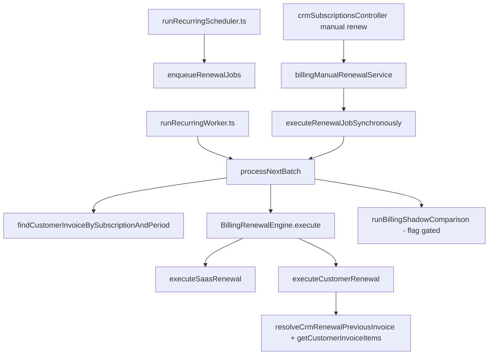

# AUDIT — Production Readiness (Sprint 3.0C)

**Data:** 2026-06-26  
**Modo:** AUDIT ONLY — Nenhuma alteração funcional realizada  
**Objetivo:** Determinar se existe impedimento técnico restante para substituir o Billing Engine V1 em produção pelo Billing Engine V2.

---

## Resposta binária

# NOT_READY

**`ready_for_worker_cutover`:** `false`  
**`production_risk`:** `HIGH` (não `NONE`)

A Sprint 3.0B eliminou o fallback legado no **BillingExecutionContext**. O **BillingEngineV2** é independente em memória. Porém o **caminho de produção** (Worker → `BillingRenewalEngine.execute` → `executeCustomerRenewal`) permanece 100% V1, e **não existe camada de persistência/orquestração** que conecte `BillingEngineV2.execute()` ao fluxo operacional.

**Não iniciar Sprint 3.1 (Worker Cutover)** até resolução dos bloqueios P0 documentados abaixo.

---

## Resumo executivo

| Área | Status pós-3.0B | Pronto para cutover? |
|------|-----------------|----------------------|
| BillingEngineV2 (módulo) | ✅ Independente em memória | Parcial |
| BillingExecutionContext | ✅ Sem fallback legado | ✅ |
| Projection pipeline | ✅ Puro, alinhado ao V2 | ✅ |
| Worker integration | ❌ Não conectado | ❌ |
| Persistência invoice | ❌ V2 não persiste | ❌ |
| Gateway real | ❌ V2 simula; V1 cobra | ❌ |
| Notifications | ❌ Disparadas no `createCustomerInvoice` | ❌ |
| SaaS renewals | ❌ Fora do escopo V2 | ❌ |
| Cobertura de dados (plan/items) | ❌ Maioria CRM sem plan persistido | ❌ |
| Cutover orchestrator | ⚠️ READ ONLY, não no worker | ❌ |

---

## BillingEngineV2 — Independência

### Veredito: ✅ Independente (escopo do módulo)

| Verificação | Resultado |
|-------------|-----------|
| Imports proibidos em `billingEngineV2/` | ✅ Zero `resolveCrmRenewalPreviousInvoice`, `getCustomerInvoiceItems`, `executeCustomerRenewal` |
| Pipeline | ✅ Plan → Items → Prices → Discounts → Taxes → Totals → Drafts |
| Dependências transitivas | ✅ Projection (puro) + `billingExecutionContext/types` + `billingShadow/types` (tipos) |
| DB no `execute()` | ✅ Nenhuma query |
| Output | `BillingEngineV2Result` — drafts + payloads simulados |

### Limitação crítica

`BillingEngineV2.execute()` **não persiste** nada. Retorna:

- `CustomerInvoiceDraft` + `CustomerInvoiceItemDraft[]`
- `NormalizedGatewayPayload` com `simulated: true`
- Notifications/timeline/history **sintéticos**

Substituir `BillingRenewalEngine.execute()` por uma chamada direta a `BillingEngineV2.execute()` **quebraria produção** (sem invoice, sem gateway, sem avanço de ciclo).

---

## BillingExecutionContext — Pós Sprint 3.0B

### Veredito: ✅ Independente

| Verificação | Evidência |
|-------------|-----------|
| Fallback legado removido | `planItemResolver.ts` — só `billingPlanRepository` + `billingPlanItemRepository` |
| Erros estruturados | `BILLING_PLAN_NOT_FOUND`, `BILLING_ITEMS_NOT_FOUND`, `LEGACY_*` |
| `plan_source` | Apenas `persisted_plan` |
| Certificação | `context_certified`, `context_pure`, `legacy_dependencies_detected` |
| `invoice_items_snapshot` | Removido do tipo |

### Impacto operacional

Assinaturas **sem** Billing Plan + Items persistidos **não obtêm contexto**. Shadow, Projection, Certification e futuro Worker V2 falham explicitamente — correto para V2, mas **bloqueia cutover em massa** até migração de dados.

---

## Mapa completo — Callers de `BillingRenewalEngine.execute()`



### Callers de produção (runtime)

| # | Caller | Arquivo | Linha | Tipo subscription |
|---|--------|---------|-------|-------------------|
| 1 | `processNextBatch` | `recurringBillingJobService.ts` | ~1758 | `saas` |
| 2 | `processNextBatch` | `recurringBillingJobService.ts` | ~1816 | `customer` |

### Callers indiretos (mesmo motor)

| Caller | Caminho |
|--------|---------|
| `runRecurringWorker.ts` | `processNextBatch(workerId)` |
| `executeRenewalJobSynchronously` | `processNextBatch(..., { manualExecution })` |
| `manualGenerateRenewalNow` / `manualRenewSubscription` | → `executeRenewalJobSynchronously` |
| `crmSubscriptionsController` | APIs manuais de renovação |

### Testes (não produção)

| Caller | Arquivo |
|--------|---------|
| Unit tests | `billingRenewalEngine.test.ts` |

### Referências a `BillingEngineV2`

| Local | Uso |
|-------|-----|
| `billingEngineV2/*.ts` | Módulo isolado |
| `billingEngineV2.test.ts` | Testes |
| **Worker / Scheduler / APIs** | **Nenhuma** |

---

## Scheduler

### Veredito: ⚠️ Acoplado ao V1 indiretamente

| Componente | Dependência do motor |
|------------|---------------------|
| `enqueueRenewalJobs` | Cria jobs em `billing_recurring_jobs` — **agnóstico** ao engine |
| `tryEnqueueRenewal` / diagnóstico | Usa `diagnoseRenewalForTenant` → `resolveCrmRenewalPreviousInvoice` (**P1**) |
| Janela horária / guards | Não invoca engine |

O Scheduler **não chama** `BillingRenewalEngine` diretamente. Cutover do Worker não exige alterar Scheduler, mas diagnósticos de enfileiramento ainda assumem template legado.

---

## Mapa completo — Pontos de persistência (V1 customer)

Fluxo `executeCustomerRenewal` (produção CRM):

| Ordem | Operação | Tabela / serviço |
|-------|----------|------------------|
| 1 | Contrato pendente | `applyPendingCrmSubscriptionContractIfDue` |
| 2 | Resolver template | `customer_invoices` + `customer_invoice_items` (via resolver) |
| 3 | Overlay contrato | `overlayCrmContractOnRenewalItems` (memória) |
| 4 | Criar invoice | `createCustomerInvoice` → `customer_invoices` |
| 5 | Inserir itens | `INSERT customer_invoice_items` (com `scheduled_due_date`) |
| 6 | Gateway | `gateway.createCharge` + `updateCustomerInvoiceGatewayData` |
| 7 | Avançar ciclo | `advanceSubscriptionAfterCompletedCycle` → `subscriptions` |
| 8 | Completar job | `completeBillingRecurringJob` → `billing_recurring_jobs` |
| 9 | Notificação | `notifyInvoiceCreated` (dentro de `createCustomerInvoice`) |
| 10 | Histórico | `recordRenewalHistory` (worker, pós-batch) |

### BillingEngineV2 equivalente

| Etapa V1 | V2 hoje |
|----------|---------|
| Persist invoice | ❌ `CustomerInvoiceDraft` apenas |
| Persist items | ❌ `CustomerInvoiceItemDraft[]` apenas |
| Gateway charge | ❌ Payload simulado |
| Advance subscription | ❌ Não executa |
| Complete job | ❌ Não executa |
| notifyInvoiceCreated | ❌ Não dispara |
| recordRenewalHistory | ❌ Não dispara |

**Gap P0:** Adapter de persistência + orquestração pós-engine inexistente.

---

## Gateway

### Compatibilidade com `CustomerInvoiceDraft`

| Campo V2 | V1 `createCustomerInvoice` | Gap |
|----------|---------------------------|-----|
| `tenant_id`, `client_id`, `subscription_id` | ✅ | — |
| `period_start/end`, `amount_cents`, `due_date` | ✅ | — |
| `gateway` | ✅ | — |
| `billing_plan_id/version/revision` | ❌ Não existe em `customer_invoices` | **P1** — sem migração |
| `subtotal/discounts/taxes/fees` | ❌ Só `amount_cents` na invoice | **P2** |
| `cycle_key` | ❌ Não persistido na invoice | **P2** |
| `currency` | Parcial (subscription) | **P3** |

V2 `resolveProjectionGateway` retorna `{ simulated: true }`. V1 executa `gateway.createCharge` com idempotency `customer_renew_{sub}_{period}`.

---

## Notification Engine

### Veredito: ❌ Incompatível sem persistência

- `notifyInvoiceCreated` é chamado em `createCustomerInvoice` (`customerInvoiceService.ts:178`).
- `ensureBillingChargeNotificationExists` no worker só para idempotência **SaaS** (`recurringBillingJobService.ts:1753`).
- V2 gera `NormalizedNotificationPayload` simulado — **não enfileira** notificação real.

**Bloqueio P0:** Cutover exige criar invoice real ou novo contrato de notificação pós-draft.

---

## Timeline / History

| Aspecto | V1 | V2 |
|---------|----|----|
| Timeline renewal | `advanceSubscriptionAfterCompletedCycle`, traces pipeline | `renewal_completed` simulado |
| History | `recordRenewalHistory` no worker | `subscription_cycle_advanced` simulado |
| Contract events | `subscription_change_events` via contract service | Não integrado |

**Paridade funcional:** ❌ Não equivalente. V2 payloads são projeção; V1 grava histórico operacional.

---

## Jobs — Idempotência, retry, locks, concorrência

Infraestrutura em `recurringBillingJobService.ts` (permanece fora do engine):

| Mecanismo | Implementação | Impacto no cutover |
|-----------|---------------|-------------------|
| Locks | `FOR UPDATE SKIP LOCKED` | Worker mantém — engine deve ser idempotente |
| Idempotência customer | `findCustomerInvoiceBySubscriptionAndPeriod` antes do engine | ✅ Compatível se V2 persistir mesma chave |
| Retry | `attempts`, `max_attempts`, `retry_at` | Engine deve lançar erros classificáveis |
| Recovery | `reclaimStaleBillingProcessingJobs` | Sem mudança |
| Result contract | `BillingRenewalResult` | V2 retorna `BillingEngineV2Result` — **incompatível (P0)** |

---

## Database

### Billing Plan / Items

| Recurso | Status |
|---------|--------|
| Tabelas `billing_plans`, `billing_plan_items` | ✅ Migrações 279–282+ |
| Versioning / effective items | ✅ `findEffective()` |
| FK plan → items | ✅ |

### Substituição do invoice template

| Pergunta | Resposta |
|----------|----------|
| Schema suporta V2 como fonte? | ✅ Plan + items |
| `customer_invoices` referencia billing plan? | ❌ Sem colunas `billing_plan_*` |
| `customer_invoice_items` referencia billing plan item? | ❌ Sem `billing_plan_item_id` / `definition_hash` |
| População em produção | ❌ Assinaturas CRM legadas sem plan persistido |

**Conclusão DB:** Schema de **origem** (plan/items) pronto; schema de **destino** (invoice) não amarra V2; **dados** não migrados em escala.

---

## Legacy — Referências restantes

### P0 — Bloqueiam substituição V1

| ID | Item | Local |
|----|------|-------|
| P0-1 | Motor produção customer | `executeCustomerRenewal.ts` — template + persist + gateway |
| P0-2 | Motor produção saas | `executeSaasRenewal.ts` — fora do V2 |
| P0-3 | Worker chama só V1 | `recurringBillingJobService.ts:1758,1816` |
| P0-4 | Sem persistence adapter V2 | Não existe módulo draft → DB |
| P0-5 | Interface `BillingRenewalResult` | Worker espera outcome do V1 |
| P0-6 | Cobertura plan/items | Context builder falha sem dados persistidos |

### P1 — Impedem paridade / cutover seguro

| ID | Item | Local |
|----|------|-------|
| P1-1 | `overlayCrmContractOnRenewalItems` | Só no V1 |
| P1-2 | `scheduled_due_date` / item due anchor | V1 `resolveMainRenewalItemDue` |
| P1-3 | Ciclo sem itens elegíveis | V1 avança sem invoice; V2 rejeita contexto vazio |
| P1-4 | `diagnoseRenewal` / manual readiness | `resolveCrmRenewalPreviousInvoice` |
| P1-5 | Cutover orchestrator não wired | `billingCutoverOrchestrator.ts` READ ONLY |
| P1-6 | Colunas billing plan na invoice | Schema gap |
| P1-7 | `recurringBillingJobService` imports legados | Linhas 29–30, 74–75 (possível código morto) |

### P2 — Acoplamento arquitetural

| ID | Item |
|----|------|
| P2-1 | Tipos Shadow importam `billingRenewalEngine/types` |
| P2-2 | `projectionService` → `legacyRenewalNormalizer` |
| P2-3 | `buildBillingItemsFromInvoice` exportado (factory/migration tooling) |

### P3 — Legado não no caminho V2

| ID | Item |
|----|------|
| P3-1 | APIs `customerInvoicesController` leitura manual |
| P3-2 | `legacyRenewalNormalizer` (shadow compare) |
| P3-3 | `BillingPlanProviderV2` stub (`not_implemented`) |

---

## Dependências restantes — Árvore pós-3.0B

```
PRODUÇÃO (inalterada)
  Worker → BillingRenewalEngine → executeCustomerRenewal [LEGADO P0]
                              → executeSaasRenewal [LEGADO P0]

V2 ISOLADO (pronto em memória)
  BillingExecutionContextBuilder → planItemResolver [PURO ✅]
                                → contextIndependenceGuard [✅]
  BillingEngineV2.execute → Projection pipeline [PURO ✅]
                         → CustomerInvoiceDraft [SEM PERSISTÊNCIA P0]

READ LAYERS (usam context builder puro)
  Shadow, Projection API, Certification, Migration Simulator, Cutover [READ]
```

---

## Checklist Production Ready

| # | Critério | Status |
|---|----------|--------|
| 1 | BillingEngineV2 independente do legado | ✅ |
| 2 | ExecutionContext independente | ✅ |
| 3 | Zero P0 no pipeline V2 isolado | ✅ |
| 4 | Zero P0 no sistema de produção | ❌ |
| 5 | Worker pode trocar só o engine | ❌ |
| 6 | Persistência invoice+items | ❌ |
| 7 | Gateway real integrado | ❌ |
| 8 | Notifications operacionais | ❌ |
| 9 | Paridade timeline/history | ❌ |
| 10 | SaaS path coberto | ❌ |
| 11 | Dados migrados (plan/items) | ❌ |
| 12 | Cutover gating no worker | ❌ |
| 13 | `BillingRenewalResult` compatível | ❌ |
| 14 | Build/testes verdes | ✅ |

**Score: 4/14 — NOT_READY**

---

## Bloqueios para Sprint 3.1 (obrigatórios antes do cutover)

1. **Persistence Orchestrator** — `CustomerInvoiceDraft` → `createCustomerInvoice` + INSERT items (+ campos V2).
2. **Worker adapter** — `buildContext` → `BillingEngineV2.execute` → persist → gateway → `advanceSubscription` → `completeJob` → `BillingRenewalResult`.
3. **Cutover gating** — por subscription/tenant via orchestrator ou flag; não cutover em massa.
4. **Migração de dados** — billing plan + items para assinaturas elegíveis.
5. **Paridade contrato** — overlay / contract apply no caminho V2 ou pré-processamento no builder.
6. **Item scheduling** — `scheduled_due_date` / E2 child path ou decisão explícita de escopo.
7. **Schema invoice** (opcional P1) — `billing_plan_id`, `billing_plan_item_id` nas tabelas de invoice.
8. **SaaS** — manter V1 ou escopo separado; não substituir `BillingRenewalEngine` monoliticamente sem decisão.

---

## Conclusão

As Sprints 3.0, 3.0A e 3.0B entregaram um **motor V2 correto e um contexto puro**. A substituição definitiva do V1 **não é uma troca de uma linha** (`BillingRenewalEngine` → `BillingEngineV2`).

O impedimento não é mais dependência legada **dentro** do V2, e sim:

1. **Ausência de camada de persistência e orquestração pós-engine**
2. **Worker 100% acoplado ao V1**
3. **Gaps de paridade operacional** (gateway, notifications, contract overlay, item scheduling)
4. **Cobertura de dados insuficiente** para assinaturas CRM legadas

---

## Metodologia

- Varredura estática `grep` em `packages/backend/src`
- Leitura de `executeCustomerRenewal.ts`, `billingRenewalEngine.ts`, `recurringBillingJobService.ts`
- Cruzamento com `AUDIT_BILLING_ENGINE_V2_INDEPENDENCE.md` (3.0A) e `BILLING_V2_SPRINT_3_0B_CONTEXT_INDEPENDENCE_REPORT.md`
- **Nenhum arquivo de código foi modificado**

---

## Próxima sprint (somente após resolver P0)

| Sprint | Título | Pré-requisito |
|--------|--------|---------------|
| **3.1** | Worker Cutover | Itens P0-1 a P0-6 resolvidos + persistence adapter |
