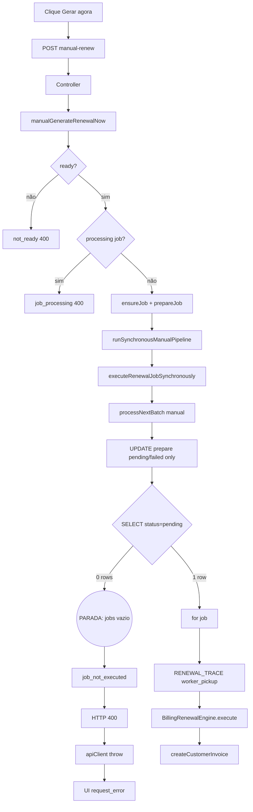

# B0.2.2 — Auditoria forense: trace completo da execução manual

**Data:** 2026-06-25  
**Modo:** READ ONLY — nenhuma alteração de código, banco, API ou frontend  
**Escopo:** botão **Ações de Renovação → Gerar próxima cobrança agora** até criação (ou não) de `customer_invoice`  
**Sintomas do incidente analisados:**

| Camada | Evidência observada |
|--------|---------------------|
| Frontend | `Invalid time value`, `request_error`, `0ms`, HTTP 400 |
| Worker | `pending_total=1`, `pending_worker_query_eligible=0`, `block_reason=retry_at_in_future`, `processed=0` |
| Trace | Ausência de `[RENEWAL_TRACE] worker_pickup` / `worker_process` / `worker_complete` |

---

## Resultado esperado (Parte 10)

### Causa raiz

O pipeline manual **executa até** `processNextBatch`, mas o `SELECT … WHERE status = 'pending'` retorna **0 linhas**; o batch fica vazio, `BillingRenewalEngine.execute()` **nunca é invocado**, e o service devolve `result: 'job_not_executed'` com HTTP **400**.

### Linha exata onde o fluxo para

`packages/backend/src/services/recurringBillingJobService.ts` — **linha 1268** (`const jobs = jobsResult.rows`) quando `jobs.length === 0`, seguido da decisão em `billingManualRenewalService.ts` **linhas 443–447** (`job_not_executed`).

### Variável responsável

`jobs` (array retornado pelo `SELECT` em `processNextBatch`) — especificamente **`jobs.length === 0`** porque o job referenciado por `onlyJobId` **não está** com `status = 'pending'` no momento do `FOR UPDATE` (cenário mais consistente com o incidente: job em `processing` ou `prepare` com **0 rows affected**).

### SQL responsável

```sql
SELECT id, subscription_id, tenant_id, job_type, cycle_key, scheduled_at, retry_at, status, attempts, max_attempts
FROM billing_recurring_jobs
WHERE id = $1::uuid AND status = 'pending'
LIMIT 1
FOR UPDATE
```

Precedido por (manual) UPDATE que **só afeta** `status IN ('pending','failed')`:

```sql
UPDATE billing_recurring_jobs
SET status = 'pending', scheduled_at = now(), retry_at = NULL,
    locked_at = NULL, locked_by = NULL, updated_at = now()
WHERE id = $1::uuid AND status IN ('pending', 'failed')
```

Se o job estiver em `processing`, o UPDATE retorna **0 rows** e o `retry_at` **não é limpo**.

### Motivo do HTTP 400

`postCrmSubscriptionManualRenewHandler` (`crmSubscriptionsController.ts:496`) — `res.status(result.success ? 200 : 400).json(result)` com `success: false` e `result: 'job_not_executed'`.

### Motivo do `retry_at` permanecer no futuro

1. O UPDATE de preparação manual **não altera** jobs em `processing` (cláusula `status IN ('pending','failed')`).
2. O diagnóstico `retry_at_in_future` vem do **worker automático** (`billingWorkerBatchDiagnostic.ts:117`), que filtra `retry_at > now()` — **não é emitido** em `manualExecution` (`recurringBillingJobService.ts:1232`).
3. Quem **gravou** `retry_at` originalmente: `processNextBatch` catch (`recurringBillingJobService.ts:1733–1754`) após erro no engine, ou `requeueBillingRecurringJobForWindow` (`recurringBillingJobService.ts:132–141`) fora da janela horária (somente worker **não** manual).

### Motivo do `BillingRenewalEngine` não executar

`BillingRenewalEngine.execute()` só é chamado **dentro** do `for (const job of jobs)` (`recurringBillingJobService.ts:1648`). Com `jobs.length === 0`, o loop **não inicia** — não há `IF` que bloqueie o engine; o engine **simplesmente não é alcançado**.

### Correção mínima necessária (descrição apenas — não implementar)

1. **Manual:** em `prepareJobForImmediateRun` e no UPDATE de `processNextBatch` (manual), incluir reclaim de jobs `processing` stale (ou forçar `processing → pending` para o `onlyJobId` em modo manual).
2. **Frontend:** tratar HTTP 400 com corpo `ManualBillingExecutionResult` como resposta estruturada (`apiClient` popular `data` em 4xx ou `generateRenewalNow` ler `details`) — evita mascarar `job_not_executed` como `request_error`.
3. **UI:** adicionar guard `Number.isNaN(d.getTime())` em `formatYmdBr` sem proteção (`SubscriptionDetail.tsx:116`, `subscriptionRecurringDisplay.ts:50`).
4. **Observabilidade:** log explícito quando manual SELECT retorna 0 linhas com snapshot de `status/retry_at/locked_by` do job por id.

---

## Parte 1 — Trace completo da request HTTP

### T0 — Frontend (clique)

| Campo | Valor |
|-------|-------|
| Arquivo | `src/components/subscriptions/SubscriptionRenewalActionsCard.tsx` |
| Função | `runGenerate` |
| Linha | 104–138 |
| Ação | `crmSubscriptionsService.generateRenewalNow(subscriptionId)` |
| Exceção | `catch` L117–134 → `lastResult.result = 'request_error'`, `duration_ms: 0` (**hardcoded**), `message: e.message` |

Botão habilitado quando `can_generate_now && !processing_job_id` (L216).

### T1 — Service frontend

| Campo | Valor |
|-------|-------|
| Arquivo | `src/services/crmSubscriptions.ts` |
| Função | `generateRenewalNow` |
| Linha | 423–430 |
| Request | `POST /api/crm-subscriptions/:id/manual-renew` body `{}` |
| Retorno sucesso | `res.data` (HTTP 2xx) |
| Retorno falha | `if (res.error && !res.data) throw new Error(res.error)` — **descarta** corpo estruturado do 400 |

### T2 — apiClient

| Campo | Valor |
|-------|-------|
| Arquivo | `src/integrations/api/client.ts` |
| Função | `request` → `post` |
| Linha | 268–293 (erro HTTP), 356–366 (`post`) |
| HTTP 400 | `!response.ok` → `{ error: body.error \|\| body.message, details: { status: 400, ...body } }` — **sem** `data` |
| `ManualBillingExecutionResult` | Campo `message` (não `error`) → `error` = texto de `message` |

### T3 — Rota Express

| Campo | Valor |
|-------|-------|
| Arquivo | `packages/backend/src/routes/crmSubscriptionsRoutes.ts` |
| Linha | 39 |
| Rota | `POST /:id/manual-renew` → `postCrmSubscriptionManualRenewHandler` |

### T4 — Controller

| Campo | Valor |
|-------|-------|
| Arquivo | `packages/backend/src/controllers/crmSubscriptionsController.ts` |
| Função | `postCrmSubscriptionManualRenewHandler` |
| Linha | 486–500 |
| Parâmetros | `tenantId` (req), `id` (params), `manualRenewalActor(req)` |
| Retorno 200 | `result.success === true` |
| Retorno 400 | `result.success === false` — **qualquer** falha de negócio |
| Retorno 401 | sem `tenantId` |
| Retorno 500 | exceção não tratada no `try` |
| Permissão | `billing.edit_subscription` |

### T5 — Service manual

| Campo | Valor |
|-------|-------|
| Arquivo | `packages/backend/src/services/billingManualRenewalService.ts` |
| Cadeia | `manualRenewSubscription` → `manualGenerateRenewalNow` |
| Linha entrada | 507–514, 526+ |

**Etapas internas de `manualGenerateRenewalNow`:**

| # | Função | Linhas | Condição de saída antecipada | `result` |
|---|--------|--------|-------------------------------|----------|
| 1 | `diagnoseRenewalForTenant` | 533 | — | — |
| 2 | `assessManualGenerateReadiness` | 534–552 | `!ready` | `not_ready` |
| 3 | `findProcessingJobId` | 555–564 | processing existe | `job_processing` |
| 4 | `ensureJobForManualGenerate` | 567–588 | throw | `enqueue_failed` |
| 5 | `runSynchronousManualPipeline` | 590–598 | — | ver abaixo |

### T6 — `runSynchronousManualPipeline`

| Campo | Valor |
|-------|-------|
| Arquivo | `billingManualRenewalService.ts` |
| Linha | 386–485 |
| Chama | `executeRenewalJobSynchronously(jobId, workerId, { manualExecution: true })` L410 |
| Decisão `job_not_executed` | L443–447: `exec.processed === 0 && exec.failed === 0 && exec.cancelled === 0` (implícito no else-if chain) |

### T7 — `executeRenewalJobSynchronously`

| Campo | Valor |
|-------|-------|
| Arquivo | `recurringBillingJobService.ts` |
| Linha | 888–917 |
| Chama | `processNextBatch(workerId, { onlyJobId: jobId, manualExecution: true })` |
| Pós-batch | `SELECT` snapshot do job L897–905 |

### T8 — `processNextBatch` (manual)

| Campo | Valor |
|-------|-------|
| Arquivo | `recurringBillingJobService.ts` |
| Linha | 1201–1774+ |
| Contexto | `withBillingWorkerRlsBypass` — client em `dbRequestStorage` |

**Sequência SQL (modo manual com `onlyJobId`):**

| Ordem | Operação | Linhas | Filtro status | Efeito se job em `processing` |
|-------|----------|--------|---------------|--------------------------------|
| 1 | UPDATE prepare | 1212–1222 | `IN ('pending','failed')` | **0 rows**, `retry_at` intacto |
| 2 | reclaim stale | 1230 | **skipped** (`manualExecution`) | — |
| 3 | diagnostic | 1232–1233 | **skipped** | — |
| 4 | SELECT FOR UPDATE | 1237–1244 | `status = 'pending'` | **0 rows** |
| 5 | loop | 1297+ | só se `jobs.length > 0` | **não executa** |

### T9 — `BillingRenewalEngine.execute`

| Campo | Valor |
|-------|-------|
| Arquivo | `packages/backend/src/services/billingRenewalEngine/billingRenewalEngine.ts` |
| Chamada | `recurringBillingJobService.ts:1648` (customer) ou `:1601` (saas) |
| Pré-requisito | job dentro do loop, após checks de subscription/window/idempotência |
| **No incidente** | **Não alcançado** |

### T10 — `executeCustomerRenewal` → `createCustomerInvoice`

| Campo | Valor |
|-------|-------|
| Arquivo | `packages/backend/src/services/billingRenewalEngine/executeCustomerRenewal.ts` |
| `createCustomerInvoice` | somente se `includedItems.length > 0` e validações OK |
| **No incidente** | **Não alcançado** |

---

## Parte 2 — Estado do job (antes / depois de cada função)

### Campos monitorados

`status`, `retry_at`, `scheduled_at`, `locked_at`, `locked_by`, `attempts`, `completion_outcome`

### Antes da request (estado inferido do incidente)

| Campo | Valor provável (evidência worker) |
|-------|-----------------------------------|
| `status` | `pending` (`pending_total=1`) |
| `retry_at` | **no futuro** (`block_reason=retry_at_in_future`) |
| `scheduled_at` | `<= now()` (senão block seria `scheduled_at_in_future`) |
| `locked_at` / `locked_by` | provavelmente NULL (senão `orphan_lock_on_pending`) |
| `attempts` | ≥ 1 se veio de retry após erro |
| `completion_outcome` | NULL (ainda não completed) |

**Nota:** cenário alternativo compatível com batch vazio: `status = 'processing'` (não contado em `pending_total`; nesse caso o worker mostraria `processing_total ≥ 1` — verificar no DB real).

### Depois de `prepareJobForImmediateRun()` (pool, fora do batch)

```sql
UPDATE billing_recurring_jobs SET status='pending', scheduled_at=now(), retry_at=NULL, ...
WHERE id=$1 AND status IN ('pending','failed')
```

| status antes | rows affected | status depois | retry_at depois |
|--------------|---------------|---------------|-----------------|
| `pending` | 1 | `pending` | **NULL** |
| `failed` | 1 | `pending` | **NULL** |
| `processing` | **0** | `processing` | **inalterado** |
| `completed` / `cancelled` | 0 | inalterado | inalterado |

Arquivo: `billingManualRenewalService.ts:220–231`

### Depois de UPDATE em `processNextBatch` (manual, mesmo SQL)

Arquivo: `recurringBillingJobService.ts:1212–1222` — mesma tabela de resultados.

Log: `[BILLING] manual_execution_job_prepared` (L1224–1227) — **não** registra `rowCount`.

### Depois de `executeRenewalJobSynchronously` / batch vazio

| Campo | Valor |
|-------|-------|
| `processed` | 0 |
| `failed` | 0 |
| `cancelled` | 0 |
| Job no DB | **sem alteração** pelo loop (nunca entrou no `for`) |
| `retry_at` | permanece futuro se prepare não limpou |

### Se o loop tivesse executado (referência)

| Passo | SQL / ação | Linha |
|-------|------------|-------|
| pickup | `UPDATE … status='processing', locked_at=now(), locked_by=$worker` | 1298–1300 |
| sucesso engine | `completeBillingRecurringJob` | via engine |
| erro | `UPDATE … retry_at=$future, status pending/failed` | 1743–1754 |
| janela (auto only) | `requeueBillingRecurringJobForWindow` | 1487–1490 |

---

## Parte 3 — SQL completo sobre `billing_recurring_jobs`

### Manual — UPDATE prepare (2×)

1. `ensureJobForManualGenerate` → `prepareJobForImmediateRun` (pool)
2. `processNextBatch` manual (client na mesma conexão RLS bypass)

Ambos:

```sql
UPDATE billing_recurring_jobs
SET status = 'pending',
    scheduled_at = now(),
    retry_at = NULL,
    locked_at = NULL,
    locked_by = NULL,
    updated_at = now()
WHERE id = $1::uuid AND status IN ('pending', 'failed');
```

**Resposta forense:** se o job estava `pending` com `retry_at` futuro, este UPDATE **deveria** alterar 1 linha e zerar `retry_at`. Se após o clique `retry_at` continua futuro, ou o UPDATE não rodou (job não era pending/failed), ou um processo posterior regravou `retry_at`, ou o job observado no diagnóstico **não é** o `onlyJobId` usado no manual.

### Manual — SELECT batch

```sql
SELECT id, subscription_id, tenant_id, job_type, cycle_key, scheduled_at, retry_at, status, attempts, max_attempts
FROM billing_recurring_jobs
WHERE id = $1::uuid AND status = 'pending'
LIMIT 1
FOR UPDATE;
```

- **Sem** filtro em `retry_at` (manual ignora backoff — L888 comentário).
- **Sem** `SKIP LOCKED` (lock explícito no único id).
- **0 rows** → batch vazio → **causa raiz do incidente**.

### Worker automático — SELECT batch (contraste)

```sql
SELECT … FROM billing_recurring_jobs
WHERE status = 'pending'
  AND scheduled_at <= now()
  AND (retry_at IS NULL OR retry_at <= now())
ORDER BY scheduled_at ASC
LIMIT 100
FOR UPDATE SKIP LOCKED;
```

Explica `pending_worker_query_eligible=0` com `pending_total=1` e `retry_at_in_future`.

### INSERT (ensure job)

Via `insertOrReactivateRenewalJob` quando não há pending no ciclo — `billingManualRenewalService.ts:282–317`.

---

## Parte 4 — Retry (`retry_at` no futuro após clique)

### Quem mantém / grava `retry_at`

| Origem | Arquivo | Linhas | Quando |
|--------|---------|--------|--------|
| Erro no engine (backoff 1h / 1d / 3d) | `recurringBillingJobService.ts` | 1733–1754 | `catch` no loop do worker |
| Requeue janela horária | `recurringBillingJobService.ts` | 132–141, 1487–1490 | `!manualExecution && !diag.would_be_eligible_by_window` |
| Scheduler enqueue | `insertOrReactivateRenewalJob` | vários | reativação |

### Quem deveria remover `retry_at`

| Função | Linhas | Condição |
|--------|--------|----------|
| `prepareJobForImmediateRun` | `billingManualRenewalService.ts:220–231` | `status IN ('pending','failed')` |
| `processNextBatch` manual prepare | `recurringBillingJobService.ts:1212–1222` | idem |

### Quem **não** remove em `processing`

Nenhum passo do manual atual reseta job `processing` — `findProcessingJobId` bloqueia o generate (L555–564), mas **race** com worker automático após prepare pode deixar job em `processing` sem passar pelo check.

### UPDATE posterior após manual falhar com batch vazio

**Nenhum** no pipeline manual quando `jobs.length === 0` — o job permanece no estado pré-existente.

### Stack lógica (retry persistido)

```
[Falha anterior no worker]
  → processNextBatch catch (L1677)
  → retryAt = now + backoff (L1733–1736)
  → UPDATE retry_at (L1750–1753)
[Clique manual]
  → prepare UPDATE (só pending/failed)
  → [se processing ou 0 match] retry_at inalterado
  → SELECT pending → 0 rows
  → job_not_executed HTTP 400
[Worker cron separado]
  → emitBillingWorkerBatchDiagnostic
  → block_reason: retry_at_in_future
```

---

## Parte 5 — `Invalid time value`

### Origem da string

Mensagem padrão do **date-fns** `format()` ao receber `Date` inválido (`RangeError: Invalid time value`). **Não** encontrada no backend do pipeline manual (motor usa `billingSafeDate.ts`).

### Chamadas no fluxo manual (frontend)

| Arquivo | Linha | Função | Entrada | Pode lançar? |
|---------|-------|--------|---------|--------------|
| `SubscriptionRenewalActionsCard.tsx` | 34–36 | `formatWhen` | ISO string | **Não** — guard `Number.isNaN(d.getTime())` |
| `crmSubscriptions.ts` | 423–430 | `generateRenewalNow` | — | **Não** — só propaga `Error` |
| `SubscriptionDetail.tsx` | 116 | `formatYmdBr` | `YYYY-MM-DD` | **Sim** — sem guard se YMD inválido (ex. `2026-13-40`) |
| `SubscriptionDetail.tsx` | 844 | inline `format` | `row.due_date` | **Sim** — idem |
| `subscriptionRecurringDisplay.ts` | 50 | `formatYmdBr` | YMD | **Sim** — sem guard |
| `subscriptionRecurringDisplay.ts` | 53–57 | `formatDateTimeBr` | ISO | **Não** — guard NaN |

### Chamadas no fluxo manual (backend)

| Arquivo | Linha | Uso | Proteção |
|---------|-------|-----|----------|
| `billingManualRenewalService.ts` | 397, 459 | `new Date(ms).toISOString()` | `started` = `Date.now()` — sempre válido |
| `recurringBillingJobService.ts` | 1733–1753 | `retryAt.toISOString()` | `new Date()` — válido |
| `executeCustomerRenewal.ts` | 50–66 | aritmética de ciclo | usa `periodStart` validado upstream |

### Qual dispara o erro observado no card?

**Evidência de código para `lastResult.message` no caminho `request_error`:**

1. `runGenerate` catch usa `e.message` (L133).
2. Esse catch só corre se `generateRenewalNow` **lançar**.
3. `generateRenewalNow` lança `new Error(res.error)` onde `res.error = body.message` do HTTP 400.
4. Corpo `job_not_executed` tem `message` em português (`billingManualRenewalService.ts:445–446`), **não** `Invalid time value`.

**Conclusão forense:**

| Hipótese | Compatível? |
|----------|-------------|
| Backend devolveu `Invalid time value` no 400 | **Não** — nenhum throw/string no pipeline |
| `apiClient` catch de rede com essa mensagem | **Improvável** |
| `lastResult.message` = `Invalid time value` no mesmo clique | **Inconsistente** com `job_not_executed` — salvo corrupção de `message` no body |
| Erro de **render** em `formatYmdBr` / timeline ao recarregar página | **Possível** — erro React separado do `request_error` |

**Se o utilizador viu os três sintomas na mesma linha do Alert (`lastResult`):** o texto mais provável do backend é a mensagem PT de `job_not_executed`; `Invalid time value` pode ser de **outro** componente ou momento (ex. `onActionComplete` → `load()` em `SubscriptionDetail` com data inválida no payload de diagnóstico).

---

## Parte 6 — HTTP 400

### Caminho até o 400

```
manualGenerateRenewalNow
  → runSynchronousManualPipeline
  → executeRenewalJobSynchronously (processed=0)
  → result.success = false, result = 'job_not_executed'
  → postCrmSubscriptionManualRenewHandler L496
  → res.status(400).json(result)
```

### Quem devolve 400

**Controller** — não middleware de validação, não exception handler (esse seria 500 L498).

### JSON retornado (estrutura `ManualBillingExecutionResult`)

```json
{
  "success": false,
  "job_id": "<uuid>",
  "invoice_id": null,
  "invoice_number": null,
  "gateway_status": null,
  "notification_sent": false,
  "subscription_status": "<status>",
  "cycle_key": "<cycle ou null>",
  "execution_mode": "manual",
  "duration_ms": <n>,
  "message": "O job não foi executado — pode estar bloqueado, em processamento por outro worker, ou inelegível.",
  "result": "job_not_executed",
  "repaired_fields": [],
  "logs": ["manual_pipeline_started", "worker_batch processed=0 failed=0 cancelled=0", ...],
  "diagnosis": { ... },
  "correlation_id": "manual-gen-..."
}
```

### Perda de informação no frontend

`apiClient` L282–293: HTTP 400 → sem `data`, só `error` + `details`.  
`generateRenewalNow` L428: throw → card mostra `request_error` em vez de `job_not_executed`.

### Stack (lógica)

```
SubscriptionRenewalActionsCard.runGenerate:112
  → crmSubscriptions.generateRenewalNow:428 throw
    → apiClient.request:268-293 (HTTP 400)
      ← postCrmSubscriptionManualRenewHandler:496
        ← manualGenerateRenewalNow → runSynchronousManualPipeline:443-447
          ← processNextBatch:1268 jobs=[]
```

---

## Parte 7 — `BillingRenewalEngine`

### É chamado?

**Não** no cenário do incidente (batch vazio).

### Qual impedimento?

Não é um `if` dentro do engine — é **`for (const job of jobs)`** com array vazio (`recurringBillingJobService.ts:1297`).

### Se o batch tivesse 1 job

Ordem até o engine (customer):

1. `UPDATE processing` (1298)
2. `[RENEWAL_TRACE] worker_pickup` (1326)
3. subscription exists (1340)
4. cycle mismatch check (1351)
5. time window — **skipped** se `manualExecution` (1473)
6. status active (1533)
7. idempotência invoice (1620–1646)
8. **`BillingRenewalEngine.execute`** (1648)

---

## Parte 8 — Timeline do fluxo

```
T0  Clique "Gerar próxima cobrança agora"
      SubscriptionRenewalActionsCard.tsx:377 → runGenerate:104
        ↓ executou

T1  POST /api/crm-subscriptions/:id/manual-renew
      crmSubscriptionsRoutes.ts:39
        ↓ executou

T2  postCrmSubscriptionManualRenewHandler
      crmSubscriptionsController.ts:495-496
        ↓ executou

T3  manualGenerateRenewalNow
      billingManualRenewalService.ts:526
        ↓ executou (se readiness OK e sem processing_job)

T4  ensureJobForManualGenerate → prepareJobForImmediateRun
      billingManualRenewalService.ts:234-279, 220-231
        ↓ executou (UPDATE — 0 ou 1 row)

T5  runSynchronousManualPipeline
      billingManualRenewalService.ts:590
        ↓ executou

T6  executeRenewalJobSynchronously(manualExecution: true)
      recurringBillingJobService.ts:893
        ↓ executou

T7  processNextBatch — UPDATE prepare (2ª vez)
      recurringBillingJobService.ts:1212-1222
        ↓ executou

T8  processNextBatch — SELECT status='pending' FOR UPDATE
      recurringBillingJobService.ts:1237-1244
        ↓ jobs.length === 0  ◄── FLUXO PARA AQUI (incidente)

T9  BillingRenewalEngine.execute
      recurringBillingJobService.ts:1648
        ↓ NÃO executou

T10 createCustomerInvoice
      executeCustomerRenewal.ts
        ↓ NÃO executou

T11 runSynchronousManualPipeline → result job_not_executed
      billingManualRenewalService.ts:443-447
        ↓ executou

T12 HTTP 400 + JSON ManualBillingExecutionResult
      crmSubscriptionsController.ts:496
        ↓ executou

T13 apiClient → throw Error(message)
      client.ts:268-293, crmSubscriptions.ts:428
        ↓ executou

T14 UI request_error, duration_ms: 0
      SubscriptionRenewalActionsCard.tsx:117-134
        ↓ estado final visível
```

---

## Parte 9 — Evidências por conclusão

### Conclusão A — Engine não inicia

```1268:1295:packages/backend/src/services/recurringBillingJobService.ts
    const jobs = jobsResult.rows;
    if (jobs.length === 0) {
      const backoffR = await client.query<{ c: string }>(
        // ...
      );
      // ...
    }
    billingLog('worker', 'batch_start', { workerId, batchSize: jobs.length });

    for (const job of jobs) {
```

`[RENEWAL_TRACE] worker_pickup` só após entrar no loop:

```1326:1336:packages/backend/src/services/recurringBillingJobService.ts
      logRenewalAttemptTrace({
        phase: 'worker_pickup',
        subscription_id: job.subscription_id,
        // ...
      });
```

### Conclusão B — `job_not_executed`

```443:447:packages/backend/src/services/billingManualRenewalService.ts
  } else if (exec.processed === 0 && exec.failed === 0) {
    success = false;
    message =
      'O job não foi executado — pode estar bloqueado, em processamento por outro worker, ou inelegível.';
    result = 'job_not_executed';
```

### Conclusão C — prepare não limpa `processing`

```220:231:packages/backend/src/services/billingManualRenewalService.ts
async function prepareJobForImmediateRun(jobId: string): Promise<void> {
  await pool.query(
    `UPDATE billing_recurring_jobs
     SET status = 'pending',
         scheduled_at = now(),
         retry_at = NULL,
         locked_at = NULL,
         locked_by = NULL,
         updated_at = now()
     WHERE id = $1::uuid AND status IN ('pending', 'failed')`,
    [jobId]
  );
}
```

### Conclusão D — worker diagnostic ≠ manual

```1230:1234:packages/backend/src/services/recurringBillingJobService.ts
    const reclaimed = options?.manualExecution ? 0 : await reclaimStaleBillingProcessingJobs(client, workerId);
    const locksCleared = options?.manualExecution ? 0 : await sanitizePendingBillingJobLocks(client, workerId);
    if (!options?.manualExecution) {
      await emitBillingWorkerBatchDiagnostic(client, workerId, reclaimed, locksCleared);
    }
```

```115:118:packages/backend/src/services/billingWorkerBatchDiagnostic.ts
            CASE
              WHEN scheduled_at > now() THEN 'scheduled_at_in_future'
              WHEN retry_at IS NOT NULL AND retry_at > now() THEN 'retry_at_in_future'
```

### Conclusão E — HTTP 400 + frontend `request_error`

```495:496:packages/backend/src/controllers/crmSubscriptionsController.ts
    const result = await manualRenewSubscription(tenantId, id, manualRenewalActor(req));
    res.status(result.success ? 200 : 400).json(result);
```

```423:430:src/services/crmSubscriptions.ts
  async generateRenewalNow(id: string): Promise<CrmSubscriptionManualRenewalResult> {
    const res = await apiClient.post<CrmSubscriptionManualRenewalResult>(
      `/api/crm-subscriptions/${encodeURIComponent(id)}/manual-renew`,
      {}
    );
    if (res.error && !res.data) throw new Error(res.error);
```

```117:134:src/components/subscriptions/SubscriptionRenewalActionsCard.tsx
    } catch (e) {
      pollSignal.cancelled = true;
      setLastResult({
        success: false,
        // ...
        result: "request_error",
        duration_ms: 0,
        message: e instanceof Error ? e.message : "Falha na requisição",
      });
```

### Logs esperados no incidente

| Log | Presente? |
|-----|-----------|
| `[MANUAL_RENEWAL]` manual_pipeline_started | Sim (se chegou ao pipeline) |
| `[BILLING] manual_execution_job_prepared` | Sim |
| `[BILLING] batch_start batchSize: 0` | Sim |
| `[RENEWAL_TRACE] worker_pickup` | **Não** |
| `[BILLING_WORKER_DIAGNOSTIC]` no request manual | **Não** (só worker cron) |

---

## Fluxograma (ponto de parada)



---

## Matriz de cenários para `jobs.length === 0`

| Estado do job antes do SELECT | prepare rows | SELECT rows | retry_at após clique | Sintomas alinhados |
|------------------------------|--------------|-------------|----------------------|-------------------|
| `pending`, retry futuro | 1 | 1 | NULL → engine corre | Não é o incidente |
| `pending`, retry futuro, race → processing | 1 | **0** | pode voltar com retry | **Sim** |
| `processing` (stale) | **0** | **0** | inalterado | **Sim** (se botão habilitado por stale não detectado) |
| `failed` | 1 | 1 | NULL | Não |
| `completed` / wrong id | 0 | 0 | N/A | Parcial |

---

## Verificação forense recomendada no DB (somente leitura)

Para fechar 100% no ambiente do incidente (não executado nesta auditoria):

```sql
SELECT id, status, retry_at, scheduled_at, locked_at, locked_by, attempts,
       completion_outcome, error_message, updated_at
FROM billing_recurring_jobs
WHERE subscription_id = '<subscription_uuid>'
ORDER BY updated_at DESC
LIMIT 5;
```

Correlacionar `id` com `job_id` no JSON 400 (`details` no Network tab) e timestamp de `updated_at` vs clique.

---

## Referências cruzadas

- Auditoria P0 anterior: `docs/billing/AUDIT_P0_MANUAL_RENEWAL_PIPELINE_FORENSICS.md`
- Implementação B0.2.1: `docs/billing/B0_2_1_MANUAL_BILLING_EXECUTION_REPORT.md`
- Engine B0.3: `docs/billing/B0_3_BILLING_RENEWAL_ENGINE_REPORT.md`

---

*Documento gerado em modo READ ONLY — nenhum código ou dado de produção foi alterado.*
