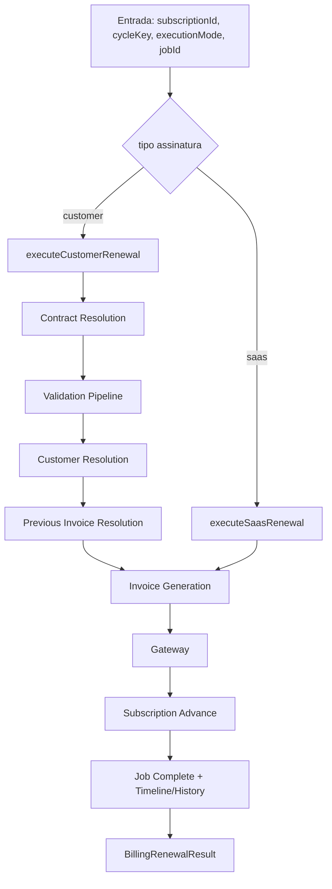

# B0.3 — BillingRenewalEngine (Core)

Relatório de consolidação arquitetural do motor de renovação financeira.

---

## 1. Arquitetura anterior

```
Scheduler (enqueue)
    ↓
processNextBatch (locks, janela, retry, batch)
    ↓
processOneCustomerRenewalJob  ─┐
processOneRenewalJob (SaaS)    ─┤ regras de negócio acopladas ao worker
    ↓                           │
validateRenewalContext          │
invoice / gateway / advance     │
completeBillingRecurringJob   ─┘

Manual (B0.2.1)
    ↓
runSynchronousManualPipeline
    ↓
executeRenewalJobSynchronously → processNextBatch → processOneCustomerRenewalJob
```

**Problema:** pipeline financeiro embutido em `recurringBillingJobService.ts` (~700 linhas), sem ponto único de entrada.

---

## 2. Arquitetura nova

```
Scheduler / Worker / Manual / Recovery / API
    ↓
[fora do engine] locks, batch, retry_at, janela, enqueue
    ↓
BillingRenewalEngine.execute()
    ↓
executeCustomerRenewal | executeSaasRenewal
    ↓
billingRecurringJobPersistence (complete / cancel / advance)
```

---

## 3. Fluxograma



---

## 4. Responsabilidades

| Componente | Responsabilidade |
|------------|------------------|
| `BillingRenewalEngine` | Ponto único `execute()`; roteamento por tipo |
| `executeCustomerRenewal` | Pipeline CRM completo |
| `executeSaasRenewal` | Pipeline SaaS completo |
| `billingRecurringJobPersistence` | complete/cancel/advance job + cycle dual-write |
| `utils/billingCycleKey` | Normalização YMD compartilhada |
| `processNextBatch` | Batch, locks, janela, idempotência pré-engine, erro/retry |
| `billingManualRenewalService` | Orquestração manual (ensure job, flush notificações) |

---

## 5. Código removido de `recurringBillingJobService.ts`

- `processOneCustomerRenewalJob` (~500 linhas)
- `processOneRenewalJob` (~180 linhas)
- `calculateNextItemDueDate`
- Duplicatas de persistência de jobs e normalização de datas

---

## 6. Código compartilhado

- `validateRenewalContext` (B0.1)
- `resolveCrmRenewalPreviousInvoice`
- `billingRecurringJobPersistence`
- `BillingRenewalEngine.execute()` — worker automatic + manual

---

## 7. Arquivos alterados / criados

**Novos:** `billingRenewalEngine/*`, `billingRecurringJobPersistence.ts`, `utils/billingCycleKey.ts`

**Alterados:** `recurringBillingJobService.ts`

**Inalterados:** APIs, frontend, gateway, schema

---

## 8. Cobertura dos testes

| Teste | Escopo |
|-------|--------|
| `billingRenewalEngine.test.ts` | Roteamento customer/saas; modos automatic/manual |
| `billingManualRenewalExecution.test.ts` | Manual → engine |
| `recurringBillingJobService.advance.test.ts` | Advance de ciclo |

---

## 9. Garantia de compatibilidade

- Lógica movida sem reescrita de regras
- Worker mantém locks, janela, retry fora do engine
- Manual via `executionMode: 'manual'`
- Re-exports preservados em `recurringBillingJobService`
