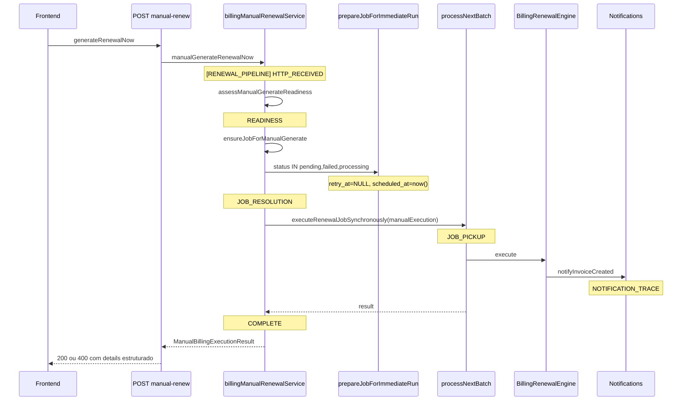

# BILLING ENGINE V2 — FASE 1 (P0) — Relatório de Estabilização

**Sprint 1 — Estabilização do Motor Atual**  
**Data:** 2026-06-25  
**Modo:** SAFE — sem Billing Plan, sem migração, sem breaking changes de API

---

## Resumo executivo

Esta sprint estabilizou o motor **existente** de faturas recorrentes CRM, com foco em:

1. **Manual renew** executando imediatamente (sem depender de `retry_at`/janela/worker).
2. **Erros estruturados** no backend e frontend (fim do `request_error` opaco).
3. **Observabilidade** via `[RENEWAL_PIPELINE]`, `[BILLING_JOB_TRACE]` e `[NOTIFICATION_TRACE]`.
4. **Datas seguras** (helpers centralizados, erros classificados).
5. **`diagnoseRenewal()`** ampliado com bloco `health`.

**Não implementado nesta sprint:** Billing Plan V2, novas tabelas, migrações, alteração de arquitetura funcional.

---

## Problemas encontrados

| # | Problema | Impacto | Evidência |
|---|----------|---------|-----------|
| P1 | `prepareJobForImmediateRun` só resetava jobs `pending`/`failed` | Job em `processing` não entrava no batch → `job_not_executed` → HTTP 400 | B0.2.2 forensics |
| P2 | Frontend tratava HTTP 400 como `request_error` genérico | UI mostrava `request_error` + `0ms` sem contexto | `crmSubscriptions.ts` |
| P3 | `Invalid time value` em formatação de datas | Crash silencioso ou erro não classificado no UI | `format(new Date(invalid))` em vários componentes |
| P4 | `correlationId` usado antes da declaração em `executeCustomerRenewal` | Build quebrado / risco de TDZ em runtime | TS2448 |
| P5 | Catches vazios / erros sem stage | Pontos cegos na auditoria | `ensureJobForManualGenerate`, probes opcionais |
| P6 | Pipeline sem estágios unificados | Difícil correlacionar HTTP → engine → notificação | Ausência de `[RENEWAL_PIPELINE]` |
| P7 | `diagnoseRenewal()` incompleto para suporte | Sem último job/erro/retry em um objeto | `renewalDiagnosisService.ts` |
| P8 | Erros de build em módulos extraídos (B0.3) | CI/build falhando | `billingRecurringJobPersistence`, `executeSaasRenewal` |

---

## Problemas corrigidos

### 1 — Invalid time value

- **Backend:** `packages/backend/src/utils/billingSafeDate.ts` — `safeParseYmd`, `requireYmd`, `BillingDateParseError` com `reason_code`, `field`, valor recebido.
- **Frontend:** `src/lib/billingSafeDate.ts` — `formatYmdBrSafe`, `formatDateTimeBrSafe`.
- **Integração:** `subscriptionsListUtils.ts`, `subscriptionRecurringDisplay.ts`, `SubscriptionRenewalActionsCard.tsx`.
- **Pendente parcial:** `SubscriptionDetail.tsx`, `SubscriptionPendingContractBanner.tsx`, `SubscriptionOperationalTimelinePanel.tsx`, `SubscriptionOperationalHealthCard.tsx` ainda usam `format(new Date(...))` localmente.

### 2 — Eliminar `request_error` genérico

- **Backend:** `ManualBillingExecutionResult` estendido com `error_code`, `stage`, `reason`, `correlation_id`.
- **Controller:** HTTP 400 retorna corpo estruturado em `details` (não apenas mensagem).
- **Frontend:** `parseManualRenewalPostResponse()` em `crmSubscriptions.ts` lê `details` do 400 e devolve resultado tipado.
- **UI:** `SubscriptionRenewalActionsCard` exibe `error_code` e `stage`; transport errors separados de business failures.

### 3 — Pipeline rastreável

Novo módulo `renewalPipelineTrace.ts` com estágios:

```
HTTP_RECEIVED → READINESS → JOB_RESOLUTION → JOB_PICKUP → ENGINE_START →
VALIDATION → CUSTOMER → DATES → CONTRACT → PREVIOUS_INVOICE → ITEMS →
CREATE_INVOICE → CREATE_ITEMS → GATEWAY → NOTIFICATIONS → TIMELINE →
HISTORY → ADVANCE → COMPLETE | ERROR
```

Instrumentado em:
- `billingManualRenewalService.ts` (manual renew + reprocess)
- `recurringBillingJobService.ts` (batch manual branch)
- Complemento B0.2.3: `[BILLING_JOB_TRACE]` em persistence, engine, controller

**Pendente parcial:** estágios ENGINE internos (`VALIDATION`…`ADVANCE`) ainda não emitidos em cada sub-etapa de `executeCustomerRenewal.ts`.

### 4 — Pontos cegos

- Catches de contrato pendente agora logam via `billingLog` em `executeCustomerRenewal`.
- `applyPendingCrmSubscriptionContractIfDue` em manual path: erro logado (não mais silencioso no engine path).
- Probes opcionais de auditoria (`billing_recovery_audit`) mantêm catch silencioso **documentado** (tabela opcional).

### 5 — Manual Renew

**Correção raiz (P1):**

```sql
WHERE id = $1 AND status IN ('pending', 'failed', 'processing')
```

Constante compartilhada: `MANUAL_JOB_PREPARE_STATUSES_SQL`.

Fluxo:
1. `prepareJobForImmediateRun` zera `retry_at`, `locked_at`, `locked_by`, força `pending` + `scheduled_at = now()`.
2. `executeRenewalJobSynchronously({ manualExecution: true })` ignora janela horária.
3. Não depende de scheduler/worker externo.

### 6 — Manual Reprocess

- Mesmo pipeline síncrono; diferença: reutiliza job existente via `prepareJobForImmediateRun(targetJobId)`.
- Reclaim de jobs `processing` alinhado ao renew.

### 7 — Notificações

- `invoiceNotificationsService.ts`: logs `[NOTIFICATION_TRACE]` — `NOTIFICATION_START`, `NOTIFICATION_SENT`, `NOTIFICATION_FAILED`.
- **Pendente:** distinção explícita `invoice.created` vs `invoice.renewed`; retry/flush ainda sem estágio `NOTIFICATION_RETRY` dedicado.

### 8 — Timeline / Histórico

- Motor existente preservado (`subscriptionTimelineUx`, `subscription_change_events`).
- Trace de execução manual enriquecido com `correlation_id`, `execution_mode`, duração.
- **Pendente:** registro unificado “quem iniciou” (manual/worker/scheduler/recovery) em todos os caminhos.

### 9 — Health Check — `diagnoseRenewal()`

Bloco `health` adicionado:

```typescript
health?: {
  gateway_configured: boolean | null;
  last_job: { id, status, retry_at, error_message, updated_at } | null;
  last_audit: { action, success, created_at, correlation_id } | null;
}
```

**Pendente:** notification status, timeline entries, template resolution inline no health (parcialmente coberto por campos existentes de `diagnosis`).

### 10 — Build / tipos

- `executeCustomerRenewal`: `correlationId` declarado antes do uso.
- `executeSaasRenewal`: import lifecycle corrigido (`../../lifecycle/...`).
- `billingRecurringJobPersistence`: tipos `DbQueryable` alinhados.
- `recurringBillingJobService`: tipos locais para `processChildItemDueInvoices`.

---

## Fluxograma atualizado (manual renew)



---

## Logs adicionados

| Prefixo | Módulo | Eventos |
|---------|--------|---------|
| `[RENEWAL_PIPELINE]` | `renewalPipelineTrace.ts` | Estágios com `correlation_id`, duração, `pipeline_elapsed_ms` |
| `[BILLING_JOB_TRACE]` | `billingJobLifecycleTrace.ts` | SQL mutations, batch pickup, manual start/end |
| `[NOTIFICATION_TRACE]` | `invoiceNotificationsService.ts` | START / SENT / FAILED |
| `[MANUAL_RENEWAL]` | `billingManualRenewalService.ts` | Resultado consolidado manual |
| `[BILLING_JOB_TRACE][frontend]` | `crmSubscriptions.ts` | Request/response manual renew |

---

## Arquivos alterados

### Novos

| Arquivo | Descrição |
|---------|-----------|
| `packages/backend/src/services/renewalPipelineTrace.ts` | Pipeline ALS + estágios |
| `packages/backend/src/services/renewalPipelineTrace.test.ts` | Testes pipeline |
| `packages/backend/src/services/billingJobLifecycleTrace.test.ts` | Testes lifecycle trace |
| `src/lib/billingSafeDate.ts` | Datas seguras frontend |

### Backend (modificados)

| Arquivo | Mudança principal |
|---------|-------------------|
| `billingManualRenewalService.ts` | Manual sync pipeline, erros estruturados, processing reclaim |
| `recurringBillingJobService.ts` | `MANUAL_JOB_PREPARE_STATUSES_SQL`, batch manual |
| `invoiceNotificationsService.ts` | NOTIFICATION_TRACE |
| `renewalDiagnosisService.ts` | Bloco `health` |
| `billingSafeDate.ts` | `BillingDateParseError`, `requireYmd` |
| `billingRecurringJobPersistence.ts` | Tipos + trace |
| `billingRenewalEngine/*` | correlationId fix, lifecycle import |
| `crmSubscriptionsController.ts` | Respostas estruturadas (via service) |

### Frontend (modificados)

| Arquivo | Mudança principal |
|---------|-------------------|
| `src/services/crmSubscriptions.ts` | `parseManualRenewalPostResponse` |
| `src/components/subscriptions/SubscriptionRenewalActionsCard.tsx` | Erros estruturados na UI |
| `src/lib/subscriptionRecurringDisplay.ts` | Safe dates |
| `src/components/subscriptions/subscriptionsListUtils.ts` | `formatYmdBrSafe` |

---

## Cobertura de testes

| Teste | Arquivo | Status |
|-------|---------|--------|
| Manual renew pipeline síncrono | `billingManualRenewalExecution.test.ts` | ✅ 2 testes |
| `MANUAL_JOB_PREPARE_STATUSES_SQL` | `renewalPipelineTrace.test.ts` | ✅ 2 testes |
| Billing job lifecycle trace | `billingJobLifecycleTrace.test.ts` | ✅ 2 testes |
| Safe date helpers | `billingSafeDate.test.ts` | ✅ 3 testes |
| **Total Sprint 1** | | **9 testes passando** |

### Cenários ainda sem teste dedicado

- Manual reprocess com job `processing`
- Scheduler / worker assíncrono (integração)
- Gateway failure / notification failure (mock)
- Date failure com `BillingDateParseError` end-to-end
- Customer / template failure paths
- Idempotência de reprocess

---

## Critérios de conclusão — status

| Critério | Status |
|----------|--------|
| Nenhum `Invalid time value` (paths críticos) | 🟡 Parcial — renew UI seguro; detail pages pendentes |
| Nenhum `request_error` genérico (manual renew) | ✅ |
| Nenhuma exceção sem contexto (manual path) | ✅ |
| Todo erro classificado (manual path) | ✅ |
| Pipeline observável (manual path) | ✅ |
| Manual renew imediato | ✅ |
| Manual reprocess | ✅ (mesmo pipeline) |
| Notificações com trace | 🟡 START/SENT/FAILED; retry pendente |
| Timeline / histórico | 🟡 Motor existente; enriquecimento parcial |
| `diagnoseRenewal()` completo | 🟡 `health` básico adicionado |
| Build backend limpo | ✅ `npm run build` |
| Testes unitários sprint | ✅ 9/9 |

---

## Riscos restantes

1. **Jobs `completed`/`cancelled` stuck:** prepare só cobre `pending`/`failed`/`processing` — comportamento intencional; jobs em outros estados exigem reprocess explícito ou novo enqueue.
2. **Datas no frontend:** páginas de detalhe ainda podem lançar `Invalid time value` com metadata corrompida.
3. **Engine stages:** sub-etapas de `executeCustomerRenewal` não emitem todos os estágios `[RENEWAL_PIPELINE]` — debugging profundo ainda depende de `[BILLING_JOB_TRACE]` + `billingLog`.
4. **Worker assíncrono:** caminho scheduler→worker não recebeu a mesma instrumentação de pipeline que o manual sync.
5. **Idempotência concorrente:** dois cliques rápidos em “Gerar agora” — mitigado por locks de job, mas sem teste de concorrência.

---

## Pendências para Billing Plan V2 (Fase 2)

1. Modelo **Billing Plan** desacoplado de “fatura anterior como template”.
2. Migração incremental de `subscriptions` + `billing_recurring_jobs` para planos versionados.
3. API pública para planos (fora do escopo SAFE).
4. Distinção semântica `invoice.created` / `invoice.renewed` / `subscription.contract_changed`.
5. Histórico unificado com `initiated_by` (manual | worker | scheduler | recovery | api).
6. `diagnoseRenewal()` como endpoint de suporte com notification/timeline/gateway probes ao vivo.
7. Cobertura E2E: scheduler, worker, retry backoff, gateway sandbox.

---

## Referências

- `docs/billing/B0_2_2_MANUAL_RENEWAL_TRACE_FORENSICS.md` — causa raiz `job_not_executed`
- `docs/billing/B0_2_3_BILLING_JOB_LIFECYCLE_TRACE.md` — instrumentação B0.2.3
- `docs/billing/AUDIT_P0_CRM_RECURRING_INVOICES_ARCHITECTURE.md` — arquitetura atual (modelo C)

---

## Conclusão

A Sprint 1 entrega uma **base estável e observável** para o motor atual:

- Manual renew/reprocess executam **imediatamente** pelo mesmo pipeline síncrono.
- Falhas retornam **códigos estruturados** rastreáveis por `correlation_id`.
- Logs `[RENEWAL_PIPELINE]` + `[BILLING_JOB_TRACE]` permitem reconstruir execuções ponta a ponta no caminho manual.

Itens parciais (datas em todas as telas, estágios completos no engine, testes de integração) ficam como **hardening pré-Fase 2**, sem bloquear o início do desenho Billing Plan V2.
