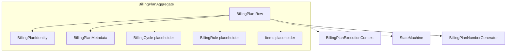

# BILLING ENGINE V2 — Sprint 2.1A — Domain Hardening

**Data:** 2026-06-25  
**Modo:** SAFE — zero impacto no runtime do motor

---

## Resumo

Esta sprint amadurece o **domínio Billing Plan** antes de qualquer uso pelo engine. Nenhum fluxo de produção foi alterado.

---

## Arquitetura anterior (Sprint 2.1)

```
Subscription
    ↓
billing_plans (tabela plana)
    ↓
Repository / Service / Factory
```

---

## Arquitetura nova (Sprint 2.1A)

```
Subscription
    ↓
BillingPlan (entidade enriquecida)
    ↓
BillingPlanAggregate
    ├── BillingPlanIdentity (VO)
    ├── BillingPlanMetadata (VO)
    ├── BillingCycle[] (conceito)
    ├── BillingRule (conceito)
    └── BillingItems (placeholder)
    ↓
BillingPlanExecutionContext (shadow — vazio)
```

**Motor legado:** inalterado. `BILLING_PLAN_V2=false`.

---

## DDD — Billing Plan

### Aggregate Root
`BillingPlanAggregate` — reúne plan, identity, metadata, cycles, items, rules. Sem regras de negócio.

### Value Objects
| VO | Responsabilidade |
|----|------------------|
| `BillingPlanIdentity` | plan_number, subscription_id, tenant_id, version, revision |
| `BillingPlanMetadata` | origin, migration, engine, flags, custom |

### State Machine
`billingPlanStateMachine.ts` — valida transições de **status** (lifecycle) e **plan_state** (operacional) de forma independente.

Exemplo permitido:
- `status = active` + `plan_state = paused`

### Versionamento vs Revision

| Conceito | Campo | Significado |
|----------|-------|-------------|
| Version | `version` | Mudança estrutural do plano (nova row) |
| Revision | `plan_revision` | Ajustes menores na mesma version |

---

## Campos estruturais novos

| Campo | Tipo | Default |
|-------|------|---------|
| `plan_number` | BP-00000001 | sequence global |
| `created_from` | enum | subscription |
| `engine_version` | v1 \| v2 \| future | v1 |
| `billing_strategy` | legacy_invoice_copy \| … | legacy_invoice_copy |
| `plan_revision` | int ≥ 1 | 1 |
| `plan_state` | draft \| running \| paused \| … | draft |

---

## Plan Number

- Sequence PostgreSQL: `billing_plan_number_seq`
- Generator: `BillingPlanNumberGenerator` / `allocateBillingPlanNumber()`
- UNIQUE em `plan_number` — nunca reutilizado
- Independente de `subscription_id` (suporte, auditoria, integrações)

---

## Billing Strategy & Engine Version

Preparam **Shadow Mode** (Sprint 2.3):

- `legacy_invoice_copy` — motor atual (default)
- `billing_plan_items` — futuro motor V2
- `mixed` / `future` — evolução

---

## Future Billing Cycle (conceito)

Tipo `BillingCycle` em `types.ts` — sem tabela:

```
id, cycle_key, starts_at, ends_at, due_at, status, invoice_id, renewal_result
```

---

## Future Billing Rule (conceito)

Tipo `BillingRule` + `billingRule.ts` — interval, frequency, anchor, proration, trial, generation days, retry, grace.

---

## Repository (evoluído)

Métodos existentes preservados. Novos:

- `findByPlanNumber()`
- `findLatestVersion()`
- `findLatestRevision()`
- `existsPlanNumber()`

`create()` aloca `plan_number` automaticamente se omitido.

---

## Service (placeholders)

- `createRevision()` → `not_implemented`
- `archiveVersion()` → `not_implemented`
- `promoteVersion()` → `not_implemented`

---

## Shadow Context

`BillingPlanExecutionContext` + `emptyBillingPlanExecutionContext()` — estrutura vazia para Sprint 2.2+.

---

## Diagrama do domínio



---

## Fluxograma runtime (inalterado)

```
[Motor V1] subscriptions → invoice template → BillingRenewalEngine
[Billing Plan V2] billing_plans — isolado, sem leitura pelo motor
```

---

## Arquivos criados

| Arquivo |
|---------|
| `database/init/280_billing_plans_domain_hardening.sql` |
| `billingPlanNumberGenerator.ts` |
| `billingPlanIdentity.ts` |
| `billingPlanMetadata.ts` |
| `billingPlanStateMachine.ts` |
| `billingPlanAggregate.ts` |
| `billingPlanRevision.ts` |
| `billingPlanRule.ts` |
| `billingPlanExecutionContext.ts` |
| `billingPlanNumberGenerator.test.ts` |
| `billingPlanStateMachine.test.ts` |
| `billingPlanIdentity.test.ts` |
| `billingPlanAggregate.test.ts` |
| `billingPlanRevision.test.ts` |
| `billingPlanMetadata.test.ts` |

---

## Arquivos alterados

| Arquivo | Mudança |
|---------|---------|
| `types.ts` | Enums + campos estruturais + BillingCycle/Rule |
| `billingPlanRepository.ts` | Novos campos + métodos |
| `billingPlanFactory.ts` | Defaults domain + metadata tipada |
| `billingPlanService.ts` | Placeholders + duplicate metadata |
| `index.ts` | Exports domínio |
| `migrationOrder.ts` | +280 |
| Testes 2.1 | Helpers atualizados (compatíveis) |

**Não alterados:** BillingRenewalEngine, worker, scheduler, gateway, notifications, APIs, frontend.

---

## Compatibilidade

1. Nenhum import de `billingPlan` fora do próprio módulo e testes.
2. `BILLING_PLAN_V2` permanece **OFF**.
3. Motor continua 100% subscription + invoice anterior.
4. Migration 280 é aditiva (ALTER TABLE + sequence).
5. Repository `create()` backward-compatible — novos campos têm defaults.

---

## Testes

| Suite | Testes |
|-------|--------|
| Sprint 2.1 (existentes) | 15 |
| Sprint 2.1A (novos) | 19 |
| **Total billingPlan** | **34** |

`npm run build` ✅

---

## Preparação Sprint 2.2 — Billing Items

- `BillingPlanAggregate.items` placeholder pronto
- `billing_strategy` permite futuro `billing_plan_items`
- `BillingPlanMetadata.flags.future_items_enabled` reservado
- Revision/Version separados para itens versionados por plano

---

## Critérios de aprovação

| Critério | Status |
|----------|--------|
| Nenhuma alteração funcional | ✅ |
| Motor inalterado | ✅ |
| Feature Flag OFF | ✅ |
| Build limpo | ✅ |
| 34 testes passando | ✅ |
| Domínio completo (Aggregate, VO, SM) | ✅ |

---

## Conclusão

O Billing Plan deixou de ser apenas uma tabela auxiliar e passou a representar um **domínio DDD completo**, pronto para Billing Items (2.2) e Shadow Mode (2.3), sem afetar o motor atual.
