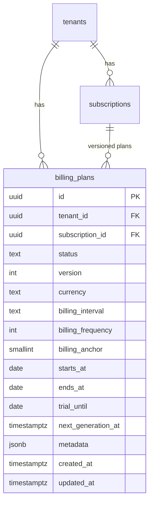

# BILLING ENGINE V2 — Sprint 2.1 — Billing Plan Foundation

**Data:** 2026-06-25  
**Modo:** SAFE — nenhuma mudança funcional no motor atual

---

## Resumo

Esta sprint cria a entidade **Billing Plan** e toda a infraestrutura de código associada (repository, service, factory, mapper, versionamento, feature flag, shadow read). **Nenhum fluxo existente foi alterado.**

---

## Arquitetura anterior

```
Subscription
    ↓
Invoice anterior (template)
    ↓
BillingRenewalEngine → Nova Invoice
```

O motor lê `subscriptions`, resolve fatura anterior via `crmRenewalCustomerResolver`, e gera a próxima cobrança.

---

## Arquitetura nova (paralela, inativa)

```
Subscription
    ↓
Billing Plan (versionado)     ← criado nesta sprint, não consumido
    ↓
(Futuro: Billing Items)       ← Sprint 2.2
    ↓
(Futuro: RenewalContext)      ← Sprint 2.3+
```

O motor legado **continua idêntico**. A tabela `billing_plans` existe mas nenhum worker, scheduler ou engine a consulta.

---

## ER Diagram



---

## Tabela `billing_plans`

| Campo | Tipo | Notas |
|-------|------|-------|
| id | UUID | PK |
| tenant_id | UUID | FK tenants |
| subscription_id | UUID | FK subscriptions |
| status | TEXT | draft, active, archived, cancelled |
| version | INT | ≥ 1, imutável por row |
| currency | TEXT | default BRL |
| billing_interval | TEXT | espelha subscription |
| billing_frequency | INT | default 1 |
| billing_anchor | SMALLINT | 1–31, nullable |
| starts_at | DATE | início do plano |
| ends_at | DATE | nullable |
| trial_until | DATE | nullable |
| next_generation_at | TIMESTAMPTZ | nullable (futuro scheduler V2) |
| metadata | JSONB | extensível |
| created_at / updated_at | TIMESTAMPTZ | auditoria |

---

## Índices

| Índice | Colunas |
|--------|---------|
| `idx_billing_plans_subscription_id` | subscription_id |
| `idx_billing_plans_tenant_id` | tenant_id |
| `idx_billing_plans_status` | status |
| `idx_billing_plans_next_generation_at` | next_generation_at (partial) |
| `idx_billing_plans_tenant_status` | tenant_id, status |
| `idx_billing_plans_one_active_per_subscription` | subscription_id WHERE status = 'active' (UNIQUE) |

---

## Constraints

- `UNIQUE (subscription_id, version)` — versionamento explícito
- `UNIQUE (subscription_id) WHERE status = 'active'` — no máximo 1 plano ativo
- Status CHECK: draft | active | archived | cancelled
- version ≥ 1

---

## Versionamento

- `billingPlanVersion.ts`: `nextBillingPlanVersion()`, ordenação por versão
- Alterações futuras: `duplicatePlan()` → nova row com `version + 1`
- Nunca UPDATE de campos de versão anterior (apenas status/metadata permitidos)

---

## Feature Flag

| Variável | Default | Efeito |
|----------|---------|--------|
| `BILLING_PLAN_V2` | `false` | Motor legado 100% |
| `BILLING_PLAN_V2=true` | — | Shadow provider V2 (ainda `not_implemented`) |

Função: `isBillingPlanV2Enabled()` em `billingEnv.ts`

---

## Repository Pattern

`BillingPlanRepository` — apenas SQL:

- `create()`, `findById()`, `findActiveBySubscription()`, `findVersions()`
- `archive()`, `activate()`, `archiveActiveForSubscription()`, `updateMetadata()`

---

## Service Pattern

`BillingPlanService` — regras de negócio (uso interno / testes):

- `createInitialPlan()`, `duplicatePlan()`, `activatePlan()`, `archivePlan()`
- `getCurrentPlan()`, `listVersions()`, `updateMetadata()`

---

## Factory

`buildBillingPlanFromSubscription(subscription)` → `BillingPlanCreateInput` **sem salvar**.

---

## Mapper

- `mapSubscriptionToBillingPlanDraft()` — Subscription → plano draft
- `mapBillingPlanToRenewalContext()` — lança `not_implemented` (Sprint futura)

---

## Shadow Read

```typescript
resolveBillingPlanReadProvider()
  → BILLING_PLAN_V2=false → LegacySubscriptionProvider (implemented: true)
  → BILLING_PLAN_V2=true  → BillingPlanProviderV2 (implemented: false)
```

Nenhum código do motor chama este provider nesta sprint.

---

## Fluxograma (estado atual)

```
[Scheduler] ──► subscriptions (legado)
[Worker]    ──► billing_recurring_jobs (legado)
              ──► BillingRenewalEngine (legado)
              ──► customer_invoices (legado)

[Billing Plan V2] ──► billing_plans (tabela vazia / testes)
                   ╳ não conectado ao fluxo acima
```

---

## Arquivos criados

| Arquivo | Descrição |
|---------|-----------|
| `database/init/279_billing_plans.sql` | Migração |
| `packages/backend/src/billingPlan/types.ts` | Tipos |
| `billingPlanVersion.ts` | Versionamento |
| `billingPlanFactory.ts` | Factory |
| `billingPlanMapper.ts` | Mapper |
| `billingPlanRepository.ts` | Repository |
| `billingPlanService.ts` | Service |
| `billingPlanProvider.ts` | Shadow read |
| `index.ts` | Barrel export |
| `billingPlan*.test.ts` | 6 arquivos de teste |

---

## Arquivos alterados

| Arquivo | Mudança |
|---------|---------|
| `migrationOrder.ts` | +279_billing_plans.sql |
| `billingEnv.ts` | +`isBillingPlanV2Enabled()` |

**Não alterados:** BillingRenewalEngine, executeCustomerRenewal, scheduler, worker, gateway, notifications, APIs, frontend, timeline, jobs.

---

## Compatibilidade — por que não há mudança funcional

1. **Nenhum import** do módulo `billingPlan` em `recurringBillingJobService`, `BillingRenewalEngine`, controllers ou rotas.
2. **Feature flag default OFF** — `resolveBillingPlanReadProvider()` não é chamado pelo motor.
3. **Tabela nova** — zero rows em produção até migração explícita (Sprint 2.2+).
4. **Mapper RenewalContext** — `throw not_implemented`.
5. **Service/Repository** — disponíveis só para testes e evolução futura.

Comportamento de geração de invoices, scheduler, worker, manual renew, notificações e APIs permanece **byte-a-byte equivalente** em runtime (exceto nova migration idempotente).

---

## Testes

| Suite | Cenários |
|-------|----------|
| `billingPlanFactory.test.ts` | Montagem a partir de subscription |
| `billingPlanVersion.test.ts` | Incremento de versão |
| `billingPlanRepository.test.ts` | create, findActive |
| `billingPlanService.test.ts` | create, duplicate, activate, archive |
| `billingPlanProvider.test.ts` | Flag OFF/ON, rollback |
| `billingPlanFeatureFlag.test.ts` | Default false |

---

## Próximo passo — Sprint 2.2

- Billing Items
- População opcional de `billing_plans` (ainda sem substituir motor)
- Possível shadow write (dual-write) com flag

---

## Critérios de aprovação

| Critério | Status |
|----------|--------|
| Nenhuma mudança funcional | ✅ |
| Nenhuma mudança na geração de invoices | ✅ |
| Scheduler / worker inalterados | ✅ |
| APIs / telas inalteradas | ✅ |
| Feature Flag OFF = comportamento idêntico | ✅ |
| Build limpo | ✅ |
| Testes passando | ✅ |
