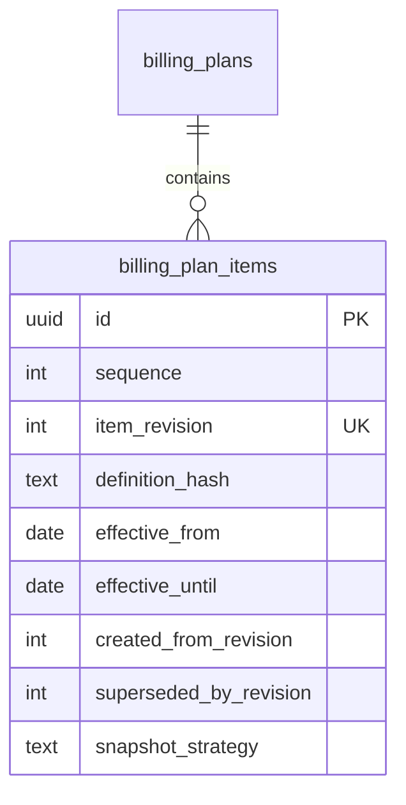

# BILLING ENGINE V2 — Sprint 2.2A — Billing Item Versioning & Snapshot Foundation

**Data:** 2026-06-25  
**Modo:** SAFE — motor legado inalterado

---

## Resumo

Fortalecido o domínio **Billing Item** com versionamento por revisão, hash determinístico de definição, vigência temporal (`effective_from` / `effective_until`) e conceito de **Billing Item Snapshot** (sem persistência). Preparação para Shadow Mode na Sprint 2.3.

---

## Arquitetura anterior (Sprint 2.2)

```
Billing Plan
      │
      ▼
Billing Item (regra de cobrança, 1 linha por sequence)
```

## Arquitetura nova (Sprint 2.2A)

```
Billing Plan (version no plano)
      │
      ▼
Billing Item (sequence + item_revision)
      │
      ├──────────────────┐
      ▼                  ▼
definition_hash    Billing Item Snapshot (conceito, memória)
```

### Cadeia conceitual (futura)

```
Billing Item  →  Billing Item Snapshot  →  Invoice Item
     (regra)         (fotografia lógica)      (snapshot financeiro)
```

Invoice e `customer_invoice_items` permanecem **inalterados** nesta sprint.

---

## Diagrama



**UNIQUE:** `(billing_plan_id, sequence, item_revision)`

---

## Fluxograma

```
[Criação item]
    → BillingItemDefinitionHasher (SHA-256)
    → item_revision = 1, effective_from obrigatório

[Alteração estrutural]
    → createRevision() → nova linha, item_revision + 1
    → definition_hash recalculado

[Snapshot lógico]
    → buildBillingItemSnapshot(item) → BillingItemSnapshot (memória)
    → mapBillingItemSnapshotToInvoiceItem() → not_implemented

[Motor V1 — inalterado]
    → subscription → invoice anterior → nova invoice
```

---

## Billing Item Version vs Revision

| Conceito | Escopo | Campo |
|----------|--------|-------|
| **Version** | Billing Plan | `billing_plans.version` |
| **Revision** | Billing Item (mesmo plano, mesma sequence) | `billing_plan_items.item_revision` |

Exemplo:

```
Plano V3 (plan.version = 3)
  └── Item sequence 1, revision 1
  └── Item sequence 1, revision 2  ← ajuste sem novo plano
  └── Item sequence 1, revision 3
```

---

## Billing Item Snapshot

Módulo `billingPlanItemSnapshot/` — **sem tabela**, **sem persistência**.

| Arquivo | Responsabilidade |
|---------|------------------|
| `types.ts` | `BillingItemSnapshot` |
| `factory.ts` | `buildBillingItemSnapshot()` |
| `mapper.ts` | `mapBillingItemSnapshotToInvoiceItem()` → `not_implemented` |
| `context.ts` | `BillingItemSnapshotContext` |

Snapshot = fotografia **lógica** da regra. Não substitui `invoice_item`.

---

## Definition Hash

`BillingItemDefinitionHasher` — SHA-256 determinístico sobre:

- name, description, quantity, unit_price
- discount_type, discount_value
- tax_rate, tax_value
- billing_interval, billing_frequency, billing_anchor
- trial_until, proration_mode, currency, metadata (ordenado)

**Excluído do hash:** id, created_at, updated_at, tenant_id, billing_plan_id

---

## Effective Dates

| Campo | Regra |
|-------|-------|
| `effective_from` | Obrigatório (modelado; sem validação runtime) |
| `effective_until` | Nullable (vigência aberta) |

Repository: `findEffective(planId, tenantId, asOf?)` filtra por vigência.

---

## Lifecycle (state machine)

Status: `draft` → `active` ↔ `paused` → `archived` / `cancelled`

Independente do lifecycle do Billing Plan (`billingPlanItems/stateMachine.ts`).

---

## Código criado

```
database/init/282_billing_plan_item_versioning.sql

packages/backend/src/billingPlanItems/
  definitionHasher.ts
  definitionHasher.test.ts
  stateMachine.ts
  stateMachine.test.ts

packages/backend/src/billingPlanItemSnapshot/
  types.ts
  factory.ts
  mapper.ts
  context.ts
  index.ts
  snapshot.test.ts
```

---

## Código alterado

| Arquivo | Mudança |
|---------|---------|
| `billingPlanItems/types.ts` | Campos de versionamento + `BillingPlanItemRevisionCompareResult` |
| `billingPlanItems/repository.ts` | findRevision, findEffective, findCurrent, findHistory, duplicateRevision, findByDefinitionHash |
| `billingPlanItems/service.ts` | createRevision, activateRevision, archiveRevision, getCurrentRevision, compareRevision; hash em create |
| `billingPlanItems/context.ts` | currentRevision, definitionHash, snapshot, futureSnapshot |
| `billingPlanItems/writer.ts` | writeSnapshot, compareSnapshot, validateSnapshot → `not_implemented` |
| `billingPlanItems/aggregate.ts` | resolveCurrentItemRevision, extras de composição |
| `billingPlan/billingPlanAggregate.ts` | currentRevision, revisionHistory, snapshots |
| `startup/migrationOrder.ts` | +282 |

**Não alterados:** BillingRenewalEngine, worker, scheduler, gateway, notifications, APIs, frontend, geração de invoices.

---

## Compatibilidade

| Critério | Status |
|----------|--------|
| Motor V1 inalterado | ✅ |
| Nenhum import de snapshot no engine | ✅ |
| Shadow read não implementado | ✅ (Sprint 2.3) |
| Shadow write → `not_implemented` | ✅ |
| `BILLING_PLAN_V2=false` | ✅ |
| Invoice = documento financeiro | ✅ |
| Billing Item = regra de cobrança | ✅ |

---

## Testes

| Área | Novos/atualizados |
|------|-------------------|
| DefinitionHasher | 3 |
| Lifecycle | 4 |
| Snapshot factory/context/mapper | 3 |
| Repository (revision, effective) | 7 |
| Service (revision, compare) | 6 |
| Aggregate (composition) | 4 |
| Writer (snapshot stubs) | 2 |
| BillingPlan aggregate | 1 |

**Total billingPlan\*: 65 testes** (20 arquivos) — `npm run build` ✅

---

## Preparação Sprint 2.3 — Shadow Mode

Pronto para comparar **Motor Atual** vs **Billing Plan + Billing Items**:

1. `BillingPlanItemsContext` — currentRevision, definitionHash, snapshot
2. `BillingPlanItemWriter` — writeSnapshot / compareSnapshot / validateSnapshot (stubs)
3. `findEffective()` / `findCurrent()` / `compareRevision()` no repository/service
4. `buildBillingItemSnapshot()` para fotografia lógica em memória
5. `billing_strategy` no plan (`legacy_invoice_copy` → `billing_plan_items`)

Shadow Mode lerá items e comparará com invoice template **sem alterar resultado** enquanto flag OFF.

---

## Conclusão

O domínio Billing Item está versionado e pronto para Shadow Mode. Nenhuma alteração funcional em produção; invoice continua sendo o único template ativo do motor V1.
