# BILLING ENGINE V2 — Sprint 2.2 — Billing Items Foundation

**Data:** 2026-06-25  
**Modo:** SAFE — motor legado inalterado

---

## Resumo

Criada a entidade **Billing Plan Items** — regra de cobrança recorrente vinculada ao Billing Plan. A invoice anterior continua sendo o template do motor V1; **nenhuma leitura de `billing_plan_items` em produção**.

---

## Arquitetura anterior

```
Subscription → Invoice anterior → customer_invoice_items (snapshot)
                                      ↓
                              BillingRenewalEngine
```

## Arquitetura nova (paralela)

```
Subscription → Billing Plan → Billing Plan Items (regra de cobrança)
         ↓
Invoice / invoice_items (documento financeiro + snapshot histórico)
```

**Motor V1:** inalterado. Invoice = documento; invoice_item = fotografia no momento da emissão.

---

## ER Diagram

```mermaid
erDiagram
  subscriptions ||--o{ billing_plans : has
  billing_plans ||--o{ billing_plan_items : contains
  customer_invoices ||--o{ customer_invoice_items : snapshot
  subscriptions ||--o{ customer_invoices : generates

  billing_plan_items {
    uuid id PK
    uuid tenant_id FK
    uuid billing_plan_id FK
    int sequence UK
    text status
    text item_type
    bigint unit_price
    bigint total_amount
    bool is_recurring
  }
```



---

## Relação entre entidades

| Entidade | Papel |
|----------|-------|
| **Subscription** | Contrato comercial CRM |
| **Billing Plan** | Versão da regra de recorrência |
| **Billing Item** | **Regra de cobrança** (não é invoice) |
| **Invoice** | Documento financeiro emitido |
| **Invoice Item** | Snapshot do item no momento da emissão |

---

## Responsabilidades

| Módulo | Responsabilidade |
|--------|------------------|
| `repository.ts` | CRUD SQL puro |
| `service.ts` | create, pause, activate, archive, duplicate |
| `factory.ts` | `buildBillingItemsFromInvoice()` — sem gravar |
| `mapper.ts` | `mapInvoiceItemsToBillingItems()` — conversão apenas |
| `writer.ts` | Shadow write interface → `not_implemented` |
| `context.ts` | `BillingPlanItemsContext` placeholder |
| `aggregate.ts` | Composição items no `BillingPlanAggregate` |

---

## Tabela `billing_plan_items`

- Status: active, paused, cancelled, archived, draft
- Item type: product, service, fee, adjustment, discount, shipping, custom
- Origin: subscription, manual, migration, contract, future
- Constraints: quantity ≥ 0, unit_price ≥ 0, billing_frequency ≥ 1, sequence ≥ 1
- UNIQUE `(billing_plan_id, sequence)`

---

## Fluxograma runtime

```
[V1 Motor]  subscription → find previous invoice → copy items → new invoice
[V2 Prep]   billing_plans ← billing_plan_items (isolado, sem leitura pelo motor)
[Mapper]    invoice_items ──convert──► BillingPlanItemCreateInput (testes/migração futura)
```

---

## Código criado

```
database/init/281_billing_plan_items.sql
packages/backend/src/billingPlanItems/
  types.ts
  repository.ts
  service.ts
  factory.ts
  mapper.ts
  writer.ts
  context.ts
  aggregate.ts
  index.ts
  *.test.ts (5 arquivos)
```

---

## Código alterado

| Arquivo | Mudança |
|---------|---------|
| `migrationOrder.ts` | +281 |
| `billingPlan/billingPlanAggregate.ts` | `items: BillingPlanItemRow[]` (composição) |
| `billingPlan/billingPlanAggregate.test.ts` | items vazio default |

**Não alterados:** BillingRenewalEngine, worker, scheduler, gateway, notifications, APIs, frontend.

---

## Testes

| Suite | Testes |
|-------|--------|
| billingPlan (2.1 + 2.1A) | 34 |
| billingPlanItems (2.2) | 11 |
| **Total** | **45** |

Cenários: factory, mapper, repository, service, aggregate, writer, pause/activate/archive.

`npm run build` ✅

---

## Compatibilidade

1. Nenhum import de `billingPlanItems` no motor de renovação.
2. `BILLING_PLAN_V2=false`.
3. Geração de invoices 100% igual.
4. Mapper/factory **não persistem** e **não chamam repository**.
5. `BillingPlanItemWriter` lança `not_implemented`.

---

## Preparação Sprint 2.3 — Shadow Mode

- `BillingPlanItemsContext` (items, eligibleItems, futureItems)
- `BillingPlanItemWriter` interface pronta
- `billing_strategy` no plan (`legacy_invoice_copy` → `billing_plan_items`)
- Aggregate com `items[]` para shadow read/write

---

## Critérios de aprovação

| Critério | Status |
|----------|--------|
| Nenhuma alteração funcional | ✅ |
| Motor inalterado | ✅ |
| Billing Item ≠ invoice | ✅ |
| Build + 45 testes | ✅ |
| Shadow write/read não implementados | ✅ (conforme escopo) |

---

## Conclusão

A fundação definitiva do **template recorrente** está pronta. Sprint 2.3 poderá introduzir Shadow Mode sem alterar o comportamento atual enquanto a flag estiver OFF.
