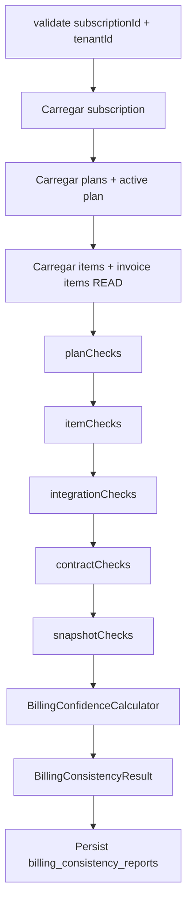
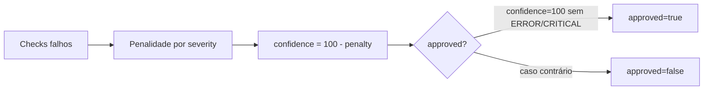

# BILLING ENGINE V2 — Sprint 2.3B — Billing Consistency Validator

**Data:** 2026-06-26  
**Modo:** SAFE — motor V1 inalterado

---

## Resumo

Camada de validação de integridade **Billing Plan + Billing Items** antes da comparação Shadow. Certifica que o modelo V2 é confiável sem alterar motor, worker, invoices ou subscriptions.

---

## Arquitetura anterior (Sprint 2.3)

```text
Motor V1 → Motor V2 Shadow → Comparison → Shadow Report
```

## Arquitetura nova

```text
Subscription
      ↓
Billing Plan + Items (READ)
      ↓
BillingConsistencyValidator
      ↓
Consistency Report
      ↓
Shadow Engine → Comparison → Shadow Report
```

---

## Fluxograma do Validator



---

## Fluxograma Confidence



Penalidades default: INFO=1, WARNING=5, ERROR=20, CRITICAL=40.

---

## Fluxograma integrado ao Shadow

```text
Worker → Motor V1 (oficial)
              ↓
         [BILLING_PLAN_V2_SHADOW=true]
              ↓
         BillingConsistencyValidator
              ↓
         billing_consistency_reports
              ↓
         BillingRenewalShadowEngine
              ↓
         RenewalComparisonService
              ↓
         billing_shadow_reports (+ consistency_failed/confidence/reason)
```

Se consistência falhar: **Shadow continua**. Grava `consistency_failed=true`.

---

## Checks executados

| Fase | Validações |
|------|------------|
| **Plan** | existe, único ativo, status, version, revision, plan_number, strategy, engine_version, metadata, dates |
| **Items** | sequence contínua, revision única/crescente, hash, amounts, currency, interval, effective dates |
| **Integration** | item→plan, tenant_id, strategy, engine_version |
| **Contract** | subscription × plan: interval, currency, anchor, tenant, subscription_id |
| **Snapshot** | Billing Item → logical snapshot vs invoice item (READ) |

---

## Confidence Model

`BillingConfidenceCalculator` → `confidence` e `score` 0–100.

`approved = confidence === 100 && sem ERROR && sem CRITICAL`.

---

## Dashboard

`GET /api/superadmin/billing/consistency`

- total_plans, healthy_plans, invalid_plans
- average_confidence, average_score
- critical_plans, warnings, top_problems
- last_validation

---

## APIs

| Método | Rota | Descrição |
|--------|------|-----------|
| GET | `/api/superadmin/billing/consistency` | Resumo global |
| GET | `/api/superadmin/billing/consistency/:subscriptionId` | Último + histórico |
| POST | `/api/superadmin/billing/consistency/:subscriptionId/validate` | Nova validação (READ ONLY) |

---

## Engine Health

`billingEngineHealth()` expandido:

```typescript
consistency: {
  healthy, average_confidence, average_score,
  plans_validated, invalid_plans, critical_plans, last_validation
}
```

---

## Logs

- `[BILLING_CONSISTENCY]`
- `[BILLING_CONFIDENCE]`
- `[BILLING_VALIDATOR]`
- `[BILLING_PLAN_CHECK]`

Campos: correlation_id, subscription_id, plan_id, confidence, score, severity, duration_ms.

---

## Arquivos criados

```
database/init/284_billing_consistency_reports.sql

packages/backend/src/billingConsistency/
  types.ts
  consistencyLogger.ts
  billingConfidenceCalculator.ts
  billingConsistencyValidator.ts
  billingConsistencyReportRepository.ts
  billingConsistencyReportService.ts
  checks/planChecks.ts
  checks/itemChecks.ts
  checks/integrationChecks.ts
  checks/contractChecks.ts
  checks/snapshotChecks.ts
  index.ts
  billingConsistency.test.ts
  billingConsistencyValidator.test.ts
```

---

## Arquivos alterados

| Arquivo | Mudança |
|---------|---------|
| `config/billingEnv.ts` | `getBillingConsistencyReportTtlDays()` |
| `billingShadow/billingShadowExecutor.ts` | Validator antes do shadow |
| `billingShadow/billingShadowReportRepository.ts` | consistency_* columns |
| `billingShadow/types.ts` | consistency fields no report |
| `billingEngineHealthService.ts` | bloco `consistency` |
| `superadminRoutes.ts` | 3 rotas consistency |
| `superadminBillingController.ts` | handlers |
| `migrationOrder.ts` | +284 |
| `billingShadowExecutor.test.ts` | mock consistency |

**Não alterados:** BillingRenewalEngine, worker logic, scheduler, gateway, notifications, timeline, customer_invoices.

---

## Cobertura de testes

| Suite | Testes |
|-------|--------|
| billingConsistency (checks + confidence) | 11 |
| billingConsistencyValidator | 2 |
| billingShadow + billingPlan (regressão) | 73 |
| **Total** | **86** |

`npm run build` ✅

---

## Compatibilidade

- Motor V1 inalterado
- Única escrita nova: `billing_consistency_reports` (+ campos consistency em shadow reports)
- Validator nunca modifica planos, items, subscriptions, invoices
- Shadow não bloqueia em falha de consistência

---

## Garantia de isolamento

O `BillingConsistencyValidator` apenas **lê** subscription, billing_plans, billing_plan_items e invoice items existentes. Não chama create/update em entidades de produção.

---

## Critérios para liberar Sprint 2.4

| Critério | Status |
|----------|--------|
| Confidence médio ≥ 99% em tenants candidatos | ⏳ operacional |
| Nenhum Billing Plan inválido em candidatos | ⏳ monitorar dashboard |
| Nenhum Billing Item inconsistente | ⏳ monitorar reports |
| Shadow Score aprovado | ⏳ shadow reports |
| Nenhuma divergência CRITICAL recorrente | ⏳ shadow + consistency |
| Motor V1 inalterado | ✅ |

---

## Conclusão

O domínio Billing Plan + Items agora possui validação formal antes do Shadow Mode. A Sprint 2.4 (migração por tenant) só deve iniciar quando métricas de consistência e shadow atingirem os limiares operacionais.
