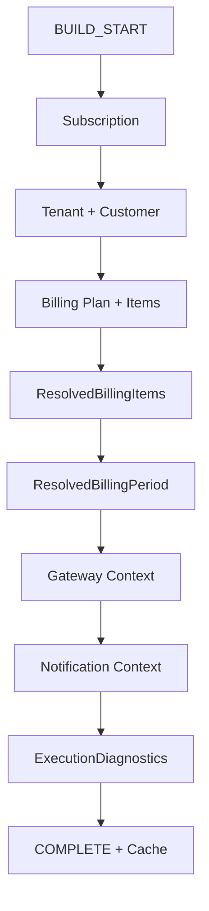
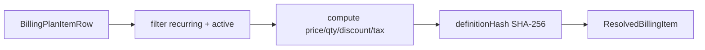

# BILLING ENGINE V2 — Sprint 2.3C — Billing Execution Context

**Data:** 2026-06-26  
**Modo:** SAFE — Motor V1 inalterado

---

## Resumo

Criado o **BillingExecutionContext** — representação única e READ ONLY do estado completo de uma cobrança recorrente. Shadow, Consistency, Replay e Comparison passam a consumir o contexto pronto, eliminando resolução duplicada.

---

## Arquitetura anterior

```
Shadow → resolve Subscription → Plan → Items → Customer
Consistency → resolve novamente
Comparison → resolve novamente
```

## Arquitetura nova

```
Subscription
      ↓
BillingExecutionContextBuilder (READ ONLY)
      ↓
BillingExecutionContext
      ├─ Shadow Engine
      ├─ Consistency Validator
      ├─ Replay
      └─ Comparison Service
```

### Regra arquitetural (obrigatória)

> Todo novo componente do Billing Engine V2 recebe `BillingExecutionContext` pronto. É proibido acessar diretamente `subscriptions`, `billing_plans` ou `billing_plan_items` para montar contexto de execução.

---

## Fluxograma do Context Builder



---

## Fluxograma Resolved Billing Item



Cálculo ocorre **uma única vez** no builder.

---

## Fluxograma Shadow com Context

```text
Worker → Motor V1
              ↓
     BillingExecutionContextBuilder.build()  ← uma vez
              ↓
     Consistency.validateFromContext(ctx)
              ↓
     BillingRenewalShadowEngine.executeShadow(ctx)
              ↓
     RenewalComparisonService.compare(...)
```

---

## Fluxograma Consistency com Context

```text
BillingExecutionContext
      ↓
validateFromContext() — sem re-query subscription/plan/items
      ↓
planChecks + itemChecks + integration + contract + snapshot
      ↓
BillingConsistencyResult
```

---

## Objetos criados

| Tipo | Campos principais |
|------|-------------------|
| `BillingExecutionContext` | subscription, tenant, customer, billingPlan, billingItems, resolvedItems, contract, period, dates, gateway, notifications, timeline, history, featureFlags, diagnostics |
| `ResolvedBillingItem` | item, effectiveRevision, resolvedPrice/Quantity, discounts, taxes, definitionHash |
| `ResolvedBillingPeriod` | cycleKey, periodStart/End, dueDate, anchor, interval, frequency |
| `ResolvedGatewayContext` | provider, currency, paymentMethod, fees |
| `ResolvedNotificationContext` | channels, templates, recipient, variables |
| `ExecutionDiagnostics` | contextBuildTime, warnings, shadowReady, consistencyReady, engineReady, cacheHit |

---

## Cache

- In-memory, TTL 30s
- Chave: `subscriptionId:cycleKey:correlationId`
- Nunca persiste
- Métricas: cache_hit_rate no health/dashboard

---

## Logs

`[BILLING_CONTEXT]` — eventos: BUILD_START, SUBSCRIPTION, PLAN, ITEMS, RESOLVED_ITEMS, DATES, GATEWAY, NOTIFICATION, COMPLETE, ERROR

Campos: correlation_id, subscription_id, duration_ms, cache_hit, cache_miss

---

## APIs

| Método | Rota | Descrição |
|--------|------|-----------|
| GET | `/api/superadmin/billing/context/:subscriptionId` | Contexto serializado (READ ONLY) |
| POST | `/api/superadmin/billing/context/:subscriptionId/rebuild` | Rebuild sem cache |

Dashboard consistency (`GET /billing/consistency`) inclui bloco `execution_context`.

---

## Engine Health

```typescript
context: {
  healthy, builder_time_avg, cache_hit_rate,
  last_failure, last_build, contexts_built,
  builder_errors, builder_warnings
}
```

---

## Arquivos criados

```
packages/backend/src/billingExecutionContext/
  types.ts
  contextLogger.ts
  contextCache.ts
  contextMetrics.ts
  planItemResolver.ts
  resolveBillingItems.ts
  billingExecutionContextBuilder.ts
  billingExecutionContextService.ts
  billingExecutionReplay.ts
  serializeContext.ts
  index.ts
  billingExecutionContext.test.ts
```

---

## Arquivos alterados

| Arquivo | Mudança |
|---------|---------|
| `billingShadow/billingRenewalShadowEngine.ts` | Recebe apenas `BillingExecutionContext` |
| `billingShadow/billingShadowExecutor.ts` | Build context uma vez; passa para consistency + shadow |
| `billingShadow/shadowPlanResolver.ts` | Delega para `planItemResolver` |
| `billingShadow/renewalComparisonService.ts` | `compareWithExecutionContext()` |
| `billingConsistency/billingConsistencyValidator.ts` | `validateFromContext()` |
| `billingEngineHealthService.ts` | bloco `context` |
| `superadminRoutes.ts` + controller | APIs context |
| Testes shadow/consistency atualizados |

**Não alterados:** BillingRenewalEngine V1, worker, scheduler, gateway, notifications, invoices.

---

## Cobertura de testes

| Suite | Testes |
|-------|--------|
| billingExecutionContext | 4 |
| billingShadow + billingConsistency + billingPlan | 85 |
| **Total** | **89** |

`npm run build` ✅

---

## Compatibilidade

- Motor V1 inalterado
- Shadow reports / consistency reports inalterados em schema
- `shadowPlanResolver` mantido como delegação (deprecated)
- `normalizeShadowRenewal` legacy preservado para compat

---

## Garantia de isolamento

`BillingExecutionContextBuilder` é **READ ONLY** — nenhum INSERT/UPDATE em subscriptions, plans, items, invoices.

---

## Critérios para Sprint 2.4

| Critério | Status |
|----------|--------|
| Módulos V2 consomem apenas ExecutionContext | ✅ Shadow, Consistency, Replay, Comparison |
| Sem resolução duplicada no shadow flow | ✅ |
| Builder determinístico | ✅ |
| Cache validado por testes | ✅ |
| Motor V1 inalterado | ✅ |
| Build + 89 testes | ✅ |

---

## Futuro — BillingRenewalEngineV2

```typescript
// Sprint 2.4+
BillingRenewalEngineV2.execute(context: BillingExecutionContext): Promise<RenewalResult>
```

Substituirá cópia da fatura anterior quando `BILLING_PLAN_V2=true` por tenant.

---

## Conclusão

A fronteira arquitetural do Billing Engine V2 está definida. O `BillingExecutionContext` é o contrato único entre domínio e motores auxiliares, preparando migração por tenant (Sprint 2.4) e substituição do template de invoice (Sprint 2.5).
