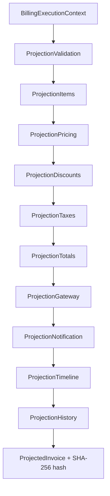

# BILLING ENGINE V2 — Sprint 2.3D — Billing Projection Engine

**Data:** 2026-06-26  
**Modo:** SAFE — READ ONLY — Nenhum side effect

---

## Resumo

Criado o **Billing Projection Engine**, que projeta em memória exatamente o que o Billing Engine V2 irá gerar. O Shadow passa a comparar **ProjectedInvoice × Invoice Real** (normalizados), eliminando comparação direta de dezenas de estruturas de domínio.

---

## Arquitetura anterior

```
ExecutionContext → Shadow Engine → normalizeShadow → compare(domínio inteiro)
```

Comparator complexo: subscription, plan, items, gateway, timeline, invoice, history, notifications.

## Arquitetura nova

```
BillingExecutionContext
        ↓
BillingProjectionEngine
        ↓
ProjectedInvoice
        ↓
ProjectionNormalizer → NormalizedInvoice
        ↓
RenewalComparisonService
        ↑
LegacyInvoiceNormalizer → NormalizedInvoice (Invoice Real)
        ↓
Billing Shadow Report
```

---

## Fluxograma Projection Engine



---

## Objetos criados

| Tipo | Descrição |
|------|-----------|
| `ProjectedInvoice` | Fatura projetada completa em memória |
| `ProjectedInvoiceItem` | Item com definitionHash, preços, descontos, impostos |
| `ProjectionResult` | projectedInvoice + warnings + errors + diagnostics |
| `ProjectionDiagnostics` | calculationTime, hash, calculatorVersions, cacheHit |

---

## Módulos puros (sem DB)

- `projectionItemResolver`
- `projectionPriceCalculator`
- `projectionDiscountCalculator`
- `projectionTaxCalculator`
- `projectionGatewayResolver`
- `projectionNotificationResolver`
- `projectionTimelineResolver`
- `projectionHistoryResolver`
- `projectionTotalCalculator`
- `projectionNormalizer`
- `projectionHash` (SHA-256 determinístico)

---

## Cache

- In-memory, TTL 30s
- Chave: `subscriptionId:cycleKey:correlationId`
- Métrica `projection_cache_hit` no health

---

## Logs

| Tag | Uso |
|-----|-----|
| `[PROJECTION_ENGINE]` | start / complete |
| `[PROJECTION_STAGE]` | cada estágio |
| `[PROJECTION_COMPARE]` | comparação shadow |
| `[PROJECTION_HASH]` | hash determinístico |
| `[PROJECTION_ERROR]` | falhas |

---

## Shadow Report — novos campos

Migration `285_billing_shadow_reports_projection.sql`:

- `projection_duration_ms`
- `projection_score`
- `projection_version`
- `projection_engine_version`
- `projection_hash`
- `projection_success`

---

## APIs

| Método | Rota | Descrição |
|--------|------|-----------|
| GET | `/api/superadmin/billing/projection/:subscriptionId` | ProjectedInvoice serializado |
| POST | `/api/superadmin/billing/projection/:subscriptionId/compare` | Projeção + comparação (+ optional `persist_report`) |

Dashboard consistency inclui bloco `projection`.

---

## Engine Health

```typescript
projection: {
  healthy, average_projection_time, projection_cache_hit,
  projection_failures, last_projection, projection_hash_mismatch
}
```

---

## Arquivos criados

```
packages/backend/src/billingProjection/
  types.ts, billingProjectionEngine.ts, billingProjectionBuilder.ts
  projectionItemResolver.ts, projectionPriceCalculator.ts
  projectionDiscountCalculator.ts, projectionTaxCalculator.ts
  projectionGatewayResolver.ts, projectionNotificationResolver.ts
  projectionTimelineResolver.ts, projectionHistoryResolver.ts
  projectionTotalCalculator.ts, projectionNormalizer.ts
  projectionHash.ts, projectionDiagnostics.ts, projectionLogger.ts
  projectionCache.ts, projectionMetrics.ts, projectionService.ts
  serializeProjection.ts, index.ts
  projection.test.ts, projectionCalculator.test.ts, projectionHash.test.ts

database/init/285_billing_shadow_reports_projection.sql
```

---

## Arquivos alterados

| Arquivo | Mudança |
|---------|---------|
| `billingShadow/billingShadowExecutor.ts` | Usa Projection Engine + `compareWithProjection` |
| `billingShadow/renewalComparisonService.ts` | `compareWithProjection()` |
| `billingShadow/types.ts` | Campos projection no report |
| `billingShadow/billingShadowReportRepository.ts` | INSERT com colunas projection |
| `billingEngineHealthService.ts` | bloco `projection` |
| `superadminBillingController.ts` | handlers GET/POST projection |
| `superadminRoutes.ts` | rotas projection |
| `startup/migrationOrder.ts` | migration 285 |

**Preservados:** `BillingRenewalShadowEngine` (legado), Motor V1, worker, scheduler.

---

## Cobertura de testes

| Suite | Testes |
|-------|--------|
| billingProjection | 11 |
| billingShadow + context + consistency + plan | 89+ |
| **Total billing (amostra)** | **100+** |

`npm run build` ✅

---

## Garantias

| Regra | Status |
|-------|--------|
| Nenhum INSERT/UPDATE exceto shadow report | ✅ |
| Nenhuma cobrança/gateway/notificação real | ✅ |
| Shadow compara InvoiceReal × ProjectedInvoice | ✅ |
| Hash determinístico | ✅ |
| Motor V1 inalterado | ✅ |

---

## Próxima Sprint — 2.4 Tenant Migration

Com projeções validadas em produção via Shadow, o Billing Engine V2 poderá ser ativado gradualmente por tenant (`BILLING_PLAN_V2=true`).

---

## Conclusão

O Projection Engine fecha o ciclo de validação: Context → Projection → Compare. O comparator ficou simples — dois `NormalizedRenewalResult` equivalentes — preparando a substituição do motor V1 na Sprint 2.4.
