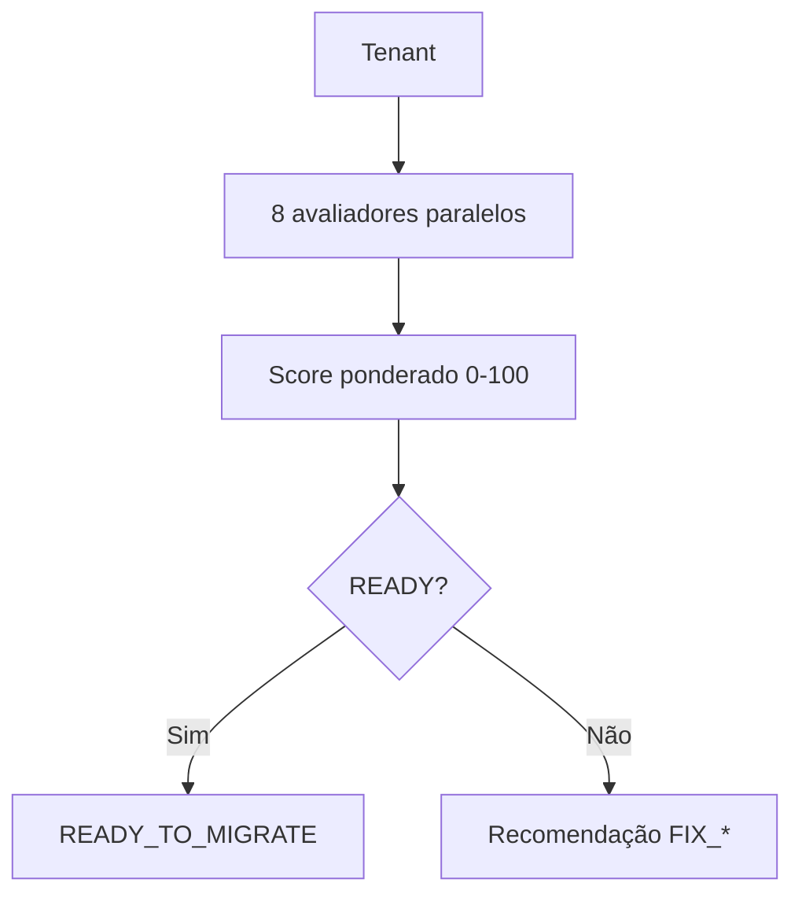

# BILLING ENGINE V2 — Sprint 2.3E — Billing Migration Readiness

**Data:** 2026-06-26  
**Modo:** SAFE — READ ONLY — Nenhuma migração de tenant

---

## Resumo

Criado o **Billing Migration Readiness Engine**, que responde automaticamente: *"Posso migrar este tenant?"* — sem alterar feature flags, sem gerar invoices, sem modificar planos.

---

## Problema anterior

Shadow, Consistency, Projection e Engine Health existiam isolados. Não havia decisão única de elegibilidade para migração.

## Nova arquitetura

```text
Tenant → Plans → Items → Shadow → Consistency → Projection → Health
                              ↓
              BillingMigrationReadinessEngine
                              ↓
              BillingMigrationReadinessReport
```

---

## Fluxograma



---

## BillingMigrationReadinessEngine

| Método | Responsabilidade |
|--------|------------------|
| `evaluateTenant()` | Orquestra todas avaliações |
| `evaluateShadow()` | Últimos ciclos, score médio/mínimo |
| `evaluateProjection()` | Hash, score, failures |
| `evaluateConsistency()` | Confidence, critical, errors |
| `evaluatePlans()` | Estado, versão, strategy |
| `evaluateItems()` | Hash, duplicates, sequence |
| `evaluateJobs()` | Stuck, failed, orphan |
| `evaluateGateway()` | Inconsistências subscription vs invoice |
| `evaluateNotifications()` | Fila e falhas (7 dias) |

---

## Score ponderado

| Área | Peso |
|------|------|
| Shadow | 25 |
| Projection | 20 |
| Consistency | 20 |
| Billing Plans | 10 |
| Billing Items | 10 |
| Jobs | 5 |
| Gateway | 5 |
| Notifications | 5 |

**READY** somente quando todas áreas = 100%, sem CRITICAL/ERROR, jobs/gateway/notifications saudáveis.

---

## Approval Levels

- `NOT_READY`
- `PARTIALLY_READY`
- `READY_WITH_WARNINGS`
- `READY`

## Recommendations

`READY_TO_MIGRATE` | `WAIT_NEXT_CYCLE` | `FIX_PROJECTION` | `FIX_CONSISTENCY` | `FIX_GATEWAY` | `FIX_NOTIFICATIONS` | `FIX_JOBS` | `FIX_PLANS` | `FIX_ITEMS`

---

## BillingMigrationReadinessReport

Campos: `tenantId`, `overallScore`, `approved`, `approvalLevel`, `readyForMigration`, `migrationRecommendation`, `blockingIssues`, `warnings`, `criticalIssues`, `areaScores`, `statistics`, summaries (shadow/projection/consistency/health), `diagnostics`, `generatedAt`.

---

## Banco

Tabela `billing_migration_readiness_reports` (migration `286`):

- `tenant_id`, `overall_score`, `approved`, `approval_level`, `recommendation`
- `blocking_issues_json`, `statistics_json`, summaries JSON
- `report_json` (relatório completo)
- TTL: 90 dias (purge automático após insert)

---

## APIs

| Método | Rota | Descrição |
|--------|------|-----------|
| GET | `/api/superadmin/billing/migration-readiness` | Dashboard global |
| GET | `/api/superadmin/billing/migration-readiness/:tenantId` | Relatório (cache ou avaliação) |
| POST | `/api/superadmin/billing/migration-readiness/:tenantId/evaluate` | Nova avaliação READ ONLY |

---

## Logs

`[MIGRATION_READINESS]` | `[MIGRATION_SCORE]` | `[MIGRATION_APPROVAL]` | `[MIGRATION_BLOCKER]`

---

## Engine Health

```typescript
migration_readiness: {
  ready_tenants, not_ready_tenants, average_score,
  critical_tenants, last_evaluation, migration_candidates
}
```

---

## Arquivos criados

```
packages/backend/src/billingMigrationReadiness/
  types.ts, billingMigrationReadinessEngine.ts
  billingMigrationReadinessRepository.ts, billingMigrationReadinessService.ts
  migrationReadinessScore.ts, migrationReadinessRecommendation.ts
  migrationReadinessLogger.ts, migrationReadinessMetrics.ts
  evaluateShadow.ts, evaluateProjection.ts, evaluateConsistency.ts
  evaluatePlans.ts, evaluateItems.ts, evaluateJobs.ts
  evaluateGateway.ts, evaluateNotifications.ts
  index.ts, migrationReadiness.test.ts

database/init/286_billing_migration_readiness_reports.sql
```

---

## Arquivos alterados

- `billingEngineHealthService.ts` — bloco `migration_readiness`
- `superadminBillingController.ts` — 3 handlers
- `superadminRoutes.ts` — 3 rotas
- `startup/migrationOrder.ts` — migration 286

---

## Testes

| Suite | Testes |
|-------|--------|
| migrationReadiness | 10 |
| billing (amostra completa) | 100+ |

`npm run build` ✅

---

## Compatibilidade

- Motor V1 inalterado
- `BILLING_PLAN_V2` permanece OFF
- Nenhum tenant migrado
- Única escrita: `billing_migration_readiness_reports` (auditoria)

---

## Próxima Sprint — 2.4 Tenant Migration

A Sprint 2.4 consumirá exclusivamente tenants com `migrationRecommendation === 'READY_TO_MIGRATE'` — sem validações adicionais de elegibilidade.

---

## Conclusão

O sistema agora possui decisão única e determinística de prontidão para migração, consolidando Shadow, Projection, Consistency e Health em um único Readiness Report por tenant.
