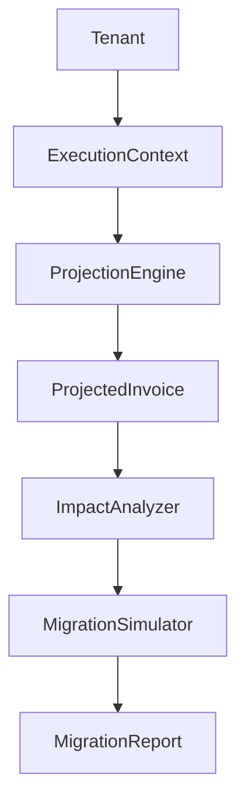

# BILLING ENGINE V2 — Sprint 2.3F — Billing Migration Simulator

**Data:** 2026-06-26  
**Modo:** SAFE — READ ONLY — Nenhuma alteração de produção

---

## Resumo

Criado o **Billing Migration Simulator**, que responde exatamente o que acontecerá se um tenant migrar para o Billing Engine V2 — reutilizando exclusivamente os módulos V2 existentes, sem duplicar regras de negócio.

**Esta sprint encerra a fase de preparação do Billing Engine V2.**

---

## Princípio: fonte única de verdade

O simulador **não implementa regras próprias**. Reutiliza obrigatoriamente:

| Módulo | Uso |
|--------|-----|
| `BillingExecutionContextBuilder` | Monta contexto por assinatura |
| `BillingProjectionEngine` | Projeta invoice V2 |
| `BillingConsistencyValidator.validateFromContext()` | Valida consistência |
| `RenewalComparisonService.compareWithProjection()` | Compara legacy × projected |
| `normalizeLegacyRenewal()` | Normaliza última invoice real (READ) |
| `impactAnalyzer` | Estrutura diferenças (sem recalcular valores) |

---

## Fluxo

```text
Tenant → ExecutionContext → Projection → Impact Analyzer → Simulation Report
```



---

## O simulador responde

1. **Invoice** — idêntica? diferenças, motivo, severidade
2. **Billing Items** — added/removed/modified, sequence, hash, revision
3. **Valores** — subtotal, descontos, impostos, total, delta R$ e %
4. **Datas** — due date, period start/end
5. **Gateway** — provider, currency, fees, payment method, payload diff
6. **Notificações** — templates, recipients, variables (simulado)
7. **Timeline** — eventos esperados vs legacy
8. **Histórico** — mudanças esperadas vs legacy
9. **Jobs** — scheduler/worker esperados (documentação apenas)

---

## MigrationImpact

```typescript
{
  identical, score, risk: NONE|LOW|MEDIUM|HIGH|CRITICAL,
  differences[], financialImpact, itemChanges[],
  notificationImpact, gatewayImpact, timelineImpact,
  historyImpact, jobsImpact
}
```

---

## BillingMigrationSimulationReport

- `tenant_id`, `subscriptions[]` (por assinatura ativa)
- `projected_invoice`, `legacy_invoice`, `impact`, `comparison`
- `projection`, `consistency`, `shadow_summary`
- `overall_score`, `recommended`, `rollback_safe`, `rollback_preview`

---

## Recommendation Engine

| Resultado | Condição |
|-----------|----------|
| `READY_TO_MIGRATE` | Score 100, risk NONE, consistency OK |
| `READY_WITH_WARNINGS` | Score ≥ 90, warnings presentes |
| `REQUIRES_REVIEW` | Score 80–89 ou risk MEDIUM/HIGH |
| `BLOCKED` | Consistency reprovada |
| `DO_NOT_MIGRATE` | Risk CRITICAL ou sem assinaturas |

---

## Rollback Preview

Documentação apenas — passos para reverter feature flag por tenant na Sprint 2.4. Nenhuma execução.

---

## APIs

| Método | Rota | Descrição |
|--------|------|-----------|
| GET | `/api/superadmin/billing/migration-simulator` | Dashboard |
| GET | `/api/superadmin/billing/migration-simulator/:tenantId` | Report + dashboard slice |
| POST | `/api/superadmin/billing/migration-simulator/:tenantId/run` | Nova simulação |

---

## Banco

`billing_migration_simulation_reports` (migration `287`):

- `simulation_json`, `impact_json`, `recommendation`, `score`, `risk`
- `rollback_safe`, `projection_hash`, TTL 90 dias

---

## Logs

`[MIGRATION_SIMULATOR]` | `[MIGRATION_IMPACT]` | `[MIGRATION_ANALYZER]` | `[MIGRATION_REPORT]`

---

## Engine Health

```typescript
migration_simulator: {
  healthy, simulations, average_duration, average_score,
  high_risk, critical, last_simulation
}
```

---

## Arquivos criados

```
packages/backend/src/billingMigrationSimulator/
  types.ts, billingMigrationSimulatorEngine.ts
  impactAnalyzer.ts, recommendationEngine.ts, rollbackPreview.ts
  billingMigrationSimulationRepository.ts, billingMigrationSimulatorService.ts
  simulatorLogger.ts, simulatorMetrics.ts, index.ts
  migrationSimulator.test.ts

database/init/287_billing_migration_simulation_reports.sql
```

---

## Arquivos alterados

- `billingEngineHealthService.ts`
- `superadminBillingController.ts`
- `superadminRoutes.ts`
- `startup/migrationOrder.ts`

---

## Testes

| Suite | Testes |
|-------|--------|
| migrationSimulator | 8 |
| migrationReadiness + projection + shadow | 29+ |
| **Total amostra** | **37** |

`npm run build` ✅

---

## Compatibilidade

- Motor V1 oficial, `BILLING_PLAN_V2` OFF
- Nenhuma invoice, cobrança, notificação, timeline ou histórico alterado
- Única escrita: `billing_migration_simulation_reports`

---

## Próxima Sprint — 2.4 Tenant Migration

Tenants elegíveis devem passar por:

- Shadow ✅
- Projection ✅
- Consistency ✅
- Migration Readiness ✅
- **Migration Simulator ✅**

A Sprint 2.4 ativa o motor gradualmente **sem novas validações estruturais**.

---

## Conclusão

A fase de preparação do Billing Engine V2 está completa. O simulador fecha o ciclo de validação pré-migração com impacto financeiro, operacional e rollback documentado — tudo READ ONLY.
