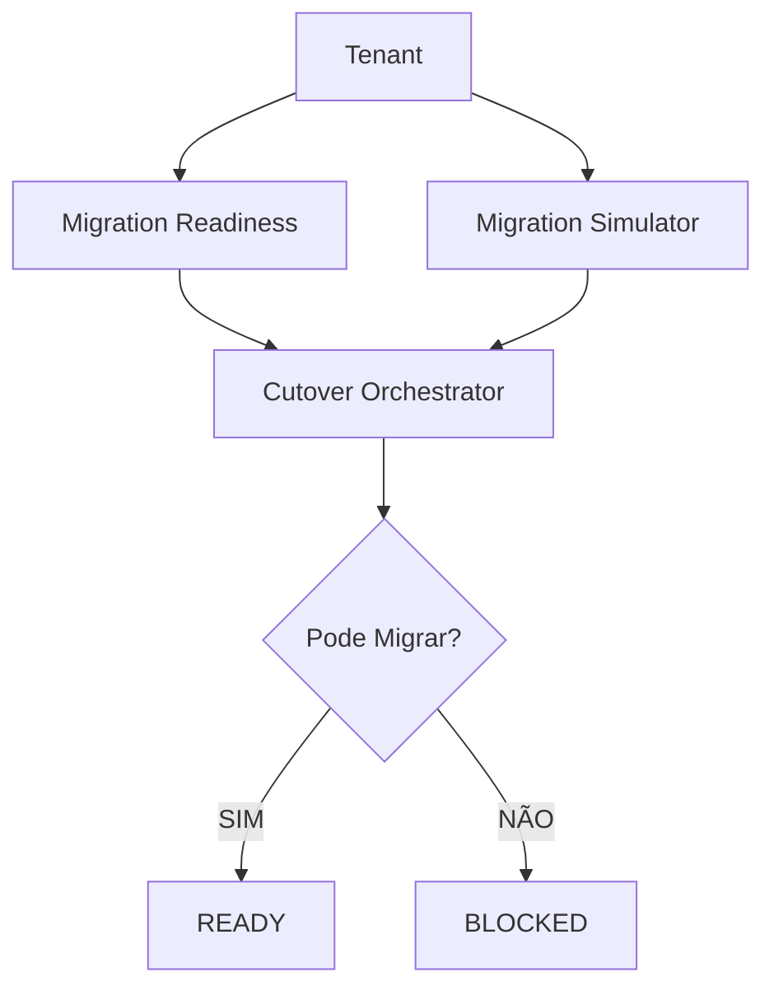

# BILLING ENGINE V2 — Sprint 2.3G — Billing Cutover Orchestrator

**Data:** 2026-06-26  
**Modo:** SAFE — READ ONLY — Nenhuma migração executada

---

## Resumo

Criado o **Billing Cutover Orchestrator**, responsável exclusivamente por decidir **quando**, **como** e **se** um tenant pode migrar para o Billing Engine V2.

O Orchestrator **não gera invoices**, **não executa billing**, **não altera feature flags automaticamente** e **não migra tenants**. Sua única responsabilidade é orquestrar o processo de migração consumindo os módulos construídos nas sprints anteriores.

---

## Objetivo arquitetural

Até a Sprint 2.3F os componentes existiam de forma independente:

| Módulo | Pergunta respondida |
|--------|---------------------|
| Projection | Como seria a invoice V2? |
| Consistency | Os dados são consistentes? |
| Shadow | Legacy × V2 batem? |
| Readiness | O tenant está preparado? |
| Migration Simulator | O que muda na migração? |

Faltava um componente que respondesse:

> **"Posso migrar este tenant agora?"**

---

## Nova arquitetura

```text
Billing Engine V1
        │
        ▼
Shadow / Projection
        │
        ▼
Consistency Validator
        │
        ▼
Migration Readiness Engine
        │
        ▼
Migration Simulator Engine
        │
        ▼
Billing Cutover Orchestrator  →  READY / BLOCKED
```



---

## Responsabilidade única

O Orchestrator **não calcula** projection, consistency, shadow, readiness ou simulation. Ele apenas consome seus resultados via:

| Chamada | Origem |
|---------|--------|
| `evaluateTenantMigrationReadiness()` | Sprint 2.3E |
| `runMigrationSimulation()` | Sprint 2.3F |

Snapshots compactos de projection, consistency e shadow são extraídos do relatório do simulador e do readiness — sem reexecutar engines individuais.

---

## Fluxo interno

```text
Carregar Tenant
  → Readiness (paralelo)
  → Simulator (paralelo)
  → Extrair shadow / projection / consistency snapshots
  → Aplicar BillingCutoverPolicy
  → Montar BillingCutoverDecision
  → Persistir billing_cutover_reports (opcional)
  → READY ou BLOCKED
```

---

## BillingCutoverPolicy

Todas as regras de aprovação centralizadas em `billingCutoverPolicy.ts`:

| Critério | Exigência |
|----------|-----------|
| Shadow Score | `== 100` |
| Projection Score | `== 100` |
| Consistency | `approved` |
| Migration Readiness | `readyForMigration` |
| Simulator | `recommended === READY_TO_MIGRATE` |
| Bloqueios críticos | nenhum (`CRITICAL` / `ERROR`) |

Níveis de aprovação: `NOT_READY` → `READY_WITH_WARNINGS` → `READY` → `APPROVED` → `CUTOVER_PENDING` ou `BLOCKED`.

---

## BillingCutoverDecision

```typescript
{
  approved: boolean;
  approvalLevel: CutoverApprovalLevel;
  reason: string;
  blockingIssues: CutoverBlockingIssue[];
  warnings: CutoverBlockingIssue[];
  recommendedAction: CutoverRecommendedAction;
  rollbackPlan: BillingRollbackStrategy;
  nextEvaluation: string | null;
  featureFlagRecommendation: FeatureFlagRecommendation;
  timeline: CutoverTimelineStage;
  overallScore: number;
}
```

### Feature Flag Recommendation

O Orchestrator **não altera flags** — apenas recomenda para a Sprint 2.4:

| Recomendação | Condição |
|--------------|----------|
| `KEEP_V1` | Bloqueios críticos ou não pronto |
| `ENABLE_SHADOW` | `READY` / `READY_WITH_WARNINGS` |
| `ENABLE_DUAL_WRITE` | Aprovado com warnings |
| `ENABLE_V2` | `CUTOVER_PENDING` aprovado |
| `ROLLBACK_TO_V1` | Reservado para Sprint 2.4 |

### BillingRollbackStrategy

Documentação apenas — nenhum rollback executado:

```typescript
{
  rollback_safe: boolean;
  rollback_required: boolean;  // sempre false nesta sprint
  rollback_reason: string | null;
  rollback_steps: string[];
  estimated_duration: string;
}
```

---

## APIs

| Método | Rota | Descrição |
|--------|------|-----------|
| GET | `/api/superadmin/billing/cutover` | Dashboard geral (ready, blocked, warnings, scores, recent) |
| GET | `/api/superadmin/billing/cutover/:tenantId` | Última decisão (cache ou avaliação on-demand) |
| POST | `/api/superadmin/billing/cutover/:tenantId/evaluate` | Nova avaliação READ ONLY |

---

## Dashboard (API)

Resposta de `GET /billing/cutover`:

| Card | Campo |
|------|-------|
| Ready | `ready` |
| Blocked | `blocked` |
| Warnings | `warnings` |
| Average Score | `average_score` |
| Pending | `pending` |
| Candidates | `candidates` |
| Rollback Safe | `rollback_safe` |
| Shadow Healthy | `shadow_healthy` |

---

## Banco

Migration `288_billing_cutover_reports.sql` — tabela `billing_cutover_reports`:

- `tenant_id`, `correlation_id`, `approved`, `approval_level`, `recommendation`
- `blocking_issues_json`, `warnings_json`
- `readiness_snapshot_json`, `simulator_snapshot_json`
- `projection_snapshot_json`, `consistency_snapshot_json`, `shadow_snapshot_json`
- `report_json`, `duration_ms`, `generated_at`
- TTL: **90 dias** (purge automático após insert)

---

## Engine Health

Novo bloco em `billingEngineHealth()`:

```typescript
cutover: {
  healthy: boolean;
  ready_tenants: number;
  blocked_tenants: number;
  average_approval: number | null;
  last_evaluation: string | null;
  rollback_safe: number;
  cutover_candidates: number;
}
```

Métricas em memória via `cutoverMetrics.ts`; agregações persistentes via repository.

---

## Logs

| Tag | Uso |
|-----|-----|
| `[CUTOVER]` | Início/fim da orquestração |
| `[CUTOVER_POLICY]` | Resultado da política |
| `[CUTOVER_DECISION]` | Decisão final |
| `[CUTOVER_BLOCKER]` | Cada bloqueio registrado |
| `[CUTOVER_RECOMMENDATION]` | Feature flag recomendada |

Todos incluem `tenant_id`, `correlation_id`, `approval_level`, `recommendation`, `duration_ms`.

---

## Arquivos criados

```
database/init/288_billing_cutover_reports.sql

packages/backend/src/billingCutover/
  types.ts
  billingCutoverOrchestrator.ts
  billingCutoverPolicy.ts
  billingCutoverDecision.ts
  billingRollbackStrategy.ts
  billingCutoverRepository.ts
  billingCutoverService.ts
  cutoverLogger.ts
  cutoverMetrics.ts
  index.ts
  billingCutover.test.ts
```

---

## Arquivos alterados

- `packages/backend/src/services/billingEngineHealthService.ts`
- `packages/backend/src/controllers/superadminBillingController.ts`
- `packages/backend/src/routes/superadminRoutes.ts`
- `packages/backend/src/startup/migrationOrder.ts`

Nenhum outro módulo do Billing Engine sofre alteração funcional.

---

## Testes

| Suite | Testes |
|-------|--------|
| `billingCutoverPolicy` | 3 |
| `billingCutoverDecision` | 1 |
| `billingRollbackStrategy` | 3 |
| `cutover repository contract` | 1 |
| **Total cutover** | **8** |
| readiness + simulator (regressão) | 18 |
| **Total amostra** | **26** |

`npm run build` ✅

---

## Compatibilidade

- Billing Engine V1 continua oficial
- Billing Engine V2 continua desligado
- Nenhuma invoice criada
- Nenhum gateway chamado
- Nenhuma notificação enviada
- Nenhuma feature flag alterada
- Nenhum tenant migrado
- Única escrita: `billing_cutover_reports` (+ upstream readiness/simulator quando `persist` ativo)

---

## Critérios para Sprint 2.4 — Tenant Migration

Todos devem ser verdadeiros antes de considerar um tenant elegível:

- [x] Shadow aprovado (score 100)
- [x] Projection aprovado (score 100)
- [x] Consistency aprovada
- [x] Migration Readiness aprovado
- [x] Migration Simulator aprovado (`READY_TO_MIGRATE`)
- [x] **Billing Cutover = READY / CUTOVER_PENDING**
- [x] Sem bloqueios críticos
- [x] Rollback Strategy documentado

---

## Critérios de aprovação da sprint

| Critério | Status |
|----------|--------|
| Nenhuma alteração funcional no Motor V1 | ✅ |
| Nenhuma migração executada | ✅ |
| Nenhuma feature flag alterada | ✅ |
| Toda decisão centralizada no Orchestrator | ✅ |
| Rollback documentado | ✅ |
| Build limpo | ✅ |
| Testes passando | ✅ |

---

## Conclusão

O **Billing Cutover Orchestrator** encerra a fase de preparação do Billing Engine V2. A arquitetura passa a possuir uma camada única de governança da migração, responsável por consolidar todas as evidências produzidas por Shadow, Projection, Consistency, Readiness e Simulator antes de qualquer ativação do novo motor.

Com esta sprint concluída, a **Sprint 2.4 — Tenant Migration** poderá focar exclusivamente na ativação gradual do Billing Engine V2 por tenant, consumindo `featureFlagRecommendation` e `rollbackPlan` sem incorporar novas regras de decisão ao fluxo de migração.
