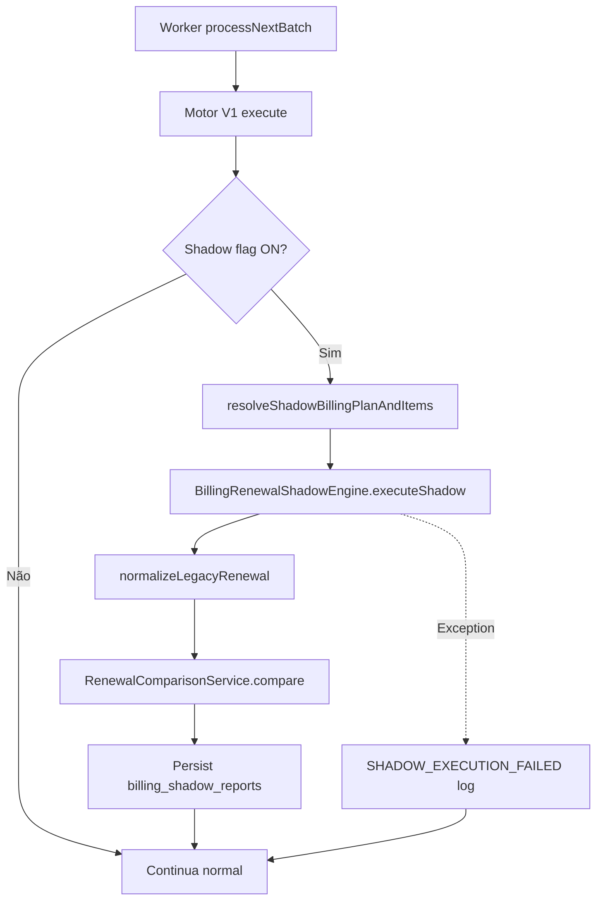

# BILLING ENGINE V2 — Sprint 2.3 — Shadow Mode

**Data:** 2026-06-26  
**Modo:** SAFE — Motor V1 permanece fonte oficial

---

## Resumo

Implementado **Shadow Mode**: o motor V2 executa em paralelo ao V1, compara resultados normalizados e persiste apenas relatórios de auditoria. **Nenhum side-effect de produção** (invoice, gateway, notificação, timeline, histórico).

---

## Arquitetura anterior

```text
Worker → BillingRenewalEngine V1 → Invoice → Gateway → Notification → Timeline
```

## Arquitetura nova

```text
Worker → BillingRenewalEngine V1 → Resultado Oficial
              │
              ├─ (se BILLING_PLAN_V2_SHADOW=true)
              │
              ▼
         Billing Plan + Items (READ)
              │
              ▼
         BillingRenewalShadowEngine
              │
              ▼
         RenewalComparisonService
              │
              ▼
         billing_shadow_reports (única escrita)
```

---

## Fluxograma Shadow Flow



---

## Comparator

Compara estruturas **normalizadas** (`NormalizedRenewalResult`):

| Domínio | Campos |
|---------|--------|
| Subscription | id, customer, tenant, status |
| Billing | interval, frequency, anchor, trial |
| Itens | sequence, quantity, unit_price, discount, tax, total, definition_hash |
| Valores | subtotal, discounts, taxes, total |
| Datas | periodStart, periodEnd, dueDate |
| Gateway | amount, currency, payment_method |
| Notificações | type, recipient, template |
| Timeline / History | eventos ordenados |
| Side Effects | invoice, notification, timeline, history, gateway |

---

## Score e Severity

| Severity | Penalidade no score |
|----------|---------------------|
| INFO | 1 |
| WARNING | 5 |
| ERROR | 25 |
| CRITICAL | 50 |

**Aprovação:** `score === 100` AND sem ERROR AND sem CRITICAL.

---

## Shadow Report

Tabela `billing_shadow_reports`:

- `comparison_score`, `approved`, `summary`
- `differences_json`, `legacy_json`, `shadow_json`
- `execution_failed`, `error_code`, `duration_ms`
- TTL: `BILLING_SHADOW_REPORT_TTL_DAYS` (default 90)

---

## Feature Flags

| Flag | Default | Efeito |
|------|---------|--------|
| `BILLING_PLAN_V2` | `false` | Motor V2 desligado |
| `BILLING_PLAN_V2_SHADOW` | `false` | Shadow desligado |
| `BILLING_PLAN_V2_SHADOW=true` | — | Comparação paralela, sem alterar produção |

---

## Arquivos criados

```
database/init/283_billing_shadow_reports.sql

packages/backend/src/billingShadow/
  types.ts
  billingRenewalShadowEngine.ts
  renewalComparisonService.ts
  comparisonScore.ts
  legacyRenewalNormalizer.ts
  shadowRenewalNormalizer.ts
  shadowPlanResolver.ts
  billingShadowExecutor.ts
  billingShadowReportRepository.ts
  billingShadowReportService.ts
  shadowLogger.ts
  index.ts
  billingShadow.test.ts
  billingShadowExecutor.test.ts
```

---

## Arquivos alterados

| Arquivo | Mudança |
|---------|---------|
| `config/billingEnv.ts` | `isBillingPlanV2ShadowEnabled()`, TTL |
| `recurringBillingJobService.ts` | Hook pós-V1 (customer + saas) |
| `billingEngineHealthService.ts` | Bloco `shadow` no health |
| `superadminRoutes.ts` | `GET /billing/shadow-report/:subscriptionId` |
| `superadminBillingController.ts` | Handler shadow report |
| `migrationOrder.ts` | +283 |

**Não alterados:** `BillingRenewalEngine` (lógica V1), scheduler, gateway, notifications, timeline, frontend.

---

## Endpoint admin

`GET /api/superadmin/billing/shadow-report/:subscriptionId`

Retorna: último relatório, histórico, diferenças, score, aggregate.

---

## Logs

- `[SHADOW_ENGINE]` — execução shadow
- `[SHADOW_COMPARE]` — comparação
- `[SHADOW_REPORT]` — persistência
- `[SHADOW_ERROR]` — falhas (não bloqueiam V1)

Todos incluem: `correlation_id`, `subscription_id`, `cycle_key`, `duration_ms`, `score`, `approved`.

---

## Cobertura de testes

| Suite | Testes |
|-------|--------|
| billingShadow (engine, comparator, score) | 5 |
| billingShadowExecutor (flag, integration) | 3 |
| billingPlan + items (regressão) | 65 |
| **Total billingShadow + billingPlan** | **73** |

`npm run build` ✅

---

## Garantia READ ONLY

1. Shadow engine **não** chama `createCustomerInvoice`, gateway, notifications.
2. Única escrita: `billing_shadow_reports`.
3. Falhas shadow → `SHADOW_EXECUTION_FAILED` → V1 continua.
4. Dynamic import no worker — isolamento de carregamento.
5. `BILLING_PLAN_V2_SHADOW=false` por default — invisível em produção.

---

## Plano Sprint 2.4 — Tenant Migration

1. Habilitar `BILLING_PLAN_V2=true` por tenant (feature flag granular).
2. Dual-write opcional de Billing Plan a partir de invoice template.
3. Shadow reports com score 100% estáveis por N ciclos → candidato a migração.
4. `billing_strategy: billing_plan_items` no plano migrado.
5. Cutover: flag por tenant alterna motor oficial V1 → V2.

---

## Conclusão

Shadow Mode operacional e auditável. Produção permanece 100% dependente do Motor V1. Divergências aparecem em relatórios; usuário final não percebe diferença.
