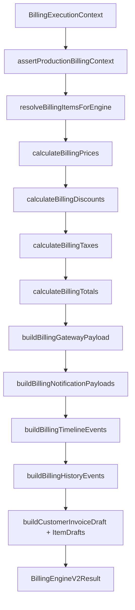

# BILLING ENGINE V2 — Sprint 3.0 — Production Engine

**Data:** 2026-06-25  
**Modo:** PRODUCTION ENGINE — isolado — sem Worker/Scheduler/APIs  
**Breaking changes:** Não  
**Database changes:** Não  
**Feature flags:** Não

---

## Resumo

Entregue o **BillingEngineV2**, motor de produção em memória capaz de gerar `CustomerInvoiceDraft` + itens + payloads auxiliares exclusivamente a partir de **Billing Plan** e **Billing Plan Items**. O motor V1 (`executeCustomerRenewal`) permanece intacto; nenhum caller foi alterado.

---

## Objetivo atingido

| Critério | Status |
|----------|--------|
| Executa sem consultar `customer_invoices` / `customer_invoice_items` como template | ✅ |
| InvoiceDraft derivado apenas do Billing Plan | ✅ |
| Itens derivados de Billing Plan Items | ✅ |
| Sem dependência de resolvers legados | ✅ |
| Build limpo (`tsc`) | ✅ |
| Testes unitários (22) | ✅ |
| Paridade de totais com Projection Engine | ✅ |

---

## Arquitetura



### Contrato

```typescript
BillingEngineV2.execute({ context: BillingExecutionContext }): BillingEngineV2Result
```

**Output:**

- `invoice` — `CustomerInvoiceDraft`
- `items` — `CustomerInvoiceItemDraft[]`
- `gateway` — `NormalizedGatewayPayload | null`
- `notifications` — `NormalizedNotificationPayload[]`
- `timeline` — `NormalizedTimelineEvent[]`
- `history` — `NormalizedHistoryEvent[]`
- `diagnostics` — `BillingEngineV2Diagnostics` (inclui `projection_hash`)
- `approved` — boolean

---

## Módulos criados

| Módulo | Responsabilidade |
|--------|------------------|
| `billingEngineV2.ts` | Entry point `BillingEngineV2.execute()` |
| `billingEnginePipeline.ts` | Orquestra estágios; `computeEngineProjectionHash` |
| `billingEngineContextGuard.ts` | Rejeita fontes legadas (`virtual_from_invoice_template`, `legacy_invoice_copy`, snapshots) |
| `billingItemResolver.ts` | Delega a `resolveProjectionItems` |
| `billingPriceCalculator.ts` | Delega a `calculateProjectionPrices` |
| `billingDiscountCalculator.ts` | Delega a `calculateProjectionDiscounts` |
| `billingTaxCalculator.ts` | Delega a `calculateProjectionTaxes` |
| `billingTotalsCalculator.ts` | Delega a `calculateProjectionTotals` |
| `billingGatewayPayloadBuilder.ts` | Delega a `resolveProjectionGateway` |
| `billingNotificationBuilder.ts` | Delega a `resolveProjectionNotification` |
| `billingTimelineBuilder.ts` | Delega a `resolveProjectionTimeline` |
| `billingHistoryBuilder.ts` | Delega a `resolveProjectionHistory` |
| `billingInvoiceBuilder.ts` | Mapeia pipeline → drafts persistíveis |
| `types.ts` | Tipos, `BillingEngineV2Error`, versão `3.0.0` |
| `engineLogger.ts` | Logs `[BILLING_ENGINE_V2]` |

**Localização:** `packages/backend/src/billingEngineV2/`

---

## Dependências proibidas (enforced)

O context guard e testes estáticos garantem ausência de:

- `resolveCrmRenewalPreviousInvoice`
- `getCustomerInvoiceItems`
- `overlayCrmContractOnRenewalItems`
- `customer_invoices` / `customer_invoice_items` como template
- `legacy_invoice_copy` como `billing_strategy`

**Códigos de erro:**

| Code | Condição |
|------|----------|
| `LEGACY_INVOICE_TEMPLATE_FORBIDDEN` | `plan_source = virtual_from_invoice_template` |
| `LEGACY_INVOICE_SNAPSHOT_FORBIDDEN` | `invoice_items_snapshot` presente |
| `LEGACY_STRATEGY_FORBIDDEN` | `billing_strategy = legacy_invoice_copy` |
| `BILLING_ITEMS_REQUIRED` | `billingItems` vazio |
| `NO_ELIGIBLE_ITEMS` | `resolvedItems` vazio |

---

## Reutilização do Projection Engine

Todos os calculadores são **wrappers finos** sobre `billingProjection/*`. Não há duplicação de fórmulas de preço, desconto, imposto ou totais. Testes confirmam paridade de `amount_cents` / `subtotal_cents` com `BillingProjectionEngine.project()` para o mesmo contexto.

---

## O que NÃO foi alterado (conforme spec)

- Motor V1 (`executeCustomerRenewal`)
- Scheduler / Worker
- APIs / Gateway / Notification Engine
- Timeline / History (produção)
- Feature flags
- Migrations

---

## Testes

**Arquivo:** `packages/backend/src/billingEngineV2/billingEngineV2.test.ts`

```bash
cd packages/backend
npx vitest run src/billingEngineV2/billingEngineV2.test.ts
```

**22 testes** cobrindo:

1. Pipeline completo com contexto de produção (`buildBaseContext` do Certification Lab)
2. Paridade de totais com Projection Engine
3. Rejeição de contextos legados (4 cenários)
4. Varredura estática de imports proibidos em todos os módulos do pacote

---

## Próxima sprint (3.1+)

Conectar `BillingEngineV2.execute()` ao Worker para substituir `executeCustomerRenewal`, com cutover gradual via orchestrator já existente (Sprint 2.3G).

---

## Verificação

```bash
cd packages/backend
npm run build
npx vitest run src/billingEngineV2/billingEngineV2.test.ts
```

Ambos passam com sucesso.
