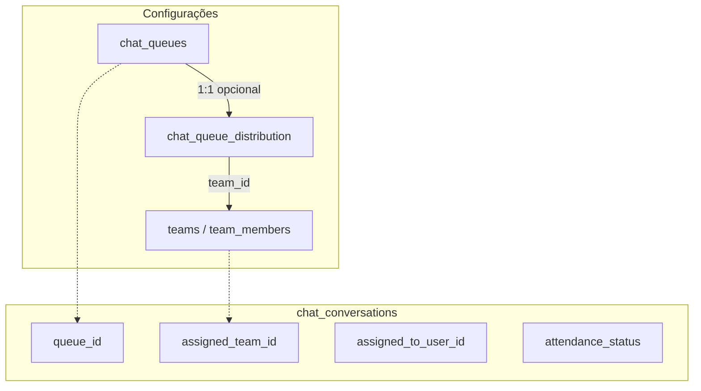
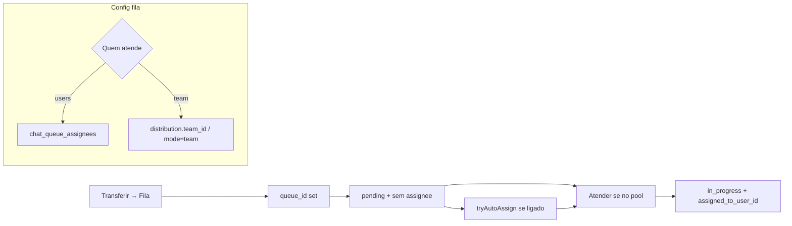

# Investigação — Filas de atendimento no Chat

**Data:** 2026-08-06  
**Branch de contexto:** `deploy-v1.1.4.27-chatbot-flows`  
**Escopo:** investigação + solução recomendada (produto e técnica)  
**Fora de escopo deste documento:** implementação de código, commit/push  

**Docs relacionados:**
- [CHAT_ATENDIMENTO_PROFISSIONAL.md](../CHAT_ATENDIMENTO_PROFISSIONAL.md) (Fases 5/7)
- [CHAT_ENGINE_AUDITORIA_E_PLANO.md](../CHAT_ENGINE_AUDITORIA_E_PLANO.md) (§ Fase 5–7)
- Chatbot flows: nó `assign_agent` com modos `user` | `team` | `queue`

---

## 1. Resumo executivo

Hoje existem **dois mecanismos paralelos** que o utilizador percebe (e a UI mistura) como “fila”:

| Conceito no código | Persistência | O que a UI de transferência usa | Onde aparece em `/chat` |
|--------------------|--------------|----------------------------------|-------------------------|
| **Fila** (`chat_queues`) | `chat_conversations.queue_id` | Quase não — backend aceita `toQueueId`, o diálogo de transferência **não** expõe | Filtro **Fila** (pool sem responsável **e sem** `assigned_team_id`; **não** filtra por `queue_id`) |
| **Equipe** (`teams`) | `chat_conversations.assigned_team_id` | Sim — tab “Equipe”, toast “transferida para a equipe” | Filtro **Equipe** (membros da equipa); badge na conversa diz **“Fila {nome da equipe}”** |

**Respostas directas ao pedido:**

1. **Transferência para atendentes:** por defeito é **manual** (alguém clica **Atender**). Existe auto-assign **opcional**, mas só via distribuição da fila (`chat_queue_distribution`) disparada no **roteamento de mensagem inbound** — não no diálogo “Transferir” do Chat.
2. **Ao “enviar para a fila” pelo Chat hoje:** o fluxo real envia para **equipe** (`assigned_team_id`). A conversa **não** entra no chip **Fila**; entra no filtro **Equipe** (para membros). Copy e badge chamam isso de “fila”, o que gera a inconsistência reportada.
3. **Decisão de produto (confirmada):** manter o conceito **Fila**; na configuração da fila, escolher quem atende — **utilizador(es)** ou **equipe completa**. Unificar copy para “Fila”.

---

## 2. Comportamento actual

### 2.1 Modelo de dados

| Artefacto | Ficheiro / migração |
|-----------|---------------------|
| Tabela `chat_queues` | `database/init/185_chat_engine_phase5_professional.sql` |
| Colunas atendimento + `queue_id` | Fase 5 / attendance (ver `chatAttendanceSchema.ts`) |
| `assigned_team_id` | Migration 98 / schema helper `hasAssignedTeamColumn` |
| `chat_queue_distribution` (equipa + strategy + `auto_assign`) | `database/init/187_chat_engine_phase6_automation.sql` |
| CRUD filas | `packages/backend/src/services/chatQueueService.ts` |
| Distribuição / auto-assign | `packages/backend/src/services/chatDistributionService.ts` → `tryAutoAssignFromQueue` |
| Patch atendimento | `packages/backend/src/controllers/chatAttendanceController.ts` → `patchConversationAttendance` |
| Aliases transfer/queue/team | `packages/backend/src/controllers/chatProfessionalController.ts` |
| UI settings | `src/components/settings/ChatAttendanceSettingsSection.tsx` |
| UI transferência Chat | `src/pages/Chat.tsx` (dialog Transferir) |
| Filtro lista | `packages/backend/src/services/chatAggregatedConversations/queryBuilder.ts` |
| Contagens Fila/Minhas/Equipe | `getConversationAttendanceCounts` em `chatController.ts` |

Campos relevantes em `chat_conversations`:

- `queue_id` → fila configurada em Settings
- `assigned_team_id` → “fila de equipe” operacional actual na transferência
- `assigned_to_user_id` → responsável individual
- `attendance_status` — tipicamente `pending` na fila/equipa sem dono; `in_progress` com responsável

### 2.2 Configurar fila (Configurações → Chat → Filas)

UI: aba **Filas** em `ChatAttendanceSettingsSection`.

**O que se pode fazer hoje:**

- Criar/editar fila (`name`, cor, activa, SLA 1ª / contínua)
- Associar **uma equipa** + método (`none` | `round_robin` | `least_open`) + switch **Distribuição automática**
- Persistência via `PUT /api/chat/automation/queues/:queueId/distribution`

**O que não se pode:**

- Escolher **utilizadores específicos** como pool da fila (só via membros da equipa ligada)
- Definir “modo de atendimento” explícito user(s) vs equipe na UX de produto (só distribuição técnica)

### 2.3 Transferir a partir de `/chat`

Dialog em `Chat.tsx`:

- Tabs: **Operador** | **Equipe**
- Descrição: *“Envie para um operador específico ou para a fila de uma equipe…”*
- Confirmação equipa: toast *“Conversa transferida para a equipe”*
- Badge/header: *“Fila {assigned_team_name}”* (usa **nome da equipe**, não `chat_queues`)

Fluxo técnico:

1. UI → `bridgeTransferConversation` / `transferConversationCommand`
2. Cliente → `POST /api/chat/conversations/:id/transfer` com `toUserId` **ou** `toTeamId`
3. `transferConversation` (controller) → `action: reassign` ou `reassign_team`

Efeitos de `reassign_team` (`patchConversationAttendance`):

- `attendance_status = pending`
- `assigned_to_user_id = null`
- `queue_id = null` ← **limpa a fila configurada**
- `assigned_team_id = toTeamId`

**Não há tab “Fila”** que liste `chat_queues` no dialog.

Nota de API: `PATCH …/transfer` (`patchConversationTransfer`) aceita `toQueueId` → `action: queue`, mas o cliente (`chatService.transferConversation`) **só tipa** `toUserId` | `toTeamId`. O POST usado pela UI também **não** aceita fila.

### 2.4 Acção `queue` (fila real)

`action: 'queue'` / `PATCH …/queue`:

- Define `queue_id`, status `pending`, limpa `assigned_team_id`
- **Não limpa** `assigned_to_user_id` (mantém o responsável anterior) — comportamento diferente do chatbot flows (`runtimeAssignConversation` mode `queue`, que faz `assigned_to_user_id = NULL`)

Quem usa a fila real hoje:

- Settings / regras de automação (`set_queue`)
- Chatbot flows `assign_agent` mode `queue` (`flowCrmActions.runtimeAssignConversation`)
- API directa (`PATCH …/attendance` ou `…/queue`) — não o dialog principal de transferência

### 2.5 Visibilidade em `/chat`

| Filtro UI | Critério SQL (resumo) | Inclui transfer “para equipe”? | Inclui `queue_id` setado? |
|-----------|----------------------|--------------------------------|---------------------------|
| **Fila** | Sem assignee; status `pending`/`open`; **sem** `assigned_team_id` | **Não** | Sim, **se** sem assignee e sem team (independente de qual `queue_id`) |
| **Equipe** | Tem `assigned_team_id`; sem assignee; membro da equipa | **Sim** | Não (team transfer limpa `queue_id`) |
| **Minhas** | `assigned_to_user_id = eu` + `in_progress` | Não (até claim) | Não |

O chip **Fila** em `ChatSidebarTagFilters` **não** significa “esta `chat_queues`”; é um **pool geral sem responsável** (excluindo conversas já na “fila de equipe”).

Contagens: `getConversationAttendanceCounts` espelha a mesma lógica (queue ≈ unassigned sem team).

### 2.6 Claim / Atender

`POST …/attend` → `attendConversation`:

- Atribui o actor como responsável, `in_progress`
- Se há `assigned_team_id`, só membros da equipa (ou admin) podem assumir
- **Não há gate por membros da `chat_queues` / distribution** no claim — qualquer utilizador com `take_attendance` e visibilidade da conversa pode atender uma conversa só com `queue_id`

### 2.7 Auto-assign (quando existe)

`tryAutoAssignFromQueue` em `chatDistributionService.ts`:

Pré-condições:

1. Linha em `chat_queue_distribution` com `auto_assign = true`, `team_id` não nulo, `strategy` ∈ {`round_robin`, `least_open`}
2. Settings tenant: `automation_enabled` + `distribution_enabled`
3. Disparo: `runInboundChatRoutingAsync` **após mensagem inbound** (e conversa ainda sem assignee), tipicamente depois de regras que possam ter feito `set_queue`

**Não** é chamado ao confirmar transferência no dialog do Chat, nem de forma genérica no fim de `action: queue`.

Estratégias escolhem um **membro da equipa** ligada à fila — não um conjunto ad-hoc de users.

### 2.8 Chatbot flows (contexto)

Nó `assign_agent` / `transfer_human` com modos `user` | `team` | `queue` (`nodeCatalog`, `NodePropertiesPanel`, `runtimeAssignConversation`):

- `user` → assignee directo + `in_progress`
- `team` → `assigned_team_id`, limpa user e `queue_id`, `pending`
- `queue` → seta `queue_id`, limpa user, `pending` (não limpa explicitamente `assigned_team_id` no SQL actual — risco residual se team anterior existir)

Isto reforça o modelo triplo (user/team/queue) que o Chat UI ainda não unifica sob “Fila”.

---

## 3. O que funciona / o que não funciona

### Funciona

- CRUD de filas + SLA por fila em Settings
- Ligar equipa + rodízio/menor carga + auto-assign **no inbound** (quando flags e distribution estão OK)
- Transferência **manual** para operador ou para **equipe**
- Claim **Atender** em conversas de equipe (restrito a membros)
- Filtros Fila | Minhas | Equipe na inbox (com semântica actual)
- Chatbot / regras podem setar `queue_id`
- Histórico de transferências regista user/team/queue quando aplicável

### Não funciona / gaps vs intenção de produto

| Expectativa | Realidade |
|-------------|-----------|
| “Transferir para a **fila**” no Chat | UI transfere para **equipe**; copy mista (“fila de uma equipe” / “Fila {team}” / toast “equipe”) |
| Escolher fila de Settings no transfer | Sem picker de `chat_queues` no dialog |
| Ao enviar para fila, ver no chip **Fila** | Transfer equipe → chip **Equipe**; chip Fila ignora `queue_id` |
| Quem atende = users **ou** equipe na config da fila | Só equipa (+ strategy); sem lista de users na fila |
| Auto-assign ao transferir para fila | Auto só no roteamento inbound; transfer manual não dispara |
| `action: queue` libera a conversa para o pool | Pode **manter** `assigned_to_user_id` (ao contrário do flows) |
| Claim respeita pool da fila | Claim por team_id; fila pura (`queue_id`) sem restrição de membros da distribution |

---

## 4. Inconsistência equipe vs fila

| Superfície | Termo usado | Destino real |
|------------|-------------|--------------|
| Dialog transferência | “fila de uma equipe” / tab **Equipe** | `assigned_team_id` |
| Toast | “equipe” | team |
| Badge conversa | **“Fila …”** | nome da **equipe** |
| Settings | **Filas** (`chat_queues`) | entidade separada |
| Chatbot flows | **Fila** / **Equipe** / Agente | `queue` / `team` / `user` |
| Notificações team transfer | Badge “Fila” se houver `queue_id`, senão “Equipe” | mistura |

**Decisão de produto:** o conceito canónico passa a ser **Fila**. Equipe e utilizadores são **modos de quem pode atender** essa fila, não um destino paralelo com copy “fila”.

---

## 5. Solução recomendada

### 5.1 Produto (modelo mental)

**Fila** = caixa de entrada nomeada (ex.: Comercial, Suporte).

Na configuração de cada fila, campo **Quem atende**:

1. **Utilizadores específicos** — multi-select de users do tenant  
2. **Equipe completa** — select de uma `teams` existente (todos os membros activos)

Comportamento operacional:

- Transferir / chatbot / regra → **sempre para uma Fila** (`queue_id`)
- Enquanto sem responsável: aparece no filtro **Fila** (e, opcionalmente, subfiltro por fila)
- **Atender** só para quem está no pool configurado (users ou membros da equipe)
- **Atribuição:**
  - Manual (default): fica pending até claim
  - Automática (opcional, reutilizar strategy): rodízio / menor carga **sobre o pool** (users da fila ou membros da equipe)

Equipe deixa de ser “destino de transferência” principal no Chat; continua a existir em CRM e como pool da fila.

### 5.2 Técnica — visão

### 5.3 Sprints sugeridos

#### S0 — Copy e alinhamento semântico (rápido, baixo risco)

- Unificar strings do Chat: “Transferir para a **fila**”, tabs/labels, toasts, badges
- Badge: preferir nome da **fila** (`queue` + join `chat_queues.name`); se legado só team, “Equipe X” até migrar
- Documentar na UI Settings que distribuição actual é “pool = equipa” (ponte até S2)

#### S1 — Transferência para `chat_queues` no Chat

- Dialog: destinos **Operador** | **Fila** (lista `GET /queues` activas); deprecar tab Equipe como destino primário (ou manter avançado “Equipe directa” temporariamente)
- Cliente: `toQueueId` em `transferConversation` / command store
- Backend `action: queue`: **sempre** limpar `assigned_to_user_id` (e team) ao enfileirar — alinhar com `runtimeAssignConversation`
- Após enfileirar: se distribution auto ligada, opcionalmente chamar `tryAutoAssignFromQueue` (mesmo path do inbound)
- Garantir que conversas com `queue_id` + sem assignee entram no filtro **Fila**

#### S2 — Config “Quem atende” (users | equipe)

- Schema: ex. `chat_queue_distribution.attendance_mode` ∈ {`team`, `users`} **ou** tabela `chat_queue_members (queue_id, user_id)`
- UI editor da fila: radio Users / Equipe + multi-select
- `tryAutoAssignFromQueue` e `attendConversation`: resolver pool a partir do modo
- Visibilidade (opcional mas recomendado): utilizadores sem `view_all` só vêem filas onde estão no pool (+ as suas Minhas)

#### S3 — Filtro Fila consciente de `queue_id` + UX

- Contagens/lista: pool = sem assignee + (`queue_id IS NOT NULL` **ou** política explícita para “fila geral” sem queue)
- Subfiltro / chips por fila nomeada (opcional)
- Migrar conversas legadas só com `assigned_team_id`: script ou regra “team X → queue Y” se o tenant mapear; senão manter filtro Equipe como legado até drenar

#### S4 — Hardening

- Notificações: copy “entrou na fila X”; notificar pool (users ou leads da equipe)
- Testes: transfer→fila→aparece Fila; claim negado fora do pool; auto-assign users vs team; chatbot `queue` + Chat UI alinhados
- Remover / esconder destino “só equipe” quando S2/S3 estáveis

### 5.4 Alternativa rejeitada (curto prazo)

Tratar **equipe** como sinónimo permanente de fila (só unificar copy).  
**Rejeitada** porque Settings já tem entidade `chat_queues`, chatbot já tem mode `queue`, e o produto pediu explicitamente fila com pool users|equipe.

---

## 6. Critérios de aceite (solução recomendada)

- [ ] Em Configurações → Filas, cada fila permite escolher **utilizadores** **ou** **equipe completa** como quem atende
- [ ] No Chat, transferência para atendimento colectivo usa copy e destino **Fila** (picker de `chat_queues`), não “transferir para equipe” como conceito principal
- [ ] Após transferir para uma fila (sem auto-assign), a conversa aparece no filtro **Fila** em `/chat` para quem tem direito a vê-la
- [ ] **Atender** só é permitido a membros do pool configurado (users seleccionados ou membros da equipe)
- [ ] Com distribuição automática ligada, um agente do pool é atribuído sem claim manual (rodízio / menor carga)
- [ ] Badges/toasts/notificações usam “Fila {nome}” de forma consistente
- [ ] Chatbot flows mode `queue` e transferência manual do Chat convergem no mesmo estado (`queue_id`, sem assignee, `pending`, team limpo salvo se mode=team for o pool)
- [ ] Transferência directa para operador (1:1) continua a funcionar sem passar por fila

---

## 7. Fora de escopo / riscos

### Fora de escopo (nesta solução)

- Redesign completo do painel operacional / SLA
- Novos providers de canal
- Remover a entidade CRM `teams` (continua a servir projectos e pool de fila)
- Auto-balanceamento multi-fila ou skills avançados
- Implementação neste entregável (apenas documentação)

### Riscos

| Risco | Mitigação |
|-------|-----------|
| Tenants já usam “transferir para equipe” no dia-a-dia | S1 pode manter tab legado “Equipe” com aviso; mapear equipes → filas 1:1 na migração |
| Filtro Fila hoje = unassigned geral; mudar quebra hábitos | Comunicar; opcionalmente manter “Não atribuídas” separado de “Filas nomeadas” |
| `action: queue` sem limpar assignee | Corrigir cedo (S1) — senão conversas “na fila” ficam invisíveis no chip Fila |
| Auto-assign só no inbound | Disparar também no transfer/set_queue (S1) |
| Claim sem pool em filas só com `queue_id` | Gate em S2; até lá documentar como gap de segurança/UX |
| Dupla escrita team vs queue em flows | Em mode `queue`, limpar `assigned_team_id` explicitamente |

---

## 8. Mapa rápido de ficheiros (implementação futura)

| Área | Caminhos |
|------|----------|
| Settings Filas | `src/components/settings/ChatAttendanceSettingsSection.tsx` |
| Transfer UI | `src/pages/Chat.tsx` |
| Cliente transfer | `src/services/chat.ts`, `src/features/chat-core/core/commands.ts` |
| Attendance core | `packages/backend/src/controllers/chatAttendanceController.ts` |
| Transfer aliases | `packages/backend/src/controllers/chatProfessionalController.ts` |
| Distribution | `packages/backend/src/services/chatDistributionService.ts` |
| Inbound hook | `packages/backend/src/services/chatInboundAutomationHooks.ts` |
| Inbox filter | `packages/backend/src/services/chatAggregatedConversations/queryBuilder.ts` |
| Counts | `getConversationAttendanceCounts` em `chatController.ts` |
| Flows assign | `packages/backend/src/services/chatbotFlows/flowCrmActions.ts` |
| Schema distribution | `database/init/187_chat_engine_phase6_automation.sql` (+ espelho Supabase) |

---

## 9. Conclusão

O produto já tem **filas de primeira classe** (`chat_queues`) e distribuição, mas o caminho feliz do Chat trata **equipe** como a “fila” do dia-a-dia — daí a confusão de copy e o chip **Fila** não reflectir o que o utilizador acabou de fazer na transferência.

A direcção recomendada é: **Fila como destino único**; **users ou equipe** só como configuração de quem atende; transfer + filtro + claim + auto-assign alinhados a esse modelo, em sprints S0–S4 acima.
